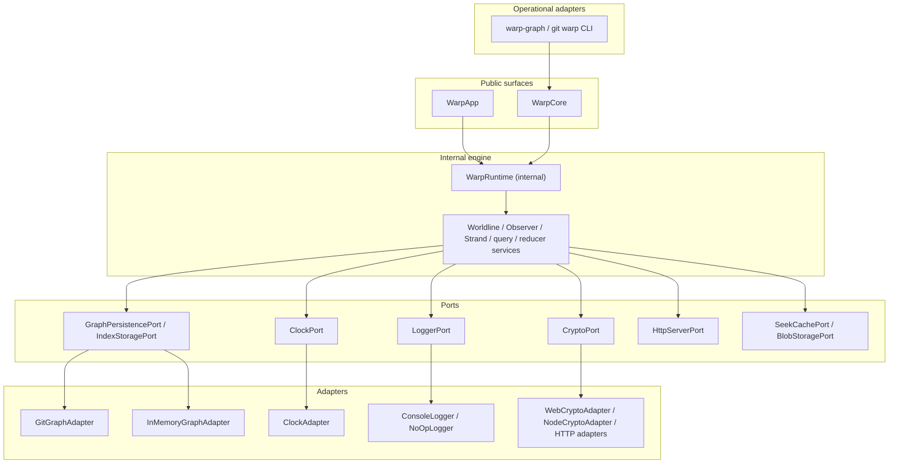

# git-warp architecture

This document explains how `git-warp` is structured internally.

If you are learning the product for the first time, start here instead:

- [README.md](README.md)
- [docs/GUIDE.md](docs/GUIDE.md)
- [docs/CLI_GUIDE.md](docs/CLI_GUIDE.md)

## What this document is for

Use this page when you want to understand:

- the architectural boundary between `WarpApp` and `WarpCore`
- the internal engine and service layering
- how writes, reads, strands, and debugger/tooling flows move through the system
- where Git ends and WARP-specific logic begins

This is not the front-door tutorial. It is the system map.

## Architectural goals

`git-warp` exists to make WARP graphs practical in a Git-backed, offline-first, multi-writer environment.

The architecture optimizes for:

- deterministic multi-writer convergence
- explicit history and replay
- hexagonal boundaries between domain logic and infrastructure
- one honest substrate shared by apps, agentic CLI flows, and tooling such as TTD
- browser-, Node-, Bun-, and Deno-friendly core logic

## Public surfaces

`v15` intentionally splits the public API into two top-level surfaces.

### `WarpApp`

`WarpApp` is the default, product-facing surface.

Use it when you are:

- building applications
- writing agentic CLI or automation flows
- teaching the system to new users

It makes these operations feel normal:

- opening a graph
- writing patches
- syncing
- creating pinned reads with `Worldline`
- shaping reads with `Lens` and `Observer`
- working with speculative lanes through `Strand`

`WarpApp` is intentionally opinionated. It prefers the nouns that make WARP desirable to application builders.

### `WarpCore`

`WarpCore` is the plumbing-facing surface.

Use it when you need:

- explicit replay and materialization
- receipts, provenance, and conflict analysis
- coordinate comparison and transfer planning
- broad inspection
- debugger and TTD integration
- maintenance and migration helpers

`WarpCore` stays public because tooling needs honest access to substrate truth. It is not hidden. It is just not the first-use story.

### Internal engine

Under both public surfaces, the implementation still runs through one internal engine: `src/domain/WarpRuntime.js`.

That internal runtime is not the public root anymore. It is the shared engine that both façades wrap.

This preserves:

- one reducer and replay implementation
- one sync model
- one provenance and receipt model
- one hexagonal core

## Core runtime concepts

### Patches and writer chains

Every writer appends patches to their own writer chain under `refs/warp/...`.

A patch is an atomic batch of graph operations. It is the unit of:

- write intent
- sync
- replay
- provenance
- deterministic merge ordering

### Worldlines

`Worldline` is the first-class read-history handle.

A worldline can pin:

- the live frontier
- an explicit coordinate
- a strand-backed observation

That makes read position explicit instead of treating the runtime itself as the read coordinate.

### Lenses and observers

`Lens` defines the aperture. It says which nodes are visible and which properties are exposed or redacted.

`Observer` is the read-only projection over a worldline through that lens.

This is the product-facing read model:

1. start from `WarpApp`
2. pin a `Worldline`
3. optionally shape it with a `Lens`
4. read through an `Observer`

### Strands and braid

`Strand` is the speculative write lane.

A strand records:

- a pinned base observation
- an overlay identity for divergent writes
- optional braid inputs from supporting read-only strands

The important architectural boundary is:

- strands are durable substrate coordinates
- braid changes what is visible, not how the reducer works
- materialized strand state is derived, never authoritative

### Warp state, receipts, and provenance

Replay produces immutable `WarpState` snapshots.

The substrate also exposes:

- tick receipts
- provenance indexes
- comparison facts
- transfer plans

These belong to the `WarpCore` layer because they are part of the substrate truth, not ordinary product reads.

## Layering


```mermaid
flowchart TB
    subgraph public["Public surfaces"]
        app["WarpApp"]
        core["WarpCore"]
    end

    subgraph engine["Internal engine"]
        runtime["WarpRuntime (internal)"]
        domain["Worldline / Observer / Strand / query / reducer services"]
    end

    subgraph ports["Ports"]
        persistence["GraphPersistencePort / IndexStoragePort"]
        crypto["CryptoPort"]
        clock["ClockPort"]
        logger["LoggerPort"]
        http["HttpServerPort"]
        cache["SeekCachePort / BlobStoragePort"]
    end

    subgraph adapters["Adapters"]
        git["GitGraphAdapter"]
        mem["InMemoryGraphAdapter"]
        clocks["ClockAdapter"]
        logs["ConsoleLogger / NoOpLogger"]
        web["WebCryptoAdapter / NodeCryptoAdapter / HTTP adapters"]
    end

    subgraph tools["Operational adapters"]
        cli["warp-graph / git warp CLI"]
    end

    app --> runtime
    core --> runtime
    cli --> core
    runtime --> domain
    domain --> persistence
    domain --> crypto
    domain --> clock
    domain --> logger
    domain --> http
    domain --> cache
    persistence --> git
    persistence --> mem
    crypto --> web
    clock --> clocks
    logger --> logs
```

## Hexagonal boundary

The codebase follows ports-and-adapters rules:

- domain code owns graph semantics, replay, query, strands, observers, and receipts
- ports define what the domain needs from storage, crypto, clocks, logging, and HTTP
- adapters implement those ports for Git, in-memory tests, Node, Bun, Deno, and browser-capable environments

That split matters because `git-warp` is meant to be used:

- as a library
- as a CLI
- in tests
- in browsers
- as substrate for higher-level hosts

The domain logic must not depend on one runtime shell or one transport model.

## Write path

At a high level, a normal write looks like this:

1. `WarpApp.patch(...)` or `WarpCore.patch(...)` creates a patch builder.
2. The builder records graph operations.
3. The patch is committed onto the current writer chain.
4. Sync later exchanges missing patches between writers.
5. Materialization or query reads merge all visible patches deterministically.

The reducer stays history-native. It does not pretend the latest snapshot is the only truth.

## Read path

The preferred product read path is:

1. `WarpApp.worldline(...)`
2. optionally `worldline.observer(...)`
3. `getNodeProps()`, `query()`, or `traverse.*`

The lower-level read path is:

1. `app.core()`
2. explicit `materialize*()` or broader inspection helpers
3. optional projection helpers such as `projectStateV5()` or `createStateReaderV5()`

That split is deliberate:

- product reads should not accidentally become whole-graph preload logic
- tooling and debugger consumers still need direct replay truth

## Strand path

A strand-backed flow looks like this:

1. create a strand descriptor pinned to a base observation
2. add overlay patches or queue intents
3. optionally braid in supporting read-only strands
4. inspect or compare the strand through `Worldline`, `Observer`, or `WarpCore`
5. plan transfer or settlement later under higher-level policy

`git-warp` does not treat strands as Git worktrees, governance workflows, or UI artifacts. They are substrate lanes.

## Tooling and TTD path

The debugger and inspection model stays thin:

- the CLI is an adapter
- `WarpCore` exposes substrate facts
- higher layers such as TTD hosts can build richer experiences on top

This is why commands such as `git warp debug ...`, `git warp seek`, and `git warp strand ...` exist without turning `git-warp` into an application shell.

## Repository layout

At a high level, the code is organized like this:

```text
src/
  domain/
    WarpApp.js
    WarpCore.js
    WarpRuntime.js
    services/
    warp/
    entities/
    errors/
    utils/
  infrastructure/
    adapters/
  ports/

bin/
  warp-graph.js
  git-warp
  cli/

docs/
  CONCEPTUAL_OVERVIEW.md
  GETTING_STARTED.md
  GUIDE.md
  API_REFERENCE.md
  ADVANCED_GUIDE.md
  CLI_GUIDE.md
  design/
  retrospectives/
  specs/
  trust/
```

Use the docs corpus as follows:

- `README.md`, `docs/GETTING_STARTED.md`, and `docs/GUIDE.md` for the primary user journey
- `docs/API_REFERENCE.md` for exhaustive API detail
- `docs/ADVANCED_GUIDE.md` and `docs/CONCEPTUAL_OVERVIEW.md` for deeper substrate concepts
- `docs/CLI_GUIDE.md` for command-line workflows
- `docs/specs/` and `adr/` for lower-level normative details

## Current architecture boundary in one sentence

`git-warp` exposes WARP as two public façades over one hexagonal Git-backed engine: `WarpApp` for application-facing worldlines, observers, and strands, and `WarpCore` for replay, provenance, inspection, and tooling truth.
