# Architecture: @git-stunts/empty-graph

A graph database substrate living entirely within Git commits, using the "Empty Tree" pattern for invisible storage and Roaring Bitmaps for high-performance indexing.

## 🧱 Core Concepts

### 1. The "Invisible" Graph
Nodes are represented by **Git Commits**.
- **SHA**: The Node ID.
- **Message**: The Node Payload.
- **Tree**: The "Empty Tree" (SHA: `4b825dc642cb6eb9a060e54bf8d69288fbee4904`).
- **Parents**: Graph Edges (Directed).

Because they point to the Empty Tree, these commits introduce **no files** into the repository. They float in the object database, visible only to `git log` and this tool.

### 2. High-Performance Indexing (The "Stunt")
To avoid O(N) graph traversals, we maintain a secondary index structure persisted as a Git Tree.

#### Components:
- **`BitmapIndexService`**: Manages the index.
- **`RoaringBitmap32`**: Used for O(1) set operations and storage.
- **Sharding**: Bitmaps are sharded by OID prefix (e.g., `00`, `01`... `ff`) to allow partial loading.

#### Index Structure (Git Tree):
```text
/
├── meta_xx.json           # Maps SHAs to IDs (sharded by prefix)
├── shards_fwd_xx.json     # Forward edges: {sha: base64Bitmap, ...}
└── shards_rev_xx.json     # Reverse edges: {sha: base64Bitmap, ...}
```

Each shard file contains per-node bitmaps encoded as base64 JSON. This enables O(1) lookups while maintaining efficient storage through prefix-based sharding.

#### Index Tree Structure

The complete index is organized as a prefix-sharded file structure:

```text
index-tree/
├── meta_00.json    # SHA→ID mappings for SHAs starting with "00"
├── meta_01.json    # SHA→ID mappings for SHAs starting with "01"
├── ...
├── meta_ff.json    # SHA→ID mappings for SHAs starting with "ff"
├── shards_fwd_00.json  # Forward edges (parent→children) for prefix "00"
├── shards_rev_00.json  # Reverse edges (child→parents) for prefix "00"
├── ...
└── shards_fwd_ff.json, shards_rev_ff.json
```

This results in 256 meta shards + 512 edge shards = 768 total shard files. Each prefix corresponds to the first two hex characters of a commit SHA.

#### Shard Envelope Format

Every shard file is wrapped in a versioned envelope with integrity verification:

```json
{
  "version": 1,
  "checksum": "sha256-hex-of-data",
  "data": { ... actual shard content ... }
}
```

- **`version`**: Schema version for forward compatibility
- **`checksum`**: SHA-256 hash of the serialized `data` field
- **`data`**: The actual shard content (format varies by shard type)

#### Meta Shard Content

Meta shards (`meta_xx.json`) map full commit SHAs to compact numeric IDs:

```json
{
  "00a1b2c3d4e5f6789...": 0,
  "00d4e5f6a7b8c9012...": 42,
  "00f1e2d3c4b5a6987...": 1337
}
```

Numeric IDs are assigned incrementally as nodes are discovered. These IDs are used within Roaring bitmaps for space-efficient edge storage.

#### Edge Shard Content

Edge shards (`shards_fwd_xx.json` and `shards_rev_xx.json`) map full SHAs to base64-encoded Roaring bitmaps:

```json
{
  "00a1b2c3d4e5f6789...": "OjAAAAEAAAAAAAEAEAAAABAAAA==",
  "00d4e5f6a7b8c9012...": "OjAAAAEAAAAAAgAQAAAAIAAA=="
}
```

Each bitmap contains the numeric IDs of connected nodes:
- **Forward shards** (`shards_fwd_xx.json`): Bitmap contains IDs of child nodes (this node is their parent)
- **Reverse shards** (`shards_rev_xx.json`): Bitmap contains IDs of parent nodes (this node is their child)

#### Lazy Loading

Shards are loaded on-demand to minimize startup time and memory usage:

1. **Query-driven loading**: A query for SHA `abc123...` only loads:
   - `meta_ab.json` (to resolve the SHA to a numeric ID)
   - `shards_rev_ab.json` (to find parent IDs, if querying ancestry)
   - `shards_fwd_ab.json` (to find child IDs, if querying descendants)

2. **In-memory caching**: Once loaded, shard contents are cached for subsequent queries to the same prefix.

3. **Lazy reverse mapping**: The full ID→SHA reverse mapping is built lazily when the first edge query needs to resolve numeric IDs back to SHAs. This avoids loading all meta shards upfront.

#### Memory Characteristics

| Scenario | Approximate Memory |
| ---------- | ------------------- |
| Cold start (no queries) | Near-zero |
| Single prefix loaded | ~0.5-2MB per prefix |
| Full index loaded (1M nodes) | ~150-200MB |

- **Roaring bitmap efficiency**: Sparse ID sets compress extremely well. A node with 3 parents uses bytes, not kilobytes.
- **JSON overhead**: Text-based format trades some memory for debuggability. Binary formats could reduce this by ~50%.
- **Prefix distribution**: Uniform SHA distribution means each of 256 prefixes holds ~0.4% of nodes.

#### Integrity Verification

Shard integrity is verified on every load:

1. **Version check**: The `version` field is validated for forward compatibility. Unknown versions may be rejected or handled with fallback logic.

2. **Checksum verification**: The SHA-256 checksum is recomputed from the `data` field and compared against the stored `checksum`.

3. **Failure modes**:
   - **Strict mode**: Throws an error on version/checksum mismatch, halting operations
   - **Non-strict mode**: Logs a warning and returns an empty shard, allowing degraded operation

This ensures corrupted shards (from disk errors, partial writes, or tampering) are detected before they can poison the index.

### 3. Hexagonal Architecture

#### Domain Layer (`src/domain/`)
- **Entities**: `GraphNode` (Value Object).
- **Services**:
  - `GraphService`: High-level graph operations.
  - `BitmapIndexService`: Index management.
  - `IndexRebuildService`: Rebuilds the index from the log.

#### Infrastructure Layer (`src/infrastructure/`)
- **Adapters**: `GitGraphAdapter` wraps `git` commands via `@git-stunts/plumbing`.

#### Ports Layer (`src/ports/`)
- **GraphPersistencePort**: Interface for Git operations (`writeBlob`, `writeTree`, `logNodes`).

## Sequence Diagrams

The following diagrams illustrate the key operational flows within the system.

### 1. Index Rebuild Flow

This flow shows how the bitmap index is rebuilt from the commit graph. The process iterates through all nodes, registers them in the bitmap builder, and persists the resulting shards as Git blobs.

**Parallel Shard Writes**: The `StreamingBitmapIndexBuilder` uses `Promise.all` to write shards in parallel during both flush and finalize operations. Since shards are partitioned by prefix, they are independent and can be written concurrently:

- `_writeShardsToStorage()`: Writes forward and reverse bitmap shards in parallel
- `_writeMetaShards()`: Writes meta shards (SHA-to-ID mappings) in parallel
- `_processBitmapShards()`: Merges multi-chunk shards in parallel


### 2. Index Query Flow (O(1) Lookup)

This flow demonstrates the O(1) parent lookup using the bitmap index. Shards are loaded on-demand based on the SHA prefix, validated, and cached for subsequent queries.

**Helper Method Decomposition**: The `BitmapIndexReader` uses extracted helper methods for maintainability and reduced complexity:

| Method | Responsibility |
| ------ | -------------- |
| `_getEdges(sha, type)` | Unified edge retrieval for both parents and children |
| `_loadShardBuffer(path, oid)` | Loads raw shard data from storage |
| `_parseAndValidateShard(buffer, path, oid)` | JSON parsing with validation |
| `_validateShard(envelope, path, oid)` | Version and checksum verification |
| `_getOrLoadShard(path, format)` | Cache-aware shard loading orchestration |

```mermaid
sequenceDiagram
    participant Client
    participant EmptyGraph
    participant BitmapIndexReader
    participant GitAdapter

    Client->>EmptyGraph: getParents(sha)
    EmptyGraph->>BitmapIndexReader: getParents(sha)
    Note over BitmapIndexReader: Extract prefix "ab" from sha
    alt Shard not loaded
        BitmapIndexReader->>GitAdapter: readBlob(shardOid)
        GitAdapter-->>BitmapIndexReader: shardBuffer
        Note over BitmapIndexReader: Validate checksum, cache shard
    end
    Note over BitmapIndexReader: Decode Roaring bitmap
    Note over BitmapIndexReader: Map IDs → SHAs
    BitmapIndexReader-->>Client: parentShas[]
```



### 3. Traversal Flow (BFS Example)

This flow illustrates breadth-first traversal of the graph. The traversal service uses the bitmap index for efficient child lookups while yielding nodes to the client as they are visited.


## 🚀 Performance

- **Write**: O(1) (Append-only commit).
- **Read (Unindexed)**: O(N) (Linear scan of `git log`).
- **Read (Indexed)**: **O(1)** (Bitmap lookup).
- **Rebuild**: O(N) (One-time scan to build the bitmap).

## ⚠️ Constraints

- **Delimiter**: Requires a safe delimiter for parsing `git log` output (mitigated by strict validation).
- **ID Map Size**: The global `ids.json` map grows linearly with node count. For >10M nodes, this map itself should be sharded (Future Work).
