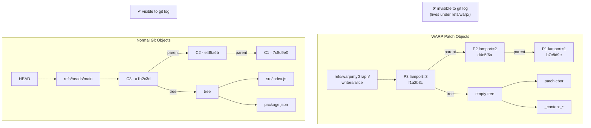
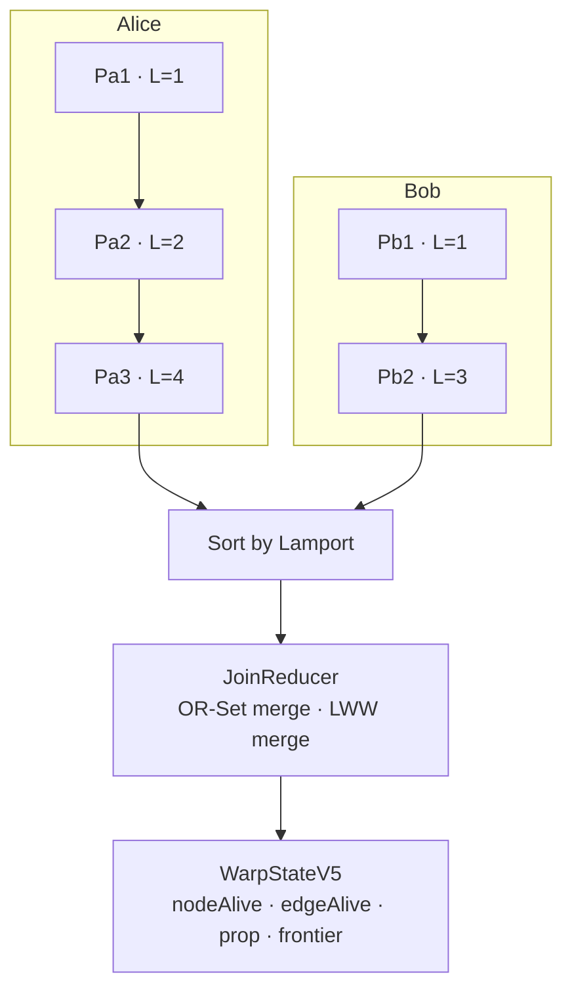
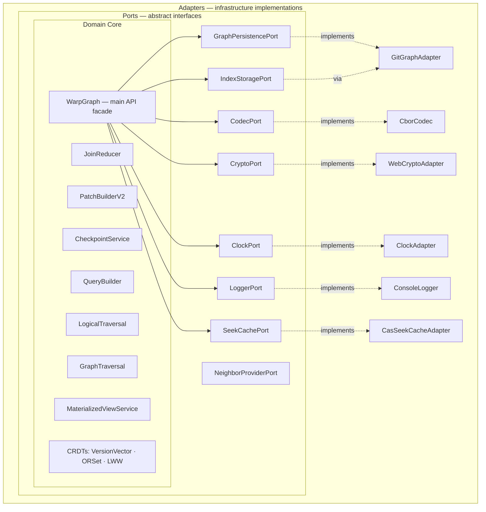

<div align="center">
<h1><code>npm install @git-stunts/git-warp</code></h1>


[](https://github.com/git-stunts/git-warp/actions/workflows/ci.yml)
[](https://opensource.org/licenses/Apache-2.0)
[](https://www.npmjs.com/package/@git-stunts/git-warp)
</div>

<p align="center">
  
</p>

## What's New in v14.16.2

- **The published `git-cas` floor is now current again** — `git-warp` now depends on `@git-stunts/git-cas@^5.3.2`, closing the gap between the declared substrate range and the stale local install that had drifted to `5.3.0`.
- **JSR and npm release metadata are aligned for the patch line** — `package.json`, `jsr.json`, and the release notes now move in lockstep again so the tag-driven publish workflow can ship the same patch version to both registries.

## What's New in v14.16.0

- **Committed content-clearing is now a first-class patch primitive** — `PatchBuilderV2` and `PatchSession` now expose `clearContent()` and `clearEdgeContent()` so higher layers can remove attached node or edge content without mutating reserved substrate keys directly.
- **Transfer-plan content-clear ops now have an honest lowering path** — the same `clear_node_content` / `clear_edge_content` ops emitted by transfer planning can now lower through the published patch API instead of requiring higher layers to know about `_content`, `_content.size`, and `_content.mime`.
- **Attachment docs now describe the full content lifecycle** — the README, architecture note, and working-set docs now show both attach and clear primitives as substrate concerns, while keeping governance and settlement policy above git-warp.

## What's New in v14.15.0

- **Scoped visible-state facts are now a first-class substrate primitive** — `compareWorkingSet()`, `compareCoordinates()`, `planWorkingSetTransfer()`, and `planCoordinateTransfer()` now accept an optional `scope` object so higher layers can compute deterministic visible-state truth over selected node-id families without teaching git-warp any app semantics.
- **Scoped digests now ignore excluded node families cleanly** — when a scope is provided, git-warp filters both the materialized visible state and the contributing patch set before computing comparison digests, transfer digests, and candidate transfer ops. This keeps governance-only node families from perturbing operational substrate facts.
- **Scoped fact exports stay portable and explicit** — exported comparison and transfer-plan facts now carry the normalized scope, so higher layers can persist both raw whole-state facts and scoped substrate facts without inventing a second serialization boundary.

## What's New in v14.14.0

- **Coordinate comparison and transfer-plan facts are now exportable as first-class substrate envelopes** — `exportCoordinateComparisonFact()` and `exportCoordinateTransferPlanFact()` publish the exact deterministic fact payload behind `comparisonDigest` and `transferDigest`, plus canonical JSON for higher-layer recording.
- **Transfer-plan exports stay JSON-safe without losing attachment truth** — exported transfer facts replace raw content bytes with `contentOid` / `mime` / `size`, so higher layers can persist or attest the substrate plan without re-sanitizing it.
- **The working-set docs now show how to carry substrate facts upward cleanly** — higher layers like XYPH can keep governance meaning on their side while reusing git-warp’s canonical factual envelope directly.

## What's New in v14.13.0

- **Deterministic transfer planning is now a first-class substrate helper** — `WarpGraph.planWorkingSetTransfer()` and `WarpGraph.planCoordinateTransfer()` extract a candidate transfer plan from one visible patch universe onto another without mutating either side.
- **Transfer plans stay substrate-factual, including attachment changes** — the returned plan reports only add/remove/set plus explicit content attach/clear operations, deterministic transfer digests, and the resolved source/target coordinates. It does not invent collapse, approval, or governance semantics.
- **The CLI exposes the same settlement runway without turning `debug` into a mutation shell** — `git warp working-set transfer-plan` plans a working set transfer into live truth, its pinned base observation, or another working set while keeping TTD read-only.

## What's New in v14.12.0

- **Braid-aware debugger reads now surface their backing working-set context explicitly** — `git warp debug timeline`, `debug provenance`, and `debug receipts` now include the resolved working-set overlay head, patch count, writability, base Lamport ceiling, and pinned braid support IDs when `--working-set <id>` is selected.
- **Readable/debuggable braid truth is now consistent across analyzer and receipt views** — `debug conflicts` now renders the same working-set overlay and braid context that the other debugger topics report, so operators can see which braid-visible patch universe produced the result instead of inferring it indirectly.
- **Working-set patch inspection and receipts stay braid-honest by default** — the debugger and library reads continue to resolve against `base + braided read-only overlays + active overlay`, and the docs now make that explicit for receipts, provenance, and timeline inspection.

## What's New in v14.11.0

- **Braided working-set composition is now a real substrate primitive** — `WarpGraph.braidWorkingSet()` pins zero or more read-only support overlays on top of a target working set's shared base observation while keeping the target overlay optionally writable.
- **The main CLI can pin the same braid truth directly** — `git warp working-set braid` exposes the substrate braid descriptor without turning `debug` into a mutation surface or teaching git-warp about higher-level worldline meaning.
- **Working-set reads now materialize the full visible patch universe** — materialization, visible patch reads, comparisons, and working-set-aware conflict analysis metadata now resolve against `base + braided read-only overlays + active overlay`, while `reduceV5` remains deterministic and blind to braid semantics.

## What's New in v14.10.0

- **Working-set and coordinate comparison are now first-class substrate reads** — `WarpGraph.compareWorkingSet()` and `WarpGraph.compareCoordinates()` compare deterministic visible patch universes plus visible node/edge/property deltas without inventing application semantics.
- **Materialized-state comparison is now reusable as a library helper** — `compareVisibleStateV5()` lets higher layers compare two materialized states directly, including optional target-local node inspection for one entity.
- **The CLI can inspect the same comparison truth without becoming a debugger app** — `git warp working-set compare` compares a working set against its base observation, live frontier, or another working set while keeping `debug` focused on single-coordinate time-travel inspection.

## What's New in v14.9.0

- **Visible-state reads now go beyond aggregate projection** — `createStateReaderV5()` builds a stable substrate reader over any materialized V5 state so higher layers can inspect visible nodes, edges, properties, content metadata, neighbors, and node-local views without depending on OR-Set internals.
- **Working-set-backed higher-layer reads can stay honest without inventing a parallel query model** — higher layers like XYPH can now combine `materializeWorkingSet()` with `createStateReaderV5()` when they need entity-local inspection, while still using `projectStateV5()` for compact whole-state summaries.
- **Working-set docs now explain the projection-vs-reader split explicitly** — the architecture and working-set notes now distinguish aggregate visible projection (`projectStateV5()`) from richer programmatic visible-state inspection (`createStateReaderV5()`), while keeping git-warp free of application semantics.

## What's New in v14.8.0

- **Visible state projection is now a public helper** — `projectStateV5()` turns any materialized V5 state into a stable `{ nodes, edges, props }` projection so higher layers can inspect working sets and replay coordinates without depending on OR-Set internals.
- **Working-set-aware higher-layer reads can now stay substrate-clean** — higher layers like XYPH can combine `materializeWorkingSet()` with `projectStateV5()` instead of reverse-engineering reducer state or inventing a parallel worldline query model.

## What's New in v14.7.0

- **Conflict analysis is now working-set aware** — `WarpGraph.analyzeConflicts()` can now analyze a pinned working set instead of only the live frontier, and the resolved coordinate now says whether the analysis ran against the frontier or a working set.
- **Working-set reads gained first-class patch, provenance, and ceiling support** — `getWorkingSetPatches()` and `patchesForWorkingSet()` expose the visible `base + overlay` patch universe directly, and `materializeWorkingSet()` now accepts an optional runtime ceiling for explicit replay/debug slices.
- **The built-in TTD can inspect working sets directly** — `git warp debug conflicts`, `debug timeline`, `debug provenance`, and `debug receipts` now accept `--working-set <id>` so operators and agents can inspect a speculative lane without inventing separate tooling, and braid-aware debug payloads now report the resolved working-set backing context explicitly.
- **Docs now describe the debugger/working-set join cleanly** — [docs/WORKING_SETS.md](docs/WORKING_SETS.md), [docs/TTD.md](docs/TTD.md), [ARCHITECTURE.md](ARCHITECTURE.md), [docs/GUIDE.md](docs/GUIDE.md), and [docs/CLI_GUIDE.md](docs/CLI_GUIDE.md) now explain the read-side worldline boundary without pretending the reducer itself became worldline-aware.

See the [full changelog](CHANGELOG.md) for complete release details.

## The Core Idea

**git-warp** is a graph database that doesn't need a database server. It stores all its data inside a Git repository by abusing a clever trick: every piece of data is a Git commit that points to the **empty tree** — a special object that exists in every Git repo. Because the commits don't reference any actual files, they're completely invisible to normal Git operations like `git log`, `git diff`, or `git status`. Your codebase stays untouched, but there's a full graph database living alongside it.

Writers collaborate without coordination using CRDTs (Conflict-free Replicated Data Types) that guarantee deterministic convergence regardless of what order the patches arrive in.

```bash
npm install @git-stunts/git-warp @git-stunts/plumbing
```

For a comprehensive walkthrough — from setup to advanced features — see the [Guide](docs/GUIDE.md).

## Quick Start

```javascript
import GitPlumbing from '@git-stunts/plumbing';
import WarpGraph, { GitGraphAdapter } from '@git-stunts/git-warp';

const plumbing = new GitPlumbing({ cwd: './my-repo' });
const persistence = new GitGraphAdapter({ plumbing });

const graph = await WarpGraph.open({
  persistence,
  graphName: 'demo',
  writerId: 'writer-1',
});

// Write data — single await with graph.patch()
await graph.patch(p => {
  p.addNode('user:alice')
    .setProperty('user:alice', 'name', 'Alice')
    .setProperty('user:alice', 'role', 'admin')
    .addNode('user:bob')
    .setProperty('user:bob', 'name', 'Bob')
    .addEdge('user:alice', 'user:bob', 'manages')
    .setEdgeProperty('user:alice', 'user:bob', 'manages', 'since', '2024');
});

// Query the graph
const result = await graph.query()
  .match('user:*')
  .outgoing('manages')
  .run();
```

## Documentation Map

If you are new to git-warp, start with the **[Guide](docs/GUIDE.md)**. For deeper dives:

- **[Architecture](ARCHITECTURE.md)**: Deep dive into the hexagonal "Ports and Adapters" design.
- **[Observer / Working-Set Boundary](docs/design/observer-working-set-boundary.md)**: Design note for the intended substrate boundary: `WarpGraph` as plumbing, observers as the read-side abstraction, and working sets as speculative write lanes.
- **[CLI Guide](docs/CLI_GUIDE.md)**: Command-by-command reference with examples, flags, and output formats.
- **[Time Travel Debugger](docs/TTD.md)**: Architecture and scope of the thin debugger CLI surface.
- **[Working Sets](docs/WORKING_SETS.md)**: Pinned observation coordinates, comparison helpers, transfer planning, overlay patch-log semantics, and the working-set API/CLI surface.
- **Braids**: the canonical term for co-present working-set composition is **braid**. The substrate now supports pinned read-only braid overlays through `braidWorkingSet()` / `git warp working-set braid`, while keeping reducer semantics worldline-blind.
- **[Protocol Specs](docs/specs/)**: Binary formats for Audit Receipts, Content Attachments, and BTRs.
- **[ADR Registry](adr/)**: Architectural Decision Records (e.g., edge-property internal canonicalization).
- **[Cookbook](examples/)**: Functional examples of Event Sourcing, Pathfinding, and Multi-Writer setups.

## How It Works



### The Multi-Writer Problem (and How It's Solved)

Multiple people (or machines, or processes) can write to the same graph **simultaneously, without any coordination**. There's no central server, no locking, no "wait your turn."

Each writer maintains their own independent chain of **patches** — atomic batches of operations like "add this node, set this property, create this edge." These patches are stored as Git commits under refs like `refs/warp/<graphName>/writers/<writerId>`.

When you want to read the graph, you **materialize** — which means replaying all patches from all writers and merging them into a single consistent view. The specific CRDT rules are:

- **Nodes and edges** use an OR-Set (Observed-Remove Set). If Alice adds a node and Bob concurrently deletes it, the add wins — unless Bob's delete specifically observed Alice's add. This is the "add wins over concurrent remove" principle.
- **Properties** use LWW (Last-Writer-Wins) registers. If two writers set the same property at the same time, the one with the higher Lamport timestamp wins. Ties are broken by writer ID (lexicographic), then by patch SHA.
- **Version vectors** track causality across writers so the system knows which operations are concurrent vs. causally ordered.

Every operation gets a unique **EventId** — `(lamport, writerId, patchSha, opIndex)` — which creates a total ordering that makes merge results identical no matter which machine runs them.

**Checkpoints** snapshot the materialized state into a single commit for fast incremental recovery. Subsequent materializations only need to replay patches created after the checkpoint. During incremental replay, checkpoint ancestry is validated once per writer tip (not once per patch), which keeps long writer chains efficient.

## Multi-Writer Collaboration



Writers operate independently on the same Git repository. Sync happens through standard Git transport (push/pull) or the built-in HTTP sync protocol.

```javascript
// Writer A (on machine A)
const graphA = await WarpGraph.open({
  persistence: persistenceA,
  graphName: 'shared',
  writerId: 'alice',
});

await graphA.patch(p => {
  p.addNode('doc:1').setProperty('doc:1', 'title', 'Draft');
});

// Writer B (on machine B)
const graphB = await WarpGraph.open({
  persistence: persistenceB,
  graphName: 'shared',
  writerId: 'bob',
});

await graphB.patch(p => {
  p.addNode('doc:2').setProperty('doc:2', 'title', 'Notes');
});

// After git push/pull, materialize merges both writers
const state = await graphA.materialize();
await graphA.hasNode('doc:1'); // true
await graphA.hasNode('doc:2'); // true
```

### HTTP Sync

```javascript
// Start a sync server
const server = await graphB.serve({ port: 3000 });

// Sync from another instance
await graphA.syncWith('http://localhost:3000/sync');

// Optional signed trust evaluation for inbound patches
await graphA.syncWith('http://localhost:3000/sync', {
  trust: { mode: 'enforce', pin: 'abc123def456' },
});

await server.close();
```

### Direct Sync

```javascript
// Sync two in-process instances directly
await graphA.syncWith(graphB);
```

## Querying

Query methods auto-materialize by default. Just open a graph and start querying:

### Simple Queries

```javascript
await graph.getNodes();                              // ['user:alice', 'user:bob']
await graph.hasNode('user:alice');                   // true
await graph.getNodeProps('user:alice');              // { name: 'Alice', role: 'admin' }
await graph.neighbors('user:alice', 'outgoing');    // [{ nodeId: 'user:bob', label: 'manages', direction: 'outgoing' }]
await graph.getEdges();                              // [{ from: 'user:alice', to: 'user:bob', label: 'manages', props: {} }]
await graph.getEdgeProps('user:alice', 'user:bob', 'manages');  // { weight: 0.9 } or null
```

### Fluent Query Builder

```javascript
const result = await graph.query()
  .match('user:*')           // glob pattern matching
  .outgoing('manages')       // traverse outgoing edges with label
  .select(['id', 'props'])   // select fields
  .run();
```

#### Object shorthand in `where()`

Filter nodes by property equality using plain objects. Multiple properties = AND semantics.

```javascript
// Object shorthand — strict equality on primitive values
const admins = await graph.query()
  .match('user:*')
  .where({ role: 'admin', active: true })
  .run();

// Chain object and function filters
const seniorAdmins = await graph.query()
  .match('user:*')
  .where({ role: 'admin' })
  .where(({ props }) => props.age >= 30)
  .run();
```

#### Multi-hop traversal

Traverse multiple hops in a single call with `depth`. Default is `[1, 1]` (single hop).

```javascript
// Depth 2: return only hop-2 neighbors
const grandchildren = await graph.query()
  .match('org:root')
  .outgoing('child', { depth: 2 })
  .run();

// Range [1, 3]: return neighbors at hops 1, 2, and 3
const reachable = await graph.query()
  .match('node:a')
  .outgoing('next', { depth: [1, 3] })
  .run();

// Depth [0, 2]: include the start set (self) plus hops 1 and 2
const selfAndNeighbors = await graph.query()
  .match('node:a')
  .outgoing('next', { depth: [0, 2] })
  .run();

// Incoming edges work the same way
const ancestors = await graph.query()
  .match('node:leaf')
  .incoming('child', { depth: [1, 5] })
  .run();
```

#### Aggregation

Compute count, sum, avg, min, max over matched nodes. This is a terminal operation — `select()`, `outgoing()`, and `incoming()` cannot follow `aggregate()`.

```javascript
const stats = await graph.query()
  .match('order:*')
  .where({ status: 'paid' })
  .aggregate({ count: true, sum: 'props.total', avg: 'props.total' })
  .run();

// stats = { stateHash: '...', count: 12, sum: 1450, avg: 120.83 }
```

Non-numeric property values are silently skipped during aggregation.

### Path Finding

```javascript
const result = await graph.traverse.shortestPath('user:alice', 'user:bob', {
  dir: 'outgoing',
  labelFilter: 'manages',
  maxDepth: 10,
});

if (result.found) {
  console.log(result.path);   // ['user:alice', 'user:bob']
  console.log(result.length); // 1
}
```

```javascript
// Weighted shortest path (Dijkstra) with edge weight function
const weighted = await graph.traverse.weightedShortestPath('city:a', 'city:z', {
  dir: 'outgoing',
  weightFn: (from, to, label) => edgeWeights.get(`${from}-${to}`) ?? 1,
});

// Weighted shortest path with per-node weight function
const nodeWeighted = await graph.traverse.weightedShortestPath('city:a', 'city:z', {
  dir: 'outgoing',
  nodeWeightFn: (nodeId) => nodeDelays.get(nodeId) ?? 0,
});

// A* search with heuristic
const astar = await graph.traverse.aStarSearch('city:a', 'city:z', {
  dir: 'outgoing',
  heuristic: (nodeId) => euclideanDistance(coords[nodeId], coords['city:z']),
});

// Topological sort (Kahn's algorithm with cycle detection)
const sorted = await graph.traverse.topologicalSort('task:root', {
  dir: 'outgoing',
  labelFilter: 'depends-on',
});
// sorted = ['task:root', 'task:auth', 'task:caching', ...]

// Longest path on DAGs (critical path)
const critical = await graph.traverse.weightedLongestPath('task:start', 'task:end', {
  dir: 'outgoing',
  weightFn: (from, to, label) => taskDurations.get(to) ?? 1,
});

// Reachability check (fast, no path reconstruction)
const canReach = await graph.traverse.isReachable('user:alice', 'user:bob', {
  dir: 'outgoing',
});
// canReach = true | false
```

### Graph Traversal Directory

git-warp includes a high-performance traversal engine with 15 deterministic algorithms:

| Category | Algorithms |
| :--- | :--- |
| **Search** | BFS, DFS, Shortest Path (Unweighted), Reachability |
| **Weighted** | Dijkstra (Weighted Shortest Path), A*, Bidirectional A* |
| **Analytical** | Topological Sort (Kahn's), Connected Components, Levels (DAG) |
| **Ancestry** | Common Ancestors, Root Ancestors |
| **Reduction** | **Transitive Reduction** (v13.1), **Transitive Closure** (v13.1) |
| **Critical Path** | Weighted Longest Path (DAG) |

All algorithms support `maxDepth`, `maxNodes`, and `AbortSignal` cancellation.

## Subscriptions & Reactivity

React to graph changes without polling. Handlers are called after `materialize()` when state has changed.

### Subscribe to All Changes

```javascript
const { unsubscribe } = graph.subscribe({
  onChange: (diff) => {
    console.log('Nodes added:', diff.nodes.added);
    console.log('Nodes removed:', diff.nodes.removed);
    console.log('Edges added:', diff.edges.added);
    console.log('Props changed:', diff.props.set);
  },
  onError: (err) => console.error('Handler error:', err),
  replay: true,  // immediately fire with current state
});

// Make changes and materialize to trigger handlers
await (await graph.createPatch()).addNode('user:charlie').commit();
await graph.materialize();  // onChange fires with the diff

unsubscribe();  // stop receiving updates
```

### Watch with Pattern Filtering

Only receive changes for nodes matching a glob pattern:

```javascript
const { unsubscribe } = graph.watch('user:*', {
  onChange: (diff) => {
    // Only includes user:* nodes, their edges, and their properties
    console.log('User changes:', diff);
  },
  poll: 5000,  // optional: check for remote changes every 5s
});
```

When `poll` is set, the watcher periodically calls `hasFrontierChanged()` and auto-materializes if remote changes are detected.

## Observer Views

Project the graph through filtered lenses for access control, data minimization, or multi-tenant isolation (Paper IV).

Higher layers should prefer observers for application-facing reads. `WarpGraph`
remains the substrate/session facade, but observers are the cleaner read-side
boundary when you need a worldline-relative, filtered, read-only projection.

```javascript
// Create an observer that only sees user:* nodes, with sensitive fields hidden
const view = await graph.observer('publicApi', {
  match: 'user:*',
  redact: ['ssn', 'password'],
});

const users = await view.getNodes();                // only user:* nodes
const props = await view.getNodeProps('user:alice'); // { name: 'Alice', ... } without ssn/password
const result = await view.query().match('user:*').where({ role: 'admin' }).run();

// Measure information loss between two observer perspectives
const { cost, breakdown } = await graph.translationCost(
  { match: '*' },                         // full view
  { match: 'user:*', redact: ['ssn'] },   // restricted view
);
// cost ∈ [0, 1] — 0 = identical views, 1 = completely disjoint
```

## Temporal Queries

CTL*-style temporal operators over patch history (Paper IV).

```javascript
// Was this node always in 'active' status?
const alwaysActive = await graph.temporal.always(
  'user:alice',
  (snapshot) => snapshot.props.status === 'active',
  { since: 0 },
);

// Was this PR ever merged?
const wasMerged = await graph.temporal.eventually(
  'pr:42',
  (snapshot) => snapshot.props.status === 'merged',
);
```

## Patch Operations

Direct patching remains part of the low-level substrate surface. For
application-facing speculative mutation, prefer working sets and their overlay
mechanics rather than treating one live `WarpGraph` handle as the entire product
API.

The patch builder supports seven operations:

```javascript
const sha = await (await graph.createPatch())
  .addNode('n1')                                    // create a node
  .removeNode('n1')                                 // tombstone a node
  .addEdge('n1', 'n2', 'label')                    // create a directed edge
  .removeEdge('n1', 'n2', 'label')                 // tombstone an edge
  .setProperty('n1', 'key', 'value')               // set a node property (LWW)
  .setEdgeProperty('n1', 'n2', 'label', 'weight', 0.8)  // set an edge property (LWW)
  .commit();                                        // commit as a single atomic patch
```

Each `commit()` creates one Git commit containing all the operations, advances the writer's Lamport clock, and updates the writer's ref via compare-and-swap.

### Content Attachment

Attach content-addressed blobs to nodes and edges as first-class payloads (Paper I `Atom(p)`). Blobs are stored in the Git object store, referenced by SHA, and inherit CRDT merge, time-travel, and observer scoping automatically.

```javascript
const patch = await graph.createPatch();
patch.addNode('adr:0007');                                    // sync — queues a NodeAdd op
await patch.attachContent('adr:0007', '# ADR 0007\n\nDecision text...', {
  mime: 'text/markdown',
}); // async — writes blob + records metadata
await patch.commit();

// Read content back
const buffer = await graph.getContent('adr:0007');   // Uint8Array | null
const oid    = await graph.getContentOid('adr:0007'); // hex SHA or null
const meta   = await graph.getContentMeta('adr:0007');
// { oid: 'abc123...', mime: 'text/markdown', size: 28 }

// Edge content works the same way (assumes nodes and edge already exist)
const patch2 = await graph.createPatch();
await patch2.attachEdgeContent('a', 'b', 'rel', 'edge payload', {
  mime: 'text/plain',
});
await patch2.commit();
const edgeBuf = await graph.getEdgeContent('a', 'b', 'rel');
const edgeMeta = await graph.getEdgeContentMeta('a', 'b', 'rel');

// Clearing content is also first-class and does not require reserved-key writes
const patch3 = await graph.createPatch();
patch3.clearContent('adr:0007');
patch3.clearEdgeContent('a', 'b', 'rel');
await patch3.commit();
```

Content blobs survive `git gc` — their OIDs are embedded in the patch commit tree and checkpoint tree, keeping them reachable. `attachContent()` / `attachEdgeContent()` also persist logical content byte-size metadata automatically and will store a MIME hint when provided. `clearContent()` / `clearEdgeContent()` remove those same logical content registers by setting the reserved content keys to `null` through the published patch API. Historical attachments created before metadata support, or later manual `_content` rewrites that bypass the attachment helpers, may still return `mime: null` / `size: null` from the metadata APIs until they are re-attached through the metadata-aware APIs. If a live `_content` reference points at a missing blob anyway (for example due to manual corruption), `getContent()` / `getEdgeContent()` throw instead of silently returning empty bytes.

### Writer API

For repeated writes, the Writer API is more convenient:

```javascript
const writer = await graph.writer();

await writer.commitPatch(p => {
  p.addNode('item:1');
  p.setProperty('item:1', 'status', 'active');
});
```

## Checkpoints and Garbage Collection

```javascript
// Checkpoint current state for fast future materialization
await graph.materialize();
await graph.createCheckpoint();

// GC removes tombstones when safe
const metrics = graph.getGCMetrics();
const { ran, result } = graph.maybeRunGC();

// Or configure automatic checkpointing
const graph = await WarpGraph.open({
  persistence,
  graphName: 'demo',
  writerId: 'writer-1',
  checkpointPolicy: { every: 500 },  // auto-checkpoint every 500 patches
});
```

When cached state is clean, local commits take an eager path that applies the patch in-memory and threads a patch diff into view rebuild (`_setMaterializedState(..., { diff })`). That allows incremental bitmap index updates on the hot write path instead of full index rebuilds.

## Observability

```javascript
// Operational health snapshot (does not trigger materialization)
const status = await graph.status();
// {
//   cachedState: 'fresh',          // 'fresh' | 'stale' | 'none'
//   patchesSinceCheckpoint: 12,
//   tombstoneRatio: 0.03,
//   writers: 2,
//   frontier: { alice: 'abc...', bob: 'def...' },
// }

// Tick receipts: see exactly what happened during materialization
const { state, receipts } = await graph.materialize({ receipts: true });
for (const receipt of receipts) {
  for (const op of receipt.ops) {
    if (op.result === 'superseded') {
      console.log(`${op.op} on ${op.target}: ${op.reason}`);
    }
  }
}
```

Core operations (`materialize()`, `syncWith()`, `createCheckpoint()`, `runGC()`) emit structured timing logs via `LoggerPort` when a logger is injected.

## CLI

The CLI is available as `warp-graph` or as a Git subcommand `git warp`.

```bash
# Install the git subcommand
npm run install:git-warp

# List graphs in a repo
git warp info

# Query nodes by pattern
git warp query --match 'user:*' --outgoing manages --json

# Find shortest path between nodes
git warp path --from user:alice --to user:bob --dir out

# Show patch history for a writer
git warp history --writer alice

# Inspect the resolved observation coordinate
git warp debug coordinate

# Inspect the newest causal timeline window
git warp debug timeline --limit 10

# Inspect the newest causal timeline window inside a working set
git warp debug timeline --working-set review-auth --limit 10

# Inspect deterministic conflict traces
git warp debug conflicts --kind supersession --evidence full

# Inspect deterministic conflict traces inside a working set
git warp debug conflicts --working-set review-auth --evidence full

# Trace causal provenance for one entity
git warp debug provenance --entity-id user:alice

# Trace provenance for one entity inside a working set
git warp debug provenance --working-set review-auth --entity-id user:alice

# Inspect reducer receipts at a time-travel coordinate
git warp debug receipts --lamport-ceiling 12 --result superseded

# Inspect reducer receipts inside a working set
git warp debug receipts --working-set review-auth --result superseded

# Braid a support working set onto a target and freeze target writes
git warp working-set braid review-auth --support hold-auth --read-only

# Compare a working set against live truth
git warp working-set compare review-auth --against live --target-id user:alice

# Plan a deterministic transfer from a working set into live truth
git warp working-set transfer-plan review-auth --into live

# Check graph health, status, and GC metrics
git warp check
```

### Time-Travel (Seek)

One of git-warp's most powerful features is the ability to query the graph at any point in its history without modifying your Git HEAD.

```bash
# Jump to absolute Lamport tick 3
git warp seek --tick 3

# Step forward or backward relative to your current cursor
git warp seek --tick=+1
git warp seek --tick=-1

# Bookmark and restore positions
git warp seek --save before-refactor
git warp seek --load before-refactor

# Return to the present and clear the cursor
git warp seek --latest

# Purge the persistent seek cache
git warp seek --clear-cache

# Skip cache for a single invocation
git warp seek --no-persistent-cache --tick 5
```

When a seek cursor is active, `query`, `info`, `materialize`, and `history` automatically show state at the selected tick.

```bash
# Visualize query results (ascii output by default)
git warp query --match 'user:*' --outgoing manages --view

# Inspect the resolved coordinate and visible frontier
git warp debug coordinate --json

# Inspect the newest visible causal timeline window
git warp debug timeline --limit 10 --json

# Inspect the newest visible causal timeline window inside a working set
git warp debug timeline --working-set review-auth --limit 10 --json

# Inspect substrate conflict provenance at the current frontier
git warp debug conflicts --entity-id user:alice --lamport-ceiling 12 --json

# Inspect substrate conflict provenance inside a working set
git warp debug conflicts --working-set review-auth --json

# Inspect patch provenance for one entity
git warp debug provenance --entity-id user:alice --json

# Inspect patch provenance inside a working set
git warp debug provenance --working-set review-auth --entity-id user:alice --json

# Inspect reducer outcomes without leaving the CLI
git warp debug receipts --writer-id alice --result superseded --json

# Inspect working-set reducer outcomes without leaving the CLI
git warp debug receipts --working-set review-auth --writer-id ws_review-auth --json

# Pin a braided support overlay before reading or comparing
git warp working-set braid review-auth --support hold-auth --read-only --json

# Compare a working set against another speculative lane
git warp working-set compare review-auth --against working-set:review-auth-b --target-id user:alice --json

# Extract a machine-readable transfer plan without mutating either side
git warp working-set transfer-plan review-auth --into live --json
```

When a higher layer needs to carry that same substrate truth across a process or
governance boundary, the library can export a canonical fact envelope directly:

```javascript
import {
  exportCoordinateComparisonFact,
  exportCoordinateTransferPlanFact,
  normalizeVisibleStateScopeV1,
} from '@git-stunts/git-warp';

const scope = normalizeVisibleStateScopeV1({
  nodeIdPrefixes: {
    exclude: ['comparison-artifact:', 'collapse-proposal:', 'attestation:'],
  },
});

const comparison = await graph.compareCoordinates({
  left: { kind: 'working_set', workingSetId: 'review-auth' },
  right: { kind: 'live' },
  targetId: 'user:alice',
  scope,
});
const comparisonFact = exportCoordinateComparisonFact(comparison);

const transferPlan = await graph.planCoordinateTransfer({
  source: { kind: 'working_set', workingSetId: 'review-auth' },
  target: { kind: 'live' },
  scope,
});
const transferFact = exportCoordinateTransferPlanFact(transferPlan);

// `factDigest` is the substrate digest; `canonicalFactJson` is ready to store.
console.log(comparisonFact.factDigest, transferFact.factDigest);
```

All commands accept `--repo <path>` to target a specific Git repository, `--json` for machine-readable output, and `--view [mode]` for visual output (ascii by default, or `svg:FILE`, `html:FILE`).

<p align="center">
  
</p>

### Human-Facing Apps

`git-warp` now ships substrate APIs, low-level CLI plumbing, and thin debug commands such as `git warp debug coordinate`, `git warp debug timeline`, `git warp debug conflicts`, `git warp debug provenance`, and `git warp debug receipts`. Those read-side debugger commands can now target either the live frontier or a pinned working set, and that pinned working set may itself expose a braid-visible patch universe, while the reducer itself stays deterministic and worldline-blind.

Interactive human-facing applications do **not** live in the core package anymore. Build or use those at a higher layer, where domain meaning belongs. Static CLI visualization remains available through `--view`, but full TUI/web experiences are intentionally out of scope for `git-warp` itself.

## Architecture



The codebase follows hexagonal architecture with ports and adapters:

**Ports** define abstract interfaces for infrastructure:
- `GraphPersistencePort` -- Git operations (composite of CommitPort, BlobPort, TreePort, RefPort, ConfigPort)
- `CommitPort` / `BlobPort` / `TreePort` / `RefPort` / `ConfigPort` -- focused persistence interfaces
- `IndexStoragePort` -- bitmap index storage
- `CodecPort` -- encode/decode operations
- `CryptoPort` -- hash/HMAC operations
- `LoggerPort` -- structured logging
- `ClockPort` -- time measurement
- `SeekCachePort` -- persistent seek materialization cache
- `NeighborProviderPort` -- abstract neighbor lookup interface

**Adapters** implement the ports:
- `GitGraphAdapter` -- wraps `@git-stunts/plumbing` for Git operations
- `ClockAdapter` -- unified clock (factory: `ClockAdapter.node()`, `ClockAdapter.global()`)
- `NodeCryptoAdapter` -- cryptographic operations via `node:crypto`
- `WebCryptoAdapter` -- cryptographic operations via Web Crypto API (browsers, Deno, Bun, Node 22+)
- `NodeHttpAdapter` / `BunHttpAdapter` / `DenoHttpAdapter` -- HTTP server per runtime
- `ConsoleLogger` / `NoOpLogger` -- logging implementations
- `CborCodec` -- CBOR serialization for patches
- `CasSeekCacheAdapter` -- persistent seek cache via `@git-stunts/git-cas`

**Domain** contains the core logic:
- `WarpGraph` -- public API facade
- `Writer` / `PatchSession` -- patch creation and commit
- `JoinReducer` -- CRDT-based state materialization
- `QueryBuilder` -- fluent query construction
- `LogicalTraversal` -- deprecated facade, delegates to GraphTraversal
- `GraphTraversal` -- unified traversal engine (11 algorithms, `nodeWeightFn`)
- `MaterializedViewService` -- orchestrate build/persist/load of materialized views
- `IncrementalIndexUpdater` -- O(diff) bitmap index updates
- `LogicalIndexBuildService` / `LogicalIndexReader` -- logical bitmap indexes
- `AdjacencyNeighborProvider` / `BitmapNeighborProvider` -- neighbor provider implementations
- `SyncProtocol` -- multi-writer synchronization
- `CheckpointService` -- state snapshot creation and loading
- `ObserverView` -- read-only filtered graph projections
- `TemporalQuery` -- CTL* temporal operators over history
- `TranslationCost` -- MDL cost estimation between observer views
- `BitmapIndexBuilder` / `BitmapIndexReader` -- roaring bitmap indexes
- `VersionVector` / `ORSet` / `LWW` -- CRDT primitives

## Dependencies

| Package | Purpose |
|---------|---------|
| `@git-stunts/plumbing` | Low-level Git operations |
| `@git-stunts/alfred` | Retry with exponential backoff |
| `@git-stunts/trailer-codec` | Git trailer encoding |
| `cbor-x` | CBOR binary serialization |
| `roaring` | Roaring bitmap indexes (native C++ bindings) |
| `roaring-wasm` | Roaring bitmap WASM fallback (Bun/Deno) |
| `zod` | Schema validation |

## Testing

```bash
npm test                # unit tests (vitest, Docker)
npm run test:local      # unit tests without Docker
npm run lint            # eslint

# Multi-runtime test matrix (Docker)
npm run test:node22     # Node 22: unit + integration + BATS CLI
npm run test:bun        # Bun: API integration tests
npm run test:deno       # Deno: API integration tests
npm run test:matrix     # All runtimes in parallel
```

## When git-warp is Most Useful

- **Distributed configuration management.** A fleet of servers each writing their own state into a shared graph without a central database.
- **Offline-first field applications.** Collecting data in the field with no connectivity; merging cleanly when back online.
- **Collaborative knowledge bases.** Researchers curating nodes and relationships independently.
- **Git-native issue/project tracking.** Embedding a full project graph directly in the repo.
- **Audit-critical systems.** Tamper-evident records with cryptographic proof (via Audit Receipts).
- **IoT sensor networks.** Sensors logging readings and relationships, syncing when bandwidth allows.
- **Game world state.** Modders independently adding content that composes without a central manager.
- **Local-First Applications.** A backend for LoFi software that needs Git's robust sync and versioning capabilities without the overhead of a standard Git worktree or a heavy database server.

## When NOT to Use It

- **High-throughput transactional workloads.** If you need thousands of writes per second with immediate consistency, use Postgres or Redis.
- **Large binary or blob storage.** Properties live in Git commit messages; content blobs live in the Git object store. Neither is optimized for large media files. Use object storage for images or videos.
- **Sub-millisecond read latency.** Materialization has overhead. Use an in-memory database for real-time gaming physics or HFT.
- **Simple key-value storage.** If you don't have relationships or need traversals, a graph database is overkill.
- **Non-Git environments.** The value proposition depends on Git infrastructure (push/pull, content-addressing).

## AIΩN Foundations Series

This package is the reference implementation of WARP (Worldline Algebra for Recursive Provenance) graphs as described in the AIΩN Foundations Series. The papers formalize the graph as a minimal recursive state object ([Paper I](https://doi.org/10.5281/zenodo.17908005)), equip it with deterministic tick-based semantics ([Paper II](https://doi.org/10.5281/zenodo.17934512)), develop computational holography and provenance payloads ([Paper III](https://doi.org/10.5281/zenodo.17963669)), and introduce observer geometry with the translation cost metric ([Paper IV](https://doi.org/10.5281/zenodo.18038297)).

## Runtime Compatibility

Architected with **Hexagonal Ports and Adapters**, git-warp is runtime-agnostic and tested across the following environments:

- **Node.js**: v22.0.0+ (Native Roaring Bitmaps & WebCrypto)
- **Bun**: v1.1+ (WASM Roaring fallback & WebCrypto)
- **Deno**: v2.0+ (WASM Roaring fallback & WebCrypto)

Bitmap indexes are wire-compatible across all runtimes; a graph created in Node.js can be materialized and queried in Deno without modification.

## License

Apache-2.0

---

<p align="center">
<sub>Built by <a href="https://github.com/flyingrobots">FLYING ROBOTS</a></sub>
</p>
