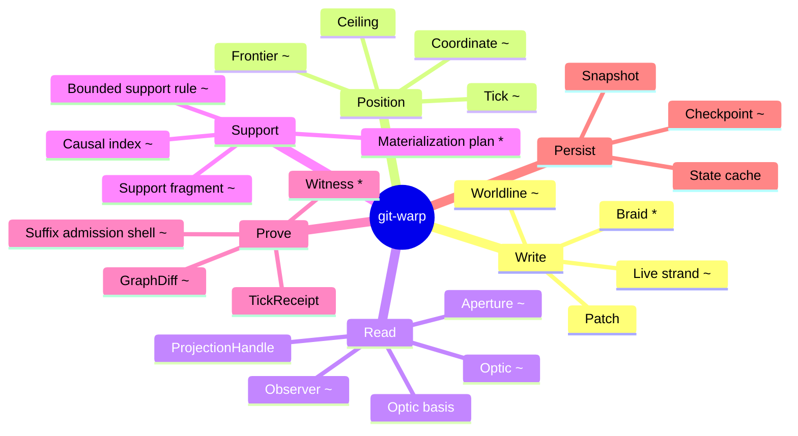

<div align="center">
<p><strong>A Git-native runtime for shared causal history.</strong></p>
<p>Offline-first, multi-writer, deterministic, and built for provenance-aware intent writes, timeline reads, and receipts.</p>
</div>

<p align="center">
<a href="https://github.com/git-stunts/git-warp/actions/workflows/ci.yml">

</a>
<a href="https://opensource.org/licenses/Apache-2.0">

</a>
<a href="https://www.npmjs.com/package/@git-stunts%2Fgit-warp">

</a>
</p>

`git-warp` is a Git-native system for storing and reading **causal history**.

Instead of treating a graph as one big in-memory object, `git-warp` treats history as the source of truth. Reads are bounded views over that history, and writes are appended as patches. It is one runtime in the [Continuum](https://github.com/flyingrobots/continuum) stack ([more below](#continuum)).

If that sounds abstract, the short version is:

- You can work **offline**.
- Multiple writers can contribute **without central coordination**.
- Conflicts resolve **deterministically**.
- Every value keeps **provenance**.
- Reads are designed to stay **bounded**, not accidentally materialize everything.

## What it does

`git-warp` provides a causal history substrate and read/runtime layer for
intent-oriented applications.

It lets you:

- Write intents into a shared causal log.
- Read the latest visible state through timeline readings.
- Read historical ticks without rewriting history.
- Use observers and apertures to control what a reader can see.
- Keep provenance attached to values and outcomes.
- Sync through normal Git transport.

## Latest release

`v18.2.1` corrects the WARP-owned state-cache materialization path introduced
in `v18.2.0`. Live materialization now uses current writer-frontier coordinates
for exact and compatible predecessor snapshot reuse, publishes replay results
under their real coordinate, and keeps diff-producing or receipt-producing reads
replay-backed so callers receive complete diff and provenance data.

See [CHANGELOG.md](CHANGELOG.md) for the full in-repository release notes.

## v19 API Direction

```typescript
import { openWarp, intent, reading } from "@git-stunts/git-warp";
import { GitStorageAdapter } from "@git-stunts/git-warp/storage";
import GitPlumbing from "@git-stunts/plumbing";

const plumbing = new GitPlumbing({ cwd: "." });
const warp = await openWarp({
  storage: new GitStorageAdapter({ plumbing }),
  writer: "agent-1",
});

const events = await warp.timeline("events");

const write = await events.write(intent.property.set({
  subject: "user:alice",
  key: "role",
  value: "admin",
}));

const role = await events.read(reading.property({
  subject: "user:alice",
  key: "role",
}));
```

The v18 graph-first API remains only under `@git-stunts/git-warp/legacy`. That
entrypoint is deprecated and migration-only. Do not start new application code
on `openWarpWorldline()`, `openWarpGraph()`, `WarpApp`, `WarpCore`,
`GitGraphAdapter`, patch builders, or graph operation creators.

### Bounded Reads

The v19 public API names bounded questions as readings. The formal optic,
coordinate, observer, and support machinery remains available to expert code
through advanced/diagnostic surfaces, not the package root.

- A **reading** is the bounded question the public API should expose.
- An **optic** is the formal execution shape used by expert and proof-oriented
  surfaces.
- A **coordinate** is formal evidence position; first-use code should see
  `tick` and receipt handles before coordinate machinery.
- Missing support should produce an honest receipt outcome, not a silent
  whole-history materialization.

<details>
<summary><h4>For the Nerds™: Optics</h4></summary>

> In category theory, an **optic** from a whole $(S, T)$ to a part $(A, B)$ is an element of a coend — an existential package over a *residual* object $M$:
>
> $$\mathrm{Optic}\big((S,T),\,(A,B)\big) \;=\; \int^{M} \mathcal{C}\!\left(S,\; M \otimes A\right) \times \mathcal{C}\!\left(M \otimes B,\; T\right)$$
>
> That is a focus $S \to M \otimes A$ paired with a put-back $M \otimes B \to T$, where $M$ — everything you *didn't* look at — is sealed inside the existential and never named.
>
> git-warp's read model is the read-only half. The whole $S$ is a **coordinate** (a reading over causal history); the part $A$ is the bounded question (`.node()`, `.prop()`, a traversal); the residual $M$ is the rest of history you deliberately do not materialize. The **bounded support rule** is that $M$ made small and explicit, and `prepareOpticBasis()` is the witness that a lawful factorization $S \to M \otimes A$ exists at the chosen coordinate. No witness ⇒ `E_OPTIC_NO_BOUNDED_BASIS`: the runtime refuses the read rather than collapsing $M$ back into the whole graph.
>
> And `.node("user:alice").prop("role")` is literal **optic composition** — composing optics tensors their residuals ($M_1 \otimes M_2$), so a chained read stays bounded by construction.

</details>

### Bounded reads in practice

The root API should express bounded questions as readings and report the
support actually used through receipts. The older `openWarpGraph()` and
`openWarpWorldline()` examples are deprecated migration material, not a second
application path. They live under `@git-stunts/git-warp/legacy` only so
existing consumers can pay down old imports deliberately.

See the [v19 API reflection](docs/topics/api/), the
[v19 migration guide](docs/migrations/v19/), and
[Optic reads](docs/topics/optic-reads.md) for the model.

## Core ideas

git-warp's concepts span how history is **written**, **positioned**, **read**, **accelerated**, **proven**, and **persisted**. The map marks runtime posture directly. Status markers: no mark = **shipped** runtime truth, `~` = **transition** (the noun exists but is narrower than its canonical meaning), `*` = **target** (intended architecture, not yet a first-class runtime concept).



| Concept | Status | One-line meaning |
|---|---|---|
| **Patch** | shipped | An appended claim about a bounded causal site; never rewritten. |
| **Worldline** | transition | The named causal history a writer commits to and readers observe. |
| **Live strand** | transition | A strand over a live parent basis plus its own owned overlay divergence. |
| **Braid** | target | A composition of lanes; common-basis braid validation is not yet shipped. |
| **Coordinate** | transition | A comparable read point: a causal basis plus a ceiling. |
| **Frontier** | transition | The causal basis — which history has been observed (writer tips / version vectors). |
| **Ceiling** | shipped | The upper replay boundary on a coordinate or lane. |
| **Tick** | transition | One atomic admitted history step on a lane. |
| **ProjectionHandle** | shipped | A pinned read handle returned by `live()` and `seek()`. |
| **Observer** | transition | A read surface that answers a question through an aperture. |
| **Aperture** | transition | The `{ match, expose, redact }` policy bounding what an observer sees. |
| **Optic** | transition | A first-class runtime read-intent noun used by fluent optic reads; native Continuum transport remains future work. |
| **Optic basis** | shipped | Verified bounded evidence (`prepareOpticBasis()`) that an optic read is answerable without full materialization. |
| **Bounded support rule** | transition | The smallest causally sufficient support set to answer an optic honestly. |
| **Causal index** | transition | A rebuildable acceleration structure that finds support without whole-graph discovery. |
| **Support fragment** | transition | A cached partial materialization keyed by support and coordinate (cache storage pending). |
| **Materialization plan** | target | The plan deciding receipts vs. indexes vs. fragments vs. replay vs. full state. |
| **Witness** | target | Minimal information sufficient to justify a local change result. |
| **TickReceipt** | shipped | The operational envelope recording what happened for one admitted step. |
| **GraphDiff** | transition | A first-class "what changed between these coordinates?" result. |
| **Witnessed suffix admission shell** | transition | Observer-readable import/export envelope for a transported suffix; live Echo/git-warp network exchange remains Continuum stack work. |
| **WarpStateSnapshot** | shipped | A persisted materialized graph state at a coordinate. |
| **WarpStateCache** | shipped | The owning system for persisted and in-memory snapshot reuse. |
| **Checkpoint** | transition | A pinned snapshot protected from ordinary eviction. |

The topic pages own the current explanations for these nouns. Exact API, CLI,
schema, and error inventories should be generated or coverage-checked rather
than maintained as long-form prose; see the generated
[source-backed reference](docs/topics/reference.md).

> `Optic` is now a reified runtime noun for the public read path. The fluent API lowers into a frozen `Optic` value before execution; see [Optic reads](docs/topics/optic-reads.md).

## How it works

### Deterministic and offline-first

Writers can make independent changes without a central coordinator. When history converges, the same patches produce the same visible result.

<details>
<summary><h4>For the Nerds™ — Convergence is a join-semilattice</h4></summary>

> Deterministic multi-writer merge is the statement that materialized state forms a **join-semilattice** $(L, \sqcup)$: a partial order with a least upper bound for any pair. Each writer's patches push state *up* the order, and merge is the **join** $\sqcup$ — idempotent, commutative, and associative:
>
> $$x \sqcup x = x \qquad x \sqcup y = y \sqcup x \qquad (x \sqcup y) \sqcup z = x \sqcup (y \sqcup z)$$
>
> Those three laws are exactly what "no central coordinator" buys you:
>
> - **commutativity** ⇒ writers can apply each other's patches in any order,
> - **associativity** ⇒ they can batch them however the network delivers them,
> - **idempotence** ⇒ re-delivering the same patch is harmless.
>
> So convergence isn't luck; it's the **least upper bound** $\bigsqcup_i h_i$ of everyone's observed history $h_i$. This is the CRDT (state-based / CvRDT) guarantee: monotone updates into a semilattice always reconcile to the same join, independent of message order or duplication.

</details>

### Append-only

History is never rewritten. New claims are appended to Git refs under `refs/warp/...`.

### Provenance-aware

Every visible value traces back to the patch that produced it.

### Bounded reads

The runtime is designed so reads stay scoped. It avoids the “just materialize the whole graph” footgun.

<details>
<summary><h4>For the Nerds™ — A causal cone is a down-set</h4></summary>

> History is a **poset** $(H, \preceq)$ under causal precedence (Git's parent edges give the Hasse diagram). A **coordinate** picks a *consistent cut*: a down-closed set, i.e. a **down-set / order ideal**
>
> $$\downarrow\! C \;=\; \{\, x \in H \mid x \preceq c \text{ for some } c \in C \,\}.$$
>
> A **frontier** is that cut's boundary — an **antichain** of writer tips, the maximal elements of the ideal.
>
> A read's **causal cone** $D(v) = {\downarrow}\{v\}$ is the down-set generated by $v$: everything that could have influenced it, and nothing that couldn't. Because the poset is well-founded, $D(v)$ is finite even when $H$ is unbounded — which is *why* a bounded read can exist at all. The **bounded support rule** is then just the claim "this optic's answer factors through $D(v)$, so materializing the rest of $H \setminus D(v)$ is provably unnecessary."

</details>

### Holographic history

History keeps per-entity provenance, so a single node's backward causal cone can be reconstructed and replayed on its own: `provenance.materializeSlice(nodeId)` loads only the cone's patches, never the whole graph. This slice path is currently classified as a **diagnostic** read, not a first-use application API.

The broader worldline-wide direction is still narrower than the doctrine: live strands and support fragments have runtime footholds, but support-fragment cache storage, plan-driven fragment execution, and full holographic worldline reads are not first-use shipped paths. See [Runtime posture](#runtime-posture), [Optic reads](docs/topics/optic-reads.md), and [Strands](docs/topics/strands.md).

## API surface

The v19 application entry point is the root intent/timeline/reading/receipt
surface. The v18 `openWarpWorldline()` and `openWarpGraph()` entry points are
deprecated and available only from `@git-stunts/git-warp/legacy` for migration.
Treat every legacy import as removal debt. New application code should use
root readings and receipts; new operator code should use explicit diagnostic
APIs instead of the graph-first compatibility bag.

## Architectural moments

Internally, the runtime still has four architectural moments:

|Moment|Capabilities|What it does|
|---|---|---|
|Commitment|`patches`, `strands`, `comparison`|Admits claims into frontier-relative truth|
|Folding|`checkpoint`|Re-expresses admitted history as operational artifacts|
|Revelation|`query`, `subscriptions`, `provenance`|Exposes admitted truth under bounded rights|
|Governance|`sync`|Transports and admits remote suffixes|

Deprecated migration code may still encounter the old graph-first names for
these moments. Do not introduce those names in new root-level application code.

## Why Git

Git and WARP fit together because both are:

- append-only in spirit.
- content-addressed.
- distributed and multi-writer.
- history-preserving.

Each writer appends patch commits under `refs/warp/<graph>/writers/<writerId>`. The refs stay outside normal branch history, so graph history stays separate from your checked-out source tree. Patch commits may carry patch and content trees; the isolation comes from refs and Git plumbing, not from pretending every data commit is empty. Sync uses normal `git push` and `git fetch` over the WARP refs.

<details>
<summary><h4>For the Nerds™ — Git as a Merkle DAG, patches as a free monoid</h4></summary>

> Git's object store is a **Merkle DAG**: every object is named by the hash of its content, so a commit's id transitively fixes its entire history. That gives **structural sharing** (equal subhistories are stored once — hash-consing) and **tamper-evidence** for free: change one byte upstream and every downstream id changes.
>
> `git-warp` leans on two consequences. First, each writer's chain at `refs/warp/<graph>/writers/<writerId>` is the **free monoid** $(W^{*},\, \cdot,\, \varepsilon)$ on that writer's claims $W$ — append-only concatenation $\cdot$, empty history $\varepsilon$ as identity, no rewriting. Second, the commits live on WARP refs rather than source-tree refs, so graph history rides Git's transport and dedup without touching your working tree. Merge law lives one layer above this (see the semilattice note); Git supplies the verifiable spine.

</details>

## Continuum

`git-warp` is one runtime in the [Continuum](https://github.com/flyingrobots/continuum) stack. Continuum is **not** a runtime, database, or storage engine — it is the shared **boundary protocol** that lets independent runtimes, apps, debuggers, and agents exchange *witnessed history* instead of copying one database or scraping UIs.

Continuum's model shift is the same one git-warp is built on:

> The graph is a coordinate chart over witnessed causal history. History is the territory; state is a policy-relative materialized view; files are readings; writes are intents; admission is witnessed.

Its shared vocabulary is **Intent → Admission → Witness → Reading**:

- **Intent** — "I want to do this" (a submitted patch).
- **Admission** — the runtime decides whether it can happen.
- **Witness** — evidence for the decision (receipts, provenance).
- **Reading** — one lawful view of the resulting history (worldlines, optics, observers).

In the stack, **git-warp and Echo own runtime truth**, while Continuum owns the boundary language and proof posture that lets those runtimes cooperate across the network.

## When to use it

|Use case|Fit|
|---|---|
|Offline-first multi-writer convergence|Strong|
|Agent/tool substrate with causal history|Strong|
|Graph semantics without inventing merge law|Strong|
|Speculative lanes for what-if exploration|Strong|
|High-throughput real-time execution|Use Echo instead|
|General-purpose OLTP|Use Postgres|
|Full-text search / analytics|Use purpose-built engines|
|Time-travel debugging UI|Use warp-ttd on top of git-warp|

## Runtime posture

Legacy docs may still describe `openWarpWorldline()`, worldline reads,
coordinates, reified optics, and observer apertures for migration context. They
are not the first-use application path. `GitWarpWitnessedSuffixAdmissionShell`
is a transition runtime envelope, not proof of live network exchange. Native
Continuum witnesshood, remote optic transport, common-basis braid validation,
live Echo/git-warp suffix exchange, support-fragment cache storage, and
plan-driven fragment execution remain outside the first-use shipped path unless
their own docs say otherwise.

## Documentation

- [Topics](docs/topics/README.md) — task-oriented documentation map
- [v19 API reflection](docs/topics/api/) — current public API direction
- [v19 migration guide](docs/migrations/v19/) — deprecated legacy API paydown
- [Optic reads](docs/topics/optic-reads.md), [Observers](docs/topics/observers.md), and [Querying](docs/topics/querying.md) — read-model context
- [Strands](docs/topics/strands.md), [Sync](docs/topics/sync.md), and [CLI](docs/topics/cli.md) — runtime and operator paths
- [Git substrate](docs/topics/git-substrate.md), [Content and CAS](docs/topics/content-and-cas.md), and [Continuum boundary](docs/topics/continuum-boundary.md) — substrate and boundary explanations
- [Operations](docs/operations/) and [Troubleshooting](docs/topics/troubleshooting.md) — maintenance and recovery workflows
- [Examples](examples/) — runnable read-model snippets
- [Architecture](ARCHITECTURE.md) — hexagonal layers and admission kernel

---

## FAQ

### What is `git-warp`, really?

A Git-native causal history runtime. It stores graph-shaped data as an append-only log of patches in Git refs, then provides safe, bounded reads over that history.

It is deliberately "weird": optimized for offline-first, multi-writer, provenance-first use cases rather than high-throughput OLTP.

### How does it differ from a normal CRDT or graph database?

It is a **state-based CvRDT substrate** with strong emphasis on bounded reads, perfect provenance, and Git as the transport layer.

This gives you deterministic convergence without a central server, but reads are intentionally scoped (via optics and coordinates) instead of materializing the entire graph.

### What does the data model look like?

**Nodes**, **properties**, and **directed edges** identified by stable string IDs. Changes are additive patches that are never rewritten. See [Getting started](docs/topics/getting-started.md).

### Can multiple people/agents write at the same time?

Yes — independently, even fully offline. Histories converge deterministically via the join-semilattice model. No locking required.

### How do I install and set it up?

```bash
npm install @git-stunts/git-warp @git-stunts/plumbing
```

Works alongside any existing Git repo. Full setup: [Getting started](docs/topics/getting-started.md).

### How does syncing work?

Standard Git (`push`/`fetch`/`pull`). Patches live under `refs/warp/...`.

### How are reads secured/filtered?

**Observers** + **Apertures** with `{ match, expose, redact }` policies for different views over the same history.

### Is it production ready?

Check [CHANGELOG.md](CHANGELOG.md), the topic docs, and the package registry for release and surface status. The README does not carry live release gates.

### What about performance and scale?

Strong for offline/moderate causal workloads thanks to bounded support and holographic slices. Not for high-frequency real-time (use **[Echo](https://github.com/flyingrobots/echo)**).

### How does it relate to Echo and Continuum?

- **`git-warp`**: Offline-first/Git-native ("the weird one").
- **[Echo](https://github.com/flyingrobots/echo)**: Primary high-throughput runtime.
- **[Continuum](https://github.com/flyingrobots/continuum)**: Boundary protocol for witnessed history exchange.

### Do I have to understand category theory/optics?

No. The fluent API is practical; theory is optional.

### What if I have existing data?

Migration tools and diagnostic surfaces exist. See [Operations](docs/operations/) and [Git substrate](docs/topics/git-substrate.md).

### Can I use it with my existing Git repository?

Yes. Graph history lives under WARP refs such as `refs/warp/<graph>/writers/<writerId>`, separate from branch refs and the checked-out worktree.

### Where can I get help or see examples?

[examples/](examples/), [docs/topics/](docs/topics/README.md), [Issues](https://github.com/git-stunts/git-warp/issues).

---

## License

[Apache-2.0](./LICENSE)
Copyright © 2026 James Ross • [FlyingRobots](https://github.com/flyingrobots)

---

<p align="center">
<sub>Built by <a href="https://github.com/flyingrobots">FLYING ROBOTS</a></sub>
</p>
