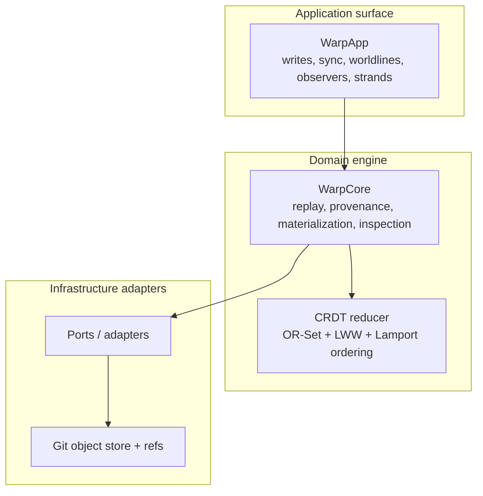

  
  <h1><code>git-warp</code>: a causal, multi-writer graph database for the Git substrate</h1>
  
Distributed, conflict-free graph storage that lives orthogonally to your source tree.

  

## Choose the right tool

| Use case | git-warp | Echo | Other | Remarks |
| --- | --- | --- | --- | --- |
| Offline-first collaborative app | ✅ | ❌ | **CouchDB / PouchDB** | `git-warp` is a strong fit when your data is graph-shaped, writers work independently, and eventual consistency is acceptable. |
| Multi-writer edge or IoT fleet with intermittent network access | ✅ | ❌ | **Event log + custom sync** | `git-warp` works well when devices need local writes, later sync, and deterministic convergence without central coordination. |
| Decentralized tool that already trusts Git remotes | ✅ | ❌ | **Plain Git + custom files** | `git-warp` is a better fit when the replicated data is a graph and you do not want to invent your own merge semantics. |
| High-performance realtime simulation or game loop | ❌ | ✅ | **Traditional ECS / game engine** | Echo is designed for deterministic, replayable, high-throughput rewrite execution where runtime throughput matters more than Git-native storage. |
| Replayable deterministic simulation tooling | ❌ | ✅ | **Custom lockstep engine** | Echo is the better fit when ticks, stepping, and runtime throughput are the core problem. |
| Centralized OLTP web app | ❌ | ❌ | **Postgres** | If you need low-latency transactions around one primary database, use a conventional database. |
| Analytics warehouse or OLAP workload | ❌ | ❌ | **DuckDB / ClickHouse** | Neither `git-warp` nor Echo is a warehouse or columnar analytics engine. |

## What git-warp is

`git-warp` is a JavaScript library that stores a WARP graph inside Git objects and refs.

A WARP graph is causal: history and provenance are part of the model instead of discarded implementation detail. Each write becomes a patch commit, readers can pin history through worldlines, and multiple writers can converge deterministically after sync.

WARP stands for **Worldline Algebra for Recursive Provenance**. WARP itself is not tied to Git; `git-warp` is the Git-native implementation. If you want the underlying theory, see [AIΩN](https://github.com/flyingrobots/aion). If you want a sibling runtime optimized for high-throughput realtime rewrite execution rather than Git-native durability, see [Echo](https://github.com/flyingrobots/echo).

Choose `git-warp` for durable asynchronous collaboration. Choose Echo for deterministic realtime execution.

## Why Git

Git and WARP fit together unusually well:

- both are append-only in spirit
- both rely on content-addressed artifacts
- both work well in distributed, multi-writer environments

`git-warp` uses Git because Git already provides battle-tested object storage, cryptographic integrity, and distributed replication. `git-warp` adds graph structure, CRDT merge semantics, and pinned historical reads on top.

Each writer appends patch commits under `refs/warp/<graph>/writers/<writerId>`. Those commits point at Git's well-known empty tree, so graph history stays orthogonal to normal source-tree history on your checked-out branches.

## Architecture at a glance

The normal builder path is `WarpApp`. `WarpCore` is the plumbing surface for replay, provenance, inspection, debugger tooling, and other substrate-level work.

## When to use it

- You need local graph writes now and sync later.
- You expect multiple writers to work independently and converge deterministically.
- You want history, time-travel reads, and provenance to be part of the data model.
- You already trust Git as a storage and replication substrate.

## When not to use it

- You need a centralized OLTP database with immediate consistency and low-latency transactions.
- You need a warehouse, search engine, or analytics store.
- You need ultra-high-throughput realtime simulation rather than Git-native durability.
- You do not actually need graph relationships, traversal, or history-aware reads.

## Documentation pipeline

Use these docs in order, based on the job you are trying to do:

- **[Getting Started](https://github.com/git-stunts/git-warp/blob/main/docs/GETTING_STARTED.md)**: see `git-warp` work in a few minutes.
- **[Guide](https://github.com/git-stunts/git-warp/blob/main/docs/GUIDE.md)**: build an app with `WarpApp`, worldlines, observers, and strands.
- **[API Reference](https://github.com/git-stunts/git-warp/blob/main/docs/API_REFERENCE.md)**: exhaustive API, flags, and examples without the narrative.
- **[Advanced Guide](https://github.com/git-stunts/git-warp/blob/main/docs/ADVANCED_GUIDE.md)**: substrate internals, replay, trust, performance, and engine-room details.
- **[CLI Guide](https://github.com/git-stunts/git-warp/blob/main/docs/CLI_GUIDE.md)**: operate, inspect, and debug a live repo from the terminal.
- **[Documentation index](https://github.com/git-stunts/git-warp/blob/main/docs/README.md)**: canonical map of the full docs corpus.

Focused docs:

- **[Conceptual overview](https://github.com/git-stunts/git-warp/blob/main/docs/CONCEPTUAL_OVERVIEW.md)**: a deeper conceptual explanation of the WARP model and the Git substrate.
- **[Architecture](https://github.com/git-stunts/git-warp/blob/main/docs/ARCHITECTURE.md)**: system structure and internal layering.
- **[Protocol specs](https://github.com/git-stunts/git-warp/tree/main/docs/specs)**: normative formats such as content attachments, receipts, and BTRs.

## Core nouns

| Term | Meaning |
| --- | --- |
| **WarpApp** | The product-facing root for writing, syncing, worldlines, observers, and strands. |
| **WarpCore** | The plumbing-facing root for replay, provenance, inspection, and tooling. |
| **Patch** | A WARP patch is a Git commit under `refs/warp/...` containing a CBOR-encoded operation log plus metadata. |
| **Tick** | One logical replay step: the application of one patch into visible state. |
| **Worldline** | A pinned read-history handle over live truth, an explicit coordinate, or a strand. |
| **Aperture** | The aperture definition that shapes what an observer can see. |
| **Observer** | A filtered, read-only projection over a worldline through an aperture. |
| **Strand** | A speculative write lane branched from a base observation. |
| **Braid** | A read-only composition that lets one strand see one or more support strands without collapsing them together. |

## License

Apache-2.0

---

Built by <a href="https://github.com/flyingrobots">FLYING ROBOTS</a>

