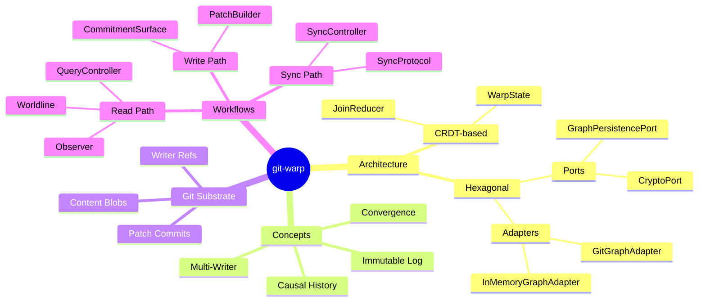
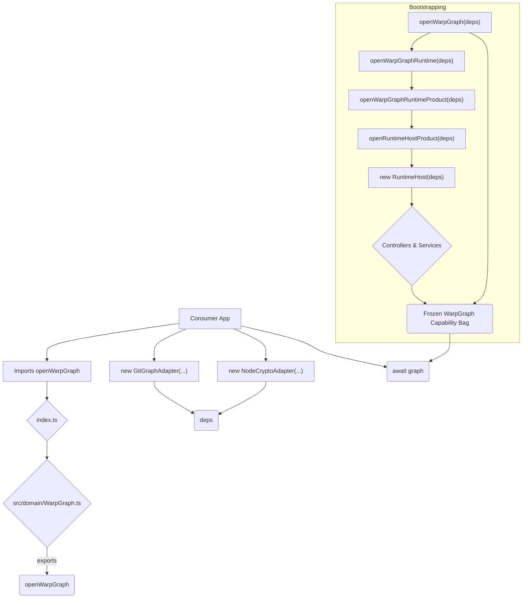
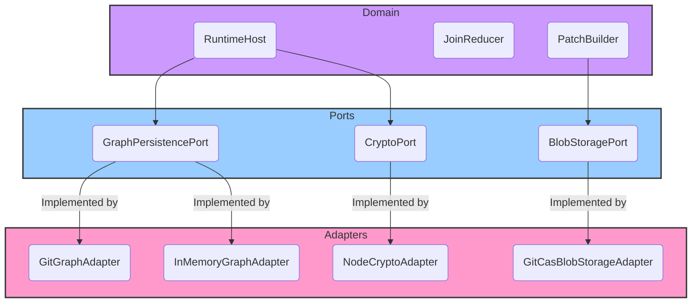
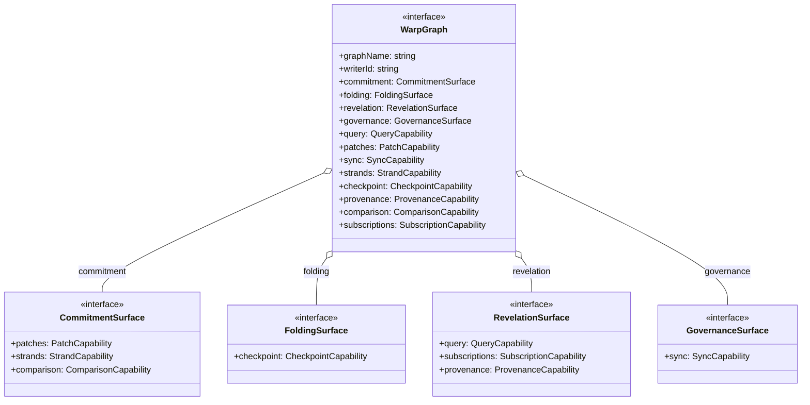

# git-warp: Zero-to-Hero Technical Teardown

This document provides an exhaustive, end-to-end technical explanation of the `@git-stunts/git-warp` software project. It is intended for a reader with no prior knowledge of the project or its underlying concepts.

## Table of Contents

- [`git-warp` Overview](#git-warp-overview)
- [Domain Dictionary](#domain-dictionary)
- [The Big Idea](#the-big-idea)
- [The Source of Truth](#the-source-of-truth)
- [Core Concepts](#core-concepts)
- [Core Workflows: The Golden Paths](#core-workflows-the-golden-paths)
- [Architectural Trade-offs](#architectural-trade-offs)
- [How To Read The Codebase Next](#how-to-read-the-codebase-next)
- [A Look Inside a `git-warp` Repository](#a-look-inside-a-git-warp-repository)
- [Summary](#summary)

## `git-warp` Overview

This mind map provides a high-level overview of the entire `git-warp` system, from its core concepts to its architecture and workflows.



## Domain Dictionary

| Term | Definition |
| --- | --- |
| **WARP** | Acronym for **Worldline Algebra for Recursive Provenance**. The runtime uses recursive witnessed admission semantics over Git: history is stored as an append-only log, writes are admitted as patches, and state is materialized from that history. The "witnessed" aspect refers to the goal of having cryptographic proof of every state transition. |
| **Git Substrate** | The underlying storage layer. `git-warp` uses Git as its database, but not in a conventional way. It leverages Git's content-addressable object store and ref system to build a distributed graph database. |
| **Graph** | The primary data structure managed by `git-warp`. It's a directed graph of nodes and edges, where both nodes and edges can have properties and binary content attachments. |
| **Writer** | An independent actor that can write to the graph. Each writer has a unique ID and its own chain of commits. |
| **Patch** | A single, atomic set of operations that modify the graph. A patch contains one or more operations, such as adding a node, setting a property, or deleting an edge. |
| **Patch Commit** | A Git commit that stores a single patch. These commits are the fundamental unit of the graph's history. They point to Git's empty tree (`4b825dc642cb6eb9a060e54bf8d69288fbee4904`) to avoid interfering with the user's working directory. |
| **Writer Ref** | A Git ref that points to the most recent patch commit for a specific writer. These refs are stored under `refs/warp/<graphName>/writers/<writerId>`. |
| **Frontier** | A version vector that maps each known writer ID to the SHA of its most recent patch commit. The frontier represents the "latest" state of the graph, as known by a particular replica. |
| **Version Vector** | A data structure used to track the state of a distributed system. In `git-warp`, it's used to represent the frontier of the graph. |
| **Lamport Tick** | A logical clock used to order events within a single writer's history. Each patch is assigned a Lamport tick that is one greater than the previous patch from the same writer. This ensures a total ordering of operations from a single writer. |
| **CRDT** | **Conflict-free Replicated Data Type**. A data structure that can be replicated across multiple computers and updated independently and concurrently, without coordination between the replicas. `git-warp` uses CRDTs to merge the histories of different writers into a consistent, convergent state. |
| **JoinReducer** | The engine that implements the CRDT logic. It takes a set of patches and "reduces" them into a single, materialized `WarpState`. It handles conflict resolution according to deterministic rules (e.g., add-wins for nodes, last-writer-wins for properties). |
| **Materialization** | The process of reading a set of patch chains from Git and applying them, in a deterministic order, to produce a single, consistent view of the graph state (`WarpState`). |
| **WarpState** | The in-memory representation of the materialized graph state. It's a collection of CRDTs (OR-Sets and LWW-Registers) that hold the nodes, edges, and properties of the graph. |
| **Worldline** | The primary, high-level read surface. A `Worldline` represents the canonical history of the graph. It provides methods for querying the graph at a specific point in time. |
| **Strand** | A temporary, speculative branch of the graph's history. Strands are used for "what-if" scenarios and for preparing complex changes before merging them into the main worldline. |
| **Braid** | The process of merging a strand back into the worldline. |
| **Observer** | A specialized, filtered read surface. An `Observer` provides a view of the graph through an "aperture", which can filter the visible nodes and properties. Observers are the primary mechanism for implementing read-side access control. |
| **Aperture** | The configuration of an `Observer`, which defines what it can see. |
| **Optic** | A target-model noun for a more advanced, stream-oriented read surface. The v20+ roadmap aims to replace the current materialization-based reading with a more efficient, optic-based system. |
| **Provenance** | The history of a piece of data. `git-warp` is designed to provide full provenance for every value in the graph, tracing it back to the specific patch that created it. |
| **TickReceipt** | A data structure that records the outcome of applying a patch to the graph. TickReceipts are a key part of the provenance system. |
| **BTR** | **Boundary Transition Record**. A record that marks a significant change in the graph's history, such as a schema migration. |
| **Checkpoint** | A snapshot of the materialized graph state at a particular point in time, stored as a Git commit with a tree. Checkpoints are used to speed up materialization by providing a starting point for the `JoinReducer`. |
| **Continuum** | A protocol for exchanging witnessed causal history between different systems. `git-warp` is a Continuum participant. |
| **Wesley** | A compiler for shared contract families within the Continuum ecosystem. |
| **Echo** | Another Continuum participant, responsible for local runtime invocation. |
| **warp-ttd** | A tool for consuming generated contract facts from Wesley. |

## The Big Idea

`git-warp` is not a traditional database. It's a **causal-history substrate built on a Git foundation**. Instead of storing the *current state* of data, it stores an **immutable, append-only log of all the changes** that have ever happened. The current state is then *materialized* from this history on demand.

This approach has several key advantages. First, it allows for **multi-writer, coordination-free writes**. Because each writer has its own independent chain of commits, multiple writers can write to the graph concurrently, even when offline, without any need for a central coordinator. Second, it produces a **convergent state**. `git-warp` uses CRDTs to merge the histories of different writers. This means that as long as two replicas have seen the same set of patches, they will always materialize the exact same state, regardless of the order in which they received the patches. Third, it provides **full provenance**. Because the entire history of the graph is preserved, it's possible to trace any piece of data back to the exact patch that created it, providing a complete audit trail. Finally, it is **distributed by default**. The use of Git as the underlying storage mechanism means that `git-warp` graphs can be synchronized using standard Git protocols (e.g., `git push`, `git pull`).

## The Source of Truth

In `git-warp`, the source of truth is not a single database file, but rather the collection of objects and refs in the underlying Git repository. This is a fundamental concept that underpins the entire system.

### In Git Objects

The immutable history of the graph is stored in Git's object database.

- **Patch Commits**: Each change to the graph is stored as a Git commit. The commit message contains metadata, and the patch payload itself is often stored in a separate blob.
- **Content Blobs**: Binary content attached to nodes or edges is stored in Git blobs, referenced by the graph data.

### In Git Refs
Git refs are used as pointers to specific points in the graph's history. They act as the "heads" of the different branches of history.
- `refs/warp/<graphName>/writers/<writerId>`: Points to the latest patch commit for each writer.
- `refs/warp/<graphName>/checkpoints/head`: Points to the most recent checkpoint commit, which is a snapshot of the materialized state.

### In Memory
The `git-warp` runtime maintains some state in memory for performance. It is crucial to understand that the in-memory state is just a cache; the durable, canonical source of truth is always the data in the Git repository.
- **Materialized State (`WarpState`)**: A cached, in-memory representation of the graph state.
- **Runtime Host**: The main runtime object that manages the graph, including its controllers, services, and caches.

## Core Concepts

This section covers the foundational concepts of the `git-warp` architecture.

### Bootstrapping vs Runtime
There is a clear distinction between the one-time **bootstrapping** process and the ongoing **runtime** operations. The **Bootstrapping** process involves importing `openWarpGraph`, constructing the necessary adapters (like `GitGraphAdapter`), and calling `openWarpGraph()`. This creates the `RuntimeHost`, which instantiates controllers and services, and returns a frozen, immutable `WarpGraph` capability bag to the consumer. **Runtime** operations include creating and committing patches, updating refs, materializing state via the `JoinReducer`, reading data through the various query surfaces, and syncing the history with remote replicas.

### Entry Point: From Package Import To `openWarpGraph()`
The primary entry point for modern consumers of `git-warp` is the `openWarpGraph` function, which is imported from the main package.



### Hexagonal Architecture
The codebase follows a hexagonal (or ports and adapters) architecture. This keeps the core domain logic separate from the infrastructure it runs on.



### Public API Surface

The `WarpGraph` object returned by `openWarpGraph` is a frozen capability bag. It exposes several focused surfaces for interacting with the graph.



The architectural surfaces are the primary shape. The flat aliases
(`graph.query`, `graph.patches`, `graph.sync`, and related capabilities) exist
for ergonomic access to the same underlying capability namespaces.

## Core Workflows: The Golden Paths

This section details the primary workflows, or "golden paths", that a user or developer will follow when interacting with `git-warp`.

### Writing to the Graph
This path covers the process of creating and storing new data in the graph. It begins with the application developer creating a patch and ends with a new commit in the Git repository. The `createPatch()` method returns a `PatchBuilder` instance, which is used to build a set of operations. The `commit()` method then bundles these operations into a patch, writes it to Git, and atomically updates the writer's ref using a `compare-and-swap` operation.

### Reading from the Graph
This path covers how data is retrieved from the graph. It starts with a query from the application and results in data being returned after a potential state materialization. The materialized graph state is created by the `JoinReducer`, which iterates through all patches from all writers in a deterministic order and applies them to the `WarpState` according to CRDT merge rules (Add-wins for nodes/edges, Last-Writer-Wins for properties).

### Distributed Operations
This path covers how different replicas of a graph converge to the same state. The core feature is multi-writer convergence, where two writers can write to the same graph without coordination. When they sync, the `JoinReducer` processes all patches from both writers, resulting in an identical, converged `WarpState` on both machines. This is enabled by a pull-based synchronization protocol.

## Architectural Trade-offs

`git-warp`'s design makes a number of deliberate trade-offs to achieve its goals.

| Trade-off | Gains | Costs |
| --- | --- | --- |
| **Git as Storage** | Distributed by default, content-addressable, immutable history, powerful branching and merging primitives. | Higher write/read orchestration complexity compared to a traditional database. Not optimized for high-frequency, small writes. |
| **Independent Writer Refs** | Enables coordination-free, offline-first writes. | Shifts complexity to the materialization process (`JoinReducer`). |
| **CRDT Materialization** | Guarantees eventual consistency and multi-writer convergence. | More complex to reason about than simple last-writer-wins databases. Read operations can be more expensive as they may require materialization. |
| **Hexagonal Architecture** | Excellent testability, allows swapping out adapters (e.g., `GitGraphAdapter` vs. `InMemoryGraphAdapter`). | More files and boilerplate (ports and adapters). |
| **Frozen Capability Bag** | Enforces a clean separation between the public API and the internal implementation. Prevents consumers from depending on internal details. | Less flexibility for power users who might want to access internal state. |

## How To Read The Codebase Next

The best way to approach the codebase depends on your goals. Here are a few suggested paths for different personas.

### For the Application Developer
Your goal is to use `git-warp` to build an application. You should focus on the public API and the core concepts.
1.  **Start with the `WarpGraph` interface**: This is your main entry point. Understand the different surfaces it provides (`patches`, `query`, etc.).
2.  **Follow Golden Paths 1 and 2**: Master the process of opening a graph and writing a simple patch.
3.  **Explore the Query Surfaces**: Learn how to read data using `query`, `worldline`, and `observer`. The tests in `test/unit/domain/WarpGraph.noCoordination.test.ts` are a great resource.

### For the Data Analyst / Auditor
Your goal is to understand the history of the data and verify its integrity.
1.  **Understand the Commit Structure**: Look at the "A Look Inside a `git-warp` Repository" section to see how patches are stored in Git.
2.  **Learn about Provenance**: Read the provenance entry in the Domain Dictionary and inspect the patch trailers in the repository example to see how `git-warp` enables data-lineage tracing.
3.  **Explore the `JoinReducer`**: The tests in `test/unit/domain/services/JoinReducer.test.ts` will show you how the final state is derived from the history.

### For the Core Contributor
Your goal is to understand the internals of `git-warp` to fix bugs or add new features.
1.  **Start with the Ports and Adapters**: Read `src/ports/GraphPersistencePort.ts` and then compare `src/infrastructure/adapters/GitGraphAdapter.ts` and `InMemoryGraphAdapter.ts`. This will give you a clear understanding of the system's boundaries.
2.  **Trace the Write Path**: Start at `PatchController.createPatch()`, then look at `PatchBuilder.ts`, and finally `PatchBuilder.commit()`.
3.  **Deep Dive into the `JoinReducer`**: This is the heart of the system. Read `src/domain/services/JoinReducer.ts` and its tests carefully.

## A Look Inside a `git-warp` Repository

The concepts of writer refs and patch commits can feel abstract. A fixture-style example makes the storage shape concrete without depending on one developer workstation's local refs.

Running `git for-each-ref refs/warp/` in a repository that stores graph data might produce output shaped like this:

```text
1111111111111111111111111111111111111111 commit refs/warp/example-graph/writers/alice
2222222222222222222222222222222222222222 commit refs/warp/example-graph/writers/bob
3333333333333333333333333333333333333333 commit refs/warp/example-graph/checkpoints/head
```

This reveals the per-writer heads and optional checkpoint head for a graph. Looking at the history of one writer head shows that each patch is represented by a structured commit:

```text
$ git log -n 1 refs/warp/example-graph/writers/alice

commit 1111111111111111111111111111111111111111
Author: Example Operator <operator@example.invalid>
Date:   Mon May 25 08:19:53 2026 -0700

    warp:patch

    eg-kind: patch
    eg-graph: example-graph
    eg-writer: alice
    eg-lamport: 224
    eg-patch-oid: aaaaaaaaaaaaaaaaaaaaaaaaaaaaaaaaaaaaaaaa
    eg-schema: 2
```

This log output shows a single patch commit. The commit message is highly structured, using trailers to store metadata:
-   `eg-graph`: The name of the graph (`example-graph`).
-   `eg-writer`: The ID of the writer (`alice`).
-   `eg-lamport`: The Lamport timestamp of the patch.
-   `eg-patch-oid`: The SHA of a Git blob that contains the actual patch payload.

The commit itself is just a metadata container. The actual operations are in the blob with SHA `aaaaaaaaaaaaaaaaaaaaaaaaaaaaaaaaaaaaaaaa`. If we inspect the type of this object:
```console
$ git cat-file -t aaaaaaaaaaaaaaaaaaaaaaaaaaaaaaaaaaaaaaaa
blob
```
This confirms it's a blob. The content of this blob is a binary CBOR-encoded representation of the patch operations.

This internal usage demonstrates the power and flexibility of `git-warp`: it's not just for application data, but can also be used to store and manage complex, structured development artifacts like ASTs, right inside the same Git repository as the code itself.

## Summary

`@git-stunts/git-warp` is a novel database architecture that leverages the power of Git to create a distributed, multi-writer, eventually consistent graph database. Its use of an append-only log, CRDT-based materialization, and a clean, port-and-adapter architecture make it a robust and flexible system for managing distributed data with full provenance. While its design introduces complexities not found in traditional databases, it provides powerful capabilities for offline-first, collaborative applications where data integrity and auditability are paramount.
