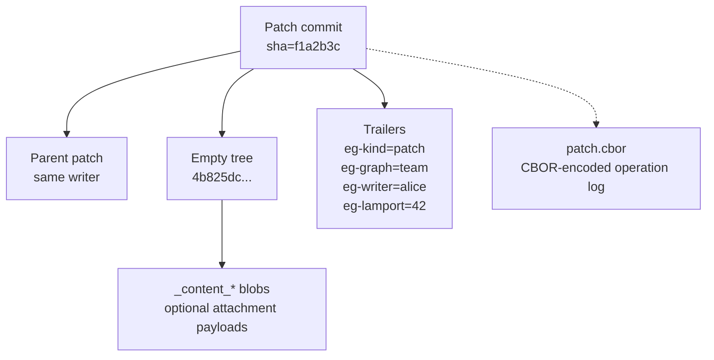
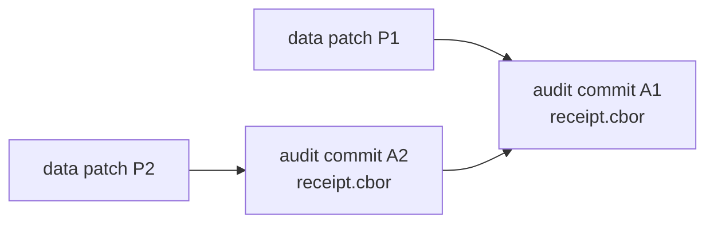

# Advanced guide

This is the engine-room guide.

Use it when you need to understand why `git-warp` is safe, how replay works, what lives in Git, and where the trust and performance boundaries are.

- If you are new, start with [Getting Started](GETTING_STARTED.md).
- If you are building day-to-day product code, use the [Guide](GUIDE.md).
- If you want every method and appendix in one place, use the [API Reference](API_REFERENCE.md).

## Public roots and boundaries

`git-warp` exposes three public roots with different audiences:

- `openWarpWorldline()` for application code and agent workflows
- `openWarpGraph()` for compatibility, diagnostics, sync, checkpoint,
  provenance, migration, and speculative-strand capability namespaces
- `WarpApp` / `WarpCore` for legacy facade compatibility and substrate tooling

The normal path is:

1. open with `openWarpWorldline()`
2. write with `WarpWorldline.commit(...)`
3. read through `live()`, `seek(...)`, `observer(...)`, and `optic()`
4. use `openWarpGraph()` only when you intentionally need substrate-level work

Inspection APIs are legitimate. The thing to avoid is exporting their results into a second app-local graph engine or reimplementing traversal/query semantics above the substrate.

## Patch anatomy

At the substrate level, a WARP patch is a Git commit.



What matters:

- the patch lives under `refs/warp/<graph>/writers/<writerId>`
- the commit points at Git's well-known empty tree
- the operation log is CBOR-encoded
- trailers carry graph, writer, Lamport, and replay metadata
- optional attachment blobs hang off the patch object graph

This is the core reason `git-warp` can live inside a normal repo without taking over your checked-out source tree.

## How replay converges

Each writer produces an independent patch chain. Visible state is derived by replaying the currently visible patches and reducing them with CRDT rules.

The main rules are:

- nodes and edges use OR-Set semantics
- properties use LWW registers
- Lamport clocks plus writer identity provide a deterministic total order
- version vectors distinguish causal order from concurrency

That is why multiple writers can work independently and later converge without manual merge resolution for graph data.

## Git substrate layout

```text
refs/warp/<graphName>/
├── writers/
│   ├── alice
│   ├── bob
│   └── ...
├── checkpoints/
│   └── head
├── coverage/
│   └── head
├── cursor/
│   ├── active
│   └── saved/<name>
└── audit/
    └── <writerId>
```

Normal source-tree history remains on ordinary refs such as `refs/heads/main`. WARP history stays under `refs/warp/...`.

## Security and trust

If you are evaluating `git-warp` for audit-critical or adversarial workflows, the key trust surfaces are:

- patch hashes and content-addressed Git objects
- optional audit receipt chains
- trust records and crypto adapters
- deterministic replay over the visible patch set

Tamper evidence matters because `git-warp` separates "what the live graph says" from "what can be proven about how it got there." Audit receipts extend ephemeral replay receipts into a durable Git-native chain:



If someone mutates a receipt, the commit SHA changes and the downstream chain no longer verifies cleanly.

For the normative details, use:

- [Audit receipt spec](specs/AUDIT_RECEIPT.md)
- [Trust crypto spec](specs/TRUST_CRYPTO_ALGORITHM.md)
- [Trust migration](trust/TRUST_MIGRATION.md)
- [Trust operator runbook](trust/TRUST_OPERATOR_RUNBOOK.md)

## Advanced reads and inspection

Drop below the ordinary app-facing read path when you intentionally need:

- whole-visible-state inspection
- direct materialization
- replay receipts
- provenance and slice materialization
- temporal analysis
- coordinate comparison and transfer planning

These are valid public APIs. What you should not do is treat them as the raw ingredients for a second graph runtime in your app.

## Strands and braids

Strands are the substrate's durable speculative lanes.

What a strand records:

- a pinned base observation
- optional Lamport ceiling
- overlay identity for divergent writes
- optional braid support overlays
- optional owner, scope, and lease metadata

The important boundary is:

- a strand is not a Git worktree feature
- a strand is not a governance engine
- a strand is a durable coordinate plus an overlay patch log

That is why strands belong in the advanced tier. Most builders use
`openWarpWorldline()` first. Reach for `openWarpGraph()` and strands when you
need review lanes, comparison, transfer planning, or other explicit speculative
workflows.

## Coordinate fact export

When a higher layer needs a deterministic, hashable artifact for audit, attestation, or machine-to-machine exchange, export a fact envelope instead of inventing custom JSON.

```javascript
import {
  exportCoordinateComparisonFact,
  exportCoordinateTransferPlanFact,
} from '@git-stunts/git-warp';

const comparison = await graph.compareCoordinates({
  left: { kind: 'live' },
  right: {
    kind: 'coordinate',
    frontier: { alice: 'abc123...' },
  },
});

const comparisonFact = exportCoordinateComparisonFact(comparison);
// comparisonFact = {
//   exportVersion: 'coordinate-comparison-fact/v1',
//   factKind: 'coordinate-comparison',
//   factDigest: '7d7f...',
//   canonicalFactJson: '{"comparisonVersion":"coordinate-comparison/v1",...}',
//   fact: { ... },
// }

const transferPlan = await graph.planCoordinateTransfer({
  source: { kind: 'live' },
  target: {
    kind: 'coordinate',
    frontier: { alice: 'abc123...' },
  },
});

const transferFact = exportCoordinateTransferPlanFact(transferPlan);
// transferFact = {
//   exportVersion: 'coordinate-transfer-plan-fact/v1',
//   factKind: 'coordinate-transfer-plan',
//   factDigest: '9ac1...',
//   canonicalFactJson: '{"transferVersion":"coordinate-transfer-plan/v1",...}',
//   fact: { ... },
// }
```

## Performance, checkpoints, and GC

These topics matter once your graph is large enough that replay cost becomes visible.

- checkpoints snapshot materialized state for faster incremental recovery
- GC compacts safe tombstone bookkeeping from the live state
- earlier history remains reconstructable through time-travel reads
- out-of-core whole-state reads remain future work
- streamed attachment I/O remains future work

The practical rule of thumb is:

- if your graph still materializes fast enough that replay is not user-visible, do nothing
- if cold reads are regularly replaying low-thousands of patches and startup latency becomes noticeable, enable auto-checkpointing
- `checkpointPolicy: { every: 500 }` is the conservative default for most repos because it keeps replay bounded without creating checkpoint churn on every write

That is not a law of physics. It is a good operating default until real measurements tell you otherwise.

Current design backlog:

- [Out-of-core materialization](https://github.com/git-stunts/git-warp/issues/136)
- [Streaming graph traversal](https://github.com/git-stunts/git-warp/issues/457)

## Where next

- [API Reference](API_REFERENCE.md): exhaustive methods, appendices, and error codes
- [Guide](GUIDE.md): builder patterns and day-to-day app flows
- [CLI Guide](CLI_GUIDE.md): operator workflows, time travel, and debugger commands
- [Conceptual Overview](CONCEPTUAL_OVERVIEW.md): the broader WARP mental model
- [Architecture](ARCHITECTURE.md): internal layering
- [Protocol specs](specs/): normative formats
