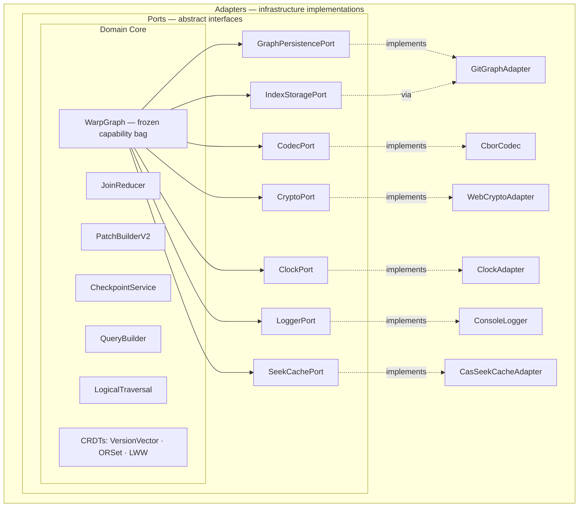
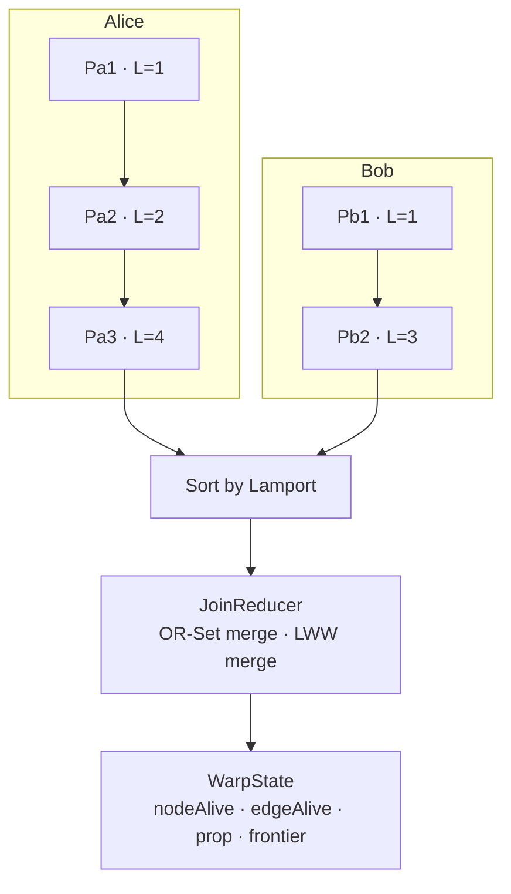
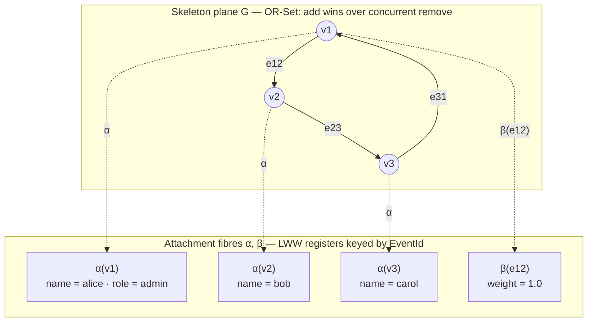
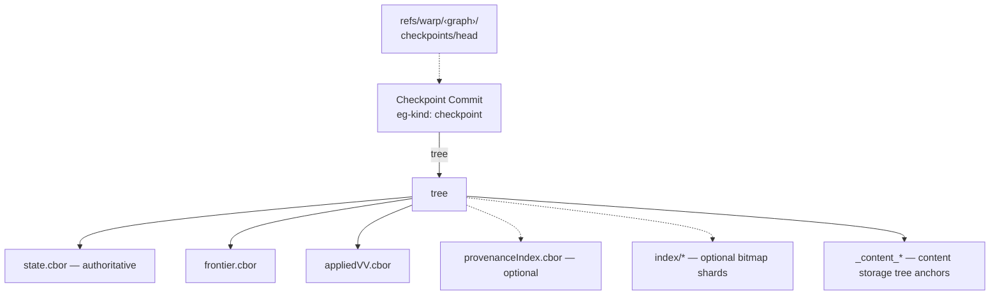
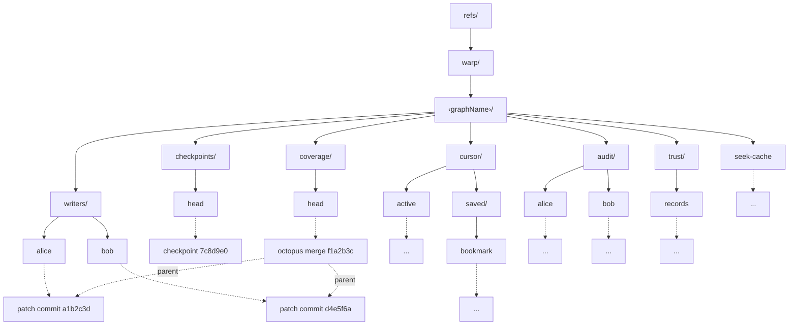
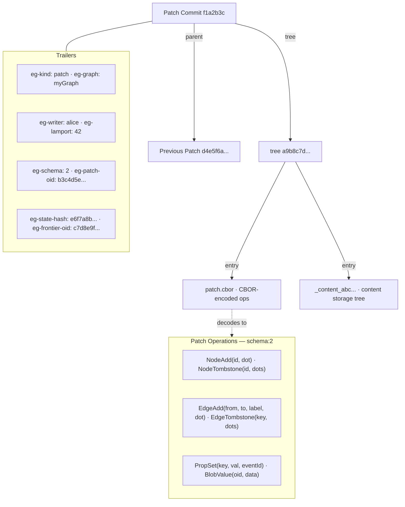
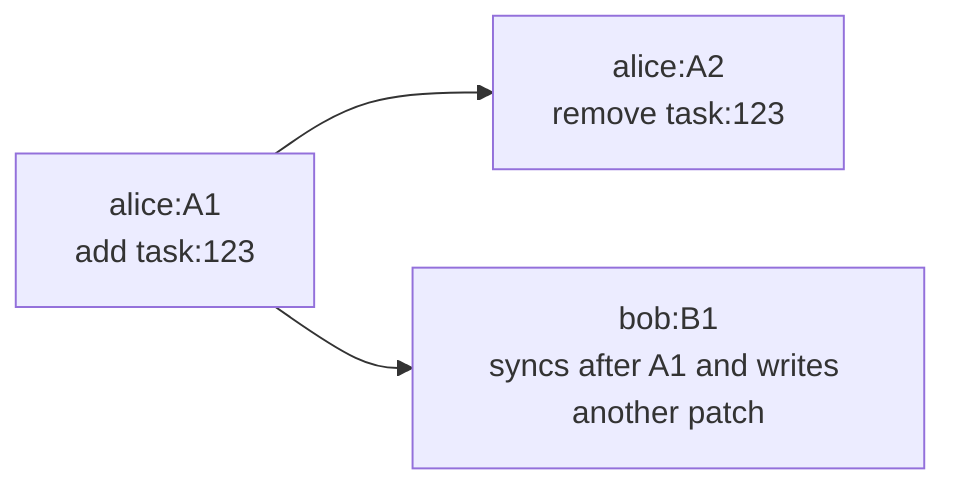

# API reference

This document is the exhaustive reference surface for `git-warp`.

Use it when you already understand the mental model and want the full method, flag, appendix, and error-code surface in one place.

- If you are learning the product, start with [Getting Started](GETTING_STARTED.md).
- If you are building an app, use the narrative [Guide](GUIDE.md).
- If you are choosing read surfaces, use [Readings And Optics](READINGS_AND_OPTICS.md).
- If you want engine-room internals, use the [Advanced Guide](ADVANCED_GUIDE.md).
- If you want terminal workflows, use the [CLI Guide](CLI_GUIDE.md).

This reference describes shipped or transition runtime surfaces. When a stronger
WARP noun or semantic promise is still target doctrine, the status and evidence
rules live in the
[Doctrine/runtime Alignment Ratchet](DOCTRINE_RUNTIME_ALIGNMENT.md).

The rest of this file intentionally stays dense and comprehensive.

For new application code, start with `openWarpWorldline()`. It returns the
small Worldline-first handle for committing patches and reading live, historical,
observer, or optic views. Use `openWarpGraph()` when you intentionally need the
lower-level compatibility, diagnostic, migration, sync, checkpoint, provenance,
or speculative-strand capability bag.

## When to Use git-warp

- **Multiple processes or machines** writing to the same graph
- **Offline-first applications** that sync later
- **Distributed systems** without central coordination
- **Audit trails** — every change is a Git commit with full provenance
- **Embedded graph storage** — no database server needed, just a Git repo

## Prerequisites

- Node.js >= 22.0.0
- Git >= 2.0

## Installation

```bash
npm install @git-stunts/git-warp @git-stunts/plumbing
```

### Multi-Runtime Support

The domain layer has no direct Node.js built-in imports. Runtime-specific adapters are provided for crypto and HTTP:

| Runtime | Crypto Adapter | HTTP Adapter |
|---------|---------------|--------------|
| Node.js | `NodeCryptoAdapter` | `NodeHttpAdapter` |
| Deno | `WebCryptoAdapter` | `DenoHttpAdapter` |
| Bun | `WebCryptoAdapter` | `BunHttpAdapter` |
| Browser | `WebCryptoAdapter` | N/A |

```typescript
import { openWarpWorldline, WebCryptoAdapter } from '@git-stunts/git-warp';

const events = await openWarpWorldline({
  persistence,
  worldlineName: 'demo',
  writerId: 'writer-1',
  crypto: new WebCryptoAdapter(),  // uses globalThis.crypto.subtle
});
```

If no crypto adapter is provided, checksum computation gracefully returns `null` (checksums are optional for correctness — they protect against bit-rot, not CRDT convergence).

---

## openWarpWorldline()

`openWarpWorldline()` is the first-use public entry point for application
workflows. It opens a named admitted causal lane, wires it through the existing
graph substrate, and returns a frozen `WarpWorldline` handle.

```typescript
import { GitGraphAdapter, openWarpWorldline } from '@git-stunts/git-warp';
import GitPlumbing from '@git-stunts/plumbing';

const plumbing = new GitPlumbing({ cwd: './my-repo' });
const persistence = new GitGraphAdapter({ plumbing });

const todos = await openWarpWorldline({
  persistence,
  worldlineName: 'todos',
  writerId: 'local',
});
```

`GitPlumbing` is the local name for the default export from
`@git-stunts/plumbing` v3. Do not import a named `Plumbing` symbol; v17 treats
that substrate rename as a breaking change.

### WarpWorldlineOpenOptions

`WarpWorldlineOpenOptions` accepts the same substrate ports as `WarpGraphDeps`,
but the identity field is `worldlineName` instead of `graphName`.

| Field | Type | Required | Description |
|---|---|---|---|
| `persistence` | `CorePersistence` (`WarpKernelPort`) | Yes | Git storage adapter |
| `worldlineName` | `string` | Yes | Admitted worldline identity |
| `writerId` | `string` | Yes | Writer identity |
| `trust` | `{ mode?: 'off' \| 'log-only' \| 'enforce'; pin?: string \| null }` | No | Trust verification |
| `gcPolicy` | `GCPolicyConfig` | No | Garbage collection thresholds |
| `checkpointPolicy` | `{ every: number }` | No | Auto-checkpoint interval |
| `onDeleteWithData` | `'reject' \| 'cascade' \| 'warn'` | No | Node delete behavior |
| `autoMaterialize` | `boolean` | No | Legacy cached-read compatibility flag |
| `crypto` | `CryptoPort` | No | Crypto adapter |
| `codec` | `CodecPort` | No | Serialization adapter |
| `clock` | `ClockPort` | No | Clock adapter |
| `audit` | `boolean` | No | Enable audit receipts |
| `logger` | `LoggerPort` | No | Logger adapter |
| `effectPipeline` | `EffectPipeline` | No | Effect processing pipeline |
| `effectSinks` | `EffectSinkPort[]` | No | Effect output sinks |
| `externalizationPolicy` | `ExternalizationPolicy` | No | Content externalization rules |
| `seekCache` | `SeekCachePort` | No | Seek cache accelerator |
| `blobStorage` | `BlobStoragePort` | No | Blob storage accelerator |
| `patchBlobStorage` | `BlobStoragePort` | No | Patch blob storage |
| `patchJournal` | `PatchJournalPort \| null` | No | Patch journal |
| `checkpointStore` | `CheckpointStorePort \| null` | No | Checkpoint store |
| `indexStore` | `IndexStorePort \| null` | No | Index store |
| `adjacencyCacheSize` | `number` | No | Adjacency cache size |

`graphName` is intentionally not accepted by `WarpWorldlineOpenOptions`.
Compatibility callers that need graph-named substrate access should use
`openWarpGraph()`.

### WarpWorldline interface

| Member | Type | Description |
|---|---|---|
| `worldlineName` | `string` | Named admitted causal lane |
| `writerId` | `string` | Writer identity used for commits |
| `commit(build)` | `(build: WarpWorldlinePatchBuild) => Promise<string>` | Commits one atomic patch |
| `live()` | `() => Worldline` | Returns the live worldline read handle |
| `seek(options?)` | `(options?: WorldlineOptions) => Promise<Worldline>` | Returns a pinned worldline read handle |
| `observer(config)` | `(config: Aperture) => Promise<Observer>` | Opens an aperture over the live worldline |
| `observer(name, config)` | `(name: string, config: Aperture) => Promise<Observer>` | Opens a named aperture |
| `prepareOpticBasis()` | `() => Promise<WarpWorldlineOpticBasis>` | Verifies the checkpoint-tail basis used by coordinate Optics |
| `coordinate()` | `() => Promise<WarpWorldlineCoordinate>` | Captures a stable coordinate for coherent optic reads |
| `optic()` | `() => WorldlineOptic` | Opens a one-off bounded optic over the live worldline |

The handle intentionally does not expose `graphName`, `materialize()`,
`checkpoint`, `provenance`, `sync`, `strands`, or raw core access.

`prepareOpticBasis()` verifies existing checkpoint-tail evidence. It does not
create that basis by materializing the full graph. If no basis exists, it fails
closed with `E_OPTIC_NO_BOUNDED_BASIS`; basis construction remains an explicit
operator/setup concern. For coherent Optics, capture a coordinate after
verifying the basis:

```typescript
await todos.prepareOpticBasis();
const coordinate = await todos.coordinate();

const done = await coordinate
  .optic()
  .node('todo:1')
  .prop('done')
  .read();
```

### WarpWorldlinePatchBuild

`WarpWorldlinePatchBuild` is the callback shape used by `commit()`:

```typescript
type WarpWorldlinePatchBuild = (
  patch: PatchBuilder,
) => void | Promise<void>;
```

Example:

```typescript
await todos.commit((patch) => {
  patch.addNode('todo:1')
    .setProperty('todo:1', 'title', 'Buy groceries')
    .setProperty('todo:1', 'done', false)
    .addEdge('todo:1', 'list:shopping', 'belongs-to');
});

const props = await todos.live().getNodeProps('todo:1');
```

---

## openWarpGraph()

`openWarpGraph()` is the advanced composition root for the admission
architecture. It accepts typed ports for persistence, governing policy, witness
infrastructure, and revelation regime, wires controllers, and returns a frozen
`WarpGraph` capability bag.

For new application workflows, prefer `openWarpWorldline()`. Use
`openWarpGraph()` when you need compatibility access to graph capability
namespaces, substrate diagnostics, provenance, checkpoint, sync, migration, or
speculative-strand controls.

```typescript
import { openWarpGraph, GitGraphAdapter } from '@git-stunts/git-warp';
import GitPlumbing from '@git-stunts/plumbing';

const plumbing = new GitPlumbing({ cwd: './my-repo' });
const persistence = new GitGraphAdapter({ plumbing });

const graph = await openWarpGraph({
  persistence,
  graphName: 'todos',
  writerId: 'local',
});
```

### WarpGraphDeps

| Field | Type | Required | Description |
|---|---|---|---|
| `persistence` | `CorePersistence` (`WarpKernelPort`) | Yes | Git storage adapter |
| `graphName` | `string` | Yes | Graph identity |
| `writerId` | `string` | Yes | Writer identity |
| `trust` | `{ mode?: 'off' \| 'log-only' \| 'enforce'; pin?: string \| null }` | No | Trust verification |
| `gcPolicy` | `GCPolicyConfig` | No | Garbage collection thresholds |
| `checkpointPolicy` | `{ every: number }` | No | Auto-checkpoint interval |
| `onDeleteWithData` | `'reject' \| 'cascade' \| 'warn'` | No | Node delete behavior (default: `'warn'`) |
| `autoMaterialize` | `boolean` | No | Legacy cached-read compatibility flag |
| `crypto` | `CryptoPort` | No | Crypto adapter |
| `codec` | `CodecPort` | No | Serialization adapter |
| `clock` | `ClockPort` | No | Clock adapter |
| `audit` | `boolean` | No | Enable audit receipts |
| `logger` | `LoggerPort` | No | Logger adapter |
| `effectPipeline` | `EffectPipeline` | No | Effect processing pipeline |
| `effectSinks` | `EffectSinkPort[]` | No | Effect output sinks |
| `externalizationPolicy` | `ExternalizationPolicy` | No | Content externalization rules |
| `seekCache` | `SeekCachePort` | No | Seek cache accelerator |
| `blobStorage` | `BlobStoragePort` | No | Blob storage accelerator |
| `patchBlobStorage` | `BlobStoragePort` | No | Patch blob storage |
| `patchJournal` | `PatchJournalPort \| null` | No | Patch journal |
| `checkpointStore` | `CheckpointStorePort \| null` | No | Checkpoint store |
| `indexStore` | `IndexStorePort \| null` | No | Index store |
| `adjacencyCacheSize` | `number` | No | Adjacency cache size |

### Streamed Advanced Ports

Some lower-level ports expose `WarpStream`-backed methods so callers can handle
large substrate ranges without forcing full residency:

| Port | Method | Stream item |
| --- | --- | --- |
| `CommitPort` | `logNodesStream(options)` | `CommitLogChunk` |
| `PatchJournalPort` | `scanPatchRange(writerId, fromSha, toSha)` | `PatchEntry` |
| `IndexStorePort` | `writeShards(shardStream)` | `IndexShard` input |
| `IndexStorePort` | `scanShards(treeOid)` | `IndexShard` output |

`CheckpointStorePort` owns folded checkpoint persistence. It is listed with the
advanced storage ports because it participates in bounded recovery, but its
current surface is checkpoint-oriented rather than a general stream scan.

`WarpStream` is an async iterable. Advanced callers consume it with
`for await`; adapters are responsible for converting host-specific streams or
storage cursors into this domain stream boundary.

### WarpGraph interface

The returned `WarpGraph` is a frozen object with these capability namespaces:

| Namespace | Capability | Description |
|---|---|---|
| `graph.patches` | `PatchCapability` | Create patches, commit CRDT ops |
| `graph.query` | `QueryCapability` | Read nodes, edges, properties; worldlines; observers |
| `graph.sync` | `SyncCapability` | Distributed sync, serve |
| `graph.strands` | `StrandCapability` | Speculative lanes |
| `graph.checkpoint` | `CheckpointCapability` | Create/restore checkpoints, GC |
| `graph.provenance` | `ProvenanceCapability` | Audit, BTR, provenance |
| `graph.comparison` | `ComparisonCapability` | Compare coordinates, plan transfers |
| `graph.subscriptions` | `SubscriptionCapability` | Reactive subscriptions |

Additionally, `graph.graphName` and `graph.writerId` expose the identity.

#### Architectural moments

The capabilities are also grouped by architectural moment for callers who prefer the admission-oriented organization:

| Moment | Surface | Capabilities |
|---|---|---|
| **Commitment** | `graph.commitment` | `patches`, `strands`, `comparison` |
| **Folding** | `graph.folding` | `checkpoint` |
| **Revelation** | `graph.revelation` | `query`, `subscriptions`, `provenance` |
| **Governance** | `graph.governance` | `sync` |

The flat aliases (`graph.patches`) and the moment-scoped accessors (`graph.commitment.patches`) refer to the same objects.

### @deprecated WarpApp / WarpCore

`WarpApp.open()` and `WarpCore.open()` remain exported for backward
compatibility and advanced substrate work. They return the legacy facade
objects. Both are deprecated for new application workflows.

To migrate:
- Replace app-facing `WarpApp.open(deps)` or `WarpCore.open(deps)` calls with
  `openWarpWorldline({ ...deps, worldlineName })`.
- Use `openWarpGraph(deps)` only where you need the lower-level capability bag.
- Replace `app.patch(...)` with `graph.patches.patch(...)`.
- Replace `app.worldline()` with `graph.query.worldline()`.
- Replace `app.createStrand(...)` with `graph.strands.createStrand(...)`.
- Replace state-inspection reads with `graph.query` readings or `graph.query.worldline()`.
- Replace `graph.createPatch()` with `graph.patches.createPatch()`.
- Replace `graph.hasNode(...)` with `graph.query.hasNode(...)`.
- Replace `graph.subscribe(...)` with `graph.subscriptions.subscribe(...)`.
- Replace `graph.syncWith(...)` with `graph.sync.syncWith(...)`.

---

## Quick Start

```typescript
import { GitGraphAdapter, openWarpWorldline } from '@git-stunts/git-warp';
import GitPlumbing from '@git-stunts/plumbing';

// 1. Point at a Git repo
const plumbing = new GitPlumbing({ cwd: './my-repo' });
const persistence = new GitGraphAdapter({ plumbing });

// 2. Open a worldline
const todos = await openWarpWorldline({
  persistence,
  worldlineName: 'todos',
  writerId: 'local',
});

// 3. Write some data
await todos.commit((p) => {
  p.addNode('list:shopping')
    .addNode('todo:1')
    .setProperty('todo:1', 'title', 'Buy groceries')
    .setProperty('todo:1', 'done', false)
    .addEdge('todo:1', 'list:shopping', 'belongs-to');
});

// 4. Create a live read handle
const live = todos.live();

// 5. Read, query, and traverse through that worldline
const props = await live.getNodeProps('todo:1');
// { title: 'Buy groceries', done: false }

const openTodos = await live.query()
  .match('todo:*')
  .run();

const path = await live.traverse.shortestPath('todo:1', 'list:shopping', {
  dir: 'out',
});
```

That's it. Your graph data is stored as Git commits — invisible to normal Git workflows but inheriting all of Git's properties.



---

## Writing Data

All writes go through **patches** — atomic batches of graph operations. A patch
can contain any combination of node adds/removes, edge adds/removes, and
property sets. Each patch becomes a single Git commit.

For application code, prefer the worldline handle:

```typescript
await todos.commit((patch) => {
  patch.addNode('user:alice').setProperty('user:alice', 'role', 'admin');
});
```

For compatibility and substrate tooling, the graph capability bag exposes the
lower-level patch namespace.

There are three main ways to write:

| API | Do you call `commit()` yourself? | What gets committed? |
|---|---|---|
| `worldline.commit(build)` | No | One atomic WARP patch on the named worldline |
| `graph.patches.patch(build)` | No | One atomic WARP patch after the callback finishes |
| `graph.patches.createPatch()` | Yes | One atomic WARP patch when you call `commit()` |
| `writer.beginPatch()` | Yes | One atomic WARP patch when you call `commit()` |

In every case, the commit updates `refs/warp/<graph>/writers/<writerId>`. It
does **not** stage files, modify your normal Git worktree, or create a normal
source-tree commit on your current branch.

Patch writes use a visibility contract: a successful `commit()`,
`writer.commitPatch(...)`, or `graph.patches.patch(...)` return means the patch
commit was created, the canonical writer ref advanced by compare-and-swap, and
the writer ref was read back pointing at the returned SHA. A patch object that
exists in storage but is not reachable from the visible writer tip is reported
as a failed write, not a successful hidden sibling commit.

### Creating Patches

```typescript
await (await graph.patches.createPatch())
  .addNode('user:alice')
  .addNode('user:bob')
  .setProperty('user:alice', 'name', 'Alice')
  .setProperty('user:bob', 'name', 'Bob')
  .addEdge('user:alice', 'user:bob', 'follows')
  .commit();
```

All methods on the patch builder are chainable. Nothing is written until `commit()` is called.

### Operations

| Operation | Method | Description |
|---|---|---|
| Add node | `.addNode(nodeId)` | Creates a node |
| Remove node | `.removeNode(nodeId)` | Tombstones a node (hides it and its edges/props) |
| Add edge | `.addEdge(from, to, label)` | Creates a directed, labeled edge |
| Remove edge | `.removeEdge(from, to, label)` | Tombstones an edge |
| Set node property | `.setProperty(nodeId, key, value)` | Sets a property on a node |
| Set edge property | `.setEdgeProperty(from, to, label, key, value)` | Sets a property on an edge |

Property values must be JSON-serializable (strings, numbers, booleans, null, arrays, plain objects).

### Removing Nodes

When you remove a node, its edges and properties become invisible automatically (tombstone cascading):

```typescript
await (await graph.patches.createPatch())
  .addNode('temp')
  .setProperty('temp', 'data', 'value')
  .addEdge('temp', 'other', 'link')
  .commit();

await (await graph.patches.createPatch())
  .removeNode('temp')
  .commit();

await graph.query.hasNode('temp');    // false
await graph.query.getEdges();         // [] — edge is hidden too
```

The `onDeleteWithData` option (set on `openWarpGraph()`) controls what happens when you remove a node that has attached edges or properties:

| Policy | Behavior |
|---|---|
| `'warn'` (default) | Removes the node, logs a warning about orphaned data |
| `'cascade'` | Removes the node and explicitly tombstones its edges |
| `'reject'` | Throws an error if the node has attached data |

### Edge Properties

Edges can carry properties just like nodes:

```typescript
await (await graph.patches.createPatch())
  .addEdge('user:alice', 'org:acme', 'works-at')
  .setEdgeProperty('user:alice', 'org:acme', 'works-at', 'since', '2024-06')
  .setEdgeProperty('user:alice', 'org:acme', 'works-at', 'role', 'engineer')
  .commit();
```

Edge properties follow the same conflict resolution rules as node properties (see [Appendix A](#appendix-a-conflict-resolution-internals)). When an edge is removed and re-added, it starts with a clean slate — old properties are not restored.

### The Writer Convenience API

For repeated writes, the `Writer` API is more ergonomic than `createPatch()`:

```typescript
const writer = await graph.patches.writer();

// Option 1: One-shot build-and-commit
const sha = await writer.commitPatch((p) => {
  p.addNode('user:carol');
  p.setProperty('user:carol', 'name', 'Carol');
});

// Option 2: Multi-step session
const session = await writer.beginPatch();
session.addNode('user:dave');
session.setProperty('user:dave', 'name', 'Dave');
const sha2 = await session.commit();
```

`writer.commitPatch(...)` commits automatically once after the callback
finishes. `writer.beginPatch()` does not write until `session.commit()` is
called. In both cases, every mutation you queue before that commit becomes part
of the same atomic WARP patch.

The Writer handles ref management and compare-and-swap (CAS) safety
automatically. If another process advances the writer ref between
`beginPatch()` and `commit()`, the commit fails with `WRITER_REF_ADVANCED`
rather than silently losing data.

The returned SHA is the visible writer-tip commit. If the patch commit is
created but the writer ref cannot be advanced and verified at that SHA, the
write fails and post-commit hooks such as eager cache updates and audit receipt
recording do not run.

### Writer ID Resolution

When you call `graph.patches.writer()` without arguments, the ID is resolved from git config (`warp.writerId.<graphName>`). If no config exists, a new canonical ID is generated and persisted. This gives each clone a stable, unique identity.

To use an explicit ID:

```typescript
const writer = await graph.patches.writer('machine-a');
```

**Writer ID best practices:**
- Use stable identifiers (hostname, UUID, user ID)
- Keep IDs short but unique
- Don't reuse IDs across different logical writers

---

## Reading Data

For application-facing reads, start from `WarpWorldline.live()` or
`WarpWorldline.seek()`.

`Worldline` pins the read source and gives you stable direct reads, query, and
traversal without forcing application code to preload the whole visible graph
or manage replay details itself.

### Product Reads

```typescript
const worldline = todos.live();

await worldline.hasNode('user:alice');      // true
await worldline.getNodeProps('user:alice'); // { name: 'Alice' }

const admins = await worldline.query()
  .match('user:*')
  .where({ role: 'admin' })
  .run();

const path = await worldline.traverse.shortestPath('user:alice', 'user:bob', {
  dir: 'out',
});
```

These exact-read and query shapes are the preferred application surface, but
their cost posture is still classified per surface. Full-result reads such as
`getNodes()` and `getEdges()` are diagnostic/offline surfaces, not first-use
product-read examples. See
[PUBLIC API COSTS](PUBLIC_API_COSTS.md).

When you need a filtered or redacted aperture, define a lens and create an
observer on top of the worldline:

```typescript
const publicUserLens = {
  match: 'user:*',
  redact: ['ssn', 'password'],
};

const publicUsers = await worldline.observer('public-users', publicUserLens);
```

### Readings And Optics

Use `graph.query`, `graph.query.worldline()`, and observers for public
read paths when you are already inside the lower-level graph capability bag.
For new application code, use `openWarpWorldline()` and the `WarpWorldline`
methods above. Both surfaces express the read as a bounded revelation over
causal history instead of asking callers to fold the graph into a public state
object first.

For the narrative version of this model, see [Readings And Optics](READINGS_AND_OPTICS.md).

For most live reads, call the query capability directly:

```typescript
// Check existence
await graph.query.hasNode('user:alice');           // true

// Get all nodes
await graph.query.getNodes();                      // ['user:alice', 'user:bob']

// Get node properties
await graph.query.getNodeProps('user:alice');       // { name: 'Alice' }

// Get all edges (with their properties)
await graph.query.getEdges();
// [{ from: 'user:alice', to: 'user:bob', label: 'follows', props: {} }]

// Get edge properties
await graph.query.getEdgeProps('user:alice', 'user:bob', 'follows');
// { since: '2024-01' } or null if edge doesn't exist

// Get neighbors
await graph.query.neighbors('user:alice', 'outgoing');
// [{ nodeId: 'user:bob', label: 'follows', direction: 'outgoing' }]
```

For reads that need an explicit causal view, use a worldline or observer:

```typescript
const worldline = graph.query.worldline();
const props = await worldline.getNodeProps('user:alice');
```

For Optics that must keep multiple awaited reads coherent, use the
Worldline-first coordinate path:

```typescript
const users = await openWarpWorldline({
  persistence,
  worldlineName: 'users',
  writerId: 'local',
});

await users.prepareOpticBasis();
const coordinate = await users.coordinate();

const role = await coordinate.optic().node('user:alice').prop('role').read();
```

The coordinate pins the checkpoint-tail basis and writer frontier used by the
optic. If the live worldline advances between two reads, reads through the
captured coordinate still describe the captured position. Coordinate Optics avoid
full graph materialization, and their large-graph posture is governed by the
current public API cost inventory.

Node optic absence returns `alive: false`. Property optic absence returns
`exists: false` and `value: undefined`. Blank node ids and blank property keys
use the same absence shapes. Evidence failures remain explicit errors:
`E_OPTIC_NO_BOUNDED_BASIS` means the basis is missing or unsupported,
`E_OPTIC_TAIL_BUDGET_EXCEEDED` means the bounded tail exceeded the read budget,
and `E_OPTIC_READ_IDENTITY` means the evidence identity could not be built.

### Eager Read Cache Updates

After a local `commit()`, the patch is applied eagerly to the read cache.
Queries immediately reflect local writes without an explicit folding call:

```typescript
await (await graph.patches.createPatch())
  .addNode('user:carol')
  .commit();

// Already reflected — no re-materialize needed
await graph.query.hasNode('user:carol'); // true
```

When audit is disabled, the eager path computes a `PatchDiff` and passes it through state install, so bitmap indexes can be updated incrementally from the diff. When audit is enabled, the eager path still collects a receipt and installs state with `diff: null` (safe fallback to full view rebuild for that patch).

### Visibility Rules

Not everything stored in the graph is visible when reading:

- **Node visible**: The node has been added and not tombstoned (or re-added after tombstone)
- **Edge visible**: The edge is alive AND both endpoint nodes are visible
- **Property visible**: The owning node (or edge) is visible AND the property has been set

Tombstoning a node automatically hides its edges and properties without explicitly removing them.

---

## Querying

### Query Builder

The same `QueryBuilder` surface is available on `Worldline`, `Observer`, and
directly via `graph.query.query()`. For stable product reads, prefer a pinned `Worldline` and query
through that handle.

```typescript
const worldline = graph.query.worldline();

const result = await worldline.query()
  .match('user:*')             // glob pattern (* = wildcard)
  .where({ role: 'admin' })   // filter by property equality
  .select(['id', 'props'])    // choose output fields
  .run();

// result = {
//   stateHash: 'abc123...',
//   nodes: [
//     { id: 'user:alice', props: { role: 'admin', name: 'Alice' } },
//   ]
// }
```

#### Pattern Matching

`match()` accepts glob-style patterns:

- `'*'` — matches all nodes
- `'user:*'` — matches `user:alice`, `user:bob`, etc.
- `'*:admin'` — matches `org:admin`, `team:admin`, etc.
- `'doc:*:draft'` — matches `doc:1:draft`, `doc:abc:draft`, etc.

#### Support Rule Inspection

`supportRule()` returns the current `BoundedSupportRule` for the accumulated
query plan. Exact node-id reads are `entity` support, exact node-id traversals
are `neighborhood` support, and wildcard/discovery reads are
`global-discovery`.

```typescript
const support = worldline.query()
  .match('user:alice')
  .outgoing('manages', { depth: [1, 2] })
  .supportRule();

support.kind; // 'neighborhood'
support.isBounded(); // true
support.maxDepth; // 2
```

This is an execution contract, not an index. It lets future causal indexes and
support fragments know which support set a read is allowed to use; it does not
make wildcard discovery cheaper by itself.

For provider authors, `QueryRunner` sends both `supportRule` and
`causalIndexPlan` in `QueryReadModelOpenRequest`. `CausalIndexPlan` maps exact
entity reads to the existing provenance entity-patch index, maps exact rooted
traversals to a composite entity-patch plus neighborhood-adjacency posture, and
marks wildcard discovery as requiring a global scan.

`supportFragmentPlan()` exposes the fragment-materialization posture derived
from the same support rule:

```typescript
const fragmentPlan = worldline.query()
  .match('user:alice')
  .supportFragmentPlan();

fragmentPlan.canMaterializeSupportFragment(); // true
fragmentPlan.fragmentKeyForCoordinate('frontier:demo');
```

`QueryReadModelOpenRequest` also carries `supportFragmentPlan`, so read-model
providers can cache fragments keyed by support scope plus coordinate. Wildcard
and discovery queries produce `global-fallback` plans instead of fake fragment
keys.

#### Filtering with `where()`

**Object shorthand** — strict equality on primitive values. Multiple properties use AND semantics:

```text
.where({ role: 'admin' })
.where({ role: 'admin', active: true })
.where({ status: null })
```

**Function form** — arbitrary predicates:

```text
.where(({ props }) => props.age >= 18)
.where(({ edgesOut }) => edgesOut.length > 0)
```

Both forms can be chained:

```typescript
const result = await worldline.query()
  .match('user:*')
  .where({ role: 'admin' })
  .where(({ props }) => props.age >= 30)
  .run();
```

> **Note:** Object shorthand only accepts primitive values (string, number, boolean, null). Non-primitive values throw `QueryError` with code `E_QUERY_WHERE_VALUE_TYPE`.

#### Multi-Hop Traversal

`outgoing()` and `incoming()` follow edges with optional depth control:

```text
// Single hop (default)
.outgoing('manages')

// Exactly 2 hops
.outgoing('child', { depth: 2 })

// Range [1, 3] — neighbors at hops 1, 2, and 3
.outgoing('next', { depth: [1, 3] })

// Include self — depth 0 = start set
.outgoing('next', { depth: [0, 2] })

// Incoming edges
.incoming('child', { depth: [1, 5] })
```

Traversal is cycle-safe and results are deterministically sorted.

**Example — Org chart:**

```typescript
// All reports up to 3 levels deep
const reports = await worldline.query()
  .match('user:ceo')
  .outgoing('manages', { depth: [1, 3] })
  .run();

// All ancestors
const chain = await worldline.query()
  .match('user:intern')
  .incoming('manages', { depth: [1, 10] })
  .run();
```

#### Aggregation

`aggregate()` computes numeric summaries. It is a terminal operation — calling `select()`, `outgoing()`, or `incoming()` after it throws.

```typescript
const stats = await worldline.query()
  .match('order:*')
  .where({ status: 'paid' })
  .aggregate({
    count: true,
    sum: 'props.total',
    avg: 'props.total',
    min: 'props.total',
    max: 'props.total',
  })
  .run();

// { stateHash: '...', count: 5, sum: 250, avg: 50, min: 10, max: 100 }
```

The `props.` prefix is optional — `'total'` and `'props.total'` are equivalent. Non-numeric values are skipped silently.

#### Composing Steps

Steps compose left-to-right, each narrowing the strand:

```typescript
const result = await worldline.query()
  .match('user:*')
  .where({ role: 'admin' })
  .outgoing('manages', { depth: [1, 2] })
  .aggregate({ count: true })
  .run();
```

### Graph Diff

Use `graph.comparison.diff({ from, to })` when a caller asks what changed
between two live Lamport ceilings. The result is a frozen `GraphDiff` object
with structural and property deltas, visible patch divergence, and the resolved
coordinate summaries used to compute it.

```typescript
const diff = await graph.comparison.diff({
  from: 120,
  to: 135,
  targetId: 'user:alice',
});

diff.diffVersion; // 'graph-diff/v1'
diff.nodes.added;
diff.nodeProperties.changed;
diff.visiblePatchDivergence.rightOnlyPatchShas;
```

`diff()` resolves the two ceilings as live coordinate reads and uses the
substrate comparison engine. It is not implemented by `query().match('*')` or
by client-side wildcard scans.

### Graph Traversals

`LogicalTraversal` is available on `Worldline`, `Observer`, and
via `graph.query`. For stable product reads, prefer `worldline.traverse` or `observer.traverse`.

All traversal methods accept:
- `dir` — `'out'`, `'in'`, or `'both'` (default: `'out'`)
- `labelFilter` — string or string array to filter by edge label
- `maxDepth` — maximum traversal depth (default: 1000)

#### BFS

```typescript
const visited = await worldline.traverse.bfs('user:alice', {
  dir: 'out',
  labelFilter: 'follows',
  maxDepth: 5,
});
// ['user:alice', 'user:bob', 'user:carol', ...]
```

#### DFS

```typescript
const visited = await worldline.traverse.dfs('user:alice', { dir: 'out' });
```

#### Shortest Path

```typescript
const result = await worldline.traverse.shortestPath('user:alice', 'user:dave', {
  dir: 'out',
});
// { found: true, path: ['user:alice', 'user:bob', 'user:dave'], length: 2 }
// or { found: false, path: [], length: -1 }
```

#### Connected Component

```typescript
const component = await worldline.traverse.connectedComponent('user:alice');
// All nodes reachable from user:alice in either direction
```

#### Is Reachable

Fast reachability check — returns `true`/`false` without reconstructing the path:

```typescript
const canReach = await worldline.traverse.isReachable('user:alice', 'user:bob', {
  dir: 'out',
  labelFilter: 'follows',
});
// true or false
```

#### Weighted Shortest Path

Dijkstra's algorithm with a custom edge weight function:

```typescript
const result = await worldline.traverse.weightedShortestPath('city:a', 'city:z', {
  dir: 'out',
  weightFn: (from, to, label) => distances.get(`${from}->${to}`) ?? 1,
});
// { found: true, path: ['city:a', ..., 'city:z'], cost: 42 }
```

Use `nodeWeightFn` to add per-node traversal costs (e.g., node processing delays):

```typescript
const result = await worldline.traverse.weightedShortestPath('city:a', 'city:z', {
  dir: 'out',
  weightFn: (from, to, label) => distances.get(`${from}->${to}`) ?? 1,
  nodeWeightFn: (nodeId) => processingDelay.get(nodeId) ?? 0,
});
```

#### A* Search

A* with a heuristic function for guided search:

```typescript
const result = await worldline.traverse.aStarSearch('city:a', 'city:z', {
  dir: 'out',
  heuristic: (nodeId) => euclideanDistance(coords[nodeId], coords['city:z']),
});
// { found: true, path: [...], cost: 38 }
```

#### Bidirectional A*

A* search from both endpoints simultaneously — faster for large graphs:

```typescript
const result = await worldline.traverse.bidirectionalAStar('city:a', 'city:z', {
  dir: 'out',
  heuristic: (nodeId) => euclideanDistance(coords[nodeId], coords['city:z']),
});
```

#### Topological Sort

Kahn's algorithm with cycle detection — useful for dependency graphs:

```typescript
const sorted = await worldline.traverse.topologicalSort('task:root', {
  dir: 'out',
  labelFilter: 'depends-on',
});
// ['task:root', 'task:auth', 'task:caching', ...]
// Throws TraversalError with code 'CYCLE_DETECTED' if a cycle exists
```

#### Common Ancestors

Find shared ancestors of multiple nodes:

```typescript
const ancestors = await worldline.traverse.commonAncestors(
  ['user:carol', 'user:dave'],
  { dir: 'in', labelFilter: 'manages' },
);
// ['user:alice'] — the common manager
```

#### Weighted Longest Path

Find the longest (most expensive) path on a DAG — useful for critical path analysis:

```typescript
const result = await worldline.traverse.weightedLongestPath('task:start', 'task:end', {
  dir: 'out',
  weightFn: (from, to, label) => durations.get(to) ?? 1,
});
// { found: true, path: [...], cost: 15 }
// Throws TraversalError with code 'CYCLE_DETECTED' if the graph has cycles
```

---

## Multi-Writer Collaboration

git-warp's core strength is coordination-free multi-writer collaboration. Each writer maintains an independent chain of patches. Materialization deterministically merges all writers into a single consistent view.

### How It Works



```typescript
// === Machine A ===
const graphA = await openWarpGraph({
  persistence: persistenceA,
  graphName: 'shared-doc',
  writerId: 'machine-a',
});

await (await graphA.patches.createPatch())
  .addNode('section:intro')
  .setProperty('section:intro', 'text', 'Hello World')
  .commit();

// === Machine B ===
const graphB = await openWarpGraph({
  persistence: persistenceB,
  graphName: 'shared-doc',
  writerId: 'machine-b',
});

await (await graphB.patches.createPatch())
  .addNode('section:conclusion')
  .setProperty('section:conclusion', 'text', 'The End')
  .commit();

// === After git sync (push/pull) ===
const nodesA = await graphA.query.getNodes();
const nodesB = await graphB.query.getNodes();
// nodesA and nodesB expose the same admitted section nodes
```

### Conflict Resolution



When two writers modify the same property concurrently, the conflict is resolved deterministically using **Last-Writer-Wins (LWW)** semantics. The winner is the operation with the higher priority, compared in this order:

1. Higher Lamport timestamp wins
2. Tie → lexicographically greater writer ID wins
3. Tie → greater patch SHA wins

```typescript
// Writer A at lamport=1: sets name to "Alice"
// Writer B at lamport=2: sets name to "Alicia"
// Result: "Alicia" (lamport 2 > 1)

// Writer "alice" at lamport=5: sets color to "red"
// Writer "bob" at lamport=5: sets color to "blue"
// Result: "blue" ("bob" > "alice" lexicographically)
```

For nodes and edges, **add wins over concurrent remove** — if writer A adds a node and writer B removes it concurrently, the node survives (OR-Set semantics). A remove only takes effect against the specific add events it observed.

For the full details, see [Appendix A](#appendix-a-conflict-resolution-internals).

### Discovering Writers

```typescript
const writers = await graph.patches.discoverWriters();
// ['alice', 'bob', 'charlie']
```

### Syncing

The simplest sync is via Git itself — `git push` and `git pull`. If your Git
configuration does not mirror `refs/warp/<graph>/...` automatically, make sure
those refs are fetched and pushed explicitly alongside your normal branch
history.

For programmatic sync without Git remotes:

```typescript
// Direct sync between two graph instances
const result = await graphA.sync.syncWith(graphB);
console.log(`Applied ${result.applied} patches`);

// HTTP sync
const result = await graph.sync.syncWith('http://peer:3000', {
  retries: 3,
  timeoutMs: 10000,
});

// Serve a sync endpoint
const { close, url } = await graph.sync.serve({
  port: 3000,
  httpPort: nodeHttpAdapter,
  unsafeAllowUnauthenticatedLocalhost: true,
});
// Peers can now POST to http://localhost:3000/sync
```

The unsafe localhost option is for local development only. Binding a
sync server to a non-local host requires `auth.mode: 'enforce'` with
configured `SyncSecret` keys and an explicit `auth.rateLimit` budget.

For details on the sync protocol, see [Appendix F](#appendix-f-sync-protocol).

### Coverage Sync

Ensure all writers are reachable from a single ref (useful for cloning):

```typescript
await graph.checkpoint.syncCoverage();
// Creates octopus anchor at refs/warp/<graph>/coverage/head
```

### Checking for Remote Changes

```typescript
const changed = await graph.sync.hasFrontierChanged();
if (changed) {
  const nodes = await graph.query.getNodes();
}
```

---

## Checkpoints & Performance

### Checkpoints



A **checkpoint** is a snapshot of materialized state at a known point in history. Without checkpoints, materialization replays every patch from every writer. With a checkpoint, it loads the snapshot and only replays patches since then.

During checkpoint-based replay, ancestry validation is done once per writer tip. If a writer tip descends from the checkpoint frontier, the intervening writer-local patch chain is accepted transitively.

```typescript
// Create a checkpoint manually
const sha = await graph.checkpoint.createCheckpoint();

// Later: continue reading through query/worldline surfaces
const worldline = graph.query.worldline();
const nodes = await graph.query.getNodes();
```

### Auto-Checkpoint

Configure automatic checkpointing so you never have to think about it:

```typescript
const graph = await openWarpGraph({
  persistence,
  graphName: 'my-graph',
  writerId: 'local',
  checkpointPolicy: { every: 500 },
});

// Checkpoints are operational artifacts. Reads still use query/worldline surfaces.
const nodes = await graph.query.getNodes();
```

Checkpoint failures are logged — they never break public readings.

### Performance Tips

1. **Batch operations** — group related changes into single patches
2. **Checkpoint regularly** — use `checkpointPolicy: { every: 500 }` or call `graph.checkpoint.createCheckpoint()` manually
3. **Use query/worldline readings** for read-heavy workloads — avoids public state-folding calls
4. **Limit concurrent writers** — more writers = more suffix work at read time
5. **Build bitmap indexes** for large graphs — enables O(1) neighbor lookups (see [Appendix H](#appendix-h-bitmap-indexes))

| Operation | Complexity | Notes |
|---|---|---|
| Write (createPatch + commit) | O(1) | Append-only commit |
| Live reading | O(P) worst case | P = visible suffix patches before indexed basis |
| Query | O(N) | N = nodes matching pattern |
| Indexed neighbor lookup | O(1) | Requires bitmap index |
| Checkpoint creation | O(state) | Snapshot for fast recovery |

---

## Subscriptions & Reactivity

### `graph.subscriptions.subscribe()`

Subscribe to all graph changes. Handlers fire after committed writes or
polling observes a new frontier and the read model emits a diff.

```typescript
const { unsubscribe } = graph.subscriptions.subscribe({
  onChange: (diff) => {
    // diff.nodes.added    — string[] of added node IDs
    // diff.nodes.removed  — string[] of removed node IDs
    // diff.edges.added    — { from, to, label }[] of added edges
    // diff.edges.removed  — { from, to, label }[] of removed edges
    // diff.props.set      — { nodeId, propKey, oldValue, newValue }[]
    // diff.props.removed  — { nodeId, propKey, oldValue }[]
    console.log('Graph changed:', diff);
  },
  onError: (err) => {
    console.error('Handler error:', err);
  },
});

await (await graph.patches.createPatch()).addNode('item:new').commit();
await graph.query.getNodes();  // read path observes the new node

unsubscribe();
```

### Initial Replay

Get the current state immediately when subscribing:

```typescript
const { unsubscribe } = graph.subscriptions.subscribe({
  onChange: (diff) => {
    // First call: diff from empty to current state (all adds)
    // Subsequent calls: incremental diffs
  },
  replay: true,
});
```

### `graph.subscriptions.watch()`

Watch for changes matching a specific glob pattern:

```typescript
const { unsubscribe } = graph.subscriptions.watch('user:*', {
  onChange: (diff) => {
    // Only contains changes where node IDs match 'user:*'
    // Edges included when from OR to matches
    console.log('User changed:', diff);
  },
});
```

### Polling for Remote Changes

Automatically detect remote changes and re-read through the query surface:

```typescript
const { unsubscribe } = graph.subscriptions.watch('order:*', {
  onChange: (diff) => {
    console.log('Order updated:', diff);
  },
  poll: 5000,  // check every 5 seconds
});
```

Minimum poll interval is 1000ms. Cleaned up automatically on `unsubscribe()`.

### Multiple Subscribers

Multiple handlers coexist. Errors in one don't affect others:

```typescript
graph.subscriptions.subscribe({ onChange: handleAuditLog });
graph.subscriptions.subscribe({ onChange: updateCache });
graph.subscriptions.watch('user:*', { onChange: notifyUserService });
graph.subscriptions.watch('order:*', { onChange: updateDashboard, poll: 3000 });
```

---

## Advanced Topics

### Read / Write Boundary

The intended substrate boundary is:

- `graph.query`, worldlines, and observers are the read-side capabilities
- observers are the preferred read-side abstraction
- strands are the preferred speculative write abstraction

That boundary is not about hiding capabilities. It is about keeping higher layers
from rebuilding their own graph engine above git-warp. Reach for `graph.query`
when you are building application-facing reads. Reach for provenance,
checkpoint, and patch capabilities when you are working on substrate plumbing or
operator diagnostics.

### Observers

Observers project the graph through a filtered lens — restricting which nodes,
edges, and properties are visible.

```typescript
const liveWorldline = graph.query.worldline();
const view = await liveWorldline.observer('userView', {
  match: 'user:*',              // only user:* nodes visible
  redact: ['ssn', 'password'],  // these properties are hidden
});

const historicalWorldline = graph.query.worldline({
  source: {
    kind: 'coordinate',
    frontier: { writerA: 'abc123...' },
    ceiling: 12,
  },
});
const historical = await historicalWorldline.observer('userViewAtTick12', {
  match: 'user:*',
});

const reviewLane = graph.query.worldline({
  source: {
    kind: 'strand',
    strandId: 'review-auth',
    ceiling: 12,
  },
});
const reviewView = await reviewLane.observer('reviewUsers', {
  match: 'user:*',
});
```

The returned `Observer` is read-only and supports the same query/traverse API:

```typescript
const nodes = await view.getNodes();
const props = await view.getNodeProps('user:alice');  // { name: 'Alice', ... } without 'ssn' or 'password'
const admins = await view.query().match('user:*').where({ role: 'admin' }).run();
const path = await view.traverse.shortestPath('user:alice', 'user:bob', { dir: 'out' });
```

The same observer can also surface its source/config split explicitly:

```typescript
const plan = view.plan();
// plan.source = { kind: 'live' } or the coordinate/strand selector used

const envelope = await view.readingEnvelope({
  witnessRef: 'receipt-or-proof-ref',
  shellRef: 'observer-shell-ref',
  receiptAnchors: [receiptBoundary.stableAnchor()],
});

envelope.payload.nodeCount;
envelope.budget.propertyKeyCount;
envelope.residualBasis;
envelope.receiptAnchors[0]?.patchSha;
```

`ObserverPlan` freezes the observer name, aperture, structural basis, and
worldline source. `ObserverReadingEnvelope` ties that plan to an emitted
`ObserverEmission` payload, optional witness/shell/plurality references, and
validated receipt anchors from `GitWarpReceiptEnvelopeBoundary`, plus budget
metadata derived from the payload. Normal node/query/traversal reads and
envelope reads therefore share the same observer family, and external tools do
not need raw receipt `ops` or debug `reason` strings for observer-level routing
decisions.

For higher-layer reads, this is the preferred boundary: choose a worldline,
choose an observer, optionally seek, then read through that observer instead of
reconstructing a second graph-shaped read model above the substrate.

Observers are pinned read handles. By default they capture the current
materialized coordinate at creation time. They can also bind directly to an
explicit coordinate or a pinned strand instead of following live truth.

`graph.query.observer(...)` remains available as a convenience entry
point, but `worldline()` is the clearer public noun when the caller wants to pin
history explicitly.

Use worldline and observer handles when the caller wants to pin history
explicitly. Lower-level replay output is an implementation concern, not the
application-facing read model.

#### Aperture Shape

| Field | Type | Description |
|---|---|---|
| `match` | `string` | Glob pattern for visible nodes |
| `expose` | `string[]` | Whitelist of property keys to include (optional) |
| `redact` | `string[]` | Blacklist of property keys to exclude (optional, takes precedence) |

Edges are only visible when **both** endpoints pass the match filter:

```typescript
// Graph has: user:alice --manages--> server:prod
const liveWorldline = graph.query.worldline();
const view = await liveWorldline.observer('users', { match: 'user:*' });
const edges = await view.getEdges(); // [] — server:prod doesn't match
```

Multiple observers can coexist with different projections:

```typescript
const liveWorldline = graph.query.worldline();

const publicView = await liveWorldline.observer('public', {
  match: '*',
  redact: ['ssn', 'password', 'salary'],
});

const hrView = await liveWorldline.observer('hr', {
  match: 'employee:*',
  expose: ['name', 'department', 'salary'],
});

const adminView = await graph.query.observer('admin', {
  match: '*',   // sees everything
});
```

### Translation Cost

Estimate the information loss when translating between two observer views.

```typescript
const result = await graph.query.translationCost(
  { match: 'user:*' },                        // observer A
  { match: 'user:*', redact: ['ssn'] },       // observer B
);

console.log(result.cost);       // 0.04 (small loss — only ssn hidden)
console.log(result.breakdown);  // { nodeLoss: 0, edgeLoss: 0, propLoss: 0.2 }
```

The cost is **directed** — it measures what A can see that B cannot:

```typescript
await graph.query.translationCost({ match: '*' }, { match: 'user:*' });  // high cost
await graph.query.translationCost({ match: 'user:*' }, { match: '*' });  // 0 (nothing lost)
```

| Scenario | Cost |
|---|---|
| Identical observers | 0 |
| A sees everything, B sees nothing | 1 |
| A sees nothing | 0 (nothing to lose) |
| Completely disjoint match patterns | 1 |

**Breakdown weights:** nodeLoss (50%), edgeLoss (30%), propLoss (20%).

### Temporal Queries

Query properties across a node's history using built-in temporal operators.

#### `graph.temporal.always()`

Returns `true` if the predicate held at every tick where the node existed:

```typescript
const alwaysActive = await graph.temporal.always(
  'user:alice',
  (snapshot) => snapshot.props.status === 'active',
  { since: 0 },
);
```

#### `graph.temporal.eventually()`

Returns `true` if the predicate held at any tick (short-circuits on first match):

```typescript
const wasMerged = await graph.temporal.eventually(
  'pr:42',
  (snapshot) => snapshot.props.status === 'merged',
);
```

**Predicate snapshots** provide `{ id, exists, props }` where `props` is a plain object with unwrapped values — compare directly with `===`.

The `since` option filters to ticks at or after a Lamport timestamp. Patches before `since` are still applied to build correct state, but the predicate is not evaluated on them.

**Edge cases:**
- Node never existed in the range: both return `false`
- Empty history: both return `false`
- `since` defaults to `0`

### Forks

Create a fork of a graph at a specific point in a writer's history:

```typescript
const forked = await graph.fork({
  from: 'alice',        // writer to fork from
  at: 'abc123...',      // patch SHA to fork at
  forkName: 'experiment',
  forkWriterId: 'fork-writer',
});

// forked is a new graph sharing history up to the fork point
await (await forked.patches.createPatch()).addNode('new:node').commit();
```

Due to Git's content-addressed storage, shared history is automatically deduplicated.

### Wormholes

Compress a contiguous range of patches into a single wormhole edge:

```typescript
const wormhole = await graph.createWormhole('oldest-sha', 'newest-sha');
// { fromSha, toSha, writerId, payload, patchCount }
```

Wormholes preserve provenance — the payload can be replayed to recover the exact intermediate states. Two consecutive wormholes can be composed (monoid concatenation).

### Provenance

Query which patches affected a given entity:

```typescript
const shas = await graph.provenance.patchesFor('user:alice');
// ['abc123...', 'def456...'] — sorted alphabetically
```

### Provenance Slice Inspection

Inspect only the backward causal cone for a specific node — useful when
you only care about one entity's state and want to skip irrelevant patches:

```typescript
const { state, patchCount } = await graph.provenance.materializeSlice('user:alice');
// patchCount shows how many patches were in the cone vs full history
```

### Coordinate Fact Export

When a higher layer needs a deterministic artifact for audit, attestation, review workflows, or machine-to-machine exchange, export the comparison or transfer plan as a canonical fact envelope instead of inventing a custom JSON shape.

```typescript
import {
  exportCoordinateComparisonFact,
  exportCoordinateTransferPlanFact,
} from '@git-stunts/git-warp';

const comparison = await graph.comparison.compareCoordinates({
  left: { kind: 'live' },
  right: {
    kind: 'coordinate',
    frontier: { alice: 'abc123...' },
  },
});

const comparisonFact = exportCoordinateComparisonFact(comparison);
// comparisonFact = {
//   exportVersion: 'coordinate-comparison-fact/v1',
//   factKind: 'coordinate-comparison',
//   factDigest: '7d7f...',
//   canonicalFactJson: '{"comparisonVersion":"coordinate-comparison/v1",...}',
//   fact: {
//     comparisonVersion: 'coordinate-comparison/v1',
//     left: { kind: 'live' },
//     right: { kind: 'coordinate', frontier: { alice: 'abc123...' } },
//     changed: true,
//     summary: { ... },
//   },
// }

const transferPlan = await graph.comparison.planCoordinateTransfer({
  source: { kind: 'live' },
  target: {
    kind: 'coordinate',
    frontier: { alice: 'abc123...' },
  },
});

const transferFact = exportCoordinateTransferPlanFact(transferPlan);
// transferFact = {
//   exportVersion: 'coordinate-transfer-plan-fact/v1',
//   factKind: 'coordinate-transfer-plan',
//   factDigest: '9ac1...',
//   canonicalFactJson: '{"transferVersion":"coordinate-transfer-plan/v1",...}',
//   fact: {
//     transferVersion: 'coordinate-transfer-plan/v1',
//     changed: true,
//     source: { kind: 'live' },
//     target: { kind: 'coordinate', frontier: { alice: 'abc123...' } },
//     summary: { ... },
//     ops: [ ... ],
//   },
// }
```

Use these exports when the consumer needs a stable, hashable summary of what changed or what would transfer, without embedding a full materialized graph snapshot or raw attachment bytes.

---

## Operations

### CLI

Available as `warp-graph` or `git warp` (after `npm run install:git-warp`):

```bash
git warp info                                          # List graphs in repo
git warp query --match 'user:*' --outgoing manages     # Query nodes
git warp path --from user:alice --to user:bob --dir out # Find path
git warp history --writer alice                         # Patch history
git warp check                                         # Health/GC status
git warp materialize                                   # Diagnostic replay/checkpoint
git warp materialize --graph my-graph                  # One graph diagnostic replay
git warp seek --tick 3                                 # Time-travel to tick 3
git warp seek --latest                                 # Return to present
git warp debug coordinate                              # Resolved observation coordinate
git warp debug timeline --limit 10                     # Recent causal patch timeline
git warp debug conflicts --kind supersession           # Conflict traces
git warp debug provenance --entity-id user:alice       # Patch provenance
git warp debug receipts --result superseded            # Reducer outcomes
git warp install-hooks                                 # Install post-merge hook
```

All commands accept `--repo <path>`, `--graph <name>`, `--json`, `--ndjson`.

Visual ASCII output is available with `--view`:

```bash
git warp --view info     # ASCII visualization
git warp --view check    # Health status visualization
git warp --view seek     # Seek dashboard with timeline
```

#### Output formats

| Flag | Description |
|------|-------------|
| *(none)* | Human-readable plain text (default) |
| `--json` | Pretty-printed JSON with sorted keys (2-space indent) |
| `--ndjson` | Compact single-line JSON (for piping/scripting) |
| `--view` | ASCII visualization |

`--json`, `--ndjson`, and `--view` are mutually exclusive.

Plain-text output respects `NO_COLOR`, `FORCE_COLOR`, and `CI` environment variables. When stdout is not a TTY (e.g., piped), ANSI color codes are automatically stripped.

### Time Travel (`seek`)

The `seek` command lets you navigate through graph history by Lamport tick. When a cursor is active, all read commands (`query`, `info`, `materialize`, `history`) automatically show state at the selected tick.

```bash
# Jump to an absolute tick
git warp seek --tick 3

# Step forward/backward relative to current position (use = for signed values)
git warp seek --tick=+1
git warp seek --tick=-1

# Return to the present (clears the cursor)
git warp seek --latest

# Save and restore named bookmarks
git warp seek --save before-refactor
git warp seek --load before-refactor

# List and delete saved bookmarks
git warp seek --list
git warp seek --drop before-refactor

# Show current cursor status
git warp seek
```

**How it works:** The cursor is stored as a lightweight Git ref at `refs/warp/<graph>/cursor/active`. Saved bookmarks live under `refs/warp/<graph>/cursor/saved/<name>`. When a cursor is active, `materialize()` replays only patches with `lamport <= tick`, and auto-checkpoint is skipped to avoid writing snapshots of past state.

**Materialization cache:** Previously-visited ticks are cached as content-addressed blobs via `@git-stunts/git-cas` (requires Node >= 22), enabling near-instant restoration. The cache is keyed by `(ceiling, frontier)` so it invalidates automatically when new patches arrive. Loose blobs are subject to Git GC (default prune expiry ~2 weeks, configurable) unless pinned to a vault.

```bash
# Purge the persistent seek cache
git warp seek --clear-cache

# Bypass cache for a single invocation (enables full provenance access)
git warp seek --no-persistent-cache --tick 5
```

> **Note:** When state is restored from cache, provenance queries (`patchesFor`, `materializeSlice`) are unavailable because the provenance index isn't populated. Use `--no-persistent-cache` if you need provenance data.

### Strands

Strands pin an explicit observation coordinate for later reuse without creating a Git worktree. A strand records:

- the graph name
- a pinned frontier snapshot
- an optional Lamport ceiling
- optional owner/scope/lease metadata
- an overlay identity and patch-log ref for future divergent writes
- an optional queued intent set plus the most recent speculative tick record

Materialized state remains derived/cache only. The descriptor is the durable part.

Higher layers should think of strands as speculative lanes, not just saved
coordinates. They are the natural place to stage divergent writes, compare
candidate futures, and later transfer/collapse one chosen lane into a target
worldline under higher-layer policy.

Observers can bind directly to a strand when a higher layer needs a
read-only view over one speculative lane without mutating live truth.

```bash
# Pin the current frontier as a reusable strand
git warp strand create --id review-auth --owner alice --scope "OAuth review"

# Pin no later than Lamport tick 12
git warp strand create --id before-hotfix --lamport-ceiling 12

# Inspect and materialize later
git warp strand show review-auth
git warp strand materialize review-auth --json

# List or delete descriptors
git warp strand list
git warp strand drop review-auth
```

Programmatically:

```typescript
const strand = await graph.strands.createStrand({
  strandId: 'review-auth',
  owner: 'alice',
  scope: 'OAuth review',
  lamportCeiling: 12,
});

const state = await graph.strands.materializeStrand(strand.strandId); // detached immutable snapshot
const reviewLane = graph.query.worldline({
  source: { kind: 'strand', strandId: strand.strandId },
});
const reviewView = await reviewLane.observer('review-auth-view', {
  match: 'task:*',
});

await graph.strands.patchStrand(strand.strandId, (p) => {
  p.setProperty('task:oauth', 'status', 'needs-review');
});

await graph.strands.queueStrandIntent(strand.strandId, (p) => {
  p.setProperty('task:oauth', 'owner', 'alice');
});

const queuedIntents = await graph.strands.listStrandIntents(strand.strandId);
const tick = await graph.strands.tickStrand(strand.strandId);
```

That raw strand materialization call returns a detached immutable snapshot
and does not retarget the caller runtime. When you want a pinned application-
facing read handle over the same speculative lane, prefer `graph.query.worldline(...)` plus
`observer(...)` as shown above.

Use the [Advanced Guide](ADVANCED_GUIDE.md) for the dedicated strand model and the [CLI Guide](CLI_GUIDE.md) for the full CLI flags.

### Time Travel Debugger (TTD)

git-warp's debugger surface is CLI-first and substrate-focused. Use:

- `seek` to choose the observation coordinate
- `debug coordinate` to inspect the resolved position and visible frontier
- `debug timeline` to inspect a cross-writer causal patch timeline
- `debug conflicts` to inspect winner/loser conflict traces
- `debug provenance` to see which patches affected an entity
- `debug receipts` to inspect per-operation reducer outcomes

On supported topics, add `--strand <id>` to inspect a pinned speculative lane instead of only the live frontier.

`strand` is intentionally **not** part of TTD. It is a separate durable substrate family that pins coordinates instead of inspecting them read-only.

See the [CLI Guide](CLI_GUIDE.md) for complete command flags and debugger workflows.

**Programmatic API:**

```typescript
// Discover all ticks without expensive deserialization
const { ticks, maxTick, perWriter } = await graph.patches.discoverTicks();

// Read the live worldline through the public query surface
const worldline = graph.query.worldline();
const nodes = await graph.query.getNodes();

// Inspect a pinned strand through substrate APIs
const conflicts = await graph.strands.analyzeConflicts({ strandId: 'review-auth' });
const provenance = await graph.strands.patchesForStrand('review-auth', 'task:auth');
```

### Git Hooks

git-warp ships a `post-merge` hook that runs after `git merge` or `git pull`. If warp refs changed, it prints:

```text
[warp] Writer refs changed during merge. Re-read through graph.query or a worldline to see updates.
```

The hook **never blocks a merge** — it always exits 0.

Enable automatic read refresh after pulls:

```bash
git config warp.autoMaterialize true
```

Install the hook:

```bash
git warp install-hooks
```

If a hook already exists, you're offered three options: **Append** (keeps existing hook), **Replace** (backs up existing), or **Skip**. In CI, use `--force` to replace automatically.

### Graph Status

```typescript
const status = await graph.sync.status();
// {
//   cachedState: 'fresh',           // 'fresh' | 'stale' | 'none'
//   patchesSinceCheckpoint: 12,
//   tombstoneRatio: 0.03,
//   writers: 2,
//   frontier: { alice: 'abc...', bob: 'def...' },
// }
```

| Field | Description |
|---|---|
| `cachedState` | `'none'` = never materialized, `'stale'` = frontier changed, `'fresh'` = up to date |
| `patchesSinceCheckpoint` | Patches since last checkpoint |
| `tombstoneRatio` | Fraction of tombstoned entries (0 if no cached state) |
| `writers` | Number of active writers |
| `frontier` | Writer IDs → latest patch SHAs |

### Logging

```bash
git warp check        # Human-readable with color-coded staleness
git warp check --json # Machine-readable JSON
```

### Visual Output (--view)

The `--view` flag enables visual ASCII dashboards for supported commands. Add `--view` before the command name (it is a global option) to get a formatted terminal UI instead of plain text.

**Supported commands:**

| Command | Description |
|---------|-------------|
| `--view info` | Graph overview with writer timelines |
| `--view check` | Health dashboard with progress bars |
| `--view history` | Patch timeline with operation summaries |
| `--view path` | Visual path diagram between nodes |
| `--view materialize` | Progress dashboard with statistics |
| `--view seek` | Time-travel dashboard with timeline |

**View modes:**
- `--view` or `--view=ascii` — ASCII art (default)
- `--view=svg:FILE` — saves as SVG (planned)
- `--view=html:FILE` — saves as HTML (planned)

**Notes:**
- `--view` must appear before the subcommand (e.g., `git warp --view info`, not `git warp info --view`)
- `--view`, `--json`, and `--ndjson` are mutually exclusive
- interactive TUI/web applications are intentionally out of scope for `git-warp`; the core package keeps `--view` for static terminal/file rendering only
- All visualizations are color-coded and terminal-width aware

---

#### info --view

Shows a visual overview of all WARP graphs in the repository with writer timelines.

```bash
git warp --view info
git warp --view info --graph my-graph
```

Example output:

```text
╔════════════════════ WARP GRAPHS IN REPOSITORY ═════════════════════╗
║                                                                    ║
║   ┌──────────────────────────────────────────────────────────┐     ║
║   │ 📊 my-graph                                              │     ║
║   │ Writers: 2 (alice, bob)                                  │     ║
║   │   alice  ●────────●────────●────────●────────● (5 patches) │   ║
║   │   bob    ●────────●────────● (3 patches)                 │     ║
║   │ Checkpoint: abc1234 (5m ago) ✓                           │     ║
║   └──────────────────────────────────────────────────────────┘     ║
║                                                                    ║
╚════════════════════════════════════════════════════════════════════╝
```

---

#### check --view

Displays a health dashboard with cache status, tombstone ratio, and system diagnostics.

```bash
git warp --view check
git warp --view check --graph my-graph
```

Example output:

```text
╔═══════════════════════ HEALTH ═══════════════════════╗
║                                                      ║
║     GRAPH HEALTH: my-graph                           ║
║                                                      ║
║     Cache:       ████████████████████ 100% fresh     ║
║     Tombstones:  █░░░░░░░░░░░░░░░░░░░ 5% (healthy)   ║
║     Patches:     3 since checkpoint                  ║
║                                                      ║
║     Writers:     alice (abc1234) | bob (def5678)     ║
║     Checkpoint:  checkpo (2m ago) ✓                  ║
║     Coverage:    ✓ all writers merged                ║
║     Hooks:       ✓ installed (v7.5.0)                ║
║                                                      ║
║     Overall: ✓ HEALTHY                               ║
║                                                      ║
╚══════════════════════════════════════════════════════╝
```

Health indicators:
- **Cache**: fresh (100%), stale (80%), or none (0%)
- **Tombstones**: healthy (<15%), warning (15-30%), critical (>30%)
- **Overall**: HEALTHY, DEGRADED, or UNHEALTHY

---

#### history --view

Renders a visual timeline of patches for a single writer.

```bash
git warp --view history                    # Current writer's patches
git warp --view history --writer alice     # Specific writer
git warp --view history --node user:bob    # Filter by node
```

Example output:

```text
╔══════════════ PATCH HISTORY ══════════════╗
║                                           ║
║     WRITER: alice                         ║
║                                           ║
║     ┌                                     ║
║     ├● L1 abc1234  +2node +1edge          ║
║     ├● L2 def4567  +1node +2edge ~2prop   ║
║     └● L3 ghi7890  -1node -1edge          ║
║                                           ║
║     Total: 3 patches                      ║
║                                           ║
╚═══════════════════════════════════════════╝
```

> **Planned:** A future `--all-writers` flag will merge timelines across all writers sorted by Lamport timestamp.

Operation indicators:
- `+Nnode` — nodes added (green)
- `-Nnode` — nodes tombstoned (red)
- `+Nedge` — edges added (green)
- `-Nedge` — edges tombstoned (red)
- `~Nprop` — properties set (yellow)

---

#### path --view

Visualizes the shortest path between two nodes with arrows connecting them.

```bash
git warp --view path --from user:alice --to user:bob
git warp --view path user:alice user:bob          # Positional args
git warp --view path --from a --to b --dir both   # Bidirectional
```

Example output:

```text
╔═════════════════════ PATH: user:alice ▶ user:bob ═════════════════════╗
║                                                                       ║
║     Graph:  social-graph                                              ║
║     Length: 3 hops                                                    ║
║                                                                       ║
║     [user:alice] ───▶ [user:carol] ───▶ [user:dave] ───▶ [user:bob]   ║
║                                                                       ║
╚═══════════════════════════════════════════════════════════════════════╝
```

When edge labels are available:

```text
╔══════════════════════ PATH: user:alice ▶ user:bob ══════════════════════╗
║                                                                         ║
║     Graph:  org-graph                                                   ║
║     Length: 2 hops                                                      ║
║                                                                         ║
║     [user:alice] ──manages──▶ [user:carol] ──reports_to──▶ [user:bob]   ║
║                                                                         ║
╚═════════════════════════════════════════════════════════════════════════╝
```

If no path exists:

```text
╔═══════════════════════ PATH ═══════════════════════╗
║                                                    ║
║     No path found                                  ║
║                                                    ║
║     From: island:a                                 ║
║     To:   island:b                                 ║
║                                                    ║
║     The nodes may be disconnected or unreachable   ║
║     with the given traversal direction.            ║
║                                                    ║
╚════════════════════════════════════════════════════╝
```

---

#### materialize --view

Shows diagnostic replay and checkpoint progress with writer contributions and
graph statistics.

```bash
git warp --view materialize                # All graphs
git warp --view materialize --graph demo   # Specific graph
```

Example output:

```text
╔═════════════════ MATERIALIZE ══════════════════╗
║                                                ║
║     📊 my-graph                                ║
║                                                ║
║     Writers:                                   ║
║       alice        ███████████████ 5 patches   ║
║       bob          █████████░░░░░░ 3 patches   ║
║                                                ║
║     Statistics:                                ║
║     Nodes:       ████████████████████ 150      ║
║     Edges:       ████████████████████ 200      ║
║     Properties:  ████████████████████ 450      ║
║                                                ║
║     Checkpoint: abc1234 ✓ created              ║
║                                                ║
║     ✓ 1 graph materialized successfully        ║
║                                                ║
╚════════════════════════════════════════════════╝
```

The dashboard shows:
- Per-writer patch contribution bars
- Node/edge/property counts with scaled bars
- Checkpoint creation status
- Summary line with success/failure counts

### Operation Timing

Inject a logger for structured timing output:

```typescript
import { openWarpGraph, ConsoleLogger } from '@git-stunts/git-warp';

const graph = await openWarpGraph({
  persistence,
  graphName: 'my-graph',
  writerId: 'local',
  logger: new ConsoleLogger(),
});

await graph.query.getNodes();
// [warp] query completed in 18ms
```

Timed operations include `syncWith()`, `createCheckpoint()`, `runGC()`, and
read operations.

---

## Troubleshooting

### "My changes aren't appearing"

1. Verify `commit()` was called on the patch
2. Check the writer ref exists: `git show-ref | grep warp`
3. Ensure both readers opened the same `graphName`
4. Read through `graph.query` or a worldline handle after writing

### "State differs between machines"

1. Both machines must sync (`git push` / `git pull`) before reading shared truth
2. Verify both use the same `graphName`
3. Check that writer IDs are unique per machine — reusing an ID causes Lamport clock confusion

### "Readings are slow"

1. Enable auto-checkpointing: `checkpointPolicy: { every: 500 }`
2. Or create checkpoints manually: `await graph.checkpoint.createCheckpoint()`
3. Prefer indexed observer/worldline reads for narrow questions
4. Batch operations into fewer, larger patches

### "Deleted node still appears"

This can happen when a concurrent add has higher priority than the remove:

```typescript
// Writer A adds node at lamport=5
// Writer B removes node at lamport=3
// Result: node is VISIBLE (add at 5 beats remove at 3)
```

This is correct OR-Set behavior — a remove only affects add events it has
observed. To ensure a remove takes effect, the removing writer must read the
current causal view and then issue the remove. See [Appendix A](#appendix-a-conflict-resolution-internals) for details.

### "QueryError: E_NO_STATE"

You're trying to read through a legacy cached path with cached reads disabled.
Use `graph.query`/worldline readings, or remove any explicit
`autoMaterialize: false` while migrating old code.

### "QueryError: E_STALE_STATE"

The frontier changed since the cached read basis was built, for example after
`git pull`. Re-read through `graph.query` or a worldline handle.

---

## Appendixes

### Appendix A: Conflict Resolution Internals

#### EventId

Every operation gets a unique **EventId** for deterministic ordering:

```text
EventId = (lamport, writerId, patchSha, opIndex)
```

Comparison is lexicographic: lamport first, then writerId, then patchSha, then opIndex. This total order ensures identical merge results regardless of patch arrival order.

#### LWW (Last-Writer-Wins)

Properties use LWW registers. When two writers set the same property, the operation with the higher EventId wins. This is the resolution described in the [Conflict Resolution](#conflict-resolution) section.

#### OR-Set (Observed-Remove Set)

Nodes and edges use OR-Set semantics. Each add operation creates a unique **dot** (writerId + counter). A remove operation specifies which dots it has *observed* — it only removes those specific dots. If a concurrent add creates a new dot that the remove hasn't observed, the element survives.

This means: **add wins over concurrent remove**. A remove only takes effect against add events it has seen. To remove something reliably, first read the current causal view through a live worldline, then issue the remove from that observed basis.

#### Version Vectors

Each writer maintains a Lamport clock (monotonically increasing counter). The **version vector** is a map from writer IDs to their last-seen counters. It tracks causality — which patches each writer has observed.

#### Causal Context

Each patch carries its version vector as causal context. This allows the reducer to determine which operations are concurrent (neither has seen the other) vs. causally ordered (one happened after the other).

### Appendix B: Git Ref Layout



```text
refs/warp/<graphName>/
├── writers/
│   ├── alice          # Alice's patch chain tip
│   ├── bob            # Bob's patch chain tip
│   └── ...
├── checkpoints/
│   └── head           # Latest checkpoint
└── coverage/
    └── head           # Octopus anchor (all writer tips)
```

Each writer's ref points to the tip of their patch chain. Patches are Git commits whose parents point to the previous patch from the same writer. All commits point to Git's well-known empty tree (`4b825dc642cb6eb9a060e54bf8d69288fbee4904`), making data invisible to normal Git workflows.

### Appendix C: Patch Format



Each patch is a Git commit containing:

- **CBOR-encoded operations** in a blob referenced from the commit message
- **Metadata** in Git trailers: writer, writerId, lamport, graph name, schema version
- **Parent** pointing to the previous patch from the same writer

Six operation types (schema v3):

| Op | Fields | Description |
|---|---|---|
| `NodeAdd` | `node`, `dot` | Create node with unique dot |
| `NodeTombstone` | `node`, `observedDots` | Delete node (observed-remove) |
| `EdgeAdd` | `from`, `to`, `label`, `dot` | Create directed edge with dot |
| `EdgeTombstone` | `from`, `to`, `label`, `observedDots` | Delete edge (observed-remove) |
| `PropSet` | `node`, `key`, `value` | Set node property (LWW) |
| `PropSet` (edge) | `from`, `to`, `label`, `key`, `value` | Set edge property (LWW) |

**Schema compatibility:**
- v3 → v2 with edge props: v2 reader throws `E_SCHEMA_UNSUPPORTED`
- v3 → v2 with node-only ops: succeeds
- v2 → v3: always succeeds

### Appendix D: Error Code Reference

#### Query Errors

| Code | Thrown When |
|---|---|
| `E_NO_STATE` | Reading without materializing first |
| `E_STALE_STATE` | Frontier changed since last materialization |
| `E_QUERY_MATCH_TYPE` | `match()` receives a non-string |
| `E_QUERY_WHERE_TYPE` | `where()` receives neither a function nor a plain object |
| `E_QUERY_WHERE_VALUE_TYPE` | Object shorthand contains a non-primitive value |
| `E_QUERY_LABEL_TYPE` | Edge label is not a string |
| `E_QUERY_DEPTH_TYPE` | Depth is not a non-negative integer or valid `[min, max]` array |
| `E_QUERY_DEPTH_RANGE` | Depth min > max |
| `E_QUERY_SELECT_FIELD` | `select()` contains an unknown field |
| `E_QUERY_SELECT_TYPE` | `select()` receives a non-array |
| `E_QUERY_AGGREGATE_TYPE` | `aggregate()` receives invalid spec or field types |
| `E_QUERY_AGGREGATE_TERMINAL` | `select()`/`outgoing()`/`incoming()` called after `aggregate()` |

#### Sync Errors

| Code | Thrown When |
|---|---|
| `E_SYNC_REMOTE_URL` | Invalid remote URL |
| `E_SYNC_REMOTE` | Remote returned an error |
| `E_SYNC_PROTOCOL` | Invalid sync response format |
| `E_SYNC_TIMEOUT` | Request timed out |
| `E_SYNC_DIVERGENCE` | Writer chains have diverged |

#### Fork Errors

| Code | Thrown When |
|---|---|
| `E_FORK_WRITER_NOT_FOUND` | Source writer doesn't exist |
| `E_FORK_PATCH_NOT_FOUND` | Fork point SHA doesn't exist |
| `E_FORK_PATCH_NOT_IN_CHAIN` | Fork point not in writer's chain |
| `E_FORK_NAME_INVALID` | Invalid fork graph name |
| `E_FORK_ALREADY_EXISTS` | Graph with fork name already has refs |

#### Wormhole Errors

| Code | Thrown When |
|---|---|
| `E_WORMHOLE_SHA_NOT_FOUND` | Patch SHA doesn't exist |
| `E_WORMHOLE_INVALID_RANGE` | fromSha is not an ancestor of toSha |
| `E_WORMHOLE_MULTI_WRITER` | Patches span multiple writers |
| `E_WORMHOLE_NOT_PATCH` | Commit is not a patch commit |
| `E_WORMHOLE_EMPTY_RANGE` | No patches in specified range |

#### Traversal Errors

| Code | Thrown When |
|---|---|
| `NODE_NOT_FOUND` | Start node doesn't exist |
| `INVALID_DIRECTION` | Direction is not `'out'`, `'in'`, or `'both'` |
| `INVALID_LABEL_FILTER` | Label filter is not a string or array |

#### Writer Errors

| Code | Thrown When |
|---|---|
| `EMPTY_PATCH` | Committing a patch with no operations |
| `WRITER_REF_ADVANCED` | CAS failure — another process advanced the ref |
| `PERSIST_WRITE_FAILED` | Git operations failed |

### Appendix E: Tick Receipts

When debugging multi-writer conflicts, use tick receipts and provenance
inspection rather than a public materialization call:

```typescript
const shas = await graph.provenance.patchesFor('user:alice');

for (const receipt of receiptsFromDiagnosticRun) {
  console.log(`Patch ${receipt.patchSha} (writer: ${receipt.writer}, lamport: ${receipt.lamport})`);
  for (const op of receipt.ops) {
    console.log(`  ${op.op} ${op.target}: ${op.result}`);
    if (op.reason) console.log(`    reason: ${op.reason}`);
  }
}
```

Per-op outcomes:

| Result | Meaning |
|---|---|
| `applied` | Operation took effect |
| `superseded` | Lost to a higher-priority concurrent write (LWW) |
| `redundant` | No effect (duplicate add, already-removed tombstone) |

For `superseded` PropSet operations, the `reason` field shows the winner:

```text
PropSet user:alice.name: superseded
  reason: LWW: writer bob at lamport 43 wins
```

**Zero-cost when disabled:** When receipts are not requested (the default), there is strictly zero overhead — no arrays allocated, no strings constructed.

External envelope consumers should not reinterpret raw receipt objects as a
stable protocol. Wrap a diagnostic receipt in `GitWarpReceiptEnvelopeBoundary`
when another tool needs substrate-owned anchors:

```typescript
const boundary = new GitWarpReceiptEnvelopeBoundary({ receipt });
const anchor = boundary.stableAnchor();
// anchor = {
//   boundaryVersion: 'git-warp.receipt-envelope-boundary/v1',
//   substrateFactKind: 'git-warp.tick-receipt',
//   patchSha: '...',
//   writer: 'alice',
//   lamport: 7,
//   outcomeCount: 3,
//   appliedCount: 2,
//   supersededCount: 1,
//   redundantCount: 0,
//   hasExplanatoryReasons: true,
// }
```

The boundary deliberately excludes raw `ops` and `reason` text. Those stay
diagnostic; the stable contract is the receipt identity and aggregate outcome
anchor.

Witnessed suffix import/export is represented by
`GitWarpWitnessedSuffixAdmissionShell`. The shell names the graph, lane,
transported site, source/basis/target frontiers, patch references, witness
material, admission law, transport law, explicit import outcome, and replay
hologram without reducing protocol truth to a naked `frontier + patches`
transport list.

```typescript
const shell = new GitWarpWitnessedSuffixAdmissionShell({
  laneId: 'lane:writer-remote',
  transportedSiteRef: 'site:remote',
  admissionLawId: 'admission-law:witnessed-suffix',
  outcome: GitWarpWitnessedSuffixAdmissionOutcome.admitted(),
  sourceFacts,
  hologram,
});

shell.patchRefs; // stable patch references for observers
shell.materializeFrom(localBasis); // deterministic target materialization
```

Admission outcomes are runtime-backed:

| Outcome | Meaning |
|---|---|
| `admitted` | The suffix was normalized and admitted against the basis. |
| `staged` | The suffix is witnessed but waiting for local prerequisites. |
| `plural` | Multiple lawful continuations remain and need selection. |
| `conflict` | The suffix overlaps with local history in a conflicting way. |
| `obstruction` | A law or witness gap blocks admission. |

Use normal query/worldline readings when you do not need diagnostic receipt
detail.

### Appendix F: Sync Protocol

git-warp provides a request/response sync protocol for programmatic synchronization without Git remotes.

#### Protocol Flow

1. **Client** sends a sync request containing its frontier (writer → tip SHA map)
2. **Server** compares frontiers, loads missing patches, returns them in a sync response
3. **Client** applies the response to its local state

#### Programmatic API

```typescript
// Client side
const request = await graph.sync.createSyncRequest();
// Send request to server...

// Server side
const response = await graph.sync.processSyncRequest(request);
// Send response to client...

// Client side
const { applied } = await graph.sync.applySyncResponse(response);
```

#### High-Level API

For most use cases, use `syncWith()` which handles the full round-trip:

```typescript
// Direct sync (in-process)
const result = await graphA.sync.syncWith(graphB);

// HTTP sync
const result = await graph.sync.syncWith('http://peer:3000/sync', {
  retries: 3,
  baseDelayMs: 250,
  maxDelayMs: 2000,
  timeoutMs: 10000,
  signal: abortController.signal,
  onStatus: (event) => console.log(event.type, event.attempt),
  trust: { mode: 'log-only' }, // optional signed trust evaluation of inbound writers
  materialize: true,  // auto-materialize after sync
});
// result = { applied: 5, attempts: 1, state: ... }
```

#### Sync Server

```typescript
import { SyncSecret } from '@git-stunts/git-warp';

const sharedSecret = SyncSecret.fromString('shared-secret');

const { close, url } = await graph.sync.serve({
  port: 3000,
  host: '127.0.0.1',
  path: '/sync',
  maxRequestBytes: 4 * 1024 * 1024,
  httpPort: nodeHttpAdapter,
  auth: {                          // HMAC-SHA256 auth
    keys: { default: sharedSecret },
    mode: 'enforce',
    rateLimit: {
      capacity: 60,                 // burst requests per key id
      refillTokensPerSecond: 10,    // sustained requests per second
      clock: () => Date.now(),
    },
  },
});

// Peers sync with:
// await peerGraph.sync.syncWith(url, { auth: { secret: sharedSecret, keyId: 'default' } });

await close(); // shut down
```

HTTP sync auth remains shared-secret HMAC. New signed requests declare
`x-warp-auth-scheme: shared-secret-hmac-sha256`; peers accept legacy HMAC
requests without that header during migration and reject unsupported declared
schemes before HMAC verification.

Non-local bind hosts require enforced auth with a per-key rate-limit
budget. Local unauthenticated serving is available only with
`unsafeAllowUnauthenticatedLocalhost: true`.

Unexpected server-side sync failures return a sanitized `500` response
with `code: "E_SYNC_INTERNAL"` and `error: "Sync failed"`. The internal
exception is logged through the configured graph logger instead of being
sent to the client.

### Appendix G: Garbage Collection

Over time, tombstoned entries accumulate in ORSets. Garbage collection compacts these to reclaim memory.

#### Automatic GC

Configure GC policy on `openWarpGraph()`:

```typescript
const graph = await openWarpGraph({
  persistence,
  graphName: 'my-graph',
  writerId: 'local',
  gcPolicy: {
    enabled: true,
    tombstoneRatioThreshold: 0.3,     // 30% tombstones triggers GC
    entryCountThreshold: 50000,        // or 50K total entries
    minPatchesSinceCompaction: 1000,   // at least 1000 patches between GCs
    maxTimeSinceCompaction: 86400000,  // 24h max between GCs
    compactOnCheckpoint: true,         // auto-compact when checkpointing
  },
});
```

Automatic GC runs during `materialize()` when thresholds are exceeded.

#### Manual GC

```typescript
// Check if GC is needed
const { ran, result, reasons } = graph.checkpoint.maybeRunGC();

// Force GC
const result = graph.checkpoint.runGC();
// { nodesCompacted, edgesCompacted, tombstonesRemoved, durationMs }

// Inspect metrics
const metrics = graph.checkpoint.getGCMetrics();
// { nodeCount, edgeCount, tombstoneCount, tombstoneRatio, ... }
```

#### Safety

GC only compacts tombstoned dots that are **covered by the applied version vector** — dots that all known writers have observed. This ensures GC never removes information that an unsynced writer might still need.

This compaction happens in the live cached/materialized state, not by deleting the historical patch chain. You can still pin a worldline to an earlier coordinate or Lamport ceiling and reconstruct the state from before those removals.

#### Illustrated example

Use this simplified history:



At that point:

- `task:123` is hidden in the **live** materialized state because Alice removed it at `A2`
- Bob's `B1` proves Bob already observed Alice's earlier add at `A1`
- the applied version vector now covers the old add-dot well enough for GC to compact the live tombstoned entry

What GC removes:

- the redundant tombstoned add/remove bookkeeping from the **live cached ORSet state**

What GC does **not** remove:

- patch `A1`
- patch `A2`
- patch `B1`
- the writer ref history needed for replay

That means time-travel still works:

```typescript
const live = graph.query.worldline();
await live.hasNode('task:123');
// false

const beforeRemoval = graph.query.worldline({
  source: {
    kind: 'coordinate',
    frontier: { alice: 'A1', bob: 'B1' },
  },
});

await beforeRemoval.hasNode('task:123');
// true
```

Why unsynced writers are protected:

- if Bob had **not** yet observed Alice's earlier add/remove history, the applied version vector would not fully cover those tombstoned dots
- in that case GC would leave the live tombstone bookkeeping in place until the missing writer observations arrive

So the rule is:

- GC compacts redundant live-state tombstone data only when it is safe for all known writers
- replayable history stays intact, so older coordinates remain reconstructible

### Appendix H: Bitmap Indexes

For large graphs, bitmap indexes provide O(1) neighbor lookups instead of scanning all edges.

#### Building an Index

Indexes are built via `IndexRebuildService`:

```typescript
import { IndexRebuildService } from '@git-stunts/git-warp';

const service = new IndexRebuildService({
  graphService,  // provides iterateNodes()
  storage,       // IndexStoragePort for persisting blobs
});

// In-memory build (fast, requires O(N) memory)
const treeOid = await service.rebuild('HEAD');

// Streaming build (bounded memory)
const treeOid = await service.rebuild('HEAD', {
  maxMemoryBytes: 50 * 1024 * 1024,  // 50MB ceiling
  onFlush: ({ flushCount }) => console.log(`Flush #${flushCount}`),
});
```

#### Loading an Index

```typescript
const reader = await service.load(treeOid, {
  strict: true,          // validate shard integrity (default)
  currentFrontier,       // for staleness detection
  autoRebuild: true,     // rebuild if stale
  rebuildRef: 'HEAD',
});
```

#### Index Structure

Indexes use Roaring bitmaps, sharded by SHA prefix for lazy loading:

```text
index-tree/
  meta_00.json ... meta_ff.json           # SHA → numeric ID mappings
  shards_fwd_00.json ... shards_fwd_ff.json  # Forward edges (parent → children)
  shards_rev_00.json ... shards_rev_ff.json  # Reverse edges (child → parents)
```

Memory: initial load near-zero (lazy); single shard 0.5–2 MB; full index at 1M nodes ~150–200 MB.

### Appendix I: Audit Receipts

When `audit: true` is set on `openWarpGraph()`, every data commit produces a corresponding **audit commit** — a tamper-evident record of what happened when the patch was materialized.

#### Enabling Audit Mode

```typescript
const graph = await openWarpGraph({
  persistence,
  graphName: 'my-graph',
  writerId: 'local',
  audit: true,
});
```

When disabled (the default), the audit pipeline is completely inert — zero overhead, no extra objects, no extra refs.

#### What Gets Recorded

Each audit receipt captures:

| Field | Description |
|---|---|
| `version` | Schema version (currently `1`) |
| `graphName` | Graph this receipt belongs to |
| `writerId` | Writer that produced the data commit |
| `dataCommit` | SHA of the data commit being audited |
| `tickStart` / `tickEnd` | Lamport tick range covered |
| `opsDigest` | SHA-256 of the canonical JSON encoding of per-operation outcomes |
| `prevAuditCommit` | SHA of the previous audit commit (zero-hash for genesis) |
| `timestamp` | POSIX milliseconds (UTC) when the receipt was created |

The `opsDigest` uses domain-separated hashing (`git-warp:opsDigest:v1\0` prefix) and canonical JSON (sorted keys at every nesting level) for deterministic, reproducible digests.

#### Git Object Structure

Each audit commit contains:

```text
refs/warp/<graphName>/audit/<writerId>   ← CAS-updated ref
  └── audit commit (parent = prev audit commit)
        └── tree
              └── receipt.cbor   ← CBOR-encoded receipt record
```

The commit message uses the standard trailer format with 6 trailers: `eg-data-commit`, `eg-graph`, `eg-kind`, `eg-ops-digest`, `eg-schema`, `eg-writer` (all in lexicographic order).

#### Chain Integrity

Audit commits form a singly-linked chain per (graphName, writerId) pair. Each commit's parent is the previous audit commit, and the `prevAuditCommit` field in the receipt body mirrors this. The genesis receipt uses the zero-hash sentinel (`0000000000000000000000000000000000000000`).

Because audit commits are content-addressed Git objects linked via parent pointers, any mutation to a receipt invalidates all successors — the chain is tamper-evident by construction.

#### Resilience

- **CAS conflict**: If another process advances the audit ref between receipt creation and ref update, the service retries once with the new tip.
- **Degraded mode**: If the audit commit fails (e.g., disk full, Git error), the data commit is **not** rolled back. The failure is logged and the audit pipeline continues on the next commit.
- **Dirty state skip**: When eager re-materialization is not possible (stale cached state), the audit receipt is skipped and a `AUDIT_SKIPPED_DIRTY_STATE` warning is logged.

#### Verifying Audit Chains

Use the `verify-audit` CLI command to validate chain integrity:

```bash
# Verify all writers
git warp verify-audit

# Verify a specific writer
git warp verify-audit --writer alice

# JSON output
git warp --json verify-audit

# Partial verification from tip to a specific commit
git warp --json verify-audit --since abc123def456...
```

The verifier walks each chain backward from tip to genesis, checking:
- Receipt schema and field types
- Chain linking (`prevAuditCommit` ↔ Git parent consistency)
- Tick monotonicity (strictly decreasing backward)
- Trailer-CBOR consistency
- OID format and length consistency
- Tree structure (exactly one `receipt.cbor` entry)

Exit code 0 means all chains are valid (or partial when `--since` is used). Exit code 3 indicates at least one chain has integrity failures.

#### Spec Reference

The full specification — including canonical serialization rules, field constraints, trust model, and normative test vectors — lives in [`docs/specs/AUDIT_RECEIPT.md`](specs/AUDIT_RECEIPT.md).

---

### Migrating from autoMaterialize: false

As of v11.0.0, `autoMaterialize` defaults to `true`. If you relied on the previous default of `false`, either:

**Option A:** Accept the new default (recommended for most users):
```typescript
// Before: required explicit materialization
const graph = await openWarpGraph({ persistence, graphName, writerId });
const nodes = await graph.query.getNodes();

// After: just works
const graph = await openWarpGraph({ persistence, graphName, writerId });
const nodes = await graph.query.getNodes();
```

**Option B:** Opt out explicitly:
```typescript
const graph = await openWarpGraph({
  persistence, graphName, writerId,
  autoMaterialize: false, // preserve pre-v11 behavior
});
```

For very large graphs, create indexed checkpoint bases and warm the query or
observer paths your application actually uses.

---

## Further Reading

- [Architecture](ARCHITECTURE.md) — system design and internals
- [Conceptual Overview](CONCEPTUAL_OVERVIEW.md) — WARP concepts and substrate mental model
