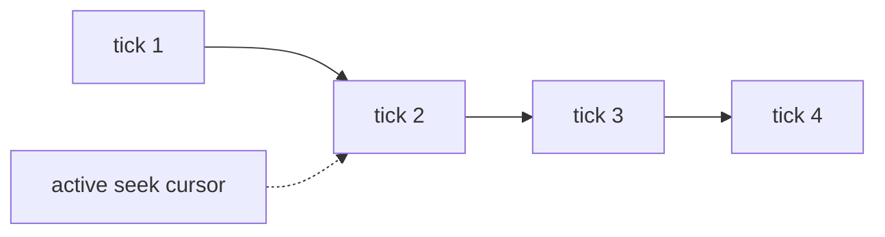

# CLI guide

This is the operator's guide.

Use the CLI when you want to inspect, validate, debug, or time-travel a live repository without writing application code.

- If you are building an app, start with the [Guide](GUIDE.md).
- If you want the substrate internals behind these commands, use the [Advanced Guide](ADVANCED_GUIDE.md).

The CLI is also the shipped Time Travel Debugger surface. In `git-warp`, debugger philosophy and debugger commands stay together because the debugger is intentionally a thin CLI-first adapter over substrate facts.

## Install and invoke

```bash
npm install @git-stunts/git-warp @git-stunts/plumbing
```

You can invoke the CLI in two equivalent ways:

```bash
# direct binary
npx warp-graph <command> [options]

# Git subcommand wrapper
npm run install:git-warp
git warp <command> [options]
```

This guide uses `git warp` in examples.

## Workflow 1: pre-flight checks

Start with `info`, `check`, and `doctor`.

```bash
git warp info --repo ./team-repo
git warp check --repo ./team-repo
git warp doctor --repo ./team-repo --strict
```

If you want the terminal dashboard view, use:

```bash
git warp --view info --repo ./team-repo
git warp --view check --repo ./team-repo
```

Typical operator output looks like this:

```text
+--------------------------------------------------+
| graph: team                                      |
| writers: 3                                       |
| frontier: alice,bob,charlie                      |
| checkpoints: healthy                             |
| index: loaded                                    |
| seek cursor: none                                |
+--------------------------------------------------+
```

Use this workflow when you want to answer:

- is the repo healthy?
- are the expected writers visible?
- is the index loaded?
- is a seek cursor active?

## Workflow 2: in-flight inspection

Use `query`, `path`, `tree`, and `history` for day-to-day inspection.

```bash
git warp query --repo ./team-repo --match 'task:*'
git warp query --repo ./team-repo --match 'task:*' --where-prop status=in-progress
git warp path --repo ./team-repo --from task:review --to user:bob --dir out
git warp tree task:review --repo ./team-repo --edge depends-on --prop status
git warp history --repo ./team-repo --node task:auth
```

These commands are state-level operator tools. They are appropriate for scripts, dashboards, and debugging.

If you want to treat the CLI as a scriptable data source, JSON output works well with `jq`:

```bash
git warp query --repo ./team-repo --match 'task:*' --json | jq '.nodes[].id'
```

## Workflow 3: black-box recovery

`seek` moves the CLI's observation ceiling through history. It does not move Git `HEAD`.



```bash
git warp seek --repo ./team-repo --tick 12
git warp seek --repo ./team-repo --tick -1
git warp seek --repo ./team-repo --tick -1 --diff
git warp seek --repo ./team-repo --latest
git warp seek --repo ./team-repo --save before-review
git warp seek --repo ./team-repo --load before-review
```

Use `bisect` when you know something went bad and need the first bad patch in one writer chain:

```bash
git warp bisect --repo ./team-repo --writer alice --good <sha> --bad <sha> --test "npm test"
```

## Workflow 4: debugger commands

Use the `debug` family when you are investigating why a result looks the way it does.

```bash
git warp debug coordinate --repo ./team-repo
git warp debug timeline --repo ./team-repo --entity-id task:auth
git warp debug conflicts --repo ./team-repo --entity-id task:auth
git warp debug provenance --repo ./team-repo --entity-id task:auth
git warp debug receipts --repo ./team-repo --limit 20
```

For raw patch inspection:

```bash
git warp patch list --repo ./team-repo --limit 10
git warp patch show <patch-sha> --repo ./team-repo
```

For explicit whole-state replay:

```bash
git warp materialize --repo ./team-repo
```

Treat `materialize` as advanced substrate inspection, not the normal application read path.

## Workflow 5: speculative lanes

Use `strand` when you want durable speculative lanes.

```bash
git warp strand create --repo ./team-repo --id review-auth --owner alice --scope "OAuth review"
git warp strand list --repo ./team-repo
git warp strand show review-auth --repo ./team-repo
git warp strand braid review-auth --repo ./team-repo --support peer-review --read-only
git warp strand materialize review-auth --repo ./team-repo --receipts
git warp strand compare review-auth --repo ./team-repo --against live
git warp strand transfer-plan review-auth --repo ./team-repo --into live
git warp strand drop review-auth --repo ./team-repo
```

Use strands for durable speculative coordinates. Use `seek` for temporary cursor movement.

## Workflow 6: trust and maintenance

The CLI also exposes maintenance and trust-oriented commands:

```bash
git warp verify-audit --repo ./team-repo
git warp verify-index --repo ./team-repo
git warp reindex --repo ./team-repo
git warp trust list --repo ./team-repo
git warp install-hooks --repo ./team-repo
```

These are operator and maintainer tools, not normal product APIs.

## Where next

- [Guide](GUIDE.md): builder patterns for app code
- [API Reference](API_REFERENCE.md): exhaustive command and API details
- [Advanced Guide](ADVANCED_GUIDE.md): substrate internals and trust model
- [Conceptual Overview](CONCEPTUAL_OVERVIEW.md): WARP concepts and substrate story
