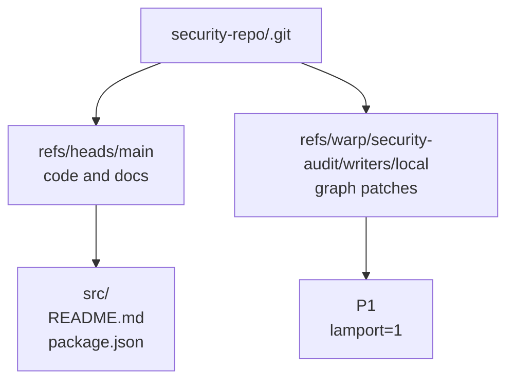

# Getting started

Use this guide when you want your first successful `git-warp` flow:

1. install the package
2. open a worldline
3. write a first patch
4. read current state
5. pin a historical view
6. sync the worldline history through Git refs

If you already know you want broader builder patterns, jump to the [Guide](GUIDE.md). If you want the public read model first, jump to [Readings And Optics](READINGS_AND_OPTICS.md). If you want substrate internals, trust, replay, or performance details, jump to the [Advanced Guide](ADVANCED_GUIDE.md).

## Install

```bash
npm install @git-stunts/git-warp @git-stunts/plumbing
```

## Open a worldline

This walkthrough uses a collaborative security audit worldline. History matters
here because the team will revise findings over time and later inspect earlier
states.

```typescript
import { GitGraphAdapter, openWarpWorldline } from '@git-stunts/git-warp';
import GitPlumbing from '@git-stunts/plumbing';

const plumbing = new GitPlumbing({ cwd: './security-repo' });
const persistence = new GitGraphAdapter({ plumbing });

const audit = await openWarpWorldline({
  persistence,
  worldlineName: 'security-audit',
  writerId: 'local',
});
// audit is a frozen Worldline-first handle over "security-audit"
```

Use a unique `writerId` per machine or clone in real deployments. The tutorial
uses `local` to keep the example readable, but production graphs should use a
stable unique id such as a hostname, device id, or UUID.

> **Advanced compatibility:** `openWarpGraph()`, `WarpApp.open()`, and
> `WarpCore.open()` remain supported for lower-level diagnostics,
> compatibility, migrations, and substrate tooling. New application code should
> start with `openWarpWorldline()`.

## Write the first patch

```typescript
const patch1 = await audit.commit((p) => {
  p.addNode('service:auth')
    .setProperty('service:auth', 'name', 'Auth service')
    .addNode('finding:oauth-state-mismatch')
    .setProperty('finding:oauth-state-mismatch', 'title', 'OAuth state mismatch')
    .setProperty('finding:oauth-state-mismatch', 'severity', 'critical')
    .setProperty('finding:oauth-state-mismatch', 'status', 'open')
    .addEdge('finding:oauth-state-mismatch', 'service:auth', 'affects');
});
// patch1 = 'abc123...'  // patch commit SHA
```

`audit.commit(...)` commits once after the callback finishes. It writes one WARP
patch commit under `refs/warp/security-audit/writers/local`; it does not create
a normal source-tree commit on your checked-out branch.

## See where the graph lives

Your source tree and your graph history share one Git repository, but they live on different refs.



That is the core trick: graph history is stored in Git without taking over normal branch history.

## Write a second patch

```typescript
const patch2 = await audit.commit((p) => {
  p.setProperty('finding:oauth-state-mismatch', 'severity', 'high')
    .setProperty('finding:oauth-state-mismatch', 'status', 'triaged');
});
// patch2 = 'def456...'
```

Now the live graph says the finding is triaged, but the earlier state still exists in history.

## Read current state

The first-use read shape is exact id-only query. When a checkpoint-tail basis is
available, this path uses the bounded exact-read provider and reports a
checkpoint-tail read identity instead of a fake whole-graph hash. Broader
property, wildcard, traversal, and observer reads remain `transitional`; see
[Public API Costs](PUBLIC_API_COSTS.md) before treating them as large-graph
safe.

```typescript
// Create a live read handle over current worldline history
const worldline = audit.live();

const finding = await worldline.query()
  .match('finding:oauth-state-mismatch')
  .select(['id'])
  .run();
// finding = {
//   stateHash: 'checkpoint-tail-query:{...read identity...}',
//   nodes: [{ id: 'finding:oauth-state-mismatch' }],
// }
```

## Read earlier history

Because WARP state is history-aware, you can pin a historical coordinate and read what the graph looked like before the second patch landed.

```typescript
const beforeTriage = await audit.seek({
  source: {
    kind: 'coordinate',
    frontier: { local: patch2 },
    ceiling: 1,
  },
});

const findingBeforeTriage = await beforeTriage.query()
  .match('finding:oauth-state-mismatch')
  .select(['id'])
  .run();
// findingBeforeTriage.nodes = [{ id: 'finding:oauth-state-mismatch' }]
```

`ceiling: 1` means "show me the graph after the first patch only." The second patch still exists in history, but this pinned worldline ignores it.

## Add a filtered read aperture

An `Aperture` defines what is visible. An `Observer` applies that aperture over a worldline.

```typescript
const externalAperture = {
  match: ['finding:*', 'service:*'],
  redact: ['exploitSteps', 'internalNotes'],
};

const externalView = await audit.observer('external-review', externalAperture);
// externalView is an Observer handle scoped by the aperture above
```

## Sync the worldline through Git

In the common case, your graph travels with Git. The part people miss is that WARP refs are not always covered by default branch refspecs, so show them explicitly while you are learning:

```bash
# Fetch graph refs for this graph explicitly
git fetch origin 'refs/warp/security-audit/*:refs/warp/security-audit/*'

# Push graph refs for this graph explicitly
git push origin 'refs/warp/security-audit/*:refs/warp/security-audit/*'
```

In a real repo, you will usually automate that with Git config or team tooling so you do not type those refspecs by hand forever.

## What you learned

- writes become WARP patch commits under `refs/warp/...`
- source-tree history and graph history stay separate
- `WarpWorldline.commit()` creates and commits patches
- `WarpWorldline.live()` provides live reads, traversal, and query builders
- historical reads are pinned by coordinate, not reconstructed in app code
- Git transports the graph, but you may need explicit WARP refspecs

## Next steps

- [Readings And Optics](READINGS_AND_OPTICS.md): public read contract, live and pinned readings, observers, and optics
- [Guide](GUIDE.md): builder patterns for Worldlines, observers, and strands
- [API Reference](API_REFERENCE.md): exhaustive API and examples
- [Advanced Guide](ADVANCED_GUIDE.md): substrate internals, trust, replay, and performance
- [CLI Guide](CLI_GUIDE.md): operator workflows from the terminal
- [Conceptual Overview](CONCEPTUAL_OVERVIEW.md): the WARP mental model and Git substrate story
