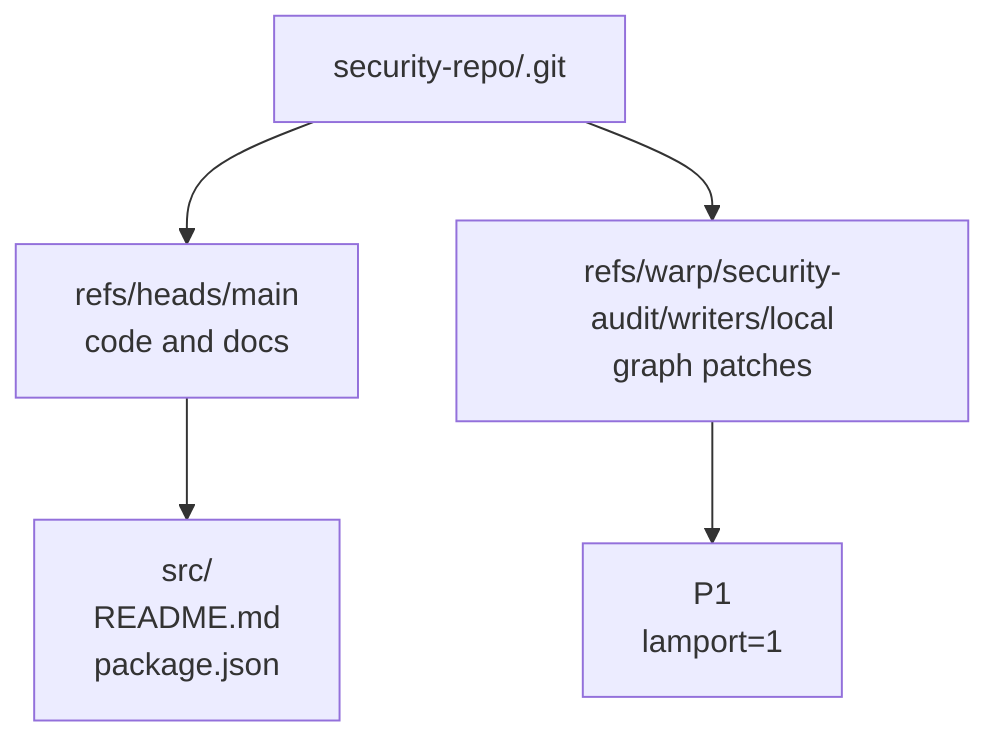

# Getting started

Use this guide when you want your first successful `git-warp` flow:

1. install the package
2. open a graph
3. write a first patch
4. read current state
5. pin a historical view
6. sync the graph through Git refs

If you already know you want broader builder patterns, jump to the [Guide](GUIDE.md). If you want substrate internals, trust, replay, or performance details, jump to the [Advanced Guide](ADVANCED_GUIDE.md).

## Install

```bash
npm install @git-stunts/git-warp @git-stunts/plumbing
```

## Open a graph

This walkthrough uses a collaborative security audit graph. History matters here because the team will revise findings over time and later inspect earlier states.

```javascript
import GitPlumbing from '@git-stunts/plumbing';
import WarpApp, { GitGraphAdapter } from '@git-stunts/git-warp';

const plumbing = new GitPlumbing({ cwd: './security-repo' });
const persistence = new GitGraphAdapter({ plumbing });

const app = await WarpApp.open({
  persistence,
  graphName: 'security-audit',
  writerId: 'local',
});
// app is a WarpApp handle over the graph named "security-audit"
```

Use a unique `writerId` per machine or clone in real deployments. The tutorial
uses `local` to keep the example readable, but production graphs should use a
stable unique id such as a hostname, device id, or UUID.

## Write the first patch

```javascript
const patch1 = await app.patch((p) => {
  p.addNode('service:auth')
    .setProperty('service:auth', 'name', 'Auth service')
    .addNode('finding:oauth-state-mismatch')
    .setProperty('finding:oauth-state-mismatch', 'title', 'OAuth state mismatch')
    .setProperty('finding:oauth-state-mismatch', 'severity', 'critical')
    .setProperty('finding:oauth-state-mismatch', 'status', 'open')
    .addEdge('finding:oauth-state-mismatch', 'service:auth', 'affects');
});
// patch1 = 'abc123...'  // patch commit SHA
```

`app.patch(...)` commits once after the callback finishes. It writes one WARP patch commit under `refs/warp/security-audit/writers/local`; it does not create a normal source-tree commit on your checked-out branch.

## See where the graph lives

Your source tree and your graph history share one Git repository, but they live on different refs.



That is the core trick: graph history is stored in Git without taking over normal branch history.

## Write a second patch

```javascript
const patch2 = await app.patch((p) => {
  p.setProperty('finding:oauth-state-mismatch', 'severity', 'high')
    .setProperty('finding:oauth-state-mismatch', 'status', 'triaged');
});
// patch2 = 'def456...'
```

Now the live graph says the finding is triaged, but the earlier state still exists in history.

## Read current state

```javascript
const worldline = app.worldline();
// worldline is a pinned read handle over current graph history

const finding = await worldline.getNodeProps('finding:oauth-state-mismatch');
// { title: 'OAuth state mismatch', severity: 'high', status: 'triaged' }

const findings = await worldline.query()
  .match('finding:*')
  .run();
// findings = {
//   stateHash: 'abc123...',
//   nodes: [
//     {
//       id: 'finding:oauth-state-mismatch',
//       props: { title: 'OAuth state mismatch', severity: 'high', status: 'triaged' },
//     },
//   ],
// }

const path = await worldline.traverse.shortestPath('finding:oauth-state-mismatch', 'service:auth', {
  dir: 'out',
});
// path = {
//   found: true,
//   path: ['finding:oauth-state-mismatch', 'service:auth'],
//   length: 1,
// }
```

## Read earlier history

Because WARP state is history-aware, you can pin a historical coordinate and read what the graph looked like before the second patch landed.

```javascript
const beforeTriage = app.worldline({
  source: {
    kind: 'coordinate',
    frontier: { local: patch2 },
    ceiling: 1,
  },
});

const findingBeforeTriage = await beforeTriage.getNodeProps('finding:oauth-state-mismatch');
// { title: 'OAuth state mismatch', severity: 'critical', status: 'open' }
```

`ceiling: 1` means "show me the graph after the first patch only." The second patch still exists in history, but this pinned worldline ignores it.

## Add a filtered read aperture

A `Lens` defines what is visible. An `Observer` applies that lens over a worldline.

```javascript
const externalLens = {
  match: ['finding:*', 'service:*'],
  redact: ['exploitSteps', 'internalNotes'],
};

const externalView = await worldline.observer('external-review', externalLens);
// externalView is an Observer handle scoped by the lens above
```

## Sync the graph through Git

In the common case, your graph travels with Git. The part people miss is that WARP refs are not always covered by default branch refspecs, so show them explicitly while you are learning:

```bash
# Fetch graph refs for this graph explicitly
git fetch origin 'refs/warp/security-audit/*:refs/warp/security-audit/*'

# Push graph refs for this graph explicitly
git push origin 'refs/warp/security-audit/*:refs/warp/security-audit/*'
```

In a real repo, you will usually automate that with Git config or team tooling so you do not type those refspecs by hand forever.

## What you learned

- writes become WARP patch commits under `refs/warp/...`
- source-tree history and graph history stay separate
- `Worldline` is the normal read handle
- historical reads are pinned by coordinate, not reconstructed in app code
- Git transports the graph, but you may need explicit WARP refspecs

## Next steps

- [Guide](GUIDE.md): builder patterns for `WarpApp`, worldlines, observers, and strands
- [API Reference](API_REFERENCE.md): exhaustive API and examples
- [Advanced Guide](ADVANCED_GUIDE.md): substrate internals, trust, replay, and performance
- [CLI Guide](CLI_GUIDE.md): operator workflows from the terminal
- [Conceptual Overview](CONCEPTUAL_OVERVIEW.md): the WARP mental model and Git substrate story
