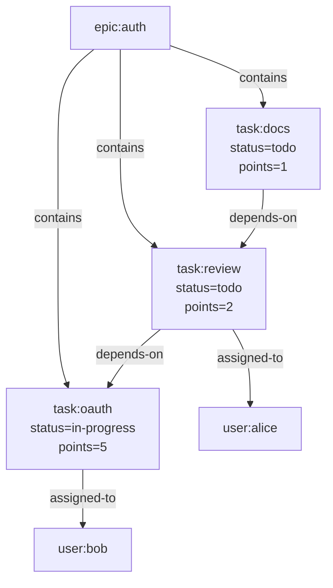

# Guide

This is the builder's guide.

Use it when you are writing an app, an agent workflow, or a local-first tool on top of `git-warp` and you want the main patterns without reading a substrate manual.

- If you are brand new, start with [Getting Started](GETTING_STARTED.md).
- If you want exhaustive method-by-method detail, use the [API Reference](API_REFERENCE.md).
- If you want replay, trust, performance, and substrate internals, use the [Advanced Guide](ADVANCED_GUIDE.md).
- If you want terminal workflows, use the [CLI Guide](CLI_GUIDE.md).

## Mental model

The most important thing to understand is state before methods.

- `WarpApp` is the root you build on.
- A `Worldline` is a pinned read coordinate.
- A `Lens` defines what is visible.
- An `Observer` is a filtered read-only view through that lens.
- A `Strand` is a speculative write lane branched from an observation.

If you understand those nouns, the rest of the API becomes much easier to reason about.

## Open an app

```javascript
import GitPlumbing from '@git-stunts/plumbing';
import WarpApp, { GitGraphAdapter } from '@git-stunts/git-warp';

const plumbing = new GitPlumbing({ cwd: './team-repo' });
const persistence = new GitGraphAdapter({ plumbing });

const app = await WarpApp.open({
  persistence,
  graphName: 'team',
  writerId: 'alice',
});
// app is the root handle for this graph
```

## Common write patterns

### Pattern 1: direct patch

Use `app.patch(...)` for normal live writes.

```javascript
const patchSha = await app.patch((p) => {
  p.addNode('task:auth')
    .setProperty('task:auth', 'title', 'Implement OAuth2')
    .setProperty('task:auth', 'status', 'in-progress');
});
// patchSha = 'abc123...'
```

This commits one atomic WARP patch after the callback finishes. It updates `refs/warp/<graph>/writers/<writerId>`. It does not touch your normal Git worktree or create a source-tree commit on the current branch.

### Pattern 2: explicit writer session

Use the writer API when you want a multi-step session before committing.

```javascript
const writer = await app.writer();
const session = await writer.beginPatch();

session.addNode('task:review');
session.setProperty('task:review', 'status', 'todo');
session.addEdge('task:review', 'task:auth', 'depends-on');

const patchSha = await session.commit();
// patchSha = 'def456...'
```

Nothing is written until `session.commit()` runs.

### Pattern 3: speculative write lane

Use a `Strand` when you want reviewable or transferable work that should not land in live truth yet.

```javascript
const strand = await app.createStrand({
  strandId: 'review-auth',
  owner: 'alice',
  scope: 'OAuth review',
});
// strand = { strandId: 'review-auth', ... }

await app.patchStrand('review-auth', (p) => {
  p.setProperty('task:auth', 'status', 'ready-for-review');
});

const reviewLane = app.worldline({
  source: { kind: 'strand', strandId: 'review-auth' },
});
// reviewLane is a Worldline pinned to the strand overlay
```

Use strands for speculative work. Use ordinary patches for live truth.

For the deeper substrate story behind strands, braids, and transfer planning, use [Advanced Guide → Strands and braids](ADVANCED_GUIDE.md#strands-and-braids).

## Common read patterns

### Pattern 1: the live view

Start from a worldline when you want stable application reads.

```javascript
const worldline = app.worldline();

const task = await worldline.getNodeProps('task:auth');
// { title: 'Implement OAuth2', status: 'in-progress' }
```

### Pattern 2: the redacted view

Add an observer when the caller should not see everything.

```javascript
const userLens = {
  match: ['user:*', 'task:*'],
  redact: ['email', 'ssn'],
};

const view = await worldline.observer('public-users', userLens);
const users = await view.query().match('user:*').run();
// users = {
//   stateHash: 'abc123...',
//   nodes: [
//     { id: 'user:alice', props: { name: 'Alice', role: 'lead' } },
//   ],
// }
```

### Pattern 3: the historical view

Pin an explicit coordinate when you need to ask what the graph looked like earlier.

```javascript
const historical = app.worldline({
  source: {
    kind: 'coordinate',
    frontier: { alice: 'patch-tip-sha' },
    ceiling: 12,
  },
});

const taskAtTick12 = await historical.getNodeProps('task:auth');
// { title: 'Implement OAuth2', status: 'todo' }
```

### Pattern 4: the speculative view

Read a strand through the same worldline abstraction you use for live truth.

```javascript
const reviewLane = app.worldline({
  source: { kind: 'strand', strandId: 'review-auth' },
});

const reviewTask = await reviewLane.getNodeProps('task:auth');
// { title: 'Implement OAuth2', status: 'ready-for-review' }
```

## Common query patterns

Use one canonical graph example when you are learning the query and traversal surface:



### Pattern 1: match nodes

```javascript
const tasks = await worldline.query()
  .match('task:*')
  .run();
// tasks = {
//   stateHash: 'abc123...',
//   nodes: [
//     { id: 'task:oauth', props: { status: 'in-progress', points: 5 } },
//     { id: 'task:review', props: { status: 'todo', points: 2 } },
//     { id: 'task:docs', props: { status: 'todo', points: 1 } },
//   ],
// }
```

### Pattern 2: hop outward from a node

```javascript
const downstream = await worldline.query()
  .match('epic:auth')
  .outgoing('contains', { depth: [1, 2] })
  .run();
// downstream = {
//   stateHash: 'abc123...',
//   nodes: [
//     { id: 'task:oauth', props: { status: 'in-progress', points: 5 } },
//     { id: 'task:review', props: { status: 'todo', points: 2 } },
//     { id: 'task:docs', props: { status: 'todo', points: 1 } },
//     { id: 'user:bob', props: {} },
//     { id: 'user:alice', props: {} },
//   ],
// }
```

### Pattern 3: aggregate

```javascript
const summary = await worldline.query()
  .match('task:*')
  .where({ status: 'todo' })
  .aggregate({ count: true, sum: 'props.points', avg: 'props.points' })
  .run();
// summary = {
//   stateHash: 'abc123...',
//   count: 2,
//   sum: 3,
//   avg: 1.5,
// }
```

### Pattern 4: find a path

```javascript
const dependencyPath = await worldline.traverse.shortestPath('task:docs', 'task:oauth', {
  dir: 'out',
  labelFilter: 'depends-on',
});
// dependencyPath = {
//   found: true,
//   path: ['task:docs', 'task:review', 'task:oauth'],
//   length: 2,
// }
```

For the exhaustive query surface, use the [API Reference](API_REFERENCE.md).

## Collaboration patterns

### Sync

The simplest sync is Git push and pull plus the WARP refspecs for your graph:

```bash
git fetch origin 'refs/warp/team/*:refs/warp/team/*'
git push origin 'refs/warp/team/*:refs/warp/team/*'
```

Automate those refspecs in team tooling or Git config once the workflow is established.

### Conflict outcomes

The easiest way to understand CRDT behavior is to look at outcomes, not theory.

| Alice writes | Bob writes | Outcome |
| --- | --- | --- |
| add node `task:auth` | add node `task:auth` | one visible node; duplicate adds converge |
| set `task:auth.status = "todo"` | set `task:auth.status = "done"` | one winning value by Lamport order, then writer tie-break |
| add edge `task:review -> task:auth` | remove same edge without seeing add | concurrent add wins |
| remove node after observing current edge set | set property on removed node concurrently | tombstoned node stays hidden in live view |

The inspection APIs are valid tools here. What you should avoid is rebuilding your own graph engine above `git-warp` when the substrate already knows how to replay, query, and traverse.

### Pattern: find out why your write lost

If you know a write was superseded and need the reason, inspect receipts through `WarpCore` instead of guessing from app state.

```javascript
const { receipts } = await app.core().materialize({ receipts: true });

const supersededOps = receipts.flatMap((receipt) =>
  receipt.ops
    .filter((op) => op.result === 'superseded')
    .map((op) => ({
      patchSha: receipt.patchSha,
      lamport: receipt.lamport,
      writer: receipt.writer,
      target: op.target,
      reason: op.reason ?? 'superseded by deterministic replay order',
    })),
);
// supersededOps = [
//   {
//     patchSha: 'abc123...',
//     lamport: 14,
//     writer: 'alice',
//     target: 'task:auth',
//     reason: 'superseded by deterministic replay order',
//   },
// ]
```

Use this pattern when you need to explain a lost race or build higher-level conflict UX. For the deeper replay and provenance model behind receipts, use [Advanced Guide → How replay converges](ADVANCED_GUIDE.md#how-replay-converges).

## When to drop to WarpCore

Reach for `app.core()` when you intentionally need:

- whole-visible-state inspection
- materialization and replay receipts
- provenance and patch inspection
- coordinate comparison and transfer planning
- debugger or operator tooling

What to avoid is not the inspection API itself. The thing to avoid is exporting that data into a second app-local graph or writing your own traversal/query semantics above the substrate.

## Where next

- [API Reference](API_REFERENCE.md): exhaustive methods, flags, and examples
- [Advanced Guide](ADVANCED_GUIDE.md): patch anatomy, replay, trust, GC, and performance
- [CLI Guide](CLI_GUIDE.md): operator workflows and live-repo inspection
- [Conceptual Overview](CONCEPTUAL_OVERVIEW.md): the WARP mental model and Git substrate story
