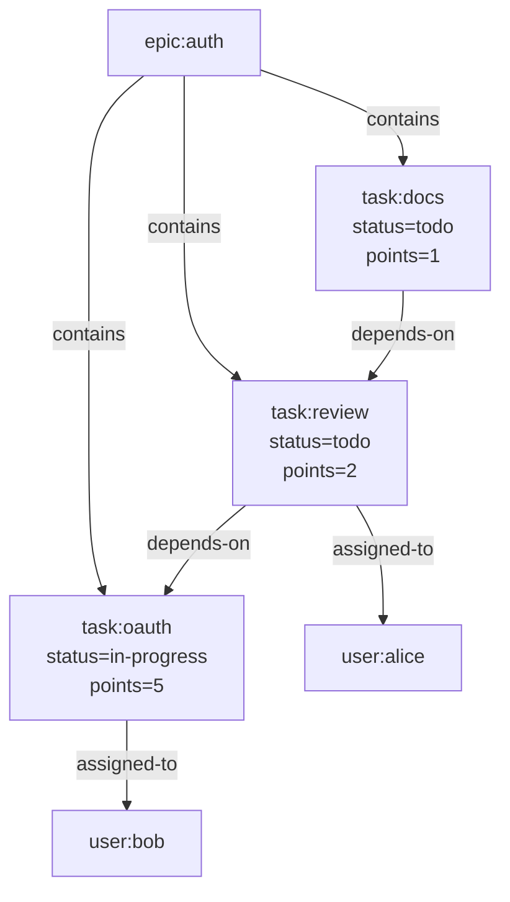

# Guide

This is the builder's guide.

Use it when you are writing an app, an agent workflow, or a local-first tool on top of `git-warp` and you want the main patterns without reading a substrate manual.

- If you are brand new, start with [Getting Started](GETTING_STARTED.md).
- If you want the public read model, use [Readings And Optics](READINGS_AND_OPTICS.md).
- If you want exhaustive method-by-method detail, use the [API Reference](API_REFERENCE.md).
- If you want replay, trust, performance, and substrate internals, use the [Advanced Guide](ADVANCED_GUIDE.md).
- If you want terminal workflows, use the [CLI Guide](CLI_GUIDE.md).
- If you want the canonical meaning of core nouns like `Worldline`,
  `Observer`, `Aperture`, or `Coordinate`, use [GLOSSARY.md](GLOSSARY.md).

## Mental model

The most important thing to understand is state before methods.

- `openWarpWorldline()` returns the first-use handle for application workflows.
- A `Worldline` is an admitted causal lane and a pinned read coordinate.
- An `Aperture` defines what is visible.
- An `Observer` is a filtered read-only view through that aperture.
- A `Strand` is a speculative write lane branched from an observation.
- `openWarpGraph()` returns the lower-level capability bag for diagnostics,
  migration, sync, provenance, checkpoints, and speculative-strand controls.

If you understand those nouns, the rest of the API becomes much easier to reason about.

> **Advanced compatibility:** `openWarpGraph()`, `WarpApp.open()`, and
> `WarpCore.open()` remain supported for lower-level diagnostics,
> compatibility, migrations, and substrate tooling. New application code should
> start with `openWarpWorldline()`.

## Open a worldline

```typescript
import {
  GitGraphAdapter,
  openWarpGraph,
  openWarpWorldline,
} from '@git-stunts/git-warp';
import GitPlumbing from '@git-stunts/plumbing';

const plumbing = new GitPlumbing({ cwd: './team-repo' });
const persistence = new GitGraphAdapter({ plumbing });

const team = await openWarpWorldline({
  persistence,
  worldlineName: 'team',
  writerId: 'alice',
});
// team is the frozen Worldline-first handle for this admitted lane
```

## Common write patterns

### Pattern 1: direct patch

Use `worldline.commit(...)` for normal live writes.

```typescript
const patchSha = await team.commit((p) => {
  p.addNode('task:auth')
    .setProperty('task:auth', 'title', 'Implement OAuth2')
    .setProperty('task:auth', 'status', 'in-progress');
});
// patchSha = 'abc123...'
```

This commits one atomic WARP patch after the callback finishes. It updates
`refs/warp/<graph>/writers/<writerId>`. It does not touch your normal Git
worktree or create a source-tree commit on the current branch.

The remaining write patterns use the lower-level graph capability bag because
they need writer sessions or speculative lanes:

```typescript
const graph = await openWarpGraph({
  persistence,
  graphName: 'team',
  writerId: 'alice',
});
```

### Pattern 2: explicit writer session

Use the lower-level graph writer API when you intentionally want a multi-step
session before committing.

```typescript
const writer = await graph.patches.writer();
const session = await writer.beginPatch();

session.addNode('task:review');
session.setProperty('task:review', 'status', 'todo');
session.addEdge('task:review', 'task:auth', 'depends-on');

const patchSha = await session.commit();
// patchSha = 'def456...'
```

Nothing is written until `session.commit()` runs.

### Pattern 3: speculative write lane

Use a `Strand` when you want reviewable or transferable work that should not land in live truth yet.

```typescript
const strand = await graph.strands.createStrand({
  strandId: 'review-auth',
  owner: 'alice',
  scope: 'OAuth review',
});
// strand = { strandId: 'review-auth', ... }

await graph.strands.patchStrand('review-auth', (p) => {
  p.setProperty('task:auth', 'status', 'ready-for-review');
});

const reviewLane = graph.query.worldline({
  source: { kind: 'strand', strandId: 'review-auth' },
});
// reviewLane is a Worldline pinned to the strand overlay
```

Use strands for speculative work. Use ordinary patches for live truth.

For the deeper substrate story behind strands, braids, and transfer planning, use [Advanced Guide -> Strands and braids](ADVANCED_GUIDE.md#strands-and-braids).

## Streamed substrate work

Most application code should not handle substrate streams directly. Use
worldlines, observers, optics, and query builders first.

When you are writing an adapter or a diagnostic tool, unbounded substrate reads
use `WarpStream` through advanced ports instead of returning whole arrays.
Typical examples are commit-log scans, patch-journal ranges, and index-shard
reads. Consume them with `for await` and keep each streamed item as the unit of
work:

```typescript
const stream = await persistence.logNodesStream({
  ref: 'refs/warp/team/writers/alice',
});

for await (const chunk of stream) {
  // Inspect or forward one commit-log chunk at a time.
}
```

If you are not implementing a port, prefer the higher-level read APIs in this
guide. Streams are the substrate boundary, not a second application query
model.

## Common read patterns

The patterns in this section are the preferred application API shapes. Their
current providers are classified per surface; use
[Public API Costs](PUBLIC_API_COSTS.md) for the current cost label and caveat
before treating a read path as large-graph safe.

### Pattern 1: the live view

Start from a worldline when you want stable application reads.

```typescript
const worldline = team.live();

const task = await worldline.query()
  .match('task:auth')
  .select(['id'])
  .run();
// task.nodes = [{ id: 'task:auth' }]
```

### Pattern 2: the redacted view

Add an observer when the caller should not see everything.

```typescript
const userAperture = {
  match: ['user:*', 'task:*'],
  redact: ['email', 'ssn'],
};

const view = await worldline.observer('public-users', userAperture);
const users = await view.query().match('user:*').run();
// users = {
//   stateHash: 'abc123...',
//   nodes: [
//     { id: 'user:alice', props: { name: 'Alice', role: 'lead' } },
//   ],
// }
```

Observer redaction is application-layer filtering. It is useful for
multi-tenant views and product isolation, but it is not a cryptographic
boundary: a user with filesystem access to `.git/objects/` can still inspect
raw patch objects unless the graph content is encrypted at rest. Use
`CasContentEncryptionPolicy` and the vault-backed CAS workflow in the
[Advanced Guide](ADVANCED_GUIDE.md#vault-backed-cas-content-encryption) when
the data itself must be protected. `@git-stunts/vault` is the intended key
management path; do not put graph encryption secrets in `.env` files.

### Pattern 3: the historical view

Pin an explicit coordinate when you need to ask what the graph looked like earlier.

```typescript
const historical = await team.seek({
  source: {
    kind: 'coordinate',
    frontier: { alice: 'patch-tip-sha' },
    ceiling: 12,
  },
});

const taskAtTick12 = await historical.getNodeProps('task:auth');
// { title: 'Implement OAuth2', status: 'todo' }
```

### Pattern 4: the speculative view

Read a strand through the same worldline abstraction you use for live truth.

```typescript
const reviewLane = graph.query.worldline({
  source: { kind: 'strand', strandId: 'review-auth' },
});

const reviewTask = await reviewLane.getNodeProps('task:auth');
// { title: 'Implement OAuth2', status: 'ready-for-review' }
```

## Common query patterns

Use one canonical graph example when you are learning the query and traversal surface:



### Pattern 1: match nodes

```typescript
const tasks = await worldline.query()
  .match('task:*')
  .run();
// tasks = {
//   stateHash: 'abc123...',
//   nodes: [
//     { id: 'task:oauth', props: { status: 'in-progress', points: 5 } },
//     { id: 'task:review', props: { status: 'todo', points: 2 } },
//     { id: 'task:docs', props: { status: 'todo', points: 1 } },
//   ],
// }
```

### Pattern 2: hop outward from a node

```typescript
const downstream = await worldline.query()
  .match('epic:auth')
  .outgoing('contains', { depth: [1, 2] })
  .run();
// downstream = {
//   stateHash: 'abc123...',
//   nodes: [
//     { id: 'task:oauth', props: { status: 'in-progress', points: 5 } },
//     { id: 'task:review', props: { status: 'todo', points: 2 } },
//     { id: 'task:docs', props: { status: 'todo', points: 1 } },
//     { id: 'user:bob', props: {} },
//     { id: 'user:alice', props: {} },
//   ],
// }
```

### Pattern 3: aggregate

```typescript
const summary = await worldline.query()
  .match('task:*')
  .where({ status: 'todo' })
  .aggregate({ count: true, sum: 'props.points', avg: 'props.points' })
  .run();
// summary = {
//   stateHash: 'abc123...',
//   count: 2,
//   sum: 3,
//   avg: 1.5,
// }
```

### Pattern 4: find a path

```typescript
const dependencyPath = await worldline.traverse.shortestPath('task:docs', 'task:oauth', {
  dir: 'out',
  labelFilter: 'depends-on',
});
// dependencyPath = {
//   found: true,
//   path: ['task:docs', 'task:review', 'task:oauth'],
//   length: 2,
// }
```

For the exhaustive query surface, use the [API Reference](API_REFERENCE.md).

## Collaboration patterns

### Sync

The simplest sync is Git push and pull plus the WARP refspecs for your graph:

```bash
git fetch origin 'refs/warp/team/*:refs/warp/team/*'
git push origin 'refs/warp/team/*:refs/warp/team/*'
```

Automate those refspecs in team tooling or Git config once the workflow is established.

### Conflict outcomes

The easiest way to understand CRDT behavior is to look at outcomes, not theory.

| Alice writes | Bob writes | Outcome |
| --- | --- | --- |
| add node `task:auth` | add node `task:auth` | one visible node; duplicate adds converge |
| set `task:auth.status = "todo"` | set `task:auth.status = "done"` | one winning value by Lamport order, then writer tie-break |
| add edge `task:review -> task:auth` | remove same edge without seeing add | concurrent add wins |
| remove node after observing current edge set | set property on removed node concurrently | tombstoned node stays hidden in live view |

The inspection APIs are valid tools here. What you should avoid is rebuilding your own graph engine above `git-warp` when the substrate already knows how to replay, query, and traverse.

### Pattern: find out why your write lost

If you know a write was superseded and need the reason, inspect the provenance for the entity and load the contributing patches.

```typescript
const patchShas = await graph.provenance.patchesFor('task:auth');

for (const patchSha of patchShas) {
  const patch = await graph.provenance.loadPatchBySha(patchSha);
  console.log(patchSha, patch.ops.length);
}
```

Use this pattern when you need to explain a lost race or build higher-level conflict UX. For the deeper replay and provenance model behind receipts, use [Advanced Guide -> How replay converges](ADVANCED_GUIDE.md#how-replay-converges). For the app-facing read contract, use [Readings And Optics](READINGS_AND_OPTICS.md).

## When to use lower-level capabilities

Reach for individual capability namespaces when you intentionally need:

- `graph.query` — compatibility and diagnostic reads through worldlines,
  observers, traversal, and query builders
- `graph.provenance` — provenance and patch inspection, backward-cone tracing
- `graph.comparison` — coordinate comparison and transfer planning
- `graph.checkpoint` — checkpoint creation, GC metrics
- `graph.sync` — programmatic sync, serve endpoints
- `graph.subscriptions` — reactive push-based change notification

What to avoid is not the inspection API itself. The thing to avoid is exporting that data into a second app-local graph or writing your own traversal/query semantics above the substrate.

## Where next

- [Readings And Optics](READINGS_AND_OPTICS.md): public read model and app-facing read patterns
- [API Reference](API_REFERENCE.md): exhaustive methods, flags, and examples
- [Advanced Guide](ADVANCED_GUIDE.md): patch anatomy, replay, trust, GC, and performance
- [CLI Guide](CLI_GUIDE.md): operator workflows and live-repo inspection
- [Conceptual Overview](CONCEPTUAL_OVERVIEW.md): the WARP mental model and Git substrate story
