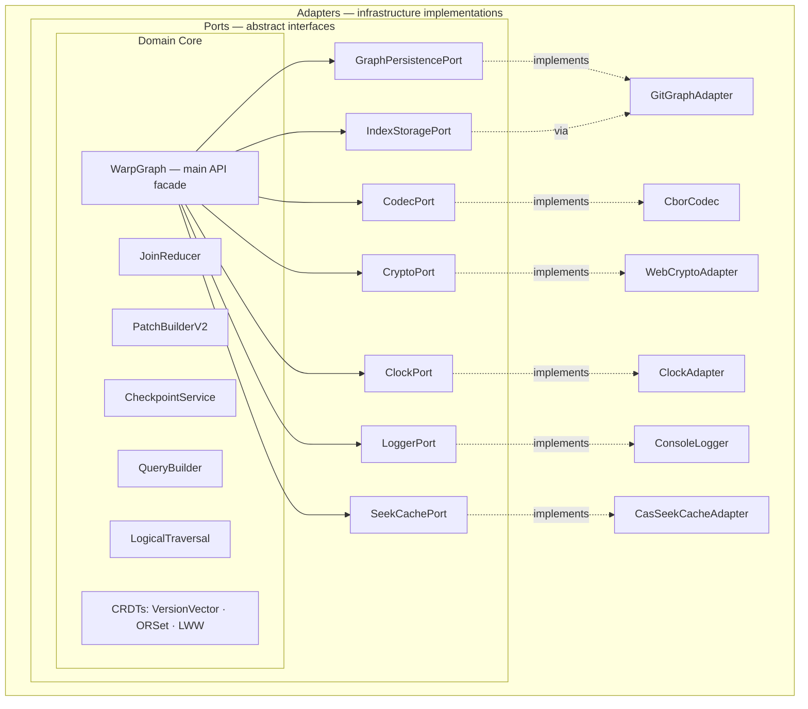
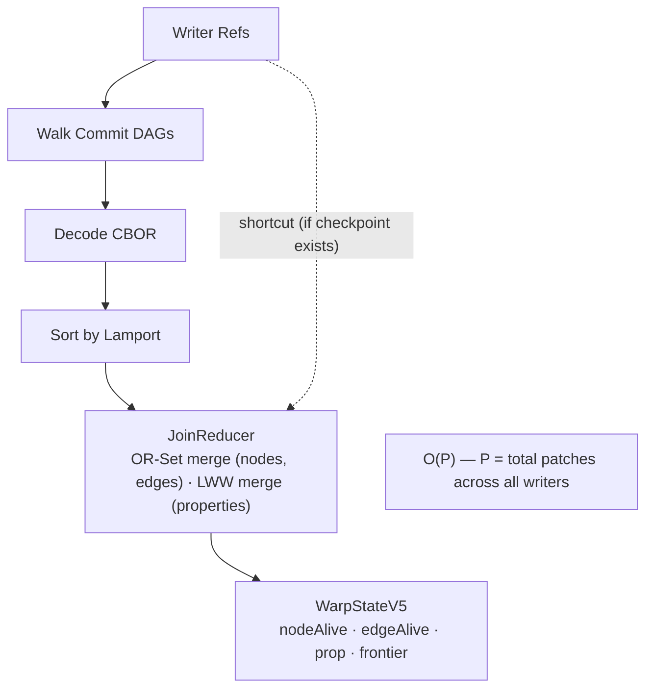
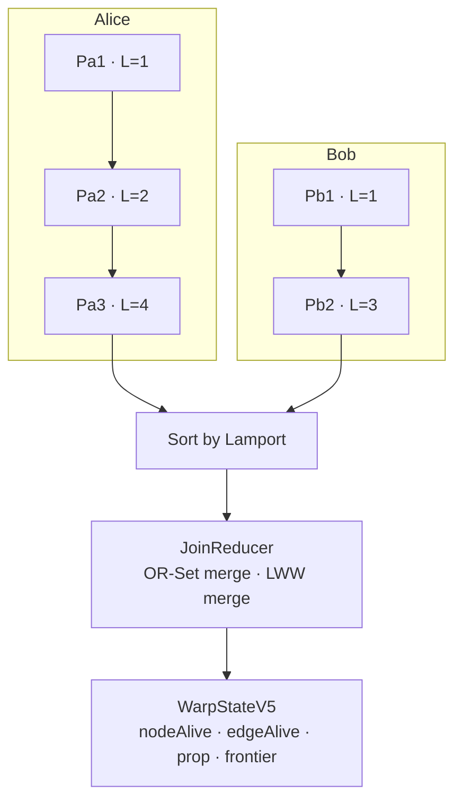
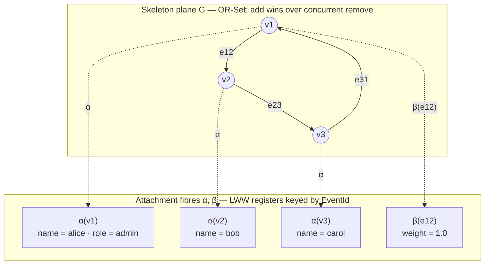
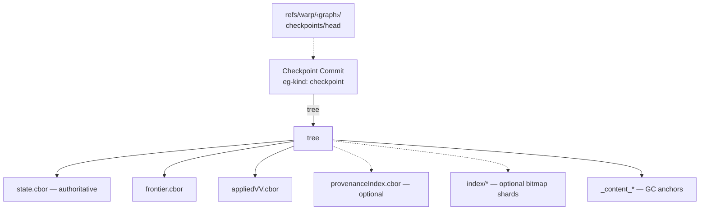
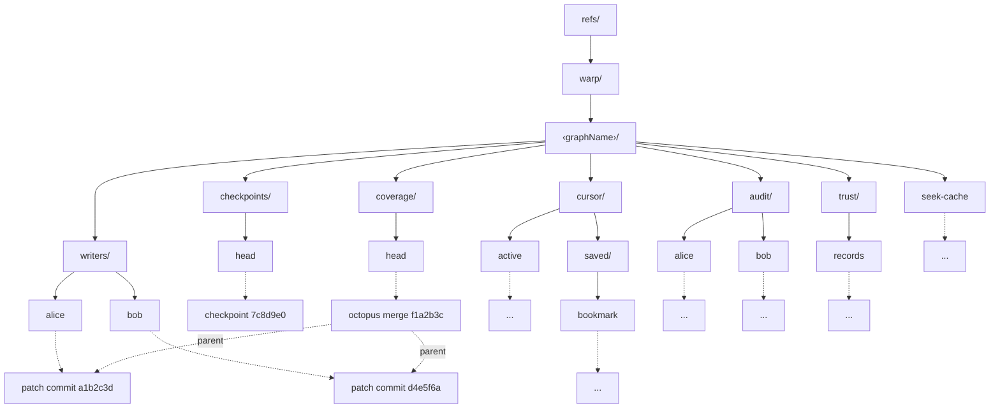
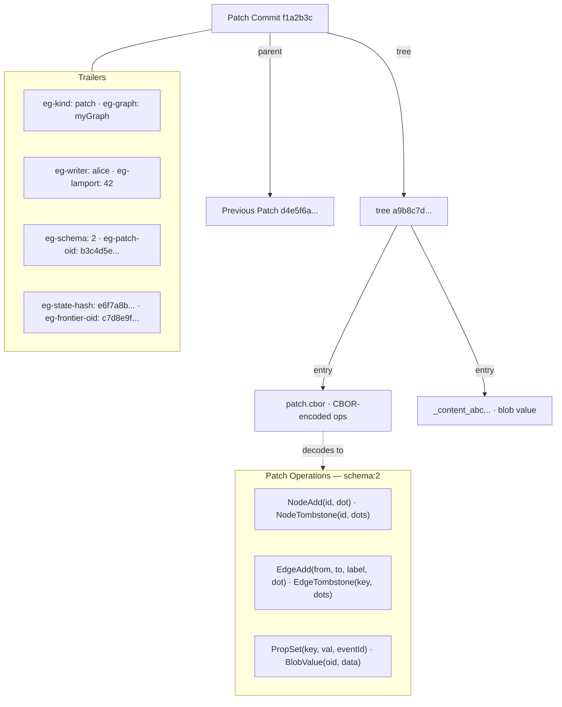

# WarpGraph User Guide

WarpGraph is a multi-writer graph database that uses Git commits as its storage substrate. Multiple independent writers can modify the same graph without coordination — changes merge deterministically using CRDTs, and Git provides content-addressing, cryptographic integrity, and distributed replication for free.

## When to Use WarpGraph

- **Multiple processes or machines** writing to the same graph
- **Offline-first applications** that sync later
- **Distributed systems** without central coordination
- **Audit trails** — every change is a Git commit with full provenance
- **Embedded graph storage** — no database server needed, just a Git repo

## Prerequisites

- Node.js >= 22.0.0
- Git >= 2.0

## Installation

```bash
npm install @git-stunts/git-warp
```

### Multi-Runtime Support

The domain layer has no direct Node.js built-in imports. Runtime-specific adapters are provided for crypto and HTTP:

| Runtime | Crypto Adapter | HTTP Adapter |
|---------|---------------|--------------|
| Node.js | `NodeCryptoAdapter` | `NodeHttpAdapter` |
| Deno | `WebCryptoAdapter` | `DenoHttpAdapter` |
| Bun | `WebCryptoAdapter` | `BunHttpAdapter` |
| Browser | `WebCryptoAdapter` | N/A |

```javascript
import { WarpGraph, WebCryptoAdapter } from '@git-stunts/git-warp';

const graph = await WarpGraph.open({
  persistence,
  graphName: 'demo',
  writerId: 'writer-1',
  crypto: new WebCryptoAdapter(),  // uses globalThis.crypto.subtle
});
```

If no crypto adapter is provided, checksum computation gracefully returns `null` (checksums are optional for correctness — they protect against bit-rot, not CRDT convergence).

---

## Quick Start

```javascript
import { WarpGraph, GitGraphAdapter } from '@git-stunts/git-warp';
import Plumbing from '@git-stunts/plumbing';

// 1. Point at a Git repo
const plumbing = new Plumbing({ cwd: './my-repo' });
const persistence = new GitGraphAdapter({ plumbing });

// 2. Open a graph
const graph = await WarpGraph.open({
  persistence,
  graphName: 'todos',
  writerId: 'local',
});

// 3. Write some data
await (await graph.createPatch())
  .addNode('todo:1')
  .setProperty('todo:1', 'title', 'Buy groceries')
  .setProperty('todo:1', 'done', false)
  .addEdge('todo:1', 'list:shopping', 'belongs-to')
  .commit();

// 4. Materialize and read
await graph.materialize();

const nodes = await graph.getNodes();
// ['list:shopping', 'todo:1']

const props = await graph.getNodeProps('todo:1');
// Map { 'title' => 'Buy groceries', 'done' => false }

const exists = await graph.hasNode('todo:1');
// true
```

That's it. Your graph data is stored as Git commits — invisible to normal Git workflows but inheriting all of Git's properties.



---

## Writing Data

All writes go through **patches** — atomic batches of graph operations. A patch can contain any combination of node adds/removes, edge adds/removes, and property sets. Each patch becomes a single Git commit.

### Creating Patches

```javascript
await (await graph.createPatch())
  .addNode('user:alice')
  .addNode('user:bob')
  .setProperty('user:alice', 'name', 'Alice')
  .setProperty('user:bob', 'name', 'Bob')
  .addEdge('user:alice', 'user:bob', 'follows')
  .commit();
```

All methods on the patch builder are chainable. Nothing is written until `commit()` is called.

### Operations

| Operation | Method | Description |
|---|---|---|
| Add node | `.addNode(nodeId)` | Creates a node |
| Remove node | `.removeNode(nodeId)` | Tombstones a node (hides it and its edges/props) |
| Add edge | `.addEdge(from, to, label)` | Creates a directed, labeled edge |
| Remove edge | `.removeEdge(from, to, label)` | Tombstones an edge |
| Set node property | `.setProperty(nodeId, key, value)` | Sets a property on a node |
| Set edge property | `.setEdgeProperty(from, to, label, key, value)` | Sets a property on an edge |

Property values must be JSON-serializable (strings, numbers, booleans, null, arrays, plain objects).

### Removing Nodes

When you remove a node, its edges and properties become invisible automatically (tombstone cascading):

```javascript
await (await graph.createPatch())
  .addNode('temp')
  .setProperty('temp', 'data', 'value')
  .addEdge('temp', 'other', 'link')
  .commit();

await (await graph.createPatch())
  .removeNode('temp')
  .commit();

await graph.materialize();
await graph.hasNode('temp');    // false
await graph.getEdges();         // [] — edge is hidden too
```

The `onDeleteWithData` option (set on `WarpGraph.open()`) controls what happens when you remove a node that has attached edges or properties:

| Policy | Behavior |
|---|---|
| `'warn'` (default) | Removes the node, logs a warning about orphaned data |
| `'cascade'` | Removes the node and explicitly tombstones its edges |
| `'reject'` | Throws an error if the node has attached data |

### Edge Properties

Edges can carry properties just like nodes:

```javascript
await (await graph.createPatch())
  .addEdge('user:alice', 'org:acme', 'works-at')
  .setEdgeProperty('user:alice', 'org:acme', 'works-at', 'since', '2024-06')
  .setEdgeProperty('user:alice', 'org:acme', 'works-at', 'role', 'engineer')
  .commit();
```

Edge properties follow the same conflict resolution rules as node properties (see [Appendix A](#appendix-a-conflict-resolution-internals)). When an edge is removed and re-added, it starts with a clean slate — old properties are not restored.

### The Writer Convenience API

For repeated writes, the `Writer` API is more ergonomic than `createPatch()`:

```javascript
const writer = await graph.writer();

// Option 1: One-shot build-and-commit
const sha = await writer.commitPatch(p => {
  p.addNode('user:carol');
  p.setProperty('user:carol', 'name', 'Carol');
});

// Option 2: Multi-step session
const session = await writer.beginPatch();
session.addNode('user:dave');
session.setProperty('user:dave', 'name', 'Dave');
const sha2 = await session.commit();
```

The Writer handles ref management and compare-and-swap (CAS) safety automatically. If another process advances the writer ref between `beginPatch()` and `commit()`, the commit fails with `WRITER_REF_ADVANCED` rather than silently losing data.

### Writer ID Resolution

When you call `graph.writer()` without arguments, the ID is resolved from git config (`warp.writerId.<graphName>`). If no config exists, a new canonical ID is generated and persisted. This gives each clone a stable, unique identity.

To use an explicit ID:

```javascript
const writer = await graph.writer('machine-a');
```

**Writer ID best practices:**
- Use stable identifiers (hostname, UUID, user ID)
- Keep IDs short but unique
- Don't reuse IDs across different logical writers

---

## Reading Data

Before reading, you need to **materialize** — this replays all patches from all writers to compute the current state.

### Materialization



```javascript
const state = await graph.materialize();
```

After materializing, all read methods work against the cached state:

```javascript
// Check existence
await graph.hasNode('user:alice');           // true

// Get all nodes
await graph.getNodes();                      // ['user:alice', 'user:bob']

// Get node properties
await graph.getNodeProps('user:alice');       // { name: 'Alice' }

// Get all edges (with their properties)
await graph.getEdges();
// [{ from: 'user:alice', to: 'user:bob', label: 'follows', props: {} }]

// Get edge properties
await graph.getEdgeProps('user:alice', 'user:bob', 'follows');
// { since: '2024-01' } or null if edge doesn't exist

// Get neighbors
await graph.neighbors('user:alice', 'outgoing');
// [{ nodeId: 'user:bob', label: 'follows', direction: 'outgoing' }]
```

### Auto-Materialize

By default, `autoMaterialize` is `true` — query methods transparently call `materialize()` when no cached state exists or when the state is stale. To opt out:

```javascript
const graph = await WarpGraph.open({
  persistence,
  graphName: 'my-graph',
  writerId: 'local',
  autoMaterialize: false,  // throws E_NO_STATE / E_STALE_STATE instead
});

// Must call materialize() explicitly before queries
await graph.materialize();
const nodes = await graph.getNodes();
```

### Eager Re-Materialize

After a local `commit()`, the patch is applied eagerly to the cached state. Queries immediately reflect local writes without calling `materialize()` again:

```javascript
await graph.materialize();

await (await graph.createPatch())
  .addNode('user:carol')
  .commit();

// Already reflected — no re-materialize needed
await graph.hasNode('user:carol'); // true
```

When audit is disabled, the eager path computes a `PatchDiff` and passes it through state install, so bitmap indexes can be updated incrementally from the diff. When audit is enabled, the eager path still collects a receipt and installs state with `diff: null` (safe fallback to full view rebuild for that patch).

### Visibility Rules

Not everything stored in the graph is visible when reading:

- **Node visible**: The node has been added and not tombstoned (or re-added after tombstone)
- **Edge visible**: The edge is alive AND both endpoint nodes are visible
- **Property visible**: The owning node (or edge) is visible AND the property has been set

Tombstoning a node automatically hides its edges and properties without explicitly removing them.

---

## Querying

### Query Builder

The fluent query builder provides pattern matching, filtering, multi-hop traversal, field selection, and aggregation.

```javascript
const result = await graph.query()
  .match('user:*')             // glob pattern (* = wildcard)
  .where({ role: 'admin' })   // filter by property equality
  .select(['id', 'props'])    // choose output fields
  .run();

// result = {
//   stateHash: 'abc123...',
//   nodes: [
//     { id: 'user:alice', props: { role: 'admin', name: 'Alice' } },
//   ]
// }
```

#### Pattern Matching

`match()` accepts glob-style patterns:

- `'*'` — matches all nodes
- `'user:*'` — matches `user:alice`, `user:bob`, etc.
- `'*:admin'` — matches `org:admin`, `team:admin`, etc.
- `'doc:*:draft'` — matches `doc:1:draft`, `doc:abc:draft`, etc.

#### Filtering with `where()`

**Object shorthand** — strict equality on primitive values. Multiple properties use AND semantics:

```text
.where({ role: 'admin' })
.where({ role: 'admin', active: true })
.where({ status: null })
```

**Function form** — arbitrary predicates:

```text
.where(({ props }) => props.age >= 18)
.where(({ edgesOut }) => edgesOut.length > 0)
```

Both forms can be chained:

```javascript
const result = await graph.query()
  .match('user:*')
  .where({ role: 'admin' })
  .where(({ props }) => props.age >= 30)
  .run();
```

> **Note:** Object shorthand only accepts primitive values (string, number, boolean, null). Non-primitive values throw `QueryError` with code `E_QUERY_WHERE_VALUE_TYPE`.

#### Multi-Hop Traversal

`outgoing()` and `incoming()` follow edges with optional depth control:

```text
// Single hop (default)
.outgoing('manages')

// Exactly 2 hops
.outgoing('child', { depth: 2 })

// Range [1, 3] — neighbors at hops 1, 2, and 3
.outgoing('next', { depth: [1, 3] })

// Include self — depth 0 = start set
.outgoing('next', { depth: [0, 2] })

// Incoming edges
.incoming('child', { depth: [1, 5] })
```

Traversal is cycle-safe and results are deterministically sorted.

**Example — Org chart:**

```javascript
// All reports up to 3 levels deep
const reports = await graph.query()
  .match('user:ceo')
  .outgoing('manages', { depth: [1, 3] })
  .run();

// All ancestors
const chain = await graph.query()
  .match('user:intern')
  .incoming('manages', { depth: [1, 10] })
  .run();
```

#### Aggregation

`aggregate()` computes numeric summaries. It is a terminal operation — calling `select()`, `outgoing()`, or `incoming()` after it throws.

```javascript
const stats = await graph.query()
  .match('order:*')
  .where({ status: 'paid' })
  .aggregate({
    count: true,
    sum: 'props.total',
    avg: 'props.total',
    min: 'props.total',
    max: 'props.total',
  })
  .run();

// { stateHash: '...', count: 5, sum: 250, avg: 50, min: 10, max: 100 }
```

The `props.` prefix is optional — `'total'` and `'props.total'` are equivalent. Non-numeric values are skipped silently.

#### Composing Steps

Steps compose left-to-right, each narrowing the working set:

```javascript
const result = await graph.query()
  .match('user:*')
  .where({ role: 'admin' })
  .outgoing('manages', { depth: [1, 2] })
  .aggregate({ count: true })
  .run();
```

### Graph Traversals

The `graph.traverse` object provides algorithmic traversal over the materialized graph.

All traversal methods accept:
- `dir` — `'out'`, `'in'`, or `'both'` (default: `'out'`)
- `labelFilter` — string or string array to filter by edge label
- `maxDepth` — maximum traversal depth (default: 1000)

#### BFS

```javascript
const visited = await graph.traverse.bfs('user:alice', {
  dir: 'out',
  labelFilter: 'follows',
  maxDepth: 5,
});
// ['user:alice', 'user:bob', 'user:carol', ...]
```

#### DFS

```javascript
const visited = await graph.traverse.dfs('user:alice', { dir: 'out' });
```

#### Shortest Path

```javascript
const result = await graph.traverse.shortestPath('user:alice', 'user:dave', {
  dir: 'out',
});
// { found: true, path: ['user:alice', 'user:bob', 'user:dave'], length: 2 }
// or { found: false, path: [], length: -1 }
```

#### Connected Component

```javascript
const component = await graph.traverse.connectedComponent('user:alice');
// All nodes reachable from user:alice in either direction
```

#### Is Reachable

Fast reachability check — returns `true`/`false` without reconstructing the path:

```javascript
const canReach = await graph.traverse.isReachable('user:alice', 'user:bob', {
  dir: 'out',
  labelFilter: 'follows',
});
// true or false
```

#### Weighted Shortest Path

Dijkstra's algorithm with a custom edge weight function:

```javascript
const result = await graph.traverse.weightedShortestPath('city:a', 'city:z', {
  dir: 'out',
  weightFn: (from, to, label) => distances.get(`${from}->${to}`) ?? 1,
});
// { found: true, path: ['city:a', ..., 'city:z'], cost: 42 }
```

Use `nodeWeightFn` to add per-node traversal costs (e.g., node processing delays):

```javascript
const result = await graph.traverse.weightedShortestPath('city:a', 'city:z', {
  dir: 'out',
  weightFn: (from, to, label) => distances.get(`${from}->${to}`) ?? 1,
  nodeWeightFn: (nodeId) => processingDelay.get(nodeId) ?? 0,
});
```

#### A* Search

A* with a heuristic function for guided search:

```javascript
const result = await graph.traverse.aStarSearch('city:a', 'city:z', {
  dir: 'out',
  heuristic: (nodeId) => euclideanDistance(coords[nodeId], coords['city:z']),
});
// { found: true, path: [...], cost: 38 }
```

#### Bidirectional A*

A* search from both endpoints simultaneously — faster for large graphs:

```javascript
const result = await graph.traverse.bidirectionalAStar('city:a', 'city:z', {
  dir: 'out',
  heuristic: (nodeId) => euclideanDistance(coords[nodeId], coords['city:z']),
});
```

#### Topological Sort

Kahn's algorithm with cycle detection — useful for dependency graphs:

```javascript
const sorted = await graph.traverse.topologicalSort('task:root', {
  dir: 'out',
  labelFilter: 'depends-on',
});
// ['task:root', 'task:auth', 'task:caching', ...]
// Throws TraversalError with code 'CYCLE_DETECTED' if a cycle exists
```

#### Common Ancestors

Find shared ancestors of multiple nodes:

```javascript
const ancestors = await graph.traverse.commonAncestors(
  ['user:carol', 'user:dave'],
  { dir: 'in', labelFilter: 'manages' },
);
// ['user:alice'] — the common manager
```

#### Weighted Longest Path

Find the longest (most expensive) path on a DAG — useful for critical path analysis:

```javascript
const result = await graph.traverse.weightedLongestPath('task:start', 'task:end', {
  dir: 'out',
  weightFn: (from, to, label) => durations.get(to) ?? 1,
});
// { found: true, path: [...], cost: 15 }
// Throws TraversalError with code 'CYCLE_DETECTED' if the graph has cycles
```

---

## Multi-Writer Collaboration

WarpGraph's core strength is coordination-free multi-writer collaboration. Each writer maintains an independent chain of patches. Materialization deterministically merges all writers into a single consistent view.

### How It Works



```javascript
// === Machine A ===
const graphA = await WarpGraph.open({
  persistence: persistenceA,
  graphName: 'shared-doc',
  writerId: 'machine-a',
});

await (await graphA.createPatch())
  .addNode('section:intro')
  .setProperty('section:intro', 'text', 'Hello World')
  .commit();

// === Machine B ===
const graphB = await WarpGraph.open({
  persistence: persistenceB,
  graphName: 'shared-doc',
  writerId: 'machine-b',
});

await (await graphB.createPatch())
  .addNode('section:conclusion')
  .setProperty('section:conclusion', 'text', 'The End')
  .commit();

// === After git sync (push/pull) ===
const stateA = await graphA.materialize();
const stateB = await graphB.materialize();
// stateA and stateB are identical
```

### Conflict Resolution



When two writers modify the same property concurrently, the conflict is resolved deterministically using **Last-Writer-Wins (LWW)** semantics. The winner is the operation with the higher priority, compared in this order:

1. Higher Lamport timestamp wins
2. Tie → lexicographically greater writer ID wins
3. Tie → greater patch SHA wins

```javascript
// Writer A at lamport=1: sets name to "Alice"
// Writer B at lamport=2: sets name to "Alicia"
// Result: "Alicia" (lamport 2 > 1)

// Writer "alice" at lamport=5: sets color to "red"
// Writer "bob" at lamport=5: sets color to "blue"
// Result: "blue" ("bob" > "alice" lexicographically)
```

For nodes and edges, **add wins over concurrent remove** — if writer A adds a node and writer B removes it concurrently, the node survives (OR-Set semantics). A remove only takes effect against the specific add events it observed.

For the full details, see [Appendix A](#appendix-a-conflict-resolution-internals).

### Discovering Writers

```javascript
const writers = await graph.discoverWriters();
// ['alice', 'bob', 'charlie']
```

### Syncing

The simplest sync is via Git itself — `git push` and `git pull`. After pulling, call `materialize()` to see the updates.

For programmatic sync without Git remotes:

```javascript
// Direct sync between two graph instances
const result = await graphA.syncWith(graphB);
console.log(`Applied ${result.applied} patches`);

// HTTP sync
const result = await graph.syncWith('http://peer:3000', {
  retries: 3,
  timeoutMs: 10000,
});

// Serve a sync endpoint
const { close, url } = await graph.serve({ port: 3000 });
// Peers can now POST to http://localhost:3000/sync
```

For details on the sync protocol, see [Appendix F](#appendix-f-sync-protocol).

### Coverage Sync

Ensure all writers are reachable from a single ref (useful for cloning):

```javascript
await graph.syncCoverage();
// Creates octopus anchor at refs/warp/<graph>/coverage/head
```

### Checking for Remote Changes

```javascript
const changed = await graph.hasFrontierChanged();
if (changed) {
  await graph.materialize();
}
```

---

## Checkpoints & Performance

### Checkpoints



A **checkpoint** is a snapshot of materialized state at a known point in history. Without checkpoints, materialization replays every patch from every writer. With a checkpoint, it loads the snapshot and only replays patches since then.

During checkpoint-based replay, ancestry validation is done once per writer tip. If a writer tip descends from the checkpoint frontier, the intervening writer-local patch chain is accepted transitively.

```javascript
// Create a checkpoint manually
const sha = await graph.createCheckpoint();

// Later: fast recovery from checkpoint
const state = await graph.materializeAt(sha);
```

### Auto-Checkpoint

Configure automatic checkpointing so you never have to think about it:

```javascript
const graph = await WarpGraph.open({
  persistence,
  graphName: 'my-graph',
  writerId: 'local',
  checkpointPolicy: { every: 500 },
});

// After 500+ patches, materialize() creates a checkpoint automatically
await graph.materialize();
```

Checkpoint failures are swallowed — they never break materialization.

### Performance Tips

1. **Batch operations** — group related changes into single patches
2. **Checkpoint regularly** — use `checkpointPolicy: { every: 500 }` or call `createCheckpoint()` manually
3. **Use auto-materialize** for read-heavy workloads — avoids manual `materialize()` calls
4. **Limit concurrent writers** — more writers = more merge overhead at materialization time
5. **Build bitmap indexes** for large graphs — enables O(1) neighbor lookups (see [Appendix H](#appendix-h-bitmap-indexes))

| Operation | Complexity | Notes |
|---|---|---|
| Write (createPatch + commit) | O(1) | Append-only commit |
| Materialization | O(P) | P = total patches across all writers |
| Query (after materialization) | O(N) | N = nodes matching pattern |
| Indexed neighbor lookup | O(1) | Requires bitmap index |
| Checkpoint creation | O(state) | Snapshot for fast recovery |

---

## Subscriptions & Reactivity

### `graph.subscribe()`

Subscribe to all graph changes. Handlers fire after `materialize()` when state differs from the previous materialization.

```javascript
const { unsubscribe } = graph.subscribe({
  onChange: (diff) => {
    // diff.nodes.added    — string[] of added node IDs
    // diff.nodes.removed  — string[] of removed node IDs
    // diff.edges.added    — { from, to, label }[] of added edges
    // diff.edges.removed  — { from, to, label }[] of removed edges
    // diff.props.set      — { nodeId, propKey, oldValue, newValue }[]
    // diff.props.removed  — { nodeId, propKey, oldValue }[]
    console.log('Graph changed:', diff);
  },
  onError: (err) => {
    console.error('Handler error:', err);
  },
});

await (await graph.createPatch()).addNode('item:new').commit();
await graph.materialize();  // onChange fires

unsubscribe();
```

### Initial Replay

Get the current state immediately when subscribing:

```javascript
const { unsubscribe } = graph.subscribe({
  onChange: (diff) => {
    // First call: diff from empty to current state (all adds)
    // Subsequent calls: incremental diffs
  },
  replay: true,
});
```

### `graph.watch()`

Watch for changes matching a specific glob pattern:

```javascript
const { unsubscribe } = graph.watch('user:*', {
  onChange: (diff) => {
    // Only contains changes where node IDs match 'user:*'
    // Edges included when from OR to matches
    console.log('User changed:', diff);
  },
});
```

### Polling for Remote Changes

Automatically detect and materialize remote changes:

```javascript
const { unsubscribe } = graph.watch('order:*', {
  onChange: (diff) => {
    console.log('Order updated:', diff);
  },
  poll: 5000,  // check every 5 seconds
});
```

Minimum poll interval is 1000ms. Cleaned up automatically on `unsubscribe()`.

### Multiple Subscribers

Multiple handlers coexist. Errors in one don't affect others:

```javascript
graph.subscribe({ onChange: handleAuditLog });
graph.subscribe({ onChange: updateCache });
graph.watch('user:*', { onChange: notifyUserService });
graph.watch('order:*', { onChange: updateDashboard, poll: 3000 });
```

---

## Advanced Topics

### Observer Views

Observers project the graph through a filtered lens — restricting which nodes, edges, and properties are visible. This implements the observer-as-functor concept from Paper IV (Echo and the WARP Core).

```javascript
await graph.materialize();

const view = await graph.observer('userView', {
  match: 'user:*',              // only user:* nodes visible
  redact: ['ssn', 'password'],  // these properties are hidden
});
```

The returned `ObserverView` is read-only and supports the same query/traverse API:

```javascript
const nodes = await view.getNodes();
const props = await view.getNodeProps('user:alice');  // { name: 'Alice', ... } without 'ssn' or 'password'
const admins = await view.query().match('user:*').where({ role: 'admin' }).run();
const path = await view.traverse.shortestPath('user:alice', 'user:bob', { dir: 'out' });
```

#### Observer Configuration

| Field | Type | Description |
|---|---|---|
| `match` | `string` | Glob pattern for visible nodes |
| `expose` | `string[]` | Whitelist of property keys to include (optional) |
| `redact` | `string[]` | Blacklist of property keys to exclude (optional, takes precedence) |

Edges are only visible when **both** endpoints pass the match filter:

```javascript
// Graph has: user:alice --manages--> server:prod
const view = await graph.observer('users', { match: 'user:*' });
const edges = await view.getEdges(); // [] — server:prod doesn't match
```

Multiple observers can coexist with different projections:

```javascript
const publicView = await graph.observer('public', {
  match: '*',
  redact: ['ssn', 'password', 'salary'],
});

const hrView = await graph.observer('hr', {
  match: 'employee:*',
  expose: ['name', 'department', 'salary'],
});

const adminView = await graph.observer('admin', {
  match: '*',   // sees everything
});
```

### Translation Cost

Estimate the information loss when translating between two observer views. Based on Minimum Description Length (MDL) from Paper IV.

```javascript
await graph.materialize();

const result = await graph.translationCost(
  { match: 'user:*' },                        // observer A
  { match: 'user:*', redact: ['ssn'] },       // observer B
);

console.log(result.cost);       // 0.04 (small loss — only ssn hidden)
console.log(result.breakdown);  // { nodeLoss: 0, edgeLoss: 0, propLoss: 0.2 }
```

The cost is **directed** — it measures what A can see that B cannot:

```javascript
await graph.translationCost({ match: '*' }, { match: 'user:*' });  // high cost
await graph.translationCost({ match: 'user:*' }, { match: '*' });  // 0 (nothing lost)
```

| Scenario | Cost |
|---|---|
| Identical observers | 0 |
| A sees everything, B sees nothing | 1 |
| A sees nothing | 0 (nothing to lose) |
| Completely disjoint match patterns | 1 |

**Breakdown weights:** nodeLoss (50%), edgeLoss (30%), propLoss (20%).

### Temporal Queries

Query properties across a node's history. Implements CTL*-style temporal logic from Paper IV.

#### `graph.temporal.always()`

Returns `true` if the predicate held at every tick where the node existed:

```javascript
const alwaysActive = await graph.temporal.always(
  'user:alice',
  (snapshot) => snapshot.props.status === 'active',
  { since: 0 },
);
```

#### `graph.temporal.eventually()`

Returns `true` if the predicate held at any tick (short-circuits on first match):

```javascript
const wasMerged = await graph.temporal.eventually(
  'pr:42',
  (snapshot) => snapshot.props.status === 'merged',
);
```

**Predicate snapshots** provide `{ id, exists, props }` where `props` is a plain object with unwrapped values — compare directly with `===`.

The `since` option filters to ticks at or after a Lamport timestamp. Patches before `since` are still applied to build correct state, but the predicate is not evaluated on them.

**Edge cases:**
- Node never existed in the range: both return `false`
- Empty history: both return `false`
- `since` defaults to `0`

### Forks

Create a fork of a graph at a specific point in a writer's history:

```javascript
const forked = await graph.fork({
  from: 'alice',        // writer to fork from
  at: 'abc123...',      // patch SHA to fork at
  forkName: 'experiment',
  forkWriterId: 'fork-writer',
});

// forked is a new WarpGraph sharing history up to the fork point
await (await forked.createPatch()).addNode('new:node').commit();
```

Due to Git's content-addressed storage, shared history is automatically deduplicated.

### Wormholes

Compress a contiguous range of patches into a single wormhole edge:

```javascript
const wormhole = await graph.createWormhole('oldest-sha', 'newest-sha');
// { fromSha, toSha, writerId, payload, patchCount }
```

Wormholes preserve provenance — the payload can be replayed to recover the exact intermediate states. Two consecutive wormholes can be composed (monoid concatenation).

### Provenance

After materialization, query which patches affected a given entity:

```javascript
await graph.materialize();
const shas = await graph.patchesFor('user:alice');
// ['abc123...', 'def456...'] — sorted alphabetically
```

### Slice Materialization

Materialize only the backward causal cone for a specific node — useful when you only care about one entity's state and want to skip irrelevant patches:

```javascript
await graph.materialize(); // builds provenance index
const { state, patchCount } = await graph.materializeSlice('user:alice');
// patchCount shows how many patches were in the cone vs full history
```

---

## Operations

### CLI

Available as `warp-graph` or `git warp` (after `npm run install:git-warp`):

```bash
git warp info                                          # List graphs in repo
git warp query --match 'user:*' --outgoing manages     # Query nodes
git warp path --from user:alice --to user:bob --dir out # Find path
git warp history --writer alice                         # Patch history
git warp check                                         # Health/GC status
git warp materialize                                   # Materialize all graphs
git warp materialize --graph my-graph                  # Single graph
git warp seek --tick 3                                 # Time-travel to tick 3
git warp seek --latest                                 # Return to present
git warp debug coordinate                              # Resolved observation coordinate
git warp debug timeline --limit 10                     # Recent causal patch timeline
git warp debug conflicts --kind supersession           # Conflict traces
git warp debug provenance --entity-id user:alice       # Patch provenance
git warp debug receipts --result superseded            # Reducer outcomes
git warp install-hooks                                 # Install post-merge hook
```

All commands accept `--repo <path>`, `--graph <name>`, `--json`, `--ndjson`.

Visual ASCII output is available with `--view`:

```bash
git warp --view info     # ASCII visualization
git warp --view check    # Health status visualization
git warp --view seek     # Seek dashboard with timeline
```

#### Output formats

| Flag | Description |
|------|-------------|
| *(none)* | Human-readable plain text (default) |
| `--json` | Pretty-printed JSON with sorted keys (2-space indent) |
| `--ndjson` | Compact single-line JSON (for piping/scripting) |
| `--view` | ASCII visualization |

`--json`, `--ndjson`, and `--view` are mutually exclusive.

Plain-text output respects `NO_COLOR`, `FORCE_COLOR`, and `CI` environment variables. When stdout is not a TTY (e.g., piped), ANSI color codes are automatically stripped.

### Time Travel (`seek`)

The `seek` command lets you navigate through graph history by Lamport tick. When a cursor is active, all read commands (`query`, `info`, `materialize`, `history`) automatically show state at the selected tick.

```bash
# Jump to an absolute tick
git warp seek --tick 3

# Step forward/backward relative to current position (use = for signed values)
git warp seek --tick=+1
git warp seek --tick=-1

# Return to the present (clears the cursor)
git warp seek --latest

# Save and restore named bookmarks
git warp seek --save before-refactor
git warp seek --load before-refactor

# List and delete saved bookmarks
git warp seek --list
git warp seek --drop before-refactor

# Show current cursor status
git warp seek
```

**How it works:** The cursor is stored as a lightweight Git ref at `refs/warp/<graph>/cursor/active`. Saved bookmarks live under `refs/warp/<graph>/cursor/saved/<name>`. When a cursor is active, `materialize()` replays only patches with `lamport <= tick`, and auto-checkpoint is skipped to avoid writing snapshots of past state.

**Materialization cache:** Previously-visited ticks are cached as content-addressed blobs via `@git-stunts/git-cas` (requires Node >= 22), enabling near-instant restoration. The cache is keyed by `(ceiling, frontier)` so it invalidates automatically when new patches arrive. Loose blobs are subject to Git GC (default prune expiry ~2 weeks, configurable) unless pinned to a vault.

```bash
# Purge the persistent seek cache
git warp seek --clear-cache

# Bypass cache for a single invocation (enables full provenance access)
git warp seek --no-persistent-cache --tick 5
```

> **Note:** When state is restored from cache, provenance queries (`patchesFor`, `materializeSlice`) are unavailable because the provenance index isn't populated. Use `--no-persistent-cache` if you need provenance data.

### Time Travel Debugger (TTD)

git-warp's debugger surface is CLI-first and substrate-focused. Use:

- `seek` to choose the observation coordinate
- `debug coordinate` to inspect the resolved position and visible frontier
- `debug timeline` to inspect a cross-writer causal patch timeline
- `debug conflicts` to inspect winner/loser conflict traces
- `debug provenance` to see which patches affected an entity
- `debug receipts` to inspect per-operation reducer outcomes

See [docs/CLI_GUIDE.md](CLI_GUIDE.md) for complete command flags and [docs/TTD.md](TTD.md) for the debugger architecture boundary.

**Programmatic API:**

```javascript
// Discover all ticks without expensive deserialization
const { ticks, maxTick, perWriter } = await graph.discoverTicks();

// Materialize at a specific point in time
const state = await graph.materialize({ ceiling: 3 });
```

### Git Hooks

WarpGraph ships a `post-merge` hook that runs after `git merge` or `git pull`. If warp refs changed, it prints:

```text
[warp] Writer refs changed during merge. Call materialize() to see updates.
```

The hook **never blocks a merge** — it always exits 0.

Enable auto-materialize after pulls:

```bash
git config warp.autoMaterialize true
```

Install the hook:

```bash
git warp install-hooks
```

If a hook already exists, you're offered three options: **Append** (keeps existing hook), **Replace** (backs up existing), or **Skip**. In CI, use `--force` to replace automatically.

### Graph Status

```javascript
const status = await graph.status();
// {
//   cachedState: 'fresh',           // 'fresh' | 'stale' | 'none'
//   patchesSinceCheckpoint: 12,
//   tombstoneRatio: 0.03,
//   writers: 2,
//   frontier: { alice: 'abc...', bob: 'def...' },
// }
```

| Field | Description |
|---|---|
| `cachedState` | `'none'` = never materialized, `'stale'` = frontier changed, `'fresh'` = up to date |
| `patchesSinceCheckpoint` | Patches since last checkpoint |
| `tombstoneRatio` | Fraction of tombstoned entries (0 if no cached state) |
| `writers` | Number of active writers |
| `frontier` | Writer IDs → latest patch SHAs |

### Logging

```bash
git warp check        # Human-readable with color-coded staleness
git warp check --json # Machine-readable JSON
```

### Visual Output (--view)

The `--view` flag enables visual ASCII dashboards for supported commands. Add `--view` before the command name (it is a global option) to get a formatted terminal UI instead of plain text.

**Supported commands:**

| Command | Description |
|---------|-------------|
| `--view info` | Graph overview with writer timelines |
| `--view check` | Health dashboard with progress bars |
| `--view history` | Patch timeline with operation summaries |
| `--view path` | Visual path diagram between nodes |
| `--view materialize` | Progress dashboard with statistics |
| `--view seek` | Time-travel dashboard with timeline |

**View modes:**
- `--view` or `--view=ascii` — ASCII art (default)
- `--view=svg:FILE` — saves as SVG (planned)
- `--view=html:FILE` — saves as HTML (planned)

**Notes:**
- `--view` must appear before the subcommand (e.g., `git warp --view info`, not `git warp info --view`)
- `--view`, `--json`, and `--ndjson` are mutually exclusive
- interactive TUI/web applications are intentionally out of scope for `git-warp`; the core package keeps `--view` for static terminal/file rendering only
- All visualizations are color-coded and terminal-width aware

---

#### info --view

Shows a visual overview of all WARP graphs in the repository with writer timelines.

```bash
git warp --view info
git warp --view info --graph my-graph
```

Example output:

```text
╔════════════════════ WARP GRAPHS IN REPOSITORY ═════════════════════╗
║                                                                    ║
║   ┌──────────────────────────────────────────────────────────┐     ║
║   │ 📊 my-graph                                              │     ║
║   │ Writers: 2 (alice, bob)                                  │     ║
║   │   alice  ●────────●────────●────────●────────● (5 patches) │   ║
║   │   bob    ●────────●────────● (3 patches)                 │     ║
║   │ Checkpoint: abc1234 (5m ago) ✓                           │     ║
║   └──────────────────────────────────────────────────────────┘     ║
║                                                                    ║
╚════════════════════════════════════════════════════════════════════╝
```

---

#### check --view

Displays a health dashboard with cache status, tombstone ratio, and system diagnostics.

```bash
git warp --view check
git warp --view check --graph my-graph
```

Example output:

```text
╔═══════════════════════ HEALTH ═══════════════════════╗
║                                                      ║
║     GRAPH HEALTH: my-graph                           ║
║                                                      ║
║     Cache:       ████████████████████ 100% fresh     ║
║     Tombstones:  █░░░░░░░░░░░░░░░░░░░ 5% (healthy)   ║
║     Patches:     3 since checkpoint                  ║
║                                                      ║
║     Writers:     alice (abc1234) | bob (def5678)     ║
║     Checkpoint:  checkpo (2m ago) ✓                  ║
║     Coverage:    ✓ all writers merged                ║
║     Hooks:       ✓ installed (v7.5.0)                ║
║                                                      ║
║     Overall: ✓ HEALTHY                               ║
║                                                      ║
╚══════════════════════════════════════════════════════╝
```

Health indicators:
- **Cache**: fresh (100%), stale (80%), or none (0%)
- **Tombstones**: healthy (<15%), warning (15-30%), critical (>30%)
- **Overall**: HEALTHY, DEGRADED, or UNHEALTHY

---

#### history --view

Renders a visual timeline of patches for a single writer.

```bash
git warp --view history                    # Current writer's patches
git warp --view history --writer alice     # Specific writer
git warp --view history --node user:bob    # Filter by node
```

Example output:

```text
╔══════════════ PATCH HISTORY ══════════════╗
║                                           ║
║     WRITER: alice                         ║
║                                           ║
║     ┌                                     ║
║     ├● L1 abc1234  +2node +1edge          ║
║     ├● L2 def4567  +1node +2edge ~2prop   ║
║     └● L3 ghi7890  -1node -1edge          ║
║                                           ║
║     Total: 3 patches                      ║
║                                           ║
╚═══════════════════════════════════════════╝
```

> **Planned:** A future `--all-writers` flag will merge timelines across all writers sorted by Lamport timestamp.

Operation indicators:
- `+Nnode` — nodes added (green)
- `-Nnode` — nodes tombstoned (red)
- `+Nedge` — edges added (green)
- `-Nedge` — edges tombstoned (red)
- `~Nprop` — properties set (yellow)

---

#### path --view

Visualizes the shortest path between two nodes with arrows connecting them.

```bash
git warp --view path --from user:alice --to user:bob
git warp --view path user:alice user:bob          # Positional args
git warp --view path --from a --to b --dir both   # Bidirectional
```

Example output:

```text
╔═════════════════════ PATH: user:alice ▶ user:bob ═════════════════════╗
║                                                                       ║
║     Graph:  social-graph                                              ║
║     Length: 3 hops                                                    ║
║                                                                       ║
║     [user:alice] ───▶ [user:carol] ───▶ [user:dave] ───▶ [user:bob]   ║
║                                                                       ║
╚═══════════════════════════════════════════════════════════════════════╝
```

When edge labels are available:

```text
╔══════════════════════ PATH: user:alice ▶ user:bob ══════════════════════╗
║                                                                         ║
║     Graph:  org-graph                                                   ║
║     Length: 2 hops                                                      ║
║                                                                         ║
║     [user:alice] ──manages──▶ [user:carol] ──reports_to──▶ [user:bob]   ║
║                                                                         ║
╚═════════════════════════════════════════════════════════════════════════╝
```

If no path exists:

```text
╔═══════════════════════ PATH ═══════════════════════╗
║                                                    ║
║     No path found                                  ║
║                                                    ║
║     From: island:a                                 ║
║     To:   island:b                                 ║
║                                                    ║
║     The nodes may be disconnected or unreachable   ║
║     with the given traversal direction.            ║
║                                                    ║
╚════════════════════════════════════════════════════╝
```

---

#### materialize --view

Shows materialization progress with writer contributions and graph statistics.

```bash
git warp --view materialize                # All graphs
git warp --view materialize --graph demo   # Specific graph
```

Example output:

```text
╔═════════════════ MATERIALIZE ══════════════════╗
║                                                ║
║     📊 my-graph                                ║
║                                                ║
║     Writers:                                   ║
║       alice        ███████████████ 5 patches   ║
║       bob          █████████░░░░░░ 3 patches   ║
║                                                ║
║     Statistics:                                ║
║     Nodes:       ████████████████████ 150      ║
║     Edges:       ████████████████████ 200      ║
║     Properties:  ████████████████████ 450      ║
║                                                ║
║     Checkpoint: abc1234 ✓ created              ║
║                                                ║
║     ✓ 1 graph materialized successfully        ║
║                                                ║
╚════════════════════════════════════════════════╝
```

The dashboard shows:
- Per-writer patch contribution bars
- Node/edge/property counts with scaled bars
- Checkpoint creation status
- Summary line with success/failure counts

### Operation Timing

Inject a logger for structured timing output:

```javascript
import { ConsoleLogger } from '@git-stunts/git-warp';

const graph = await WarpGraph.open({
  persistence,
  graphName: 'my-graph',
  writerId: 'local',
  logger: new ConsoleLogger(),
});

await graph.materialize();
// [warp] materialize completed in 142ms (23 patches)
```

Timed operations: `materialize()`, `syncWith()`, `createCheckpoint()`, `runGC()`.

---

## Troubleshooting

### "My changes aren't appearing"

1. Verify `commit()` was called on the patch
2. Check the writer ref exists: `git show-ref | grep warp`
3. Ensure you're materializing the same `graphName`
4. If using `autoMaterialize: false`, call `materialize()` after writing

### "State differs between machines"

1. Both machines must sync (`git push` / `git pull`) before materializing
2. Verify both use the same `graphName`
3. Check that writer IDs are unique per machine — reusing an ID causes Lamport clock confusion

### "Materialization is slow"

1. Enable auto-checkpointing: `checkpointPolicy: { every: 500 }`
2. Or create checkpoints manually: `await graph.createCheckpoint()`
3. Use `materializeAt(sha)` for incremental recovery
4. Batch operations into fewer, larger patches

### "Deleted node still appears"

This can happen when a concurrent add has higher priority than the remove:

```javascript
// Writer A adds node at lamport=5
// Writer B removes node at lamport=3
// Result: node is VISIBLE (add at 5 beats remove at 3)
```

This is correct OR-Set behavior — a remove only affects add events it has *observed*. To ensure a remove takes effect, the removing writer must first materialize (to observe the add) and then issue the remove. See [Appendix A](#appendix-a-conflict-resolution-internals) for details.

### "QueryError: E_NO_STATE"

You're trying to read without materializing first and `autoMaterialize` is disabled. Either:
- Call `await graph.materialize()` before queries
- Use the default `autoMaterialize: true` (remove any explicit `autoMaterialize: false`)

### "QueryError: E_STALE_STATE"

The frontier has changed since the last materialization (e.g., after a `git pull`). Call `materialize()` again.

---

## Appendixes

### Appendix A: Conflict Resolution Internals

#### EventId

Every operation gets a unique **EventId** for deterministic ordering:

```text
EventId = (lamport, writerId, patchSha, opIndex)
```

Comparison is lexicographic: lamport first, then writerId, then patchSha, then opIndex. This total order ensures identical merge results regardless of patch arrival order.

#### LWW (Last-Writer-Wins)

Properties use LWW registers. When two writers set the same property, the operation with the higher EventId wins. This is the resolution described in the [Conflict Resolution](#conflict-resolution) section.

#### OR-Set (Observed-Remove Set)

Nodes and edges use OR-Set semantics. Each add operation creates a unique **dot** (writerId + counter). A remove operation specifies which dots it has *observed* — it only removes those specific dots. If a concurrent add creates a new dot that the remove hasn't observed, the element survives.

This means: **add wins over concurrent remove**. A remove only takes effect against add events it has seen. To remove something reliably, first materialize (to observe all current dots), then issue the remove.

#### Version Vectors

Each writer maintains a Lamport clock (monotonically increasing counter). The **version vector** is a map from writer IDs to their last-seen counters. It tracks causality — which patches each writer has observed.

#### Causal Context

Each patch carries its version vector as causal context. This allows the reducer to determine which operations are concurrent (neither has seen the other) vs. causally ordered (one happened after the other).

### Appendix B: Git Ref Layout



```text
refs/warp/<graphName>/
├── writers/
│   ├── alice          # Alice's patch chain tip
│   ├── bob            # Bob's patch chain tip
│   └── ...
├── checkpoints/
│   └── head           # Latest checkpoint
└── coverage/
    └── head           # Octopus anchor (all writer tips)
```

Each writer's ref points to the tip of their patch chain. Patches are Git commits whose parents point to the previous patch from the same writer. All commits point to Git's well-known empty tree (`4b825dc642cb6eb9a060e54bf8d69288fbee4904`), making data invisible to normal Git workflows.

### Appendix C: Patch Format



Each patch is a Git commit containing:

- **CBOR-encoded operations** in a blob referenced from the commit message
- **Metadata** in Git trailers: writer, writerId, lamport, graph name, schema version
- **Parent** pointing to the previous patch from the same writer

Six operation types (schema v3):

| Op | Fields | Description |
|---|---|---|
| `NodeAdd` | `node`, `dot` | Create node with unique dot |
| `NodeTombstone` | `node`, `observedDots` | Delete node (observed-remove) |
| `EdgeAdd` | `from`, `to`, `label`, `dot` | Create directed edge with dot |
| `EdgeTombstone` | `from`, `to`, `label`, `observedDots` | Delete edge (observed-remove) |
| `PropSet` | `node`, `key`, `value` | Set node property (LWW) |
| `PropSet` (edge) | `from`, `to`, `label`, `key`, `value` | Set edge property (LWW) |

**Schema compatibility:**
- v3 → v2 with edge props: v2 reader throws `E_SCHEMA_UNSUPPORTED`
- v3 → v2 with node-only ops: succeeds
- v2 → v3: always succeeds

### Appendix D: Error Code Reference

#### Query Errors

| Code | Thrown When |
|---|---|
| `E_NO_STATE` | Reading without materializing first |
| `E_STALE_STATE` | Frontier changed since last materialization |
| `E_QUERY_MATCH_TYPE` | `match()` receives a non-string |
| `E_QUERY_WHERE_TYPE` | `where()` receives neither a function nor a plain object |
| `E_QUERY_WHERE_VALUE_TYPE` | Object shorthand contains a non-primitive value |
| `E_QUERY_LABEL_TYPE` | Edge label is not a string |
| `E_QUERY_DEPTH_TYPE` | Depth is not a non-negative integer or valid `[min, max]` array |
| `E_QUERY_DEPTH_RANGE` | Depth min > max |
| `E_QUERY_SELECT_FIELD` | `select()` contains an unknown field |
| `E_QUERY_SELECT_TYPE` | `select()` receives a non-array |
| `E_QUERY_AGGREGATE_TYPE` | `aggregate()` receives invalid spec or field types |
| `E_QUERY_AGGREGATE_TERMINAL` | `select()`/`outgoing()`/`incoming()` called after `aggregate()` |

#### Sync Errors

| Code | Thrown When |
|---|---|
| `E_SYNC_REMOTE_URL` | Invalid remote URL |
| `E_SYNC_REMOTE` | Remote returned an error |
| `E_SYNC_PROTOCOL` | Invalid sync response format |
| `E_SYNC_TIMEOUT` | Request timed out |
| `E_SYNC_DIVERGENCE` | Writer chains have diverged |

#### Fork Errors

| Code | Thrown When |
|---|---|
| `E_FORK_WRITER_NOT_FOUND` | Source writer doesn't exist |
| `E_FORK_PATCH_NOT_FOUND` | Fork point SHA doesn't exist |
| `E_FORK_PATCH_NOT_IN_CHAIN` | Fork point not in writer's chain |
| `E_FORK_NAME_INVALID` | Invalid fork graph name |
| `E_FORK_ALREADY_EXISTS` | Graph with fork name already has refs |

#### Wormhole Errors

| Code | Thrown When |
|---|---|
| `E_WORMHOLE_SHA_NOT_FOUND` | Patch SHA doesn't exist |
| `E_WORMHOLE_INVALID_RANGE` | fromSha is not an ancestor of toSha |
| `E_WORMHOLE_MULTI_WRITER` | Patches span multiple writers |
| `E_WORMHOLE_NOT_PATCH` | Commit is not a patch commit |
| `E_WORMHOLE_EMPTY_RANGE` | No patches in specified range |

#### Traversal Errors

| Code | Thrown When |
|---|---|
| `NODE_NOT_FOUND` | Start node doesn't exist |
| `INVALID_DIRECTION` | Direction is not `'out'`, `'in'`, or `'both'` |
| `INVALID_LABEL_FILTER` | Label filter is not a string or array |

#### Writer Errors

| Code | Thrown When |
|---|---|
| `EMPTY_PATCH` | Committing a patch with no operations |
| `WRITER_REF_ADVANCED` | CAS failure — another process advanced the ref |
| `PERSIST_WRITE_FAILED` | Git operations failed |

### Appendix E: Tick Receipts

When debugging multi-writer conflicts, `materialize({ receipts: true })` returns per-patch decision records:

```javascript
const { state, receipts } = await graph.materialize({ receipts: true });

for (const receipt of receipts) {
  console.log(`Patch ${receipt.patchSha} (writer: ${receipt.writer}, lamport: ${receipt.lamport})`);
  for (const op of receipt.ops) {
    console.log(`  ${op.op} ${op.target}: ${op.result}`);
    if (op.reason) console.log(`    reason: ${op.reason}`);
  }
}
```

Per-op outcomes:

| Result | Meaning |
|---|---|
| `applied` | Operation took effect |
| `superseded` | Lost to a higher-priority concurrent write (LWW) |
| `redundant` | No effect (duplicate add, already-removed tombstone) |

For `superseded` PropSet operations, the `reason` field shows the winner:

```text
PropSet user:alice.name: superseded
  reason: LWW: writer bob at lamport 43 wins
```

**Zero-cost when disabled:** When receipts are not requested (the default), there is strictly zero overhead — no arrays allocated, no strings constructed.

```javascript
// Default — returns state directly, no overhead
const state = await graph.materialize();

// With receipts — returns { state, receipts }
const { state, receipts } = await graph.materialize({ receipts: true });
```

### Appendix F: Sync Protocol

WarpGraph provides a request/response sync protocol for programmatic synchronization without Git remotes.

#### Protocol Flow

1. **Client** sends a sync request containing its frontier (writer → tip SHA map)
2. **Server** compares frontiers, loads missing patches, returns them in a sync response
3. **Client** applies the response to its local state

#### Programmatic API

```javascript
// Client side
const request = await graph.createSyncRequest();
// Send request to server...

// Server side
const response = await graph.processSyncRequest(request);
// Send response to client...

// Client side
const { applied } = graph.applySyncResponse(response);
```

#### High-Level API

For most use cases, use `syncWith()` which handles the full round-trip:

```javascript
// Direct sync (in-process)
const result = await graphA.syncWith(graphB);

// HTTP sync
const result = await graph.syncWith('http://peer:3000/sync', {
  retries: 3,
  baseDelayMs: 250,
  maxDelayMs: 2000,
  timeoutMs: 10000,
  signal: abortController.signal,
  onStatus: (event) => console.log(event.type, event.attempt),
  trust: { mode: 'log-only' }, // optional signed trust evaluation of inbound writers
  materialize: true,  // auto-materialize after sync
});
// result = { applied: 5, attempts: 1, state: ... }
```

#### Sync Server

```javascript
const { close, url } = await graph.serve({
  port: 3000,
  host: '127.0.0.1',
  path: '/sync',
  maxRequestBytes: 4 * 1024 * 1024,
  auth: {                          // optional HMAC-SHA256 auth
    keys: { default: 'shared-secret' },
    mode: 'enforce',               // or 'log-only'
  },
});

// Peers sync with:
// await peerGraph.syncWith(url, { auth: { secret: 'shared-secret', keyId: 'default' } });

await close(); // shut down
```

### Appendix G: Garbage Collection

Over time, tombstoned entries accumulate in ORSets. Garbage collection compacts these to reclaim memory.

#### Automatic GC

Configure GC policy on `WarpGraph.open()`:

```javascript
const graph = await WarpGraph.open({
  persistence,
  graphName: 'my-graph',
  writerId: 'local',
  gcPolicy: {
    enabled: true,
    tombstoneRatioThreshold: 0.3,     // 30% tombstones triggers GC
    entryCountThreshold: 50000,        // or 50K total entries
    minPatchesSinceCompaction: 1000,   // at least 1000 patches between GCs
    maxTimeSinceCompaction: 86400000,  // 24h max between GCs
    compactOnCheckpoint: true,         // auto-compact when checkpointing
  },
});
```

Automatic GC runs during `materialize()` when thresholds are exceeded.

#### Manual GC

```javascript
// Check if GC is needed
const { ran, result, reasons } = await graph.maybeRunGC();

// Force GC
const result = await graph.runGC();
// { nodesCompacted, edgesCompacted, tombstonesRemoved, durationMs }

// Inspect metrics
const metrics = graph.getGCMetrics();
// { nodeCount, edgeCount, tombstoneCount, tombstoneRatio, ... }
```

#### Safety

GC only compacts tombstoned dots that are **covered by the applied version vector** — dots that all known writers have observed. This ensures GC never removes information that an unsynced writer might still need.

### Appendix H: Bitmap Indexes

For large graphs, bitmap indexes provide O(1) neighbor lookups instead of scanning all edges.

#### Building an Index

Indexes are built via `IndexRebuildService`:

```javascript
import { IndexRebuildService } from '@git-stunts/git-warp';

const service = new IndexRebuildService({
  graphService,  // provides iterateNodes()
  storage,       // IndexStoragePort for persisting blobs
});

// In-memory build (fast, requires O(N) memory)
const treeOid = await service.rebuild('HEAD');

// Streaming build (bounded memory)
const treeOid = await service.rebuild('HEAD', {
  maxMemoryBytes: 50 * 1024 * 1024,  // 50MB ceiling
  onFlush: ({ flushCount }) => console.log(`Flush #${flushCount}`),
});
```

#### Loading an Index

```javascript
const reader = await service.load(treeOid, {
  strict: true,          // validate shard integrity (default)
  currentFrontier,       // for staleness detection
  autoRebuild: true,     // rebuild if stale
  rebuildRef: 'HEAD',
});
```

#### Index Structure

Indexes use Roaring bitmaps, sharded by SHA prefix for lazy loading:

```text
index-tree/
  meta_00.json ... meta_ff.json           # SHA → numeric ID mappings
  shards_fwd_00.json ... shards_fwd_ff.json  # Forward edges (parent → children)
  shards_rev_00.json ... shards_rev_ff.json  # Reverse edges (child → parents)
```

Memory: initial load near-zero (lazy); single shard 0.5–2 MB; full index at 1M nodes ~150–200 MB.

### Appendix I: Audit Receipts

When `audit: true` is set on `WarpGraph.open()`, every data commit produces a corresponding **audit commit** — a tamper-evident record of what happened when the patch was materialized.

#### Enabling Audit Mode

```javascript
const graph = await WarpGraph.open({
  persistence,
  graphName: 'my-graph',
  writerId: 'local',
  audit: true,
});
```

When disabled (the default), the audit pipeline is completely inert — zero overhead, no extra objects, no extra refs.

#### What Gets Recorded

Each audit receipt captures:

| Field | Description |
|---|---|
| `version` | Schema version (currently `1`) |
| `graphName` | Graph this receipt belongs to |
| `writerId` | Writer that produced the data commit |
| `dataCommit` | SHA of the data commit being audited |
| `tickStart` / `tickEnd` | Lamport tick range covered |
| `opsDigest` | SHA-256 of the canonical JSON encoding of per-operation outcomes |
| `prevAuditCommit` | SHA of the previous audit commit (zero-hash for genesis) |
| `timestamp` | POSIX milliseconds (UTC) when the receipt was created |

The `opsDigest` uses domain-separated hashing (`git-warp:opsDigest:v1\0` prefix) and canonical JSON (sorted keys at every nesting level) for deterministic, reproducible digests.

#### Git Object Structure

Each audit commit contains:

```text
refs/warp/<graphName>/audit/<writerId>   ← CAS-updated ref
  └── audit commit (parent = prev audit commit)
        └── tree
              └── receipt.cbor   ← CBOR-encoded receipt record
```

The commit message uses the standard trailer format with 6 trailers: `eg-data-commit`, `eg-graph`, `eg-kind`, `eg-ops-digest`, `eg-schema`, `eg-writer` (all in lexicographic order).

#### Chain Integrity

Audit commits form a singly-linked chain per (graphName, writerId) pair. Each commit's parent is the previous audit commit, and the `prevAuditCommit` field in the receipt body mirrors this. The genesis receipt uses the zero-hash sentinel (`0000000000000000000000000000000000000000`).

Because audit commits are content-addressed Git objects linked via parent pointers, any mutation to a receipt invalidates all successors — the chain is tamper-evident by construction.

#### Resilience

- **CAS conflict**: If another process advances the audit ref between receipt creation and ref update, the service retries once with the new tip.
- **Degraded mode**: If the audit commit fails (e.g., disk full, Git error), the data commit is **not** rolled back. The failure is logged and the audit pipeline continues on the next commit.
- **Dirty state skip**: When eager re-materialization is not possible (stale cached state), the audit receipt is skipped and a `AUDIT_SKIPPED_DIRTY_STATE` warning is logged.

#### Verifying Audit Chains

Use the `verify-audit` CLI command to validate chain integrity:

```bash
# Verify all writers
git warp verify-audit

# Verify a specific writer
git warp verify-audit --writer alice

# JSON output
git warp --json verify-audit

# Partial verification from tip to a specific commit
git warp --json verify-audit --since abc123def456...
```

The verifier walks each chain backward from tip to genesis, checking:
- Receipt schema and field types
- Chain linking (`prevAuditCommit` ↔ Git parent consistency)
- Tick monotonicity (strictly decreasing backward)
- Trailer-CBOR consistency
- OID format and length consistency
- Tree structure (exactly one `receipt.cbor` entry)

Exit code 0 means all chains are valid (or partial when `--since` is used). Exit code 3 indicates at least one chain has integrity failures.

#### Spec Reference

The full specification — including canonical serialization rules, field constraints, trust model, and normative test vectors — lives in [`docs/specs/AUDIT_RECEIPT.md`](specs/AUDIT_RECEIPT.md).

---

### Migrating from autoMaterialize: false

As of v11.0.0, `autoMaterialize` defaults to `true`. If you relied on the previous default of `false`, either:

**Option A:** Accept the new default (recommended for most users):
```js
// Before: required explicit materialize()
const graph = await WarpGraph.open({ persistence, graphName, writerId });
await graph.materialize();
const nodes = await graph.getNodes();

// After: just works
const graph = await WarpGraph.open({ persistence, graphName, writerId });
const nodes = await graph.getNodes();
```

**Option B:** Opt out explicitly:
```js
const graph = await WarpGraph.open({
  persistence, graphName, writerId,
  autoMaterialize: false, // preserve pre-v11 behavior
});
```

For very large graphs, consider warming `materialize()` on startup rather than taking the hit on first query.

---

## Further Reading

- [Architecture](../ARCHITECTURE.md) — system design and internals
- Paper I — *WARP Graphs: A Worldline Algebra for Recursive Provenance*
- Paper II — *Canonical State Evolution and Deterministic Worldlines*
- Paper III — *Computational Holography & Provenance Payloads*
- Paper IV — *Echo and the WARP Core*
