# git-warp Technical Teardown

This teardown explains `@git-stunts/git-warp` from zero context. It starts at
the shipped execution entry points, then follows the successful paths through
bootstrapping, writing, reading, materialization, checkpoints, sync, and failure
handling.

The central idea is simple but unusual: `git-warp` stores a multi-writer graph
as causal history inside Git. A graph is not one mutable object in memory. The
authority is the patch history stored under WARP refs; in-memory state,
checkpoints, indexes, and caches are derived readings over that history.

## Domain Dictionary

Before reading the entry point, establish the nouns the code uses.

| Term | Meaning |
| --- | --- |
| WARP graph | A graph whose source of truth is append-only causal history stored in Git refs under `refs/warp/...`. |
| Graph name | The named graph/worldline namespace inside WARP refs. In first-use APIs this is called `worldlineName`. |
| Writer | A replica or process that appends its own independent patch chain. Writer chains live under writer refs. |
| Patch | One atomic batch of graph operations from one writer. It carries a Lamport tick, version-vector context, reads, writes, and ordered operations. |
| Operation | A mutation inside a patch, such as node add, edge add, node removal, edge removal, node property set, or edge property set. |
| Dot | A unique operation identity, `(writerId, counter)`, used by observed-remove sets to distinguish concurrent adds from observed removes. |
| EventId | A total-order identity for one operation: Lamport tick, writer id, patch SHA, and operation index. It drives last-write-wins property resolution. |
| Frontier | The current observed writer tips: a map from writer id to patch commit SHA. It says "which history this reader has seen." |
| Coordinate | A pinned read point made from a frontier plus an optional Lamport ceiling. It lets reads stay stable while live history continues advancing. |
| Worldline | The first-use application handle around one named causal lane. It supports commit, live reads, seek, observers, optics, and intents. |
| Observer | A filtered read surface over a worldline or pinned coordinate. It has an aperture that says which nodes and properties are visible. |
| Aperture | The visibility policy for an observer: `match`, optional `expose`, optional `redact`, and optional basis labels. |
| Optic | A bounded read intent that answers a specific question without pretending to materialize the whole graph. |
| Checkpoint | A folded representation of materialized state stored as a Git commit/tree, used as a replay base. |
| State cache | A durable CAS-backed cache of materialized snapshots keyed by coordinate. It accelerates reads but is not the source of truth. |
| CRDT | A conflict-free replicated data type. Here, nodes and edges use add-wins observed-remove sets, and properties use last-write-wins registers. |
| Strand | A pinned speculative lane over a live or coordinate basis. It is used for durable alternate work before transfer or comparison. |
| Sync | Frontier-based exchange of missing per-writer patch chains, either in-process or over HTTP. |
| Trust gate | Optional writer trust evaluation during sync, backed by signed evidence and audit/trust services. |
| CAS | Content-addressable storage. Git object IDs and git-cas trees identify bytes, not semantic graph truth. |

## Entry Point

There are two practical entry points:

1. CLI execution through `bin/git-warp` and `bin/warp-graph.ts`.
2. Package API execution through `index.ts`.

The CLI path is the exact point of execution for `git warp ...` and
`warp-graph ...`. The package path is the exact point of execution for code that
imports `@git-stunts/git-warp`.

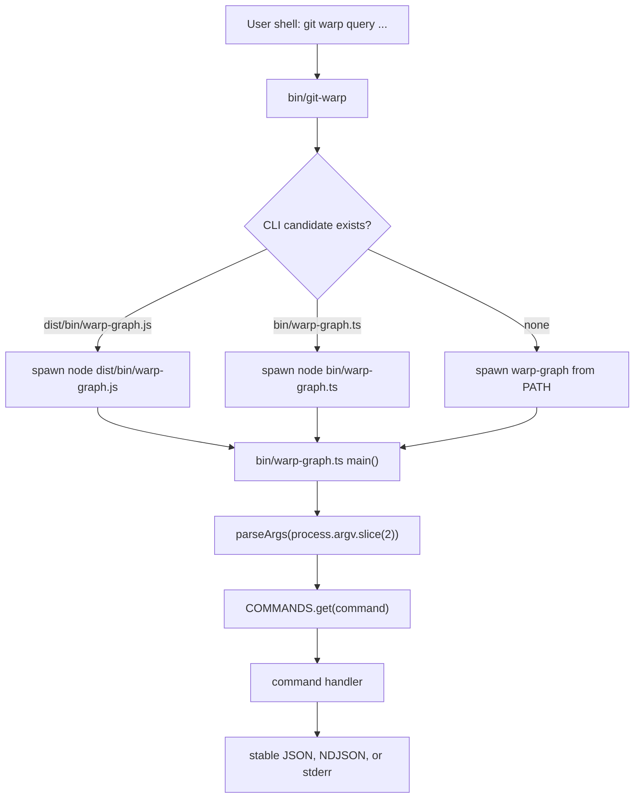
```mermaid
flowchart TB
    shell["User shell: git warp query ..."] --> wrapper["bin/git-warp"]
    wrapper --> candidate{"CLI candidate exists?"}
    candidate -->|dist/bin/warp-graph.js| nodeDist["spawn node dist/bin/warp-graph.js"]
    candidate -->|bin/warp-graph.ts| nodeTs["spawn node bin/warp-graph.ts"]
    candidate -->|none| fallback["spawn warp-graph from PATH"]
    nodeDist --> cliMain["bin/warp-graph.ts main()"]
    nodeTs --> cliMain
    fallback --> cliMain
    cliMain --> parse["parseArgs(process.argv.slice(2))"]
    parse --> registry["COMMANDS.get(command)"]
    registry --> handler["command handler"]
    handler --> output["stable JSON, NDJSON, or stderr"]
```

### `bin/git-warp`: The Node Wrapper

`bin/git-warp` is a small JavaScript executable. Its job is to find the real CLI
program and run it with the current Node executable.

The wrapper:

- computes its own directory from `import.meta.url`
- checks two candidate files:
  - `../dist/bin/warp-graph.js`
  - `bin/warp-graph.ts`
- forwards every user argument after the executable name
- uses `spawnSync(process.execPath, [cliPath, ...args])`
- inherits stdio so the user sees the child command output directly
- falls back to `spawnSync('warp-graph', args)` if neither local candidate
  exists
- writes any spawn error to stderr and exits with the child's status

The wrapper is intentionally not domain-aware. It does not know about graphs,
patches, refs, or sync. It exists so `git warp` can behave like a Git
subcommand while still using the TypeScript/compiled CLI underneath.

### `bin/warp-graph.ts`: The CLI Main Function

`bin/warp-graph.ts` is the CLI program. Its `main()` function is the first
domain-adjacent execution point.

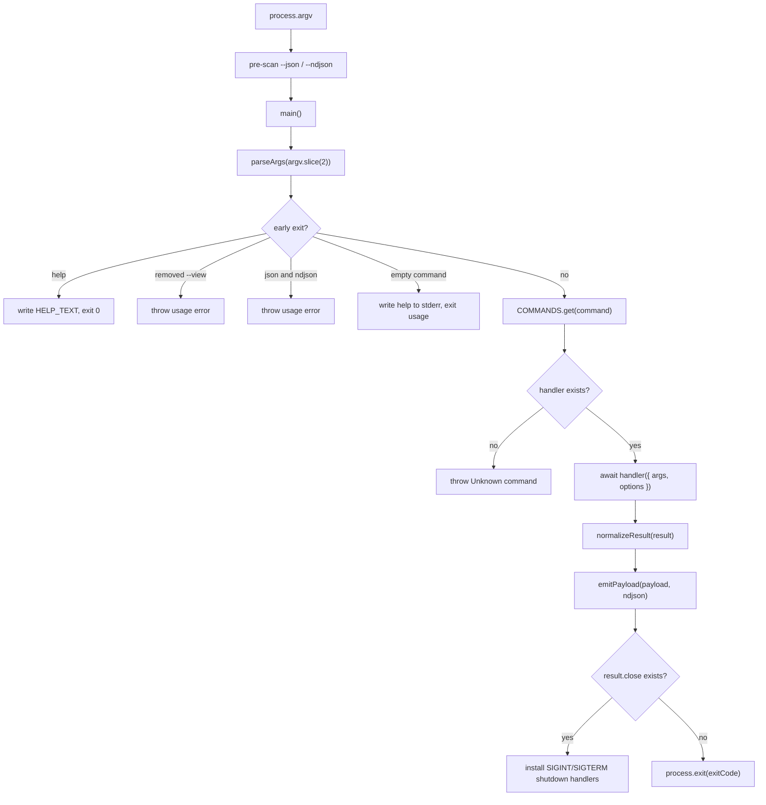
```mermaid
flowchart TD
    argv["process.argv"] --> prescan["pre-scan --json / --ndjson"]
    prescan --> main["main()"]
    main --> parse["parseArgs(argv.slice(2))"]
    parse --> early{"early exit?"}
    early -->|help| help["write HELP_TEXT, exit 0"]
    early -->|removed --view| viewErr["throw usage error"]
    early -->|json and ndjson| fmtErr["throw usage error"]
    early -->|empty command| empty["write help to stderr, exit usage"]
    early -->|no| lookup["COMMANDS.get(command)"]
    lookup --> found{"handler exists?"}
    found -->|no| unknown["throw Unknown command"]
    found -->|yes| run["await handler({ args, options })"]
    run --> normalize["normalizeResult(result)"]
    normalize --> emit["emitPayload(payload, ndjson)"]
    emit --> long{"result.close exists?"}
    long -->|yes| signals["install SIGINT/SIGTERM shutdown handlers"]
    long -->|no| exit["process.exit(exitCode)"]
```

Important details:

- The CLI pre-scans raw `process.argv` for `--json` and `--ndjson` before
  parsing. If parsing fails, the catch block can still decide whether to emit a
  structured error payload.
- `parseArgs()` is implemented in `bin/cli/infrastructure.ts`. It extracts base
  options from anywhere in the command line, then leaves command-specific flags
  untouched for the command handler.
- `COMMANDS` in `bin/cli/commands/registry.ts` maps command names to handler
  modules such as `query`, `patch`, `materialize`, `sync`, `serve`, `watch`,
  `checkpoint`, and `gc`.
- Handler return values are normalized into `{ payload, exitCode }`.
- Long-running commands such as `serve` and `watch` may also return `close`.
  When they do, the CLI installs shutdown handlers and does not immediately
  exit.
- Errors become either structured JSON/NDJSON or `Error: <message>` on stderr.
  CLI errors carry explicit exit codes and error codes.

### CLI Argument Parsing

The parser in `bin/cli/infrastructure.ts` uses a two-stage model.

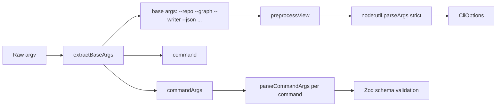
```mermaid
flowchart LR
    raw["Raw argv"] --> extract["extractBaseArgs"]
    extract --> base["base args: --repo --graph --writer --json ..."]
    extract --> command["command"]
    extract --> rest["commandArgs"]
    base --> view["preprocessView"]
    view --> nodeParse["node:util.parseArgs strict"]
    nodeParse --> options["CliOptions"]
    rest --> handlerParse["parseCommandArgs per command"]
    handlerParse --> zod["Zod schema validation"]
```

Base options:

```text
repo    absolute repository path, default process.cwd()
json    pretty sorted JSON output
ndjson  compact single-line JSON output
view    removed compatibility option
graph   explicit WARP graph name
writer  writer id, default "cli"
help    help flag
```

Command-level options are parsed separately with Zod. This keeps the CLI
strict, but lets each command own its own flags and validation messages.

## Package Entry Point

Application code usually starts with `index.ts`.

At import time, `index.ts` does three major things:

1. Exports the first-use values `openWarp`, `intent`, and `reading`.
2. Exports application types for timelines, intents, readings, receipts, and
   opaque storage handles.
3. Leaves storage construction, advanced optics, and diagnostics on explicit
   package subpaths.

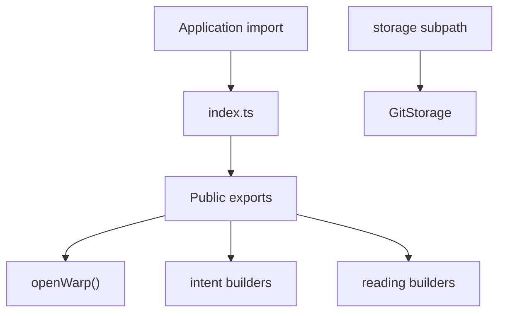
```mermaid
flowchart TB
    app["Application import"] --> index["index.ts"]
    index --> exports["Public exports"]
    exports --> warp["openWarp()"]
    exports --> intents["intent builders"]
    exports --> readings["reading builders"]
    storage["storage subpath"] --> gitStorage["GitStorage"]
```

The root import has no storage bootstrap side effect. `GitStorage.open()` owns
the Node Git and git-cas composition used by first-use applications.

## System Architecture

The architecture is hexagonal. Domain code owns graph semantics. Ports define
I/O capabilities. Infrastructure adapters translate those ports to Git,
git-cas, Node HTTP, fetch, WebCrypto, or in-memory test paths.

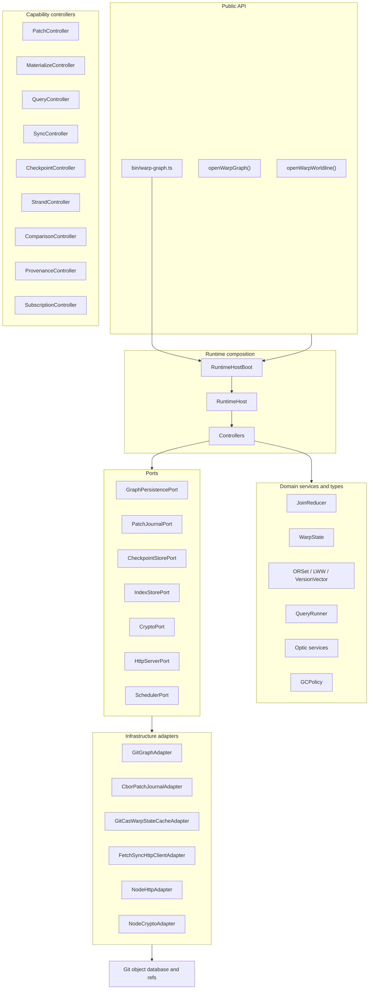
```mermaid
flowchart TB
    subgraph API["Public API"]
      worldline["openWarpWorldline()"]
      graphBag["openWarpGraph()"]
      cli["bin/warp-graph.ts"]
    end

    subgraph Runtime["Runtime composition"]
      boot["RuntimeHostBoot"]
      host["RuntimeHost"]
      controllers["Controllers"]
    end

    subgraph Controllers["Capability controllers"]
      patch["PatchController"]
      materialize["MaterializeController"]
      query["QueryController"]
      sync["SyncController"]
      checkpoint["CheckpointController"]
      strand["StrandController"]
      comparison["ComparisonController"]
      provenance["ProvenanceController"]
      subscription["SubscriptionController"]
    end

    subgraph Domain["Domain services and types"]
      reducer["JoinReducer"]
      state["WarpState"]
      crdt["ORSet / LWW / VersionVector"]
      queryRunner["QueryRunner"]
      optics["Optic services"]
      gc["GCPolicy"]
    end

    subgraph Ports["Ports"]
      persistence["GraphPersistencePort"]
      journal["PatchJournalPort"]
      checkpointPort["CheckpointStorePort"]
      indexPort["IndexStorePort"]
      cryptoPort["CryptoPort"]
      httpPort["HttpServerPort"]
      schedulerPort["SchedulerPort"]
    end

    subgraph Adapters["Infrastructure adapters"]
      git["GitGraphAdapter"]
      cbor["CborPatchJournalAdapter"]
      stateCache["GitCasWarpStateCacheAdapter"]
      fetch["FetchSyncHttpClientAdapter"]
      nodeHttp["NodeHttpAdapter"]
      nodeCrypto["NodeCryptoAdapter"]
    end

    API --> boot
    cli --> boot
    boot --> host
    host --> controllers
    controllers --> Domain
    controllers --> Ports
    Ports --> Adapters
    Adapters --> gitSubstrate["Git object database and refs"]
```

### Runtime Composition Root

`RuntimeHost` is the internal composition root. It owns runtime state and wires
controllers.

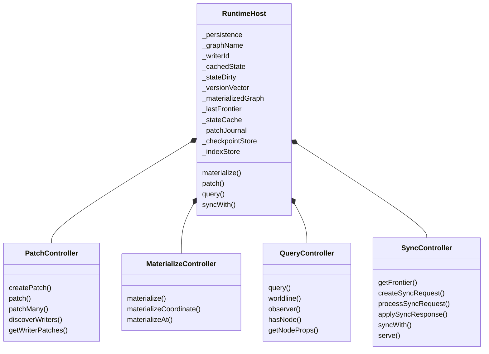
```mermaid
classDiagram
    class RuntimeHost {
      _persistence
      _graphName
      _writerId
      _cachedState
      _stateDirty
      _versionVector
      _materializedGraph
      _lastFrontier
      _stateCache
      _patchJournal
      _checkpointStore
      _indexStore
      materialize()
      patch()
      query()
      syncWith()
    }

    class PatchController {
      createPatch()
      patch()
      patchMany()
      discoverWriters()
      getWriterPatches()
    }

    class MaterializeController {
      materialize()
      materializeCoordinate()
      materializeAt()
    }

    class QueryController {
      query()
      worldline()
      observer()
      hasNode()
      getNodeProps()
    }

    class SyncController {
      getFrontier()
      createSyncRequest()
      processSyncRequest()
      applySyncResponse()
      syncWith()
      serve()
    }

    RuntimeHost *-- PatchController
    RuntimeHost *-- MaterializeController
    RuntimeHost *-- QueryController
    RuntimeHost *-- SyncController
```

`RuntimeHost` contains mutable runtime bookkeeping:

- current graph identity: `_graphName`, `_writerId`
- cached materialized state: `_cachedState`
- whether cached state must be replayed again: `_stateDirty`
- frontier and Lamport tracking: `_lastFrontier`, `_maxObservedLamport`
- indexes and derived views: `_logicalIndex`, `_cachedIndexTree`
- replay and storage services: `_patchJournal`, `_checkpointStore`,
  `_indexStore`, `_stateCache`
- policy objects: `_gcPolicy`, `_checkpointPolicy`, `_trustConfig`
- controllers: sync, patch, query, materialize, checkpoint, strands,
  provenance, comparison, subscriptions, and intents

This is a deliberate trade-off. The host is a stateful orchestrator, while
domain algorithms stay in focused classes. It gives the API one stable object
to delegate from without forcing every controller to know every implementation
detail.

## Bootstrapping Versus Runtime

Bootstrapping answers "what ports and policies will this graph use?" Runtime
answers "what happens for this commit, query, materialization, or sync?"

### CLI Bootstrapping

Every normal CLI command calls `openGraph()` from `bin/cli/shared.ts`.

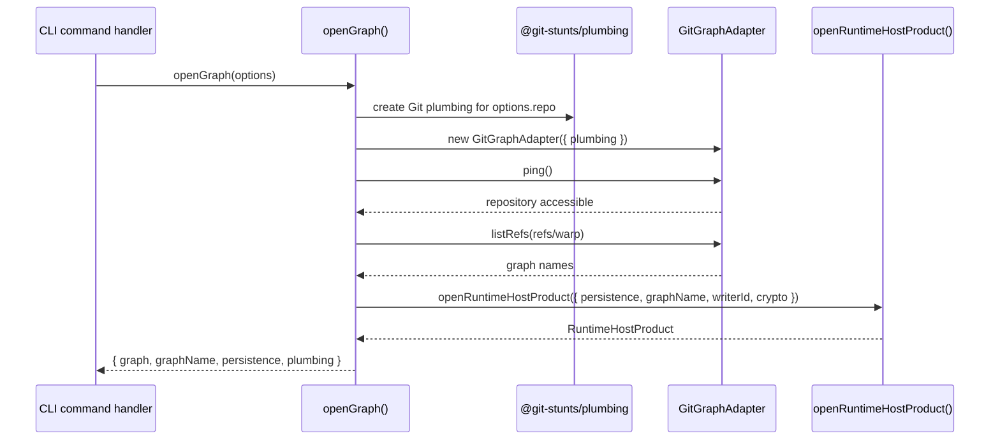
```mermaid
sequenceDiagram
    participant Handler as CLI command handler
    participant Shared as openGraph()
    participant Plumbing as @git-stunts/plumbing
    participant Adapter as GitGraphAdapter
    participant Runtime as openRuntimeHostProduct()

    Handler->>Shared: openGraph(options)
    Shared->>Plumbing: create Git plumbing for options.repo
    Shared->>Adapter: new GitGraphAdapter({ plumbing })
    Shared->>Adapter: ping()
    Adapter-->>Shared: repository accessible
    Shared->>Adapter: listRefs(refs/warp)
    Adapter-->>Shared: graph names
    Shared->>Runtime: openRuntimeHostProduct({ persistence, graphName, writerId, crypto })
    Runtime-->>Shared: RuntimeHostProduct
    Shared-->>Handler: { graph, graphName, persistence, plumbing }
```

The CLI-specific source of truth enters here:

- the repository path comes from `--repo` or `process.cwd()`
- the graph name comes from `--graph` or auto-detection under WARP refs
- the writer id comes from `--writer` or the default `cli`
- Git access is provided by `@git-stunts/plumbing`
- persistence is `GitGraphAdapter`
- crypto is `WebCryptoAdapter` in this opener

### Runtime Bootstrapping

`openRuntimeHostProduct()` delegates to `openRuntimeHost()`, which delegates to
`resolveRuntimeHostConstructionOptions()` in `src/domain/warp/RuntimeHostBoot.ts`.

That resolver normalizes and fills in:

- blob storage
- patch write storage route
- commit message codec
- data codec
- crypto
- trust crypto
- patch journal
- checkpoint store
- durable state cache
- index store
- state hash service
- materialized view service
- optional audit service
- optional effect pipeline
- optional trie-backed state session

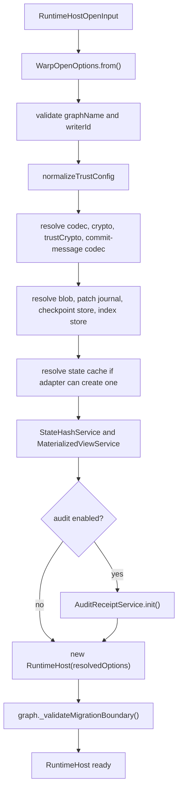
```mermaid
flowchart TD
    input["RuntimeHostOpenInput"] --> options["WarpOpenOptions.from()"]
    options --> validate["validate graphName and writerId"]
    validate --> trust["normalizeTrustConfig"]
    trust --> ports["resolve codec, crypto, trustCrypto, commit-message codec"]
    ports --> stores["resolve blob, patch journal, checkpoint store, index store"]
    stores --> cache["resolve state cache if adapter can create one"]
    cache --> services["StateHashService and MaterializedViewService"]
    services --> audit{"audit enabled?"}
    audit -->|yes| auditSvc["AuditReceiptService.init()"]
    audit -->|no| construct["new RuntimeHost(resolvedOptions)"]
    auditSvc --> construct
    construct --> migration["graph._validateMigrationBoundary()"]
    migration --> opened["RuntimeHost ready"]
```

Bootstrapping fails early for invalid identity, missing required persistence,
invalid checkpoint policy, invalid delete policy, invalid trust configuration,
or unsupported retired patch history.

## Data Source of Truth

The source of truth is Git history under WARP refs.

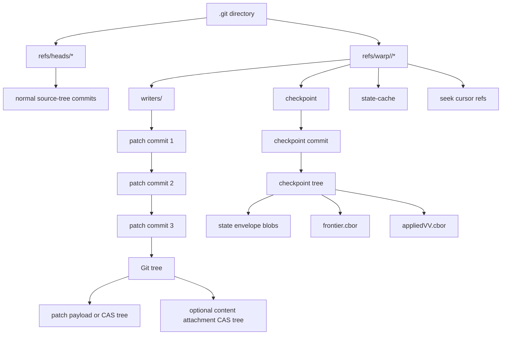
```mermaid
flowchart TB
    repo[".git directory"] --> branchRefs["refs/heads/*"]
    repo --> warpRefs["refs/warp/<graph>/*"]

    branchRefs --> codeCommits["normal source-tree commits"]

    warpRefs --> writerRefs["writers/<writerId>"]
    warpRefs --> checkpointRef["checkpoint"]
    warpRefs --> stateCacheRef["state-cache"]
    warpRefs --> cursorRef["seek cursor refs"]

    writerRefs --> p1["patch commit 1"]
    p1 --> p2["patch commit 2"]
    p2 --> p3["patch commit 3"]

    p3 --> tree["Git tree"]
    tree --> patchBlob["patch payload or CAS tree"]
    tree --> contentTree["optional content attachment CAS tree"]

    checkpointRef --> ck["checkpoint commit"]
    ck --> ckTree["checkpoint tree"]
    ckTree --> stateEnvelope["state envelope blobs"]
    ckTree --> frontier["frontier.cbor"]
    ckTree --> appliedVV["appliedVV.cbor"]
```

### Where State Lives

| State | Location | Authority level |
| --- | --- | --- |
| Patch history | Git commits and refs under `refs/warp/<graph>/writers/<writerId>` | Authoritative |
| Patch payload bytes | Git blob or git-cas tree referenced by patch commit message and tree | Authoritative for bytes |
| Writer frontier | Current writer refs resolved from Git | Authoritative read coordinate |
| Materialized `WarpState` | `RuntimeHost._cachedState` in memory | Derived and disposable |
| Adjacency/index provider | `RuntimeHost._materializedGraph`, bitmap index tree | Derived acceleration |
| Checkpoint | Git checkpoint commit/tree or pinned state-cache snapshot | Derived but durable folded basis |
| State cache | CAS-backed snapshot records under state-cache refs | Derived acceleration |
| Seek cursor | Git blob/ref storing CLI cursor position | Operator state, not graph truth |
| Query result | Object returned to API/CLI | Derived reading over a coordinate |
| Sync request/response | JSON payload crossing HTTP or in-process peer boundary | Transport DTO |

The architecture repeatedly enforces this distinction. Type annotations,
indexes, caches, and docs do not decide truth. Runtime history does.

## Golden Path 1: CLI Query

The CLI query path is a useful first complete walkthrough because it starts at
the executable and ends in a read result.

Example invocation:

```bash
git warp query --repo ./team-repo --graph events --match 'user:*' --select id,props --json
```

### Query Sequence

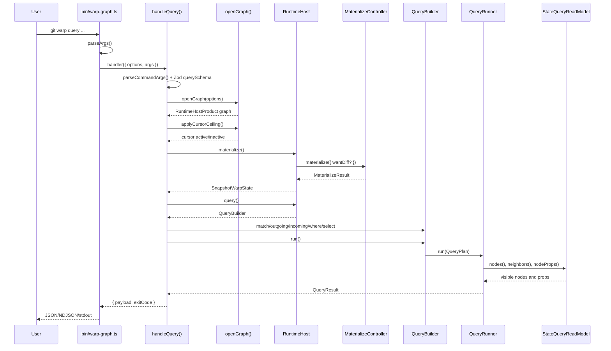
```mermaid
sequenceDiagram
    participant User
    participant CLI as bin/warp-graph.ts
    participant QueryCmd as handleQuery()
    participant Shared as openGraph()
    participant Runtime as RuntimeHost
    participant Mat as MaterializeController
    participant QB as QueryBuilder
    participant QR as QueryRunner
    participant ReadModel as StateQueryReadModel

    User->>CLI: git warp query ...
    CLI->>CLI: parseArgs()
    CLI->>QueryCmd: handler({ options, args })
    QueryCmd->>QueryCmd: parseCommandArgs() + Zod querySchema
    QueryCmd->>Shared: openGraph(options)
    Shared-->>QueryCmd: RuntimeHostProduct graph
    QueryCmd->>Shared: applyCursorCeiling()
    Shared-->>QueryCmd: cursor active/inactive
    QueryCmd->>Runtime: materialize()
    Runtime->>Mat: materialize({ wantDiff? })
    Mat-->>Runtime: MaterializeResult
    Runtime-->>QueryCmd: SnapshotWarpState
    QueryCmd->>Runtime: query()
    Runtime-->>QueryCmd: QueryBuilder
    QueryCmd->>QB: match/outgoing/incoming/where/select
    QueryCmd->>QB: run()
    QB->>QR: run(QueryPlan)
    QR->>ReadModel: nodes(), neighbors(), nodeProps()
    ReadModel-->>QR: visible nodes and props
    QR-->>QueryCmd: QueryResult
    QueryCmd-->>CLI: { payload, exitCode }
    CLI-->>User: JSON/NDJSON/stdout
```

### Step-by-Step

1. `bin/warp-graph.ts` parses base options.
2. The `query` command handler parses command-level flags:
   - `--match`
   - `--outgoing`
   - `--incoming`
   - `--where-prop`
   - `--select`
3. `openGraph()` creates a Git persistence adapter and opens the runtime.
4. The CLI applies the active seek cursor if one exists. This sets
   `graph._seekCeiling`, so later materialization honors an operator's pinned
   historical view.
5. `graph.materialize()` makes sure there is fresh state to query.
6. `buildQueryBuilder()` starts from `graph.query()` and applies the parsed
   flags as a fluent query builder.
7. `QueryBuilder.run()` builds a `QueryPlan`.
8. `QueryRunner` opens a read model and executes:
   - initial node matching
   - where filters
   - outgoing or incoming traversals
   - field selection
   - optional aggregation
9. The CLI wraps the result with the graph name and returns it.
10. The top-level CLI emits stable JSON or compact NDJSON.

### Query Plan Payload

The query command converts flags into a logical plan. In simplified form:

```json
{
  "pattern": "user:*",
  "operations": [
    {
      "type": "where",
      "predicate": "props.role == admin"
    },
    {
      "type": "outgoing",
      "label": "member-of",
      "depth": [1, 1]
    }
  ],
  "select": ["id", "props"],
  "aggregate": null
}
```

The actual predicate is a function, not JSON. The snippet shows the logical
shape. `QueryRunner` also derives bounded-support plans from the query plan so
specialized read models can answer exact bounded questions when possible.

## Golden Path 2: Opening a Worldline

The recommended application path is `openWarpWorldline()`.

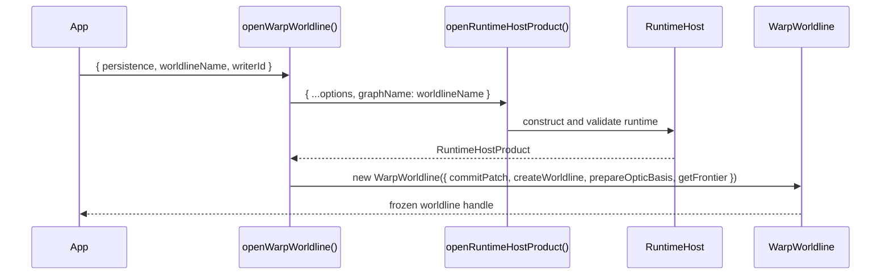
```mermaid
sequenceDiagram
    participant App
    participant Worldline as openWarpWorldline()
    participant Runtime as openRuntimeHostProduct()
    participant Host as RuntimeHost
    participant Handle as WarpWorldline

    App->>Worldline: { persistence, worldlineName, writerId }
    Worldline->>Runtime: { ...options, graphName: worldlineName }
    Runtime->>Host: construct and validate runtime
    Host-->>Worldline: RuntimeHostProduct
    Worldline->>Handle: new WarpWorldline({ commitPatch, createWorldline, prepareOpticBasis, getFrontier })
    Handle-->>App: frozen worldline handle
```

`openWarpWorldline()` is a facade over `RuntimeHostProduct`:

- `commit(build)` calls `graph.patch(build)`
- `live()` calls `graph.worldline()`
- `seek(options)` delegates through the live projection handle
- `observer()` builds a worldline observer
- `optic()` gets an optic over the live projection
- `prepareOpticBasis()` verifies a checkpoint-tail basis
- `coordinate()` captures a stable coordinate after a basis exists
- `admitIntent()` delegates to the intent controller

The trade-off is explicit: first-use code gets a narrow API that prevents
tooling-oriented substrate methods from crowding normal application workflows.
Advanced callers can still use `openWarpGraph()` when they need the lower-level
capability bag.

## Golden Path 3: Committing a Patch

A successful write starts at `WarpWorldline.commit()` or `RuntimeHost.patch()`
and ends with a new Git commit under one writer ref.

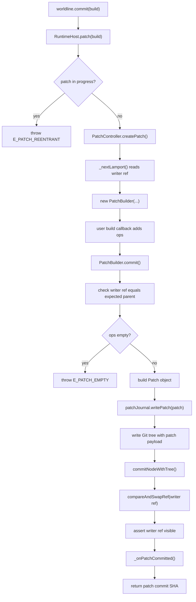
```mermaid
flowchart TD
    commit["worldline.commit(build)"] --> patch["RuntimeHost.patch(build)"]
    patch --> guard{"patch in progress?"}
    guard -->|yes| reentrant["throw E_PATCH_REENTRANT"]
    guard -->|no| create["PatchController.createPatch()"]
    create --> lamport["_nextLamport() reads writer ref"]
    lamport --> builder["new PatchBuilder(...)"]
    builder --> callback["user build callback adds ops"]
    callback --> commitPatch["PatchBuilder.commit()"]
    commitPatch --> cas["check writer ref equals expected parent"]
    cas --> empty{"ops empty?"}
    empty -->|yes| emptyErr["throw E_PATCH_EMPTY"]
    empty -->|no| build["build Patch object"]
    build --> journal["patchJournal.writePatch(patch)"]
    journal --> tree["write Git tree with patch payload"]
    tree --> node["commitNodeWithTree()"]
    node --> update["compareAndSwapRef(writer ref)"]
    update --> visible["assert writer ref visible"]
    visible --> success["_onPatchCommitted()"]
    success --> sha["return patch commit SHA"]
```

### Patch Builder

`PatchBuilder` is a fluent accumulator. It records operations, reads, writes,
content attachment references, and version-vector state. It does not write
until `commit()`.

Core operations:

- `addNode(nodeId)`
- `removeNode(nodeId)`
- `addEdge(from, to, label)`
- `removeEdge(from, to, label)`
- `setProperty(nodeId, key, value)`
- `setEdgeProperty(from, to, label, key, value)`
- `attachContent(nodeId, content, metadata)`
- `attachEdgeContent(from, to, label, content, metadata)`
- `emitEffect(kind, payload, options)`

Important runtime guards:

- node, edge, and key strings cannot contain reserved bytes
- removing nodes or edges requires materialized state so observed dots can be
  tombstoned correctly
- edge properties require the edge to exist in the current state or in this
  builder
- content attachment requires blob storage
- a builder cannot be reused after commit
- empty patches cannot be committed

### Patch Payload Anatomy

A committed patch is a domain object with this shape:

```json
{
  "schema": 3,
  "writer": "agent-1",
  "lamport": 42,
  "context": {
    "agent-1": 41,
    "agent-2": 18
  },
  "ops": [
    {
      "type": "NodeAdd",
      "node": "user:alice",
      "dot": {
        "writerId": "agent-1",
        "counter": 42
      }
    },
    {
      "type": "PropSet",
      "node": "user:alice",
      "key": "role",
      "value": "admin"
    }
  ],
  "reads": ["user:alice"],
  "writes": ["user:alice"]
}
```

Schema `2` is enough for node-level operations and node properties. Schema `3`
is used when edge properties are present.

### Patch Commit Anatomy

Patch commits store payloads through the patch journal and commit-message
codec. The simplified Git object layout is:

```text
refs/warp/<graph>/writers/<writer>
  -> patch commit
       parents: previous writer patch commit, if any
       tree:
         patch/             when payload is stored through git-cas
         patch.cbor         for legacy Git blob payloads
         _content_<oid>/    optional content attachment anchors
       message:
         kind=patch
         graph=<graph>
         writer=<writer>
         lamport=<n>
         patchOid=<oid>
         schema=<2-or-3>
         storage=<route>
```

The exact message syntax is owned by the commit-message codec. Domain services
do not parse ad hoc commit strings.

### Why the Writer Ref Compare-And-Swap Matters

Every writer owns a linear patch chain. Two processes using the same writer id
could both read the same parent and try to append. `commitPatch()` protects the
chain with a compare-and-swap update:

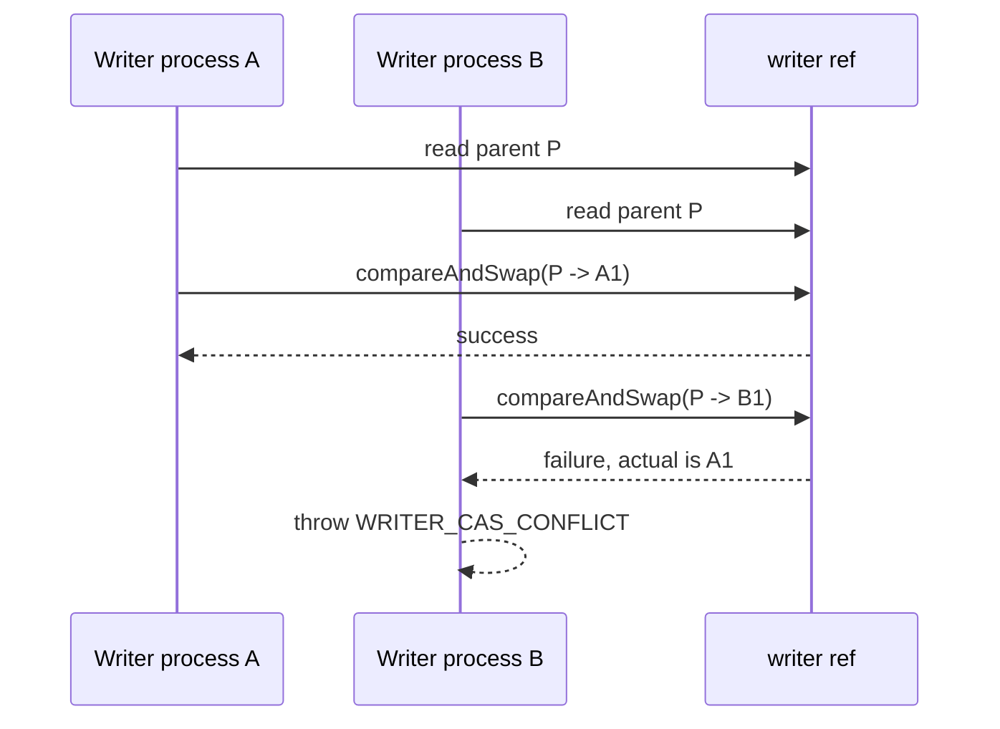
```mermaid
sequenceDiagram
    participant A as Writer process A
    participant B as Writer process B
    participant Ref as writer ref

    A->>Ref: read parent P
    B->>Ref: read parent P
    A->>Ref: compareAndSwap(P -> A1)
    Ref-->>A: success
    B->>Ref: compareAndSwap(P -> B1)
    Ref-->>B: failure, actual is A1
    B-->>B: throw WRITER_CAS_CONFLICT
```

The system does not hide this conflict. The caller must re-materialize and
retry. This is the right trade-off for preserving causal history without
silently forking a writer's own chain.

### Post-Commit State Handling

After the Git commit lands, `PatchController._onPatchCommitted()` updates the
runtime:

- increments the version vector for the writer
- updates max observed Lamport
- increments checkpoint counters
- if cached state is fresh, applies the patch directly with a diff or receipt
- updates materialized state and derived index
- adds provenance data if available
- updates last frontier if available
- commits audit receipt if audit is enabled
- otherwise marks cached state dirty and invalidates derived index data

This is a speed optimization. The authoritative write has already happened in
Git. The in-memory fast path avoids a full replay when it can safely apply the
just-written patch to fresh state.

## Golden Path 4: Materialization

Materialization converts authoritative patch history into a `WarpState` reading.

`RuntimeHost.materialize()` delegates to `MaterializeController.materialize()`.
The controller chooses one of four strategies:

- live frontier
- explicit coordinate
- Lamport ceiling
- specific checkpoint SHA

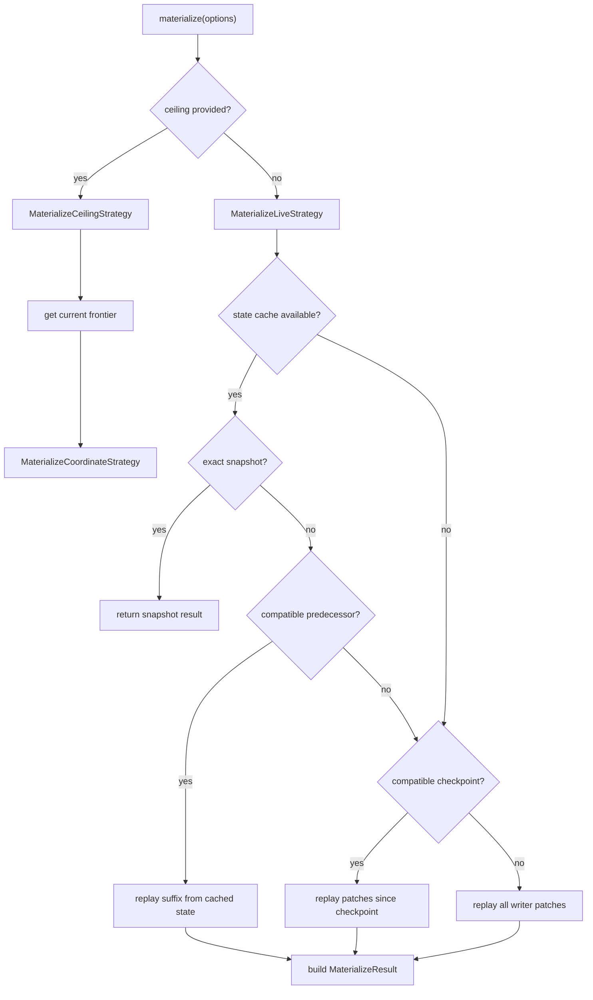
```mermaid
flowchart TD
    materialize["materialize(options)"] --> ceiling{"ceiling provided?"}
    ceiling -->|yes| ceilingStrategy["MaterializeCeilingStrategy"]
    ceiling -->|no| live["MaterializeLiveStrategy"]

    ceilingStrategy --> frontier["get current frontier"]
    frontier --> coordinate["MaterializeCoordinateStrategy"]

    live --> cache{"state cache available?"}
    cache -->|yes| exact{"exact snapshot?"}
    exact -->|yes| exactReturn["return snapshot result"]
    exact -->|no| pred{"compatible predecessor?"}
    pred -->|yes| replaySuffix["replay suffix from cached state"]
    pred -->|no| ck{"compatible checkpoint?"}
    cache -->|no| ck
    ck -->|yes| replayCheckpoint["replay patches since checkpoint"]
    ck -->|no| scratch["replay all writer patches"]
    replaySuffix --> buildResult["build MaterializeResult"]
    replayCheckpoint --> buildResult
    scratch --> buildResult
```

### Materialize Result

The result has this shape:

```json
{
  "state": "WarpState instance",
  "stateHash": "deterministic state hash",
  "adjacency": {
    "outgoing": "Map<nodeId, NeighborEdge[]>",
    "incoming": "Map<nodeId, NeighborEdge[]>"
  },
  "receipts": "optional TickReceipt[]",
  "diff": "optional PatchDiff",
  "patchCount": 128,
  "maxObservedLamport": 128,
  "provenanceIndex": "ProvenanceIndex",
  "provenanceDegraded": false,
  "frontier": {
    "agent-1": "a1b2c3...",
    "agent-2": "d4e5f6..."
  },
  "ceiling": null
}
```

### CRDT State Anatomy

`WarpState` is the materialized CRDT state:

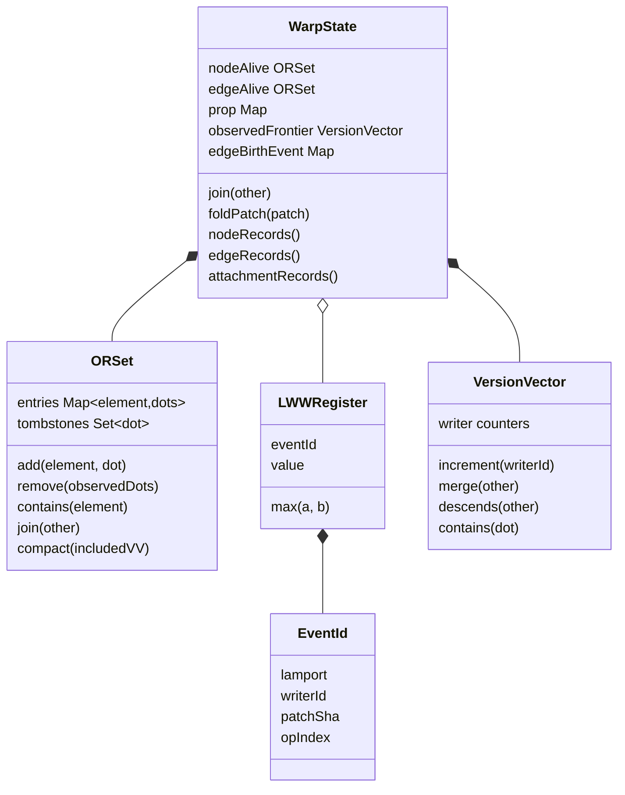
```mermaid
classDiagram
    class WarpState {
      nodeAlive ORSet
      edgeAlive ORSet
      prop Map
      observedFrontier VersionVector
      edgeBirthEvent Map
      join(other)
      foldPatch(patch)
      nodeRecords()
      edgeRecords()
      attachmentRecords()
    }

    class ORSet {
      entries Map~element,dots~
      tombstones Set~dot~
      add(element, dot)
      remove(observedDots)
      contains(element)
      join(other)
      compact(includedVV)
    }

    class LWWRegister {
      eventId
      value
      max(a, b)
    }

    class VersionVector {
      writer counters
      increment(writerId)
      merge(other)
      descends(other)
      contains(dot)
    }

    class EventId {
      lamport
      writerId
      patchSha
      opIndex
    }

    WarpState *-- ORSet
    WarpState *-- VersionVector
    WarpState o-- LWWRegister
    LWWRegister *-- EventId
```

Nodes and edges use add-wins observed-remove sets:

- add records a new dot for an element
- remove tombstones only dots observed by the remover
- concurrent unobserved adds survive
- merge is union of entries and tombstones

Properties use last-write-wins registers:

- each property write receives an `EventId`
- `EventId` compares by Lamport, writer id, patch SHA, then operation index
- every replica resolves concurrent property writes the same way

### Reducer Execution

`JoinReducer.reducePatches()` is the inner replay loop.

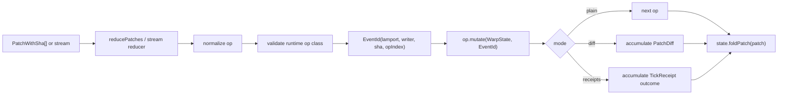
```mermaid
flowchart LR
    patches["PatchWithSha[] or stream"] --> reducer["reducePatches / stream reducer"]
    reducer --> op["normalize op"]
    op --> validate["validate runtime op class"]
    validate --> event["EventId(lamport, writer, sha, opIndex)"]
    event --> mutate["op.mutate(WarpState, EventId)"]
    mutate --> collect{"mode"}
    collect -->|plain| next["next op"]
    collect -->|diff| diff["accumulate PatchDiff"]
    collect -->|receipts| receipt["accumulate TickReceipt outcome"]
    next --> fold["state.foldPatch(patch)"]
    diff --> fold
    receipt --> fold
```

Three reducer modes exist:

| Mode | Used when | Output |
| --- | --- | --- |
| Plain | normal materialization | mutated `WarpState` |
| Diff | incremental index updates | `WarpState` plus `PatchDiff` |
| Receipts | audit/provenance reporting | `WarpState` plus `TickReceipt[]` |

### State Cache and Checkpoint Trade-Off

The runtime prefers:

1. exact state-cache hit
2. compatible predecessor state-cache hit plus suffix replay
3. compatible checkpoint plus suffix replay
4. full replay

This trades disk/CAS storage and cache management for lower replay latency.
The safety rule is that cached materializations must name their coordinate. A
cache entry is useful only if its frontier and ceiling are compatible with the
requested read.

## Golden Path 5: Query and Observer Reads

A query can run over:

- live materialized state
- a pinned coordinate
- a strand
- an observer snapshot
- a bounded exact checkpoint-tail read model

### Read Model Selection

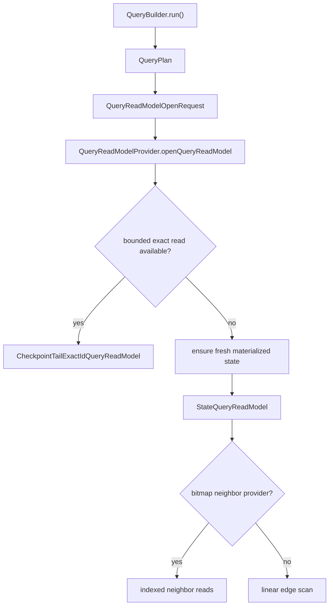
```mermaid
flowchart TD
    query["QueryBuilder.run()"] --> plan["QueryPlan"]
    plan --> request["QueryReadModelOpenRequest"]
    request --> provider["QueryReadModelProvider.openQueryReadModel"]
    provider --> bounded{"bounded exact read available?"}
    bounded -->|yes| exact["CheckpointTailExactIdQueryReadModel"]
    bounded -->|no| fresh["ensure fresh materialized state"]
    fresh --> stateModel["StateQueryReadModel"]
    stateModel --> indexed{"bitmap neighbor provider?"}
    indexed -->|yes| indexRead["indexed neighbor reads"]
    indexed -->|no| linear["linear edge scan"]
```

### ProjectionHandle

`ProjectionHandle` is the read handle returned by `worldline.live()` and
`graph.worldline()`. It stores a `WorldlineSelector`:

- live selector
- coordinate selector
- strand selector

It lazily creates a delegate observer for broad reads, and it can create a
bounded optic when a checkpoint-tail source is available.

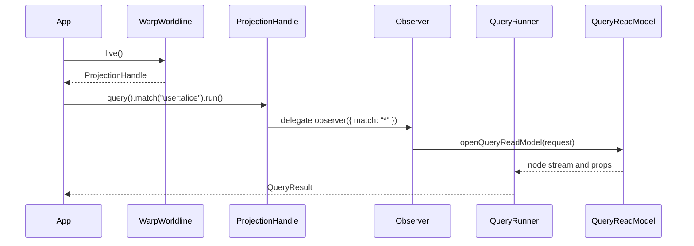
```mermaid
sequenceDiagram
    participant App
    participant Worldline as WarpWorldline
    participant Handle as ProjectionHandle
    participant Observer as Observer
    participant Runner as QueryRunner
    participant ReadModel as QueryReadModel

    App->>Worldline: live()
    Worldline-->>App: ProjectionHandle
    App->>Handle: query().match("user:alice").run()
    Handle->>Observer: delegate observer({ match: "*" })
    Observer->>ReadModel: openQueryReadModel(request)
    ReadModel-->>Runner: node stream and props
    Runner-->>App: QueryResult
```

### Observer Visibility

An observer applies an aperture:

```json
{
  "match": ["finding:*", "service:*"],
  "expose": ["title", "severity", "status"],
  "redact": ["internalNotes"]
}
```

Visibility rules:

- a node is visible if its id matches the glob or one of the glob patterns
- an edge is visible only if both endpoints are visible
- a property is hidden if redacted
- if `expose` is present, only exposed properties are visible
- redaction wins over exposure

This is not authentication by itself. It is a read-model aperture. External
authorization must decide who receives the observer.

## Golden Path 6: Checkpoint Creation

Checkpointing folds materialized state into a durable basis.

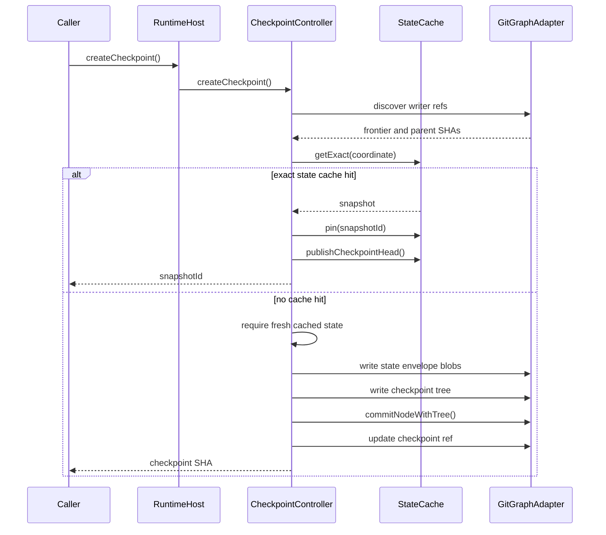
```mermaid
sequenceDiagram
    participant Caller
    participant Host as RuntimeHost
    participant Ck as CheckpointController
    participant Cache as StateCache
    participant Git as GitGraphAdapter

    Caller->>Host: createCheckpoint()
    Host->>Ck: createCheckpoint()
    Ck->>Git: discover writer refs
    Git-->>Ck: frontier and parent SHAs
    Ck->>Cache: getExact(coordinate)
    alt exact state cache hit
        Cache-->>Ck: snapshot
        Ck->>Cache: pin(snapshotId)
        Ck->>Cache: publishCheckpointHead()
        Ck-->>Caller: snapshotId
    else no cache hit
        Ck->>Ck: require fresh cached state
        Ck->>Git: write state envelope blobs
        Ck->>Git: write checkpoint tree
        Ck->>Git: commitNodeWithTree()
        Ck->>Git: update checkpoint ref
        Ck-->>Caller: checkpoint SHA
    end
```

A checkpoint tree contains:

```text
checkpoint tree
  state/
    nodeAlive
    edgeAlive
    prop.cbor
    observedFrontier.cbor
    edgeBirthEvent.cbor
  frontier.cbor
  appliedVV.cbor
  provenanceIndex.cbor       optional
  index/                     optional bitmap index shards
  _content_* anchors         optional content anchors
```

Why this matters:

- it bounds future replay by starting from an already folded state
- it protects content anchors from Git garbage collection
- it can carry provenance and index data alongside state
- it provides the basis needed by checkpoint-tail optic reads

## Golden Path 7: Sync

Sync exchanges missing patches by comparing frontiers.

### Sync Request and Response

Request:

```json
{
  "type": "sync-request",
  "frontier": {
    "agent-1": "1111111",
    "agent-2": "2222222"
  },
  "page": {
    "maxPatches": 1000,
    "cursor": null
  }
}
```

Response:

```json
{
  "type": "sync-response",
  "frontier": {
    "agent-1": "3333333",
    "agent-2": "2222222"
  },
  "patches": [
    {
      "writerId": "agent-1",
      "sha": "3333333",
      "patch": {
        "schema": 2,
        "writer": "agent-1",
        "lamport": 43,
        "context": {
          "agent-1": 42
        },
        "ops": [
          {
            "type": "PropSet",
            "node": "task:1",
            "key": "status",
            "value": "done"
          }
        ]
      }
    }
  ],
  "metrics": {
    "patchCount": 1,
    "skippedWriterCount": 0,
    "estimatedPayloadBytes": 512,
    "latencyMs": null
  }
}
```

### HTTP Sync Sequence

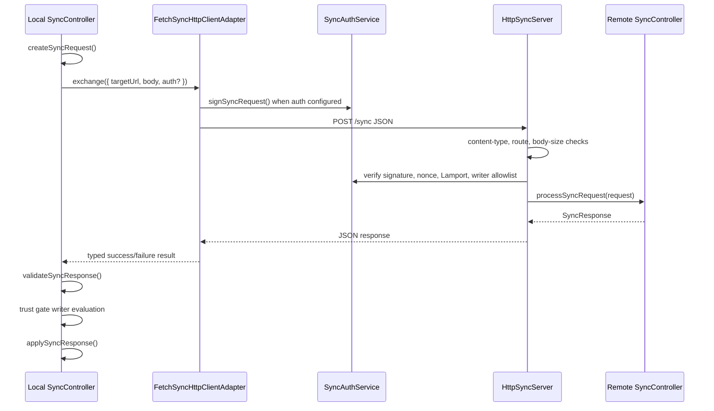
```mermaid
sequenceDiagram
    participant Local as Local SyncController
    participant Client as FetchSyncHttpClientAdapter
    participant Auth as SyncAuthService
    participant Server as HttpSyncServer
    participant Remote as Remote SyncController

    Local->>Local: createSyncRequest()
    Local->>Client: exchange({ targetUrl, body, auth? })
    Client->>Auth: signSyncRequest() when auth configured
    Client->>Server: POST /sync JSON
    Server->>Server: content-type, route, body-size checks
    Server->>Auth: verify signature, nonce, Lamport, writer allowlist
    Server->>Remote: processSyncRequest(request)
    Remote-->>Server: SyncResponse
    Server-->>Client: JSON response
    Client-->>Local: typed success/failure result
    Local->>Local: validateSyncResponse()
    Local->>Local: trust gate writer evaluation
    Local->>Local: applySyncResponse()
```

### Sync Retry and Abort

`syncWith()` wraps network sync in an operation policy:

- default retries: `3`
- base delay: `250ms`
- max delay: `2000ms`
- default timeout: `10000ms`
- backoff: exponential
- jitter: decorrelated
- retryable sync errors: remote server error, timeout, network failure
- non-retryable sync errors: protocol failures, invalid payload, trust denial
- abort signal becomes `OperationAbortedError`

The HTTP adapter returns typed transport results. `SyncController` translates
those results into errors for the retry harness.

## Unhappy Paths and Error Handling

The codebase uses typed domain errors and structured CLI errors. Expected
failures generally become explicit return values or named error codes rather
than silent fallbacks.

```mermaid
flowchart TD
    failure["Failure"] --> cli["CLI boundary"]
    failure --> runtime["Runtime/domain boundary"]
    failure --> adapter["Adapter boundary"]

    cli --> usage["CliError E_USAGE"]
    cli --> notFound["CliError E_NOT_FOUND"]
    cli --> json["structured JSON/NDJSON error payload"]

    runtime --> patchErr["PatchError"]
    runtime --> queryErr["QueryError"]
    runtime --> syncErr["SyncError"]
    runtime --> trustErr["TrustError"]
    runtime --> schemaErr["SchemaUnsupportedError"]

    adapter --> persistence["PersistenceError"]
    adapter --> encryption["EncryptionError"]
    adapter --> network["typed transport result"]
```

### CLI Failures

| Situation | Behavior |
| --- | --- |
| Unknown command | `usageError("Unknown command: ...")` |
| Empty command | Writes help to stderr, exits usage |
| `--json` with `--ndjson` | Usage error |
| Removed `--view` | Usage error explaining the flag was removed |
| Invalid command flags | Zod issue text becomes usage error |
| Repository inaccessible | `Repository not accessible: <path>` |
| No graphs found | not-found error asking for `--graph` |
| Multiple graphs found | usage error asking for `--graph` |
| Handler throws with JSON flag | stdout receives `{ "error": { "code", "message" } }` |

### Write Failures

| Situation | Error |
| --- | --- |
| Nested `graph.patch()` | `E_PATCH_REENTRANT` |
| Empty patch commit | `E_PATCH_EMPTY` |
| Writer ref advanced before commit | `WRITER_CAS_CONFLICT` with expected and actual SHAs |
| Removing node or edge without materialized state | `E_PATCH_NO_STATE` |
| Removing a node with attached data in reject mode | `E_PATCH_DELETE_WITH_DATA` |
| Setting an edge property on an unknown edge | `E_PATCH_EDGE_PROP_UNKNOWN_EDGE` |
| Content attach without blob storage | `NO_BLOB_STORAGE` |
| Patch journal missing | `E_MISSING_JOURNAL` |
| Patch commit not visible after ref update | `E_REF_IO` |

### Materialization and Read Failures

| Situation | Error |
| --- | --- |
| Query requires cached state but none exists | `E_NO_STATE` |
| Query sees dirty cached state | `E_STALE_STATE` |
| Invalid coordinate frontier | `E_QUERY_COORDINATE_INVALID` |
| Unsupported checkpoint schema | `E_CHECKPOINT_UNSUPPORTED_SCHEMA` |
| Retired patch history at open | explicit upgrade error |
| Missing checkpoint tree blob | checkpoint missing-state/frontier persistence error |
| No bounded optic basis | `E_OPTIC_NO_BOUNDED_BASIS` |
| Invalid observer match config | `E_OBSERVER_MATCH_TYPE` |
| Invalid query depth/select/where/aggregate | `E_QUERY_*` codes |

### Sync and Security Failures

| Situation | Error or response |
| --- | --- |
| HTTP timeout | `E_SYNC_TIMEOUT` |
| Network failure | `E_SYNC_NETWORK` |
| HTTP 5xx | `E_SYNC_REMOTE` |
| HTTP 4xx / invalid protocol status | `E_SYNC_PROTOCOL` |
| Invalid JSON response | `E_SYNC_PROTOCOL` |
| Invalid sync response shape | `E_SYNC_PAYLOAD_INVALID` |
| Trust gate rejects writers | `E_SYNC_UNTRUSTED_WRITER` |
| Missing auth headers on server | `MISSING_AUTH` response when enforce mode |
| Bad signature | `INVALID_SIGNATURE` response when enforce mode |
| Nonce replay | `REPLAY` response when enforce mode |
| Stale Lamport auth timestamp | `STALE_LAMPORT` response when enforce mode |
| Rate limit exhausted | `RATE_LIMITED` response |
| Oversized HTTP body | `413 Payload Too Large` at adapter/server preflight |

### Cache and GC Failures

The state cache is an accelerator. If a cached snapshot cannot be restored and
the failure is not an encryption/authentication failure, the adapter removes the
bad cache entry and returns a miss. The runtime can replay from checkpoint or
history.

GC is conservative:

- automatic GC is disabled by default
- thresholds can be evaluated without running compaction
- if the frontier changes during GC, the compaction result is discarded
- automatic GC failure logs a warning and materialization continues
- explicit GC throws if a concurrent frontier change is detected

## Concurrency and Asynchronous Flow

`git-warp` is asynchronous because Git, CAS, HTTP, streaming bodies, and storage
ports are asynchronous. It is also multi-writer by design.

### Concurrency Model

```mermaid
flowchart TB
    subgraph IndependentWriters["Independent writers"]
      w1["writer A chain"]
      w2["writer B chain"]
      w3["writer C chain"]
    end

    w1 --> frontier["frontier map"]
    w2 --> frontier
    w3 --> frontier
    frontier --> materialize["deterministic materialization"]
    materialize --> state["same visible state on every replica"]
```

Multiple writers can append independently. The CRDT reducer makes the final
visible reading deterministic once replicas see the same set of patches.

Within one writer chain, compare-and-swap keeps that writer's history linear.

### Async Streams

The runtime uses streams where loading everything would pretend an unbounded
operation is cheap:

- `CommitPort.logNodesStream(...)`
- `PatchJournalPort.scanPatchRange(...)`
- `IndexStorePort.writeShards(...)`
- `IndexStorePort.scanShards(...)`
- materialization patch streams
- HTTP request body streams
- content/CAS restore streams

The trade-off is more async plumbing in exchange for not accidentally loading
large histories or blobs into memory.

### Subscriptions and Watch

`SubscriptionController` manages `subscribe()` and `watch()`.

```mermaid
stateDiagram-v2
    [*] --> Subscribed
    Subscribed --> ReplayPending: replay requested before state exists
    Subscribed --> Notified: materialization produces diff
    ReplayPending --> Notified: first materialization
    Notified --> Subscribed: callback returns
    Subscribed --> Polling: watch poll configured
    Polling --> ErrorCallback: frontier changed, cached state stale
    ErrorCallback --> Polling
    Subscribed --> [*]: unsubscribe
    Polling --> [*]: cancel scheduled task
```

Polling uses `SchedulerPort`; domain code does not call `setInterval`
directly. If a watch asks for polling without an injected scheduler, it throws
`E_WATCH_MISSING_SCHEDULER`.

## External Dependencies and Borders

The boundaries are explicit.

| Dependency | Where it belongs | Role |
| --- | --- | --- |
| `@git-stunts/plumbing` | CLI/shared and Git adapter path | Runs Git plumbing commands. |
| `@git-stunts/git-cas` | Infrastructure adapters | CAS blob/tree persistence over Git. |
| `@git-stunts/trailer-codec` | Commit-message codec adapter | Structured commit-message encoding. |
| `@git-stunts/alfred` | Operation policy adapter | Retry, timeout, backoff policy. |
| `cbor-x` | Codec adapter | Binary encoding for patches/checkpoints/indexes. |
| `zod` | CLI and sync payload validation | Boundary schema validation. |
| `globalThis.fetch` | `FetchSyncHttpClientAdapter` | HTTP sync client. |
| `node:http` | `NodeHttpAdapter` | HTTP sync server adapter. |
| WebCrypto/Node crypto | Crypto adapters | Hash, HMAC, timing-safe equality, trust crypto. |
| `roaring-wasm` | Index implementation | Bitmap-backed acceleration. |
| Git object database | Git adapter | Authoritative patch/checkpoint/ref substrate. |

Domain code depends on ports rather than these concrete APIs. This keeps the
same runtime model usable in Node, browser-like environments, Bun, Deno, and
tests, as long as the appropriate ports exist.

## Security Boundaries and Auth Flows

`git-warp` has several security-relevant boundaries.

### Boundary 1: Local Repository Access

The CLI trusts the local process user and the repository path. If the user can
read or write the Git repository, they can inspect or mutate WARP refs through
the CLI. Repository-level authorization is outside `git-warp`.

### Boundary 2: Sync Payload Validation

HTTP sync is a trust boundary. Incoming requests and outgoing responses are
validated by Zod schemas with resource limits:

```text
maxWritersInFrontier = 10000
maxPatches = 100000
maxOpsPerPatch = 50000
maxStringBytes = 4096
maxBlobBytes = 16777216
```

Malformed or oversized payloads fail before reaching the reducer.

### Boundary 3: HMAC Sync Auth

When sync auth is configured, the client signs:

```text
warp-v2|shared-secret-hmac-sha256|<keyId>|<METHOD>|<path>|<lamport>|<nonce>|<content-type>|<bodySha256>
```

The server verifies:

1. supported auth scheme
2. signature version
3. required headers
4. timestamp/Lamport format
5. nonce format
6. signature hex format
7. Lamport freshness per key id
8. known key id
9. HMAC signature using timing-safe equality
10. nonce not previously seen
11. rate-limit allowance
12. optional writer whitelist

```mermaid
flowchart TD
    request["HTTP sync request"] --> headers["validate auth headers"]
    headers --> freshness["validate Lamport freshness"]
    freshness --> key["resolve key id"]
    key --> hmac["compute expected HMAC"]
    hmac --> compare["timingSafeEqual"]
    compare --> nonce["reserve nonce"]
    nonce --> rate["consume rate limit"]
    rate --> writers["check allowed writers"]
    writers --> allow["process sync request"]
```

Auth mode can be `enforce` or `log-only`. In log-only mode failures are logged
and counted but the request continues. This is useful for staged rollout, but it
is not enforcement.

### Boundary 4: Trust Gate

Sync can also evaluate writer trust. The trust gate extracts writer ids from
incoming patch entries and asks a trust evaluator whether those writers are
allowed. In enforce mode, untrusted writers cause `E_SYNC_UNTRUSTED_WRITER`.

HMAC auth answers "is this HTTP request signed by a known shared secret?"
Writer trust answers "are the writers named inside these patches trusted by
policy?" They are related but not the same boundary.

## Configuration and Environment Tuning

Most runtime behavior is tuned through explicit API options or CLI flags, not
ambient environment variables.

### Runtime Open Options

| Option | Effect | Trade-off |
| --- | --- | --- |
| `graphName` / `worldlineName` | Chooses the WARP ref namespace. | Separate graphs share one Git repo without sharing history. |
| `writerId` | Chooses the writer chain to append to. | Stable unique ids avoid same-writer CAS conflicts between machines. |
| `onDeleteWithData` | `warn`, `reject`, or `cascade` for node deletion with attached data. | `reject` is safest, `cascade` is convenient, `warn` preserves legacy behavior. |
| `autoMaterialize` | Controls runtime eager materialization behavior. | Faster reads versus less background work. |
| `checkpointPolicy.every` | Auto-create checkpoints after enough patches. | More checkpoint storage for shorter future replay. |
| `gcPolicy` | Tombstone compaction thresholds and enablement. | Lower storage/scan cost versus risk of doing extra compaction work. |
| `stateCache` | Durable materialized snapshot cache. | More CAS storage for faster materialization. |
| `blobStorage` | Content/CAS storage. | Enables attachments and git-cas patch storage. |
| `patchJournal` | Patch serialization and storage boundary. | Custom storage can replace default CBOR journal. |
| `trust.mode` | `off`, `log-only`, or `enforce`. | Enforcement improves safety but requires trust crypto/evidence. |
| `effectSinks` / `effectPipeline` | External effect emission. | Lets applications observe effects without putting I/O in core logic. |
| `scheduler` | Recurring task capability for watch polling. | Domain stays timer-free, caller controls scheduling. |

### GC Defaults

```text
enabled = false
tombstoneRatioThreshold = 0.3
entryCountThreshold = 50000
minPatchesSinceCompaction = 1000
maxTicksSinceCompaction = 10000
compactOnCheckpoint = true
```

Automatic GC is opt-in. That is conservative: history is the product's core
asset, so compaction should not surprise operators.

### Sync Defaults

```text
retries = 3
baseDelayMs = 250
maxDelayMs = 2000
timeoutMs = 10000
serve.maxRequestBytes = 4194304
httpAdapter.MAX_BODY_BYTES = 10485760
auth mode = enforce when auth is configured
```

CLI flags can override retry and timeout behavior for `sync with`, and request
body limits/auth behavior for `serve`.

### Environment Variables

Runtime domain services do not read `process.env`. The CLI has a small boundary
helper, `getEnvVar()`, used by `verify-audit` to detect deprecated
`WARP_TRUSTED_ROOT` configuration and emit a warning. Package scripts use
environment variables for testing and release tooling, such as
`GIT_STUNTS_DOCKER`, `GIT_WARP_UPDATE_COVERAGE_RATCHET`,
`GIT_WARP_QUARANTINE_BASE`, and test worker controls. These affect tooling, not
the graph runtime model.

## Why It Is Built This Way

### Git as Substrate

Using Git gives `git-warp`:

- durable content-addressed objects
- cheap append-only refs
- existing transport
- commit ancestry checks
- local-first offline operation
- provenance-friendly object history

The trade-off is that graph operations must be encoded into Git commits, trees,
refs, and blobs. The runtime pays complexity in adapters and codecs so
application code can see worldlines, patches, and queries instead of raw Git
commands.

### Multi-Writer Patch Chains

Each writer appends its own chain rather than all writers contending on one
global log.

Benefits:

- offline writes do not need a coordinator
- same-writer CAS is simple
- sync can compare per-writer frontiers
- merge order can be deterministic

Trade-off:

- materialization must merge multiple chains
- cross-writer ordering must be derived from Lamport/context/operation identity
- users need stable writer ids

### Runtime-Backed Domain Types

The code uses classes such as `Patch`, `WarpState`, `Dot`, `VersionVector`,
`Observer`, `ProjectionHandle`, `WarpWorldlineCoordinate`, and error classes.

Benefits:

- constructors validate invariants
- `instanceof` dispatch can distinguish real domain concepts
- frozen values protect exposed snapshots
- boundary parsing is explicit

Trade-off:

- more small files and more explicit construction than plain object code
- adapters must hydrate decoded shapes into runtime domain objects

### Caches Are Derived, Not Truth

The runtime has in-memory state, bitmap indexes, checkpoint commits, and CAS
snapshots. They all improve performance. None of them replaces patch history.

This is why cache failures can often degrade into replay, but patch history
corruption or unsupported schema history is a hard failure.

### Ports Keep the Core Honest

Core domain code does not directly import Node HTTP, fetch, filesystem, Git
shells, wall-clock timers, or process environment. Those capabilities enter
through ports and adapters.

Benefits:

- testability
- browser and alternate runtime support
- clearer security boundaries
- less accidental I/O in core algorithms

Trade-off:

- more interfaces and adapter boilerplate
- dynamic imports in a few places to keep module graph boundaries clean

## End-to-End Mental Model

The whole system can be compressed into this lifecycle:

```mermaid
flowchart TD
    open["Open graph/worldline"] --> ports["Resolve ports and policies"]
    ports --> history["Read writer refs and checkpoint refs"]
    history --> write{"Write path?"}
    history --> read{"Read path?"}
    history --> sync{"Sync path?"}

    write --> builder["Build patch with CRDT ops"]
    builder --> commit["Commit patch payload/tree to Git"]
    commit --> cas["CAS update writer ref"]
    cas --> cacheUpdate["Update or dirty cached state"]

    read --> materialize["Materialize coordinate"]
    materialize --> reduce["Reduce patch stream into WarpState"]
    reduce --> index["Build adjacency and optional bitmap index"]
    index --> query["Run observer/query/optic"]

    sync --> request["Exchange frontiers"]
    request --> validate["Validate payload/auth/trust"]
    validate --> apply["Apply received patches"]
    apply --> cacheUpdate

    cacheUpdate --> checkpoint{"Checkpoint/GC policy?"}
    checkpoint -->|yes| fold["Fold state into checkpoint/cache"]
    checkpoint -->|no| done["Return result"]
    fold --> done
```

## File Map for Further Reading

| Area | Main files |
| --- | --- |
| CLI entry | `bin/git-warp`, `bin/warp-graph.ts`, `bin/cli/infrastructure.ts`, `bin/cli/commands/registry.ts` |
| CLI graph opening | `bin/cli/shared.ts` |
| Package entry | `index.ts`, `src/application/RuntimeHostNodeDefaults.ts` |
| Public worldline API | `src/domain/WarpWorldline.ts`, `src/domain/WarpWorldlineCoordinate.ts`, `src/domain/WarpWorldlineOpticBasis.ts` |
| Advanced graph API | `src/domain/WarpGraph.ts`, `src/domain/warp/WarpGraphRuntimeBridge.ts` |
| Runtime boot | `src/domain/warp/RuntimeHostBoot.ts`, `src/domain/RuntimeHost.ts`, `src/domain/runtimeHelpers.ts` |
| Patch writes | `src/domain/services/controllers/PatchController.ts`, `src/domain/services/PatchBuilder.ts`, `src/domain/services/PatchCommitter.ts` |
| Patch storage | `src/infrastructure/adapters/CborPatchJournalAdapter.ts`, `src/infrastructure/adapters/GitGraphAdapter.ts` |
| Materialization | `src/domain/services/controllers/MaterializeController.ts`, `MaterializeLiveStrategy.ts`, `MaterializeCoordinateStrategy.ts`, `MaterializePatchStreamReducer.ts` |
| CRDT reducer | `src/domain/services/JoinReducer.ts`, `src/domain/services/state/WarpState.ts`, `src/domain/crdt/ORSet.ts`, `src/domain/crdt/LWW.ts`, `src/domain/crdt/VersionVector.ts` |
| Query path | `src/domain/services/controllers/QueryController.ts`, `src/domain/services/query/QueryBuilder.ts`, `QueryRunner.ts`, `StateQueryReadModel.ts`, `Observer.ts` |
| Checkpoints | `src/domain/services/controllers/CheckpointController.ts`, `src/domain/services/state/checkpointCreate.ts`, `checkpointLoad.ts` |
| Sync | `src/domain/services/controllers/SyncController.ts`, `src/domain/services/sync/SyncProtocol.ts`, `SyncPayloadSchema.ts`, `HttpSyncServer.ts`, `SyncAuthService.ts` |
| HTTP adapters | `src/infrastructure/adapters/FetchSyncHttpClientAdapter.ts`, `src/infrastructure/adapters/NodeHttpAdapter.ts`, `BunHttpAdapter.ts`, `DenoHttpAdapter.ts` |
| Durable state cache | `src/infrastructure/adapters/GitCasWarpStateCacheAdapter.ts`, `src/ports/WarpStateCachePort.ts` |

## The Core Insight

`git-warp` is not a graph database that happens to serialize to Git. It is a
causal history runtime that uses Git as its durable substrate and materializes
graph-shaped readings on demand.

That single idea explains the rest:

- writes are patches, not row updates
- writer refs are append points
- reads are worldline or coordinate readings
- checkpoints and caches are folded evidence, not truth
- CRDTs make multi-writer convergence deterministic
- ports keep the domain independent of host APIs
- sync exchanges missing suffixes by comparing frontiers
- security boundaries validate transport, writer trust, and payload shape before
  history is admitted
