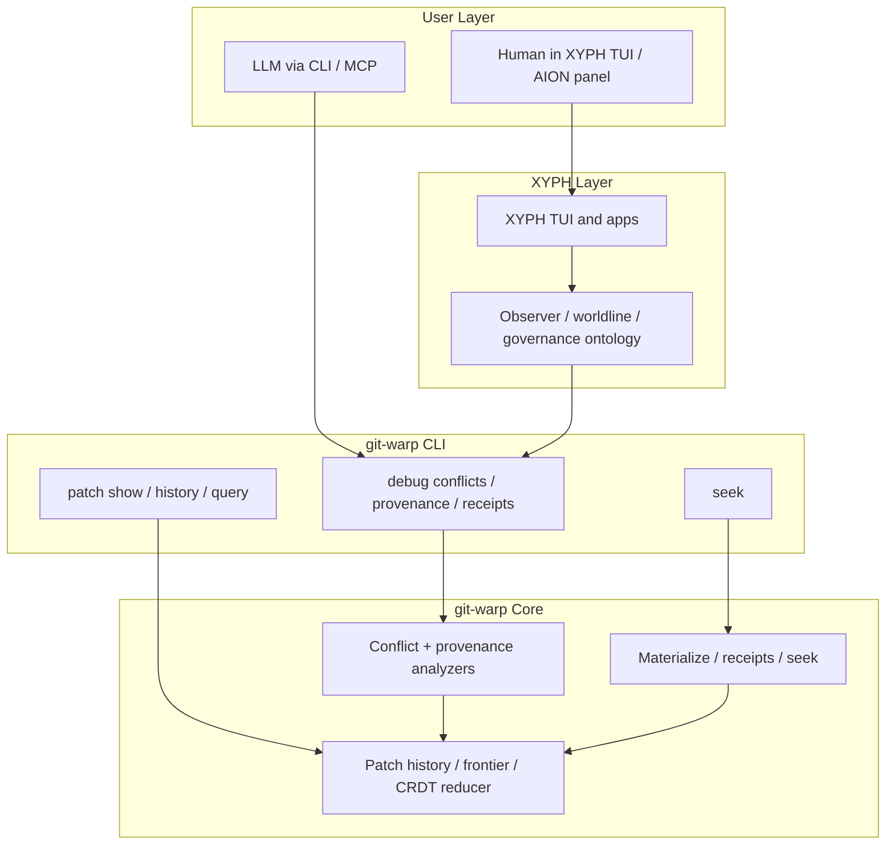

# Time Travel Debugger (TTD)

**Status:** v1 surface accepted and active.

The git-warp time travel debugger is intentionally a **thin CLI-first inspection surface** over substrate facts. It is not a human-facing TUI, and it is not a second product layered awkwardly inside git-warp.

## Scope

TTD in git-warp exists to answer substrate questions such as:

- what coordinate am I observing?
- what conflicts competed and why did one write win?
- which patches contributed to a given entity?
- what did the reducer do with each operation at a given Lamport ceiling?

TTD does **not** own:

- domain meaning above the substrate
- workflow/governance semantics
- compare/collapse interpretation
- human-facing debugger panels or time-travel applications

Those live in higher layers such as XYPH.

## Layering

## Command Surface

TTD in git-warp is a **family**, not a single command:

- `git warp seek`
  Controls the active historical coordinate for exploratory reads.
- `git warp debug conflicts`
  Shows deterministic conflict traces and structured loser/winner evidence.
- `git warp debug provenance`
  Shows causal patch provenance for a specific entity ID.
- `git warp debug receipts`
  Shows tick receipts and per-operation reducer outcomes.
- `git warp patch show`
  Decodes the raw patch behind a receipt or conflict anchor.
- `git warp history`
  Shows writer-local patch timelines.

Together these form the substrate-level time travel debugger.

## Hexagonal Boundary

TTD follows the same ports-and-adapters rules as the rest of git-warp:

- **Domain/core**
  Owns analyzers, receipts, materialization, conflict classification, and provenance facts.
- **CLI adapters**
  Parse flags, resolve coordinates, call domain methods, and return structured payloads.
- **Presenters**
  Render text / JSON / NDJSON views over the payloads.

The CLI must stay thin:

- no business/domain semantics beyond substrate truth
- no alternative storage layer
- no special debugger-only mutation path
- no embedded TUI or browser application

## Read-Only Contract

The debug family is intended to remain **read-only**.

In practice:

- `debug conflicts` uses the conflict analyzer, which performs zero durable writes.
- `debug provenance` and `debug receipts` use explicit materialization without the CLI attaching checkpoint policies or persistent seek caches.
- debug topics may consult the active seek cursor, but they do not mutate it.

If a future debugger feature requires durable writes, it should not be added casually. The read-only contract is part of the debugger’s architecture, not just a convenience.

## Coordinate Model

The debugger operates over:

- the current frontier
- plus an optional Lamport ceiling
- plus the optional active seek cursor when no explicit ceiling is given

This keeps TTD aligned with the current git-warp substrate model:

- `seek` controls observation position
- debug topics inspect facts at that position
- higher layers may later project richer worldline semantics on top

## Why There Is No Built-In TUI

git-warp is the substrate and its thin operator/LLM CLI.

Human-facing debugger or time-travel applications belong above it. That keeps:

- git-warp versioning simple
- the core package free of UI framework drift
- substrate facts reusable by higher-level systems

In practice this means:

- git-warp ships the CLI and machine-readable data
- XYPH owns the human-facing AION / Time Travel panel

## Backlog Direction

Likely future TTD-adjacent extensions:

- additional debug topics once their substrate facts are stable
- richer provenance drilldown over conflict anchors
- working-set/worldline-aware coordinates after substrate support exists
- higher-level debugger panels in XYPH, not in git-warp
