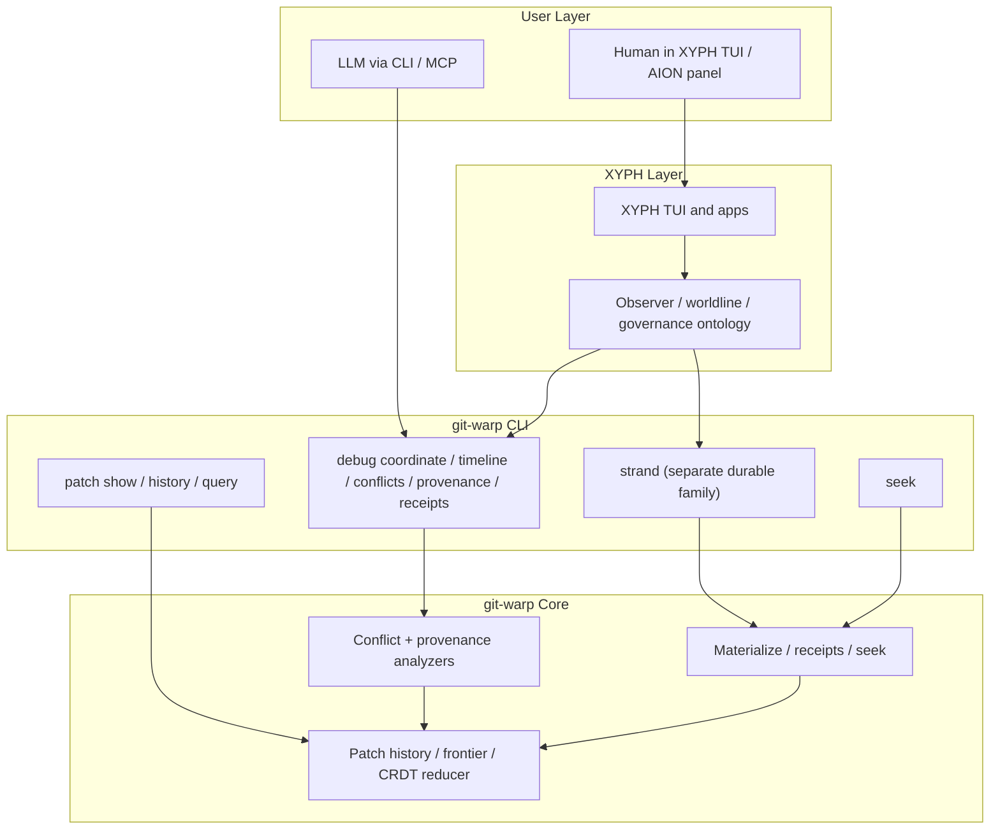

# Time Travel Debugger (TTD)

**Status:** v1 surface accepted and active.

The git-warp TTD surface is intentionally a **thin CLI-first adapter** over
substrate facts.

That statement applies to what git-warp ships directly. It does **not** mean
that the broader WARP TTD should be CLI-only or non-human-facing. The broader
human-centered debugger architecture is captured in:

- `docs/design/ttd-human-centered-hex-architecture.md`

The boundary is:

- git-warp ships substrate truth plus thin operational adapters
- higher layers such as XYPH, Echo, or future hosts may provide richer human-
  facing debugger experiences over those same substrate facts

## Scope

TTD in git-warp exists to answer substrate questions such as:

- what coordinate am I observing?
- what conflicts competed and why did one write win?
- which patches contributed to a given entity?
- what did the reducer do with each operation at a given Lamport ceiling?

The git-warp adapter does **not** own:

- domain meaning above the substrate
- workflow/governance semantics
- compare/collapse interpretation
- human-facing debugger panels or time-travel applications

Those live in higher layers such as XYPH or other WARP TTD hosts.

## Layering

## Command Surface

TTD in git-warp is a **family**, not a single command:

- `git warp seek`
  Controls the active historical coordinate for exploratory reads.
- `git warp debug coordinate`
  Shows the resolved observation coordinate, frontier digest, visible patch counts, and tick-local receipt summary.
- `git warp debug timeline`
  Shows a cross-writer causal patch timeline, optionally scoped to an entity, writer, or Lamport window.
- `git warp debug conflicts`
  Shows deterministic conflict traces and structured loser/winner evidence.
- `git warp debug provenance`
  Shows causal patch provenance for a specific entity ID.
- `git warp debug receipts`
  Shows tick receipts and per-operation reducer outcomes.
- `git warp patch show`
  Decodes the raw patch behind a receipt or conflict anchor.
- `git warp history`
  Shows writer-local patch timelines.

Together these form the substrate-level time travel debugger.

Separate but adjacent:

- `git warp strand`
  Manages durable pinned coordinates and materializes them later. This is intentionally outside the read-only TTD family because it creates and deletes descriptor refs.
- `git warp strand braid`
  Pins read-only braid support overlays onto a target strand without changing the TTD read-only contract.
- `git warp strand compare`
  Compares durable coordinates and visible patch universes. It stays outside `debug` because it is a coordinate-comparison surface, not a single-coordinate debugger topic.
- `git warp strand transfer-plan`
  Extracts a deterministic candidate transfer between durable coordinates. It stays outside `debug` because settlement-runway planning is adjacent to, but distinct from, single-coordinate time-travel inspection.

## Hexagonal Boundary

TTD follows the same ports-and-adapters rules as the rest of git-warp:

- **Domain/core**
  Owns analyzers, receipts, materialization, conflict classification, and provenance facts.
- **CLI adapters**
  Parse flags, resolve coordinates, call domain methods, and return structured payloads.
- **Presenters**
  Render text / JSON / NDJSON views over the payloads.

The CLI must stay thin:

- no business/domain semantics beyond substrate truth
- no alternative storage layer
- no special debugger-only mutation path
- no embedded TUI or browser application

TTD is also deliberately separate from strand management:

- debug commands inspect substrate facts
- strand commands pin durable coordinates and compare them
- `strand transfer-plan` plans substrate-factual transfer without deciding application-level settlement
- content-clear transfer ops lower through the same public patch helpers (`clearContent()` / `clearEdgeContent()`) rather than through debugger-only or application-only mutation conventions
- higher layers may combine both, but git-warp keeps the boundary explicit
- higher-layer library code that needs the same visible truth can combine
  `materializeStrand()` with `projectStateV5()` or `createStateReaderV5()`
  without turning git-warp into an application query framework
- coordinate comparison helpers such as `compareStrand()`,
  `compareCoordinates()`, `compareVisibleStateV5()`, `planStrandTransfer()`,
  and `planCoordinateTransfer()` stay substrate-factual and do not collapse
  into application-level decision semantics
- those comparison/transfer helpers can also take an optional visible-state
  `scope` keyed by node-id prefixes when a higher layer needs deterministic
  substrate truth over only part of the visible graph
- when higher layers need to record those same comparison or transfer facts,
  `exportCoordinateComparisonFact()` and `exportCoordinateTransferPlanFact()`
  expose the canonical JSON-safe substrate envelope without making TTD or the
  CLI responsible for application-level artifact policy

## Read-Only Contract

The debug family is intended to remain **read-only**.

In practice:

- `debug conflicts` uses the conflict analyzer, which performs zero durable writes.
- `debug coordinate` uses explicit materialization without the CLI attaching checkpoint policies or persistent seek caches.
- `debug provenance` and `debug timeline` inspect either the live provenance view or the visible strand patch universe without mutating graph state.
- `debug receipts` uses explicit materialization over the live frontier or a pinned strand without mutating seek state or graph state.
- debug topics may consult the active seek cursor, but they do not mutate it.
- when `--strand <id>` is selected, braid-aware topics can surface the resolved strand backing facts directly in payload/output: base ceiling, overlay head/count/writability, and pinned braid support IDs

When a selected strand carries braided read-only overlays, those debug
topics inspect the resulting braid-visible patch universe automatically because
they still materialize and analyze through the strand substrate surface.

If a future debugger feature requires durable writes, it should not be added casually. The read-only contract is part of the debugger’s architecture, not just a convenience.

This is why `strand` is a separate top-level family instead of a `debug` subcommand.

## Coordinate Model

The debugger operates over:

- the current frontier
- plus an optional Lamport ceiling
- plus the optional active seek cursor when no explicit ceiling is given
- plus, on supported topics, an explicit strand patch universe selected by `--strand <id>`

This keeps TTD aligned with the current git-warp substrate model:

- `seek` controls observation position
- debug topics inspect facts at that position
- `debug coordinate` remains live-frontier/cursor scoped for now
- `debug timeline`, `debug conflicts`, `debug provenance`, and `debug receipts` can inspect a pinned strand, including any pinned braid support overlays, without teaching the reducer about worldlines
- those braid-aware debug topics can also report which pinned overlay/braid context backed the read, so receipts and provenance stay auditable instead of implicit
- `strand compare` handles deterministic coordinate/strand divergence reads outside the debugger family
- `strand transfer-plan` handles deterministic candidate-transfer extraction outside the debugger family
- `strand braid` changes descriptor visibility, not debugger semantics
- explicit strand descriptors pin positions without mutating the debugger family
- higher layers may later project richer worldline semantics on top

## Human Playback Model

The human-facing debugger model may legitimately be simpler than the substrate
model.

At the substrate level, worldlines and strands can advance independently.
For human DX, however, playback controls such as:

- rewind
- step backward
- step forward
- play
- pause

usually imply one composite scene rather than many unrelated local clocks.

That is acceptable as long as we keep the boundary explicit:

- substrate truth uses independent worldline coordinates
- debugger playback may use a derived global session cursor over a merged event
  stream

In that model, "rewind everything" means:

- resolve each active worldline or strand to its latest visible
  coordinate at or before the selected debugger frame

not:

- pretend the substrate itself has only one real global clock

This distinction matters because:

- it preserves honest worldline semantics
- it keeps the human debugger cognitively manageable
- it lets higher layers such as XYPH present lockstep playback without forcing
  git-warp to erase independent causality in its core model

The current git-warp CLI remains intentionally thin. Richer playback-control
surfaces belong primarily in higher layers, but they should follow this same
split between substrate coordinates and derived debugger frames.

## Why There Is No Built-In TUI

git-warp is the substrate and its thin operator/LLM CLI.

Human-facing debugger or time-travel applications belong above it. That keeps:

- git-warp versioning simple
- the core package free of UI framework drift
- substrate facts reusable by higher-level systems

In practice this means:

- git-warp ships the CLI and machine-readable data
- XYPH owns the human-facing AION / Time Travel panel

## Backlog Direction

Likely future TTD-adjacent extensions:

- additional debug topics once their substrate facts are stable
- entity-local slice inspection at historical coordinates once substrate support exists
- richer provenance drilldown over conflict anchors
- richer braid-oriented debugger affordances and examples now that co-present overlay composition exists in the substrate
- higher-level debugger panels in XYPH, not in git-warp
