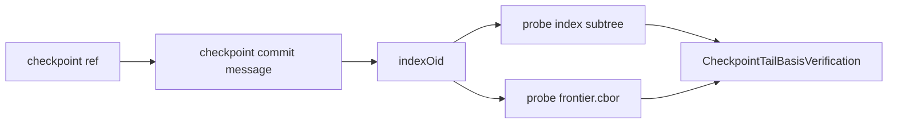

# PERF-0270 - Bounded Tree-Entry Basis Probes

## Linked Issue

- Primary gate: https://github.com/git-stunts/git-warp/issues/549
- Bad-code pressure: https://github.com/git-stunts/git-warp/issues/575
- Candidate shape: https://github.com/git-stunts/git-warp/issues/577
- Downstream Optics closeout: https://github.com/git-stunts/git-warp/issues/547
- Release umbrella: https://github.com/git-stunts/git-warp/issues/552

## Design Type

This design is primarily:

- [x] Runtime/API
- [x] Storage/substrate
- [ ] Sync/protocol
- [ ] Migration/release
- [ ] CLI/operator
- [ ] Docs/public guidance
- [ ] TUI/visual surface
- [x] Test/tooling

## Decision Summary

Introduce a bounded tree-entry probe contract for checkpoint-tail basis
verification. `prepareOpticBasis()` should prove the required checkpoint
frontier and index evidence through targeted tree-entry reads or explicitly
bounded prefix probes, not through the full `readTreeOids(...)` tree-map
surface.

## Sponsored Human

A production graph operator wants first-use Optics setup to verify existing
checkpoint-tail basis evidence without loading an entire checkpoint tree map so
that large checkpoints do not turn "bounded" setup into a hidden memory
surprise, without having to avoid the documented Worldline Optics path.

## Sponsored Agent

An agent needs a machine-checkable tree-entry probe contract so it can prove
which checkpoint evidence was read during Optics setup, without inferring memory
behavior from a streaming-looking API or from prose caveats.

## Hill

By the end of this cycle, checkpoint-tail basis verification can prove required
basis evidence through targeted or bounded tree-entry reads instead of full tree
maps, and the repo proves it with a large-tree fixture plus tripwire coverage
that rejects `readTreeOids(...)` on the first-use Optics setup path.

## Current Truth

Gate 1 removed the direct full graph materialization call from the first-use
Optics setup path, but the verifier still uses full tree-map semantics:

- `CheckpointTailBasisVerifier.verify()` reads the checkpoint commit message,
  verifies the schema, and then verifies the checkpoint tree before returning a
  checkpoint SHA:
  [src/domain/services/optic/CheckpointTailBasisVerifier.ts#21:5e081ccafff46bc850874df491a80ae2594d629c](https://github.com/git-stunts/git-warp/blob/5e081ccafff46bc850874df491a80ae2594d629c/src/domain/services/optic/CheckpointTailBasisVerifier.ts#L21).
- `_verifyCheckpointTree(...)` currently calls
  `_source._persistence.readTreeOids(checkpointMessage.indexOid)` before
  checking for `frontier.cbor` and index evidence:
  [src/domain/services/optic/CheckpointTailBasisVerifier.ts#51:5e081ccafff46bc850874df491a80ae2594d629c](https://github.com/git-stunts/git-warp/blob/5e081ccafff46bc850874df491a80ae2594d629c/src/domain/services/optic/CheckpointTailBasisVerifier.ts#L51).
- `TreePort.readTreeOids(...)` is a whole-tree map contract:
  [src/ports/TreePort.ts#15:5e081ccafff46bc850874df491a80ae2594d629c](https://github.com/git-stunts/git-warp/blob/5e081ccafff46bc850874df491a80ae2594d629c/src/ports/TreePort.ts#L15).
- The Git recursive tree reader shells out to `git ls-tree -rz <treeOid>` and
  parses the complete output before returning:
  [src/infrastructure/adapters/GitRecursiveTreeOidReaderAdapter.ts#41:5e081ccafff46bc850874df491a80ae2594d629c](https://github.com/git-stunts/git-warp/blob/5e081ccafff46bc850874df491a80ae2594d629c/src/infrastructure/adapters/GitRecursiveTreeOidReaderAdapter.ts#L41).
- The in-memory adapter also builds a complete path-to-OID result map for the
  requested tree:
  [src/infrastructure/adapters/InMemoryGraphAdapter.ts#77:5e081ccafff46bc850874df491a80ae2594d629c](https://github.com/git-stunts/git-warp/blob/5e081ccafff46bc850874df491a80ae2594d629c/src/infrastructure/adapters/InMemoryGraphAdapter.ts#L77).
- The current first-use Optics honesty test forbids materialization helpers,
  state blob reads, patch blob reads, checkpoint writes, and source-level
  materialization calls, but it does not yet reject `readTreeOids(...)` on the
  setup path:
  [test/conformance/v18FirstUseOpticsHonesty.test.ts#156:5e081ccafff46bc850874df491a80ae2594d629c](https://github.com/git-stunts/git-warp/blob/5e081ccafff46bc850874df491a80ae2594d629c/test/conformance/v18FirstUseOpticsHonesty.test.ts#L156).
- The public API cost inventory still classifies `worldline.prepareOpticBasis()`
  as `transitional`, with memory-budgeted verification waiting for gate 2:
  [docs/public-api-cost-inventory.tsv#11:5e081ccafff46bc850874df491a80ae2594d629c](https://github.com/git-stunts/git-warp/blob/5e081ccafff46bc850874df491a80ae2594d629c/docs/public-api-cost-inventory.tsv#L11).

## Problem

The Gate 1 first-use Optics verifier stopped calling
`materialize()`/`createCheckpoint()`, but it still proves checkpoint-tail basis
by loading the whole checkpoint tree OID map. A large checkpoint envelope can
still make first-use setup allocate an unbounded map before it discovers whether
frontier and index evidence exist.

## Scope

This cycle includes:

- a focused tree-entry probe contract for exact path evidence;
- an explicitly bounded prefix or subtree evidence contract when "any shard
  exists" must be proven;
- honest Git-backed and in-memory adapter behavior for the new contract;
- `CheckpointTailBasisVerifier` migration from full tree maps to the new
  bounded evidence contract;
- tests that fail if the first-use Optics setup path calls `readTreeOids(...)`;
- a large-tree fixture that proves the verifier requests only the required
  evidence probes and never calls the full tree-map surface;
- cost inventory and issue disposition updates when the implementation changes
  classification.

## Non-Goals

This cycle does not include:

- completing the whole #549 bounded-memory product gate;
- replacing all `readTreeOids(...)` callers;
- changing checkpoint creation or checkpoint state serialization;
- making normal public reads, writes, content lookup, or sync bounded;
- changing public package API for users;
- publishing v18 or running release preflight;
- native Continuum witnesshood.

## Runtime / API Contract

Name the software contract: **bounded tree-entry basis evidence**.

The implementation should introduce a focused port instead of widening
`TreePort.readTreeOids(...)` into fake-bounded semantics.

Expected contract shape:

- `TreeEntryProbePort` is a focused port surface for tree evidence reads.
- `readTreeEntryOid(treeOid, path)` asks for one tree path and returns a
  runtime-backed result.
- `readTreeEntryPrefix(treeOid, prefix, limit)` or equivalent asks for at most
  `limit` entries under a prefix and returns a bounded batch.
- `TreeEntryFound`, `TreeEntryMissing`, and bounded batch result classes are
  runtime-backed and dispatchable with `instanceof`.
- Blank paths, non-positive limits, and unbounded prefix scans are invalid at
  construction.
- Existing `readTreeOids(...)` remains available for diagnostic, legacy,
  checkpoint loading, or migration paths until broader paydown work retires it.

For current checkpoint-tail basis verification, the required evidence is:

- the checkpoint commit message decodes as the current schema;
- `frontier.cbor` exists in the checkpoint index tree;
- current-schema index evidence exists, preferably as an exact `index` subtree
  entry;
- if compatibility requires recursive shard evidence, the verifier probes only
  a bounded `index/` prefix with a limit of one.

Missing or unsupported evidence remains an expected Optics setup failure through
`E_OPTIC_NO_BOUNDED_BASIS`.

## User Experience / Product Shape

Not applicable as a rendered surface. The user-visible product shape is the
public Worldline Optics setup chain:

```text
openWarpWorldline(...) -> prepareOpticBasis() -> coordinate() -> coordinate.optic()
```

For this cycle, user-visible success is no new visible UI. The product outcome
is that the existing setup path moves one step closer to a bounded-memory claim
without changing first-use syntax.

## Data / State Model

| State | Source of truth | Derived state | Invalid states | Reset behavior | Serialization | Determinism assumptions |
| --- | --- | --- | --- | --- | --- | --- |
| Git tree entries | Git tree object addressed by tree OID | `TreeEntryFound`, `TreeEntryMissing`, bounded prefix batch | blank path, invalid OID, non-positive limit, unbounded prefix scan | no mutable state | no new persistent format | Git tree path lookup is deterministic for a tree OID and path |
| Checkpoint-tail basis evidence | checkpoint commit message and checkpoint index tree | `CheckpointTailBasisVerification` | missing checkpoint, unsupported schema, missing frontier, missing index evidence | verifier retries by re-reading current checkpoint ref | no new persistent format | same checkpoint SHA yields same evidence result |



## Architecture / Anti-SLUDGE Posture

| Concern | Decision |
| --- | --- |
| Domain changes | `CheckpointTailBasisVerifier` consumes bounded evidence results instead of path maps. |
| Port changes | Add a focused tree-entry probe port rather than changing `readTreeOids(...)` semantics. |
| Adapter changes | Git and in-memory adapters implement exact path and bounded prefix evidence honestly. |
| Boundary validation | Adapter inputs validate OIDs and path/limit values before invoking Git plumbing. |
| Runtime-backed nouns introduced | Tree entry path, tree entry limit, found/missing result, and bounded prefix batch as needed. |
| Expected failure representation | Missing basis stays `QueryError` with `E_OPTIC_NO_BOUNDED_BASIS`; adapter failures stay port-specific persistence errors. |
| Banned shortcuts avoided | No `Record<string, string>` for the new bounded contract, no `any`, no `unknown` outside adapters, no casts to fake result shapes. |
| Quarantine impact | No file-level quarantine expansion. If a quarantined file is touched, graduate or narrow according to policy. |

## Cost / Residency Posture

| Surface | Current cost | Target cost | Limit/budget | Failure mode |
| --- | --- | --- | --- | --- |
| `worldline.prepareOpticBasis()` tree evidence | transitional full tree OID map | targeted or bounded tree-entry probes | exact path probes plus prefix limit of one when needed | `E_OPTIC_NO_BOUNDED_BASIS` for missing basis |
| `TreePort.readTreeOids(...)` | diagnostic/legacy full map | unchanged legacy surface | none | existing persistence errors |
| Git adapter tree probe | unavailable | exact path or bounded prefix plumbing | one path or explicit prefix limit | missing entry result or wrapped Git error |
| In-memory adapter tree probe | unavailable | exact path-indexed lookup or bounded child-prefix result without building a full result map | one path or explicit prefix limit | missing entry result or persistence error |

This cycle may keep `worldline.prepareOpticBasis()` classified as
`transitional` because the broader memory budget and basis/tail providers are
not complete. It should remove the specific full tree-map dependency tracked in
#575.

## Determinism / Replay / Causality

This design preserves deterministic replay by:

- reading immutable Git tree evidence by object ID;
- keeping checkpoint SHA as the basis identity;
- preserving existing `E_OPTIC_NO_BOUNDED_BASIS` recovery behavior for missing
  evidence;
- avoiding any ambient time, entropy, or process-local ordering in the verifier.

Causal inputs:

- basis: latest checkpoint-tail basis evidence under the graph checkpoint ref;
- frontier: `frontier.cbor` entry in the checkpoint index tree;
- writer id: unchanged, supplied by existing Worldline open path;
- patch/order source: unchanged, supplied by existing coordinate/Optic source;
- checkpoint or coordinate identity: checkpoint SHA returned by
  `prepareOpticBasis()` and pinned by `coordinate()`.

Replay/convergence tests:

- current coordinate Optics public-path tests must continue to pass;
- new verifier tests prove missing or unsupported evidence fails closed;
- large-tree fixture proves evidence verification requests only the required
  evidence probes, while adapter tests prove exact lookup avoids full-map
  construction.

## Git Substrate Impact

| Substrate area | Impact |
| --- | --- |
| refs | no format change; checkpoint ref lookup remains the source of latest basis |
| commits | no commit format change |
| trees/blobs | new read contract over existing Git tree objects |
| empty-tree graph commits | no change |
| object ids | exact tree path probes return existing OIDs |
| tag/release behavior | no tag behavior change |
| migration compatibility | current checkpoint schema remains supported; legacy full-map reads remain available outside first-use setup |

## Compatibility / Migration Posture

| Concern | Decision |
| --- | --- |
| Public API compatibility | No public user syntax change. |
| Package export changes | No new user-facing package export expected. |
| Storage/read compatibility | Existing checkpoint tree format remains valid. |
| Legacy behavior retained | `readTreeOids(...)` remains for full checkpoint loaders and diagnostics. |
| Deprecation behavior | No deprecation in this slice; cost inventory may reclassify only the verifier dependency. |
| Migration path | None; this is a read contract over existing Git objects. |
| Release note impact | v18 release notes may mention this as part of bounded-memory gate evidence only after #549 closes. |

## Error Contract

| Failure | Error/result | Caller recovery | Test |
| --- | --- | --- | --- |
| no checkpoint ref | `QueryError` `E_OPTIC_NO_BOUNDED_BASIS` reason `missing-checkpoint` | create or import checkpoint-tail basis evidence | existing missing-basis test plus focused verifier test |
| unsupported checkpoint schema | `QueryError` `E_OPTIC_NO_BOUNDED_BASIS` reason `checkpoint-without-index-tree` | use current checkpoint basis | focused verifier test |
| missing `frontier.cbor` | `QueryError` `E_OPTIC_NO_BOUNDED_BASIS` reason `checkpoint-missing-frontier` | rebuild basis evidence | focused verifier test |
| missing index evidence | `QueryError` `E_OPTIC_NO_BOUNDED_BASIS` reason `checkpoint-missing-index-shards` or renamed equivalent | rebuild basis evidence | focused verifier test |
| adapter cannot probe tree entry | persistence or capability error mapped to fail-closed Optics setup behavior | use adapter with bounded tree-entry capability | capability test |

## Security / Trust / Redaction Posture

Required because Git plumbing and operator-visible errors are involved.

- trust boundary: tree-entry probes read existing Git object database state;
- authority or capability checked: the adapter must expose the new probe port;
- secret-bearing values: none expected; OIDs and paths are not secret in normal
  graph storage;
- redaction behavior: error context may include graph name, reason, path, and
  OID, but not blob contents;
- log/report behavior: no new logging surface in this slice;
- abuse or replay concern: unbounded prefix probes are rejected by construction.

## Lower Modes

The lower mode is deterministic test and witness output:

- focused verifier tests show whether full-map reads occurred;
- conformance tripwire output identifies the forbidden operation;
- public API cost inventory stays machine-readable TSV.

## Accessibility Posture

For non-rendered runtime work, accessibility is preserved through linear,
plain-text errors and witness output.

| Concern | Decision |
| --- | --- |
| Semantic labels or facts | error code and reason identify the missing evidence |
| Focus order or focus ownership | not applicable |
| Hidden or visual-only information | no visual-only state |
| Keyboard behavior | not applicable |
| Secret/redaction behavior | blob contents are not emitted |

## User-Facing Text / Directionality

Required only if implementation changes error prose or docs. This design expects
stable ASCII error codes and reason strings. No locale or translation process
applies.

## Agent Inspectability / Explainability Posture

An agent can inspect the result without scraping pixels or prose by checking:

- the focused tree-entry probe port and runtime-backed result classes;
- the `CheckpointTailBasisVerifier` call graph;
- tripwire tests that fail on `readTreeOids(...)` setup-path use;
- large-tree fixture probe-path witness;
- public API cost inventory rows for `worldline.prepareOpticBasis()` and
  coordinate Optics.

## Linked Invariants

- Tests Are the Spec.
- Runtime Truth Wins.
- Hexagonal Architecture.
- Git History Is Graph Data.
- Public Claims Need Witnesses.
- Docs Are Evidence, Not Proof.
- No fake boundedness through renamed full-map APIs.

## Design Alternatives Considered

### Option A: Keep `readTreeOids(...)` and trust small trees

Pros:

- No new port.
- No adapter work.

Cons:

- Leaves #575 unresolved.
- Keeps Optics setup transitional for the exact reason Gate 2 is trying to
  remove.
- Cannot prove large checkpoint trees stay within a small memory budget.

### Option B: Add optional limit parameters to `readTreeOids(...)`

Pros:

- Reuses the existing port name.
- Looks small at the call site.

Cons:

- Blurs a full-map API into a bounded API without changing the concept.
- Risks adapter implementations that still read the full tree before applying a
  limit.
- Makes tests harder to reason about because the same method can be full or
  bounded depending on options.

### Option C: Add a focused tree-entry probe port

Pros:

- Names the smaller substrate truth directly.
- Lets tests reject the old full-map call on first-use setup paths.
- Allows exact path lookup and bounded prefix evidence to have explicit result
  types.
- Keeps existing `readTreeOids(...)` compatibility behavior untouched.

Cons:

- Requires adapter and test helper updates.
- Adds one more port surface until broader tree-read paydown retires full-map
  dependencies.

## Decision

Choose Option C. A focused tree-entry probe port is the cleanest way to remove
the verifier's whole-tree-map dependency without pretending the existing
`readTreeOids(...)` contract has become bounded. This decision is temporary only
in the sense that broader #549 work may later replace both full-map and probe
surfaces with a richer bounded tree cursor substrate.

## Proof Surface

The implementation must be proven through:

- actual surface under test:
  `openWarpWorldline(...).prepareOpticBasis()` and
  `CheckpointTailBasisVerifier.verify()`;
- first RED test:
  a verifier fixture where `readTreeOids(...)` throws a forbidden operation but
  bounded tree-entry probes are available;
- required witness command:
  `npx vitest run test/unit/domain/services/optic/CheckpointTailBasisVerifier.test.ts test/conformance/v18FirstUseOpticsHonesty.test.ts`;
- non-acceptable proof:
  docs-only assertions, source-only string checks, or a limit applied after a
  full tree map has already been read.

## Implementation Slices

- Add RED verifier coverage proving success with tree-entry probes and failure
  when setup calls `readTreeOids(...)`.
- Add runtime-backed tree-entry result/limit/path nouns and a focused probe
  port.
- Implement honest in-memory probe behavior without constructing the full tree
  OID map.
- Implement honest Git-backed exact path and bounded prefix probe behavior.
- Migrate `CheckpointTailBasisVerifier` to the new port and preserve
  `E_OPTIC_NO_BOUNDED_BASIS` failure behavior.
- Strengthen first-use Optics tripwires and add a large-tree fixture.
- Update cost inventory, BEARING, and tracker dispositions for #575/#577 when
  the implementation lands.

Each slice should be small enough to commit or review independently and should
have its own proof.

## Tests To Write First

Behavior tests required:

- [x] `CheckpointTailBasisVerifier` verifies required basis evidence when
  `readTreeOids(...)` is forbidden and bounded probes are available.
- [x] `CheckpointTailBasisVerifier` fails closed for missing `frontier.cbor`
  through the probe path.
- [x] `CheckpointTailBasisVerifier` fails closed for missing index evidence
  through the probe path.
- [x] In-memory adapter probe tests prove exact path lookup does not build a
  full result map.
- [x] Git adapter probe tests prove exact path and bounded prefix behavior use
  the requested pathspecs and stop at the runtime limit.
- [x] First-use Optics conformance rejects `readTreeOids(...)` on setup.
- [x] Large-tree fixture proves verification requests only required evidence
  probes.

Documentation/process tests, only if relevant:

- [x] Cost inventory row updated without changing
  `worldline.prepareOpticBasis()` classification.

Rule: documentation tests cannot be the only proof for implementation work.

## Acceptance Criteria

The work is done when:

- [x] Behavior tests prove `prepareOpticBasis()` no longer depends on full tree
  maps.
- [x] Runtime probe results prove exact path and bounded prefix evidence without
  `Record<string, string>` full-map return values.
- [x] Missing-basis behavior still returns named `E_OPTIC_NO_BOUNDED_BASIS`
  failures.
- [x] Git-backed and in-memory adapters implement the new contract honestly.
- [x] Large-tree-over-small-evidence fixture proves the verifier requests only
  required evidence probes and does not call the full tree-map surface.
- [x] #575 can close or be narrowed to a later residual that is no longer about
  checkpoint-tail basis verification.
- [x] #577 can close as implemented or be converted into a broader bounded tree
  cursor follow-up.
- [x] Issue and PR are linked correctly.
- [x] Local validation is green. GitHub CI is tracked on PR #579.

## Validation Plan

Commands expected before PR:

```bash
npx vitest run test/unit/domain/services/optic/CheckpointTailBasisVerifier.test.ts
npx vitest run test/conformance/v18FirstUseOpticsHonesty.test.ts
npx vitest run test/unit/infrastructure/adapters/InMemoryGraphAdapter.test.ts
npm run typecheck
npm run lint
npm run lint:sludge
npm run lint:quarantine-graduate
npm run lint:md
npm run lint:md:code
```

Trim commands that do not apply. Add focused Git adapter tests once the exact
adapter file is touched.

## Playback / Witness

Reviewers can inspect or run:

```bash
npx vitest run test/unit/domain/services/optic/CheckpointTailBasisVerifier.test.ts test/conformance/v18FirstUseOpticsHonesty.test.ts
```

The expected witness is a first-use Optics setup path that succeeds when bounded
tree-entry probes are used and fails immediately if any setup dependency calls
`readTreeOids(...)`.

## Risks

Known risks:

- Git plumbing exact path lookup can still be implemented through a full
  command output buffer if the adapter uses the wrong command.
- Compatibility checkpoint shapes may require a bounded prefix probe rather than
  a single exact `index` entry.
- Test helpers may accidentally implement probe behavior by delegating to
  `readTreeOids(...)`.

Mitigations:

- Add adapter-level tests with streaming-limit traps or forbidden operation
  traps.
- Keep `readTreeOids(...)` forbidden in the first-use setup fixture.
- Make prefix probe limits runtime-backed and mandatory.

## Follow-On Debt

Create or update GitHub issues for anything deferred:

- broader bounded tree cursor substrate beyond checkpoint-tail basis evidence;
- normal public read fact resolvers under #549;
- content-reference lookup under #549;
- cursorized sync under #549;
- docs guard automation under #578 if it is not included in this cycle.

Do not hide future work in prose. If it matters, it gets an issue.

## Tracker Disposition

| Issue | Role | Expected disposition |
| --- | --- | --- |
| #549 | parent release gate | leave open; update with cycle evidence |
| #575 | bad-code pressure | close via PR #579 after verifier no longer reads full tree maps |
| #577 | candidate shape | close via PR #579 as implemented; broader bounded cursor work remains under #549 |
| #547 | downstream Optics closeout | leave open until #549 evidence supports release-complete Optics |
| #552 | release umbrella | leave open until #549, #547, preflight, tag, npm, and JSR evidence land |
| #576 | docs/API caveat debt | leave open; revisit after bounded read providers land |
| #578 | docs guard automation | leave open unless guard automation is pulled into this cycle |

## Done Does Not Mean

When this lands, it does not prove:

- all #549 bounded-memory requirements are complete;
- normal public reads or writes are bounded;
- content-reference lookup is bounded;
- sync is cursorized;
- coordinate Optic reads are memory-budgeted end to end;
- v18 is ready to tag or publish.

## Retrospective

Fill this in after implementation.

What changed from the design:

- `TreeEntryProbePort` landed as a focused port instead of changing
  `TreePort.readTreeOids(...)`.
- The verifier uses exact `frontier.cbor` and `index` tree-entry probes, with a
  bounded `index/` prefix fallback.
- `worldline.prepareOpticBasis()` stayed `transitional` in the cost inventory
  because #549 still owns normal public reads, writes, content lookup, sync,
  and end-to-end memory-budget conformance.

What the tests proved:

- `CheckpointTailBasisVerifier` succeeds when `readTreeOids(...)` is forbidden
  and tree-entry probes are available.
- Missing frontier and missing index evidence still fail closed with
  `E_OPTIC_NO_BOUNDED_BASIS`.
- In-memory and Git-backed adapters expose runtime-backed exact and bounded
  prefix probe results without a full-map return contract.
- Git prefix probes stream child-prefix output and stop at the runtime limit.
- First-use Optics setup rejects accidental `readTreeOids(...)` use.
- A large checkpoint tree with 4,096 unrelated state entries is verified by
  requesting only `frontier.cbor` and `index`.

What remains open:

- #549 remains the parent gate until normal public reads, writes, content
  lookup, and sync pass large-graph-over-small-pool conformance.

PR:

- https://github.com/git-stunts/git-warp/pull/579
