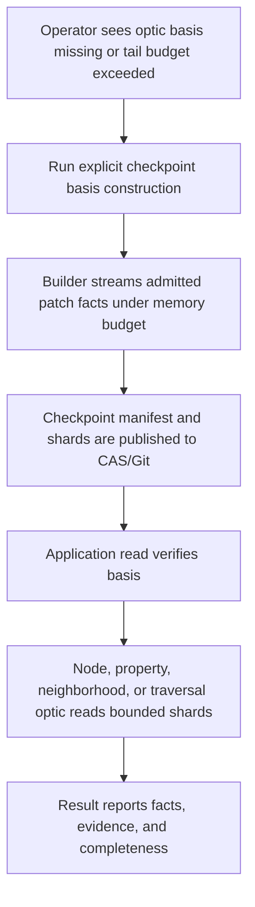
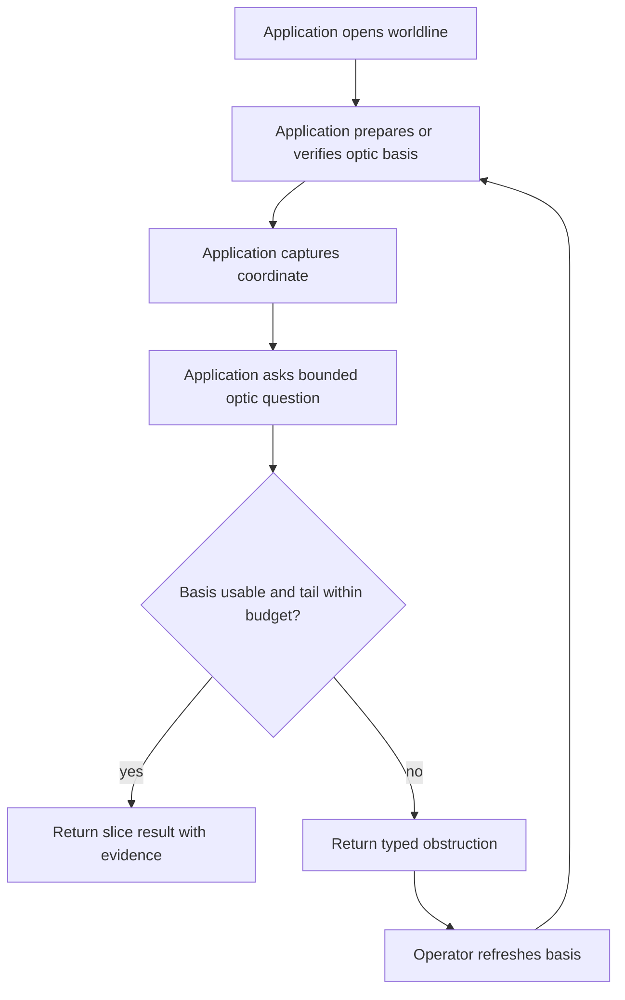
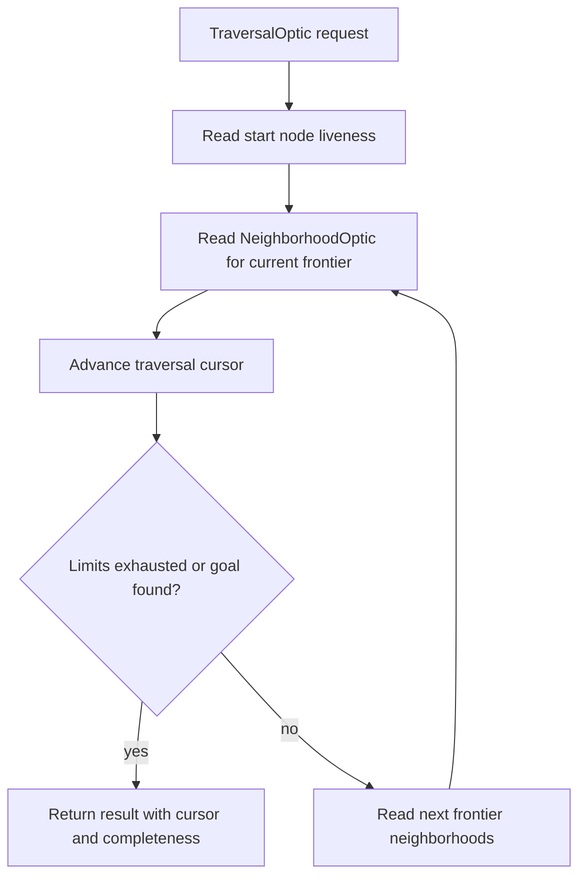
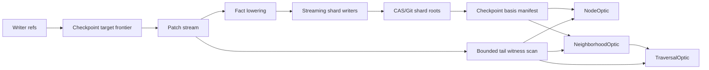

# PROTO-0271 - Holographic Slicing And Streaming Checkpoint Basis

## Linked Issue

- https://github.com/git-stunts/git-warp/issues/626

## Design Type

This design is primarily:

- [x] Runtime/API
- [x] Storage/substrate
- [ ] Sync/protocol
- [ ] Migration/release
- [x] CLI/operator
- [x] Docs/public guidance
- [ ] TUI/visual surface
- [x] Test/tooling

## Decision Summary

git-warp will treat full graph materialization as an explicit diagnostic,
export, checkpoint, migration, or compatibility operation, not as the ordinary
application read substrate. Normal public reads move toward holographic slices:
bounded, provenance-bearing, cursorable reads over a declared worldline or
coordinate basis. Checkpoints become the operator job that streams admitted
graph facts into CAS-backed basis shards and manifests, so node, property,
neighborhood, traversal, and indexed query reads can touch only the shards and
bounded tail needed for their declared question.

## Sponsored Human

A git-warp application developer wants to read and traverse large graph
worldlines under a declared memory budget so that v18 can support real
application workloads, without having to call `materialize()` or hope a
bounded-looking API does not secretly fold the full graph.

## Sponsored Agent

An agent needs machine-readable slice, checkpoint-basis, and traversal-cursor
contracts so it can inspect node facts, neighborhoods, traversal progress, and
checkpoint evidence, without inferring global truth from absent pixels, prose,
or a heap-resident `WarpState`.

## Hill

By the end of this design cycle, engineers and agents can plan v18 materialized
read retirement through one linked GitHub Issue and this design doc, and the
repo proves the design artifact with Method-shaped frontmatter, evidence-backed
Current Truth anchors, and a future RED test list that targets real runtime,
storage, API, CLI, and witness surfaces.

## Current Truth

The public docs already define a coordinate as a stable read position that
captures a checkpoint-tail basis and worldline frontier:
[docs/READINGS_AND_OPTICS.md#30:39646e65d0819f8a8f336709ff50bce0609e506c](https://github.com/git-stunts/git-warp/blob/39646e65d0819f8a8f336709ff50bce0609e506c/docs/READINGS_AND_OPTICS.md#L30).

The same guide already says an optic is the bounded question over a reading,
including node, edge, neighbor set, traversal, or query result:
[docs/READINGS_AND_OPTICS.md#35:39646e65d0819f8a8f336709ff50bce0609e506c](https://github.com/git-stunts/git-warp/blob/39646e65d0819f8a8f336709ff50bce0609e506c/docs/READINGS_AND_OPTICS.md#L35).

The implemented `WorldlineOptic` currently only exposes node optics:
[src/domain/services/optic/WorldlineOptic.ts#8:39646e65d0819f8a8f336709ff50bce0609e506c](https://github.com/git-stunts/git-warp/blob/39646e65d0819f8a8f336709ff50bce0609e506c/src/domain/services/optic/WorldlineOptic.ts#L8).
`NodeOptic` supports node liveness and property reads, not neighborhoods or
traversal:
[src/domain/services/optic/NodeOptic.ts#18:39646e65d0819f8a8f336709ff50bce0609e506c](https://github.com/git-stunts/git-warp/blob/39646e65d0819f8a8f336709ff50bce0609e506c/src/domain/services/optic/NodeOptic.ts#L18).

Checkpoint creation currently falls back to a cached, non-dirty full reading
state before writing a checkpoint:
[src/domain/services/controllers/CheckpointController.ts#155:39646e65d0819f8a8f336709ff50bce0609e506c](https://github.com/git-stunts/git-warp/blob/39646e65d0819f8a8f336709ff50bce0609e506c/src/domain/services/controllers/CheckpointController.ts#L155).
When the cached index tree is missing, it builds the view index from that full
state:
[src/domain/services/controllers/CheckpointController.ts#175:39646e65d0819f8a8f336709ff50bce0609e506c](https://github.com/git-stunts/git-warp/blob/39646e65d0819f8a8f336709ff50bce0609e506c/src/domain/services/controllers/CheckpointController.ts#L175).

The checkpoint envelope is already split into named state artifacts and Git tree
entries rather than one opaque `state.cbor` blob:
[src/domain/services/state/checkpointCreate.ts#137:39646e65d0819f8a8f336709ff50bce0609e506c](https://github.com/git-stunts/git-warp/blob/39646e65d0819f8a8f336709ff50bce0609e506c/src/domain/services/state/checkpointCreate.ts#L137).
However, those artifacts are serialized from a full `WarpState` envelope:
[src/domain/services/state/CheckpointSerializer.ts#131:39646e65d0819f8a8f336709ff50bce0609e506c](https://github.com/git-stunts/git-warp/blob/39646e65d0819f8a8f336709ff50bce0609e506c/src/domain/services/state/CheckpointSerializer.ts#L131).

Checkpoint-tail optics already expect bounded checkpoint index shards and fail
closed when the basis does not contain them:
[src/domain/services/optic/CheckpointTailBasisLoader.ts#35:39646e65d0819f8a8f336709ff50bce0609e506c](https://github.com/git-stunts/git-warp/blob/39646e65d0819f8a8f336709ff50bce0609e506c/src/domain/services/optic/CheckpointTailBasisLoader.ts#L35).

The deprecated traversal facade still routes through a query read model and
uses unbounded `maxNodes: Infinity` calls for ordinary BFS, DFS, and shortest
path:
[src/domain/services/query/LogicalTraversal.ts#77:39646e65d0819f8a8f336709ff50bce0609e506c](https://github.com/git-stunts/git-warp/blob/39646e65d0819f8a8f336709ff50bce0609e506c/src/domain/services/query/LogicalTraversal.ts#L77).

The lower-level traversal engine already records deterministic traversal
ordering invariants:
[src/domain/services/query/GraphTraversal.ts#15:39646e65d0819f8a8f336709ff50bce0609e506c](https://github.com/git-stunts/git-warp/blob/39646e65d0819f8a8f336709ff50bce0609e506c/src/domain/services/query/GraphTraversal.ts#L15).

The existing streaming index work shows the desired storage posture: flush
bounded chunks to streaming storage and keep chunked shard entries instead of
reading flushed chunks back into one final blob:
[src/domain/services/index/StreamingBitmapIndexBuilder.ts#101:39646e65d0819f8a8f336709ff50bce0609e506c](https://github.com/git-stunts/git-warp/blob/39646e65d0819f8a8f336709ff50bce0609e506c/src/domain/services/index/StreamingBitmapIndexBuilder.ts#L101)
and
[docs/method/retro/0057-index-builder-on-git-cas/index-builder-on-git-cas.md#9:39646e65d0819f8a8f336709ff50bce0609e506c](https://github.com/git-stunts/git-warp/blob/39646e65d0819f8a8f336709ff50bce0609e506c/docs/method/retro/0057-index-builder-on-git-cas/index-builder-on-git-cas.md#L9).

`BEARING` already names streaming basis construction, sharded fact resolvers,
cursorized reads, bounded memory, and bounded-mode legacy rejection as v18
blockers:
[docs/BEARING.md#44:39646e65d0819f8a8f336709ff50bce0609e506c](https://github.com/git-stunts/git-warp/blob/39646e65d0819f8a8f336709ff50bce0609e506c/docs/BEARING.md#L44).

## Problem

git-warp currently has the right public vocabulary but the wrong remaining
substrate dependency. The v18 read story says application code should use
worldlines, coordinates, and optics instead of full materialization, but
checkpoint creation, query reads, legacy traversal, CLI read commands, and many
tests still treat full `WarpState` residency as the proof or implementation
surface. Without a formal holographic slicing and streaming checkpoint-basis
contract, future slices can accidentally polish deprecated materializing APIs
or rebuild full materialization under a friendlier name.

## Scope

This cycle includes:

- defining the materialization boundary policy for v18;
- defining the checkpoint-basis artifact shape that slice reads consume;
- defining `NeighborhoodOptic` as the one-hop adjacency read primitive;
- defining `TraversalOptic` as cursorized multi-hop movement over neighborhoods;
- defining the expected obstruction and completeness language for bounded reads;
- naming the implementation slices and RED tests required before runtime claims
  are accepted.

## Non-Goals

This cycle does not include:

- deleting `materialize()` or `openWarpGraph()`;
- rewriting checkpoint creation in this doc-only slice;
- implementing `NeighborhoodOptic`, `TraversalOptic`, or a new index builder;
- claiming v18 bounded-memory readiness;
- changing storage schema on disk;
- changing CLI output;
- creating a browser visualization surface;
- solving every global graph algorithm as a local slice.

## Runtime / API Contract

The design names six contracts. Future implementation should use runtime-backed
classes or explicit value objects for these concepts, not typedef-only bags.

### Materialization Boundary Policy

Full graph materialization is legal only for explicitly named operations:

- checkpoint or basis construction;
- export;
- diagnostic inspection;
- migration;
- compatibility tests;
- low-level runtime plumbing that has not yet received a bounded replacement.

Full graph materialization is forbidden as the hidden implementation of:

- new public application reads;
- new examples or docs that teach normal users to read through
  `materialize()`;
- new query APIs;
- new traversal APIs;
- new observer or optic reads;
- new CLI product reads unless the command is explicitly diagnostic or
  plumber-scoped.

### Checkpoint Basis Manifest

A checkpoint basis manifest is the machine-readable contract that says which
CAS/Git objects support bounded reads at a frontier.

Required fields:

- schema;
- graph name;
- checkpoint SHA;
- frontier;
- applied version vector;
- basis hash or state hash;
- node-liveness root;
- property root;
- outgoing adjacency root;
- incoming adjacency root;
- edge-fact root;
- provenance root or explicit unavailable posture;
- content-anchor root or explicit unavailable posture;
- shard geometry and chunking metadata;
- completeness posture.

The manifest is not a `WarpState`. It is a basis for bounded fact resolution.

### Streaming Checkpoint Basis Builder

Checkpoint basis construction may scan the whole admitted graph history, but it
must stream patch facts into bounded shard/trie writers. It may not require a
full `WarpState` object as its input contract.

The builder accepts:

- checkpoint target frontier;
- optional previous checkpoint frontier;
- ordered patch/fact stream;
- memory budget;
- shard geometry;
- persistence and storage ports.

The builder emits:

- checkpoint basis manifest;
- CAS-backed shard or trie roots;
- flush metrics;
- obstruction records for malformed or unsupported inputs;
- a checkpoint commit or publishable manifest tree.

### Holographic Slice

A holographic slice is a bounded, provenance-bearing answer to a declared
question over a reading basis.

Every slice result must include:

- request identity;
- basis identity;
- result facts;
- evidence;
- completeness posture;
- unknown or out-of-window posture;
- limit/cursor information when the boundary is not exhausted.

### NeighborhoodOptic

`NeighborhoodOptic` answers one-hop adjacency around a node.

Inputs:

- center node id;
- direction: incoming, outgoing, or both;
- optional edge label filter;
- optional edge fact filter;
- edge or neighbor limit;
- optional cursor.

Output:

- center node liveness posture;
- neighbor entries sorted deterministically;
- edge facts needed to support each neighbor;
- index shard identities;
- tail witness identities;
- completeness posture.

### TraversalOptic

`TraversalOptic` answers multi-hop movement by expanding neighborhood slices and
carrying traversal state explicitly.

Inputs:

- start node id;
- strategy: breadth-first, depth-first, shortest-path window, or single-step;
- direction;
- edge filters;
- optional goal node id;
- max depth;
- max nodes;
- max edges;
- optional cursor.

Output:

- visited node entries;
- traversed edge entries;
- pending frontier;
- cursor;
- completeness posture;
- obstruction posture when the request requires a global scan;
- read identity and evidence for the basis and touched shards.

`TraversalOptic` must not return a graph-like object that implies global
completeness.

## User Experience / Product Shape

This work is not a rendered surface. The user-visible shape is the runtime,
CLI/operator, and documentation contract.

Golden operator path:



Application read path:



Traversal path:



Success is communicated by a result whose `completeness` says the declared
boundary was satisfied. Failure is communicated by typed obstruction: missing
basis, tail budget exceeded, corrupt shard, unsupported global scan, invalid
cursor, or unavailable evidence. Retry is possible after checkpoint refresh,
cursor continuation, or narrower limits.

## Wide UI Mockup

Not applicable. This design changes runtime, storage, and CLI/operator
contracts, not rendered UI.

## Narrow UI Mockup

Not applicable. This design changes runtime, storage, and CLI/operator
contracts, not rendered UI.

## Data / State Model

| State | Source of truth | Derived state | Invalid states | Reset behavior | Serialization | Determinism assumptions |
| --- | --- | --- | --- | --- | --- | --- |
| Checkpoint frontier | Writer refs at checkpoint target | Frontier fingerprint | Missing writer head for known writer, non-string SHA | Recompute from refs | Manifest field and `frontier.cbor` | Writer ids sorted lexically |
| Basis manifest | Checkpoint builder output | Read-basis identity | Missing required roots, unsupported schema | Rebuild checkpoint basis | Git tree plus manifest fields | Stable tree-entry ordering |
| Liveness shards | Streamed node facts | Node alive/absent result | Corrupt shard, missing shard for required root | Rebuild basis or fail closed | CAS/Git shard blobs or trie roots | Stable shard key and sort order |
| Property shards | Streamed property facts | Property value result | Corrupt shard, missing shard, invalid value envelope | Rebuild basis or fail closed | CAS/Git shard blobs or trie roots | Stable property key encoding |
| Adjacency shards | Streamed edge facts | Neighbor slice | Corrupt shard, missing shard, invalid direction | Rebuild basis or fail closed | CAS/Git shard blobs or trie roots | Stable direction and edge ordering |
| Tail witness scan | Patch chains after checkpoint frontier | Tail overlay facts | Tail exceeds budget, malformed patch | Refresh checkpoint or narrow request | Patch commits and read identity | Patch order follows causal frontier rules |
| Traversal cursor | TraversalOptic result | Pending frontier and visited posture | Cursor basis mismatch, expired basis, invalid limits | Restart traversal from request | Runtime-backed cursor DTO | Strategy-defined deterministic order |



## Architecture / Anti-SLUDGE Posture

| Concern | Decision |
| --- | --- |
| Domain changes | Introduce runtime-backed nouns for basis manifest, slice request/result, neighborhood optic, traversal cursor, and completeness posture. |
| Port changes | Introduce or reuse streaming storage/checkpoint-basis ports so domain builders can write CAS-backed chunks without whole-buffer residency. |
| Adapter changes | Git/CAS adapters own stream and tree object I/O. Domain code does not import host APIs. |
| Boundary validation | Manifest, cursor, and obstruction DTOs validate at construction or decode boundaries. |
| Runtime-backed nouns introduced | `CheckpointBasisManifest`, `HolographicSlice`, `NeighborhoodOptic`, `TraversalOptic`, `TraversalCursor`, `SliceCompleteness`, `BasisObstruction`. |
| Expected failure representation | Missing basis, corrupt shard, tail budget exceeded, and global scan requirements are typed obstruction results or domain errors. |
| Banned shortcuts avoided | No `any`, `unknown`, `as unknown as`, fake `*Like` types, hidden `materialize()`, or graph-like slice facade. |
| Quarantine impact | Touching quarantined files must graduate or inline-suppress by ticket. This design does not grant file-level exceptions. |

## Cost / Residency Posture

| Surface | Current cost | Target cost | Limit/budget | Failure mode |
| --- | --- | --- | --- | --- |
| `worldline.prepareOpticBasis()` | Transitional bounded verification | Bounded basis verification | Tree/shard probe budget | `E_OPTIC_NO_BOUNDED_BASIS` |
| Checkpoint creation | Full-state checkpoint read | Streaming global basis job | Operator memory budget | Typed checkpoint-basis obstruction |
| `coordinate.optic().node(id)` | Checkpoint-tail shard facts | Same, with streamed basis roots | Target shard plus bounded tail | Missing basis or corrupt shard |
| `coordinate.optic().node(id).neighbors(...)` | Not implemented | One-hop shard read plus bounded tail | Edge/neighbor limit | Incomplete or basis obstruction |
| `coordinate.optic().traverse(...)` | Not implemented | Cursorized neighborhood expansion | Depth, nodes, edges | Open frontier, limit, or global-scan obstruction |
| Legacy `LogicalTraversal` | Transitional/unbounded | Deprecated compatibility | Explicit compatibility only | Legacy rejection in bounded mode |
| Public `materialize()` | Compatibility/diagnostic | Compatibility/diagnostic only | Explicit operation | Forbidden in app-read policy tests |

## Determinism / Replay / Causality

This design preserves deterministic replay by:

- deriving checkpoint basis from a declared target frontier;
- streaming patches in causal order defined by writer refs and checkpoint
  coverage;
- writing shards under deterministic shard keys and sorted tree entries;
- recording basis identity and frontier in every slice result;
- making traversal strategy and tie-breaking explicit;
- treating out-of-boundary absence as unknown or incomplete, not global truth.

Causal inputs:

- basis: checkpoint basis manifest;
- frontier: writer frontier at checkpoint target plus read coordinate frontier;
- writer id: sourced from patch chains and frontier entries;
- patch/order source: writer refs and previous checkpoint coverage;
- checkpoint or coordinate identity: checkpoint SHA plus coordinate frontier;
- tail: patch suffix after checkpoint frontier, bounded by read budget.

## Git Substrate Impact

The target checkpoint basis is a Git/CAS publication surface:

- checkpoint commits remain the retained basis root;
- checkpoint trees name manifest and shard roots;
- shard blobs or tries live in Git/CAS and are reachable from checkpoint refs;
- content anchors remain reachable from checkpoint trees;
- previous checkpoint coverage can reduce the patch suffix scanned for a new
  basis;
- Git object ordering and tree-entry ordering must stay deterministic.

The design does not require a storage migration in this cycle. Future
implementation must include compatibility behavior for existing schema-5
checkpoint envelopes.

## Compatibility / Migration Posture

Existing public compatibility surfaces remain:

- `openWarpGraph()` remains compatibility, migration, diagnostics, and substrate
  tooling.
- `materialize()` remains explicit compatibility or diagnostic behavior.
- Existing checkpoint schema-5 envelopes must remain readable.
- Existing coordinate optics must keep node and property behavior.

The migration target is a policy shift:

- new app-facing read code uses worldline, coordinate, optic, observer, slice,
  or cursor contracts;
- old graph-wide APIs are not improved except where the work directly helps
  removal, compatibility, or diagnostics;
- docs stop teaching materialization as ordinary reading.

## Error Contract

Expected obstructions:

| Code/posture | Meaning | Retry |
| --- | --- | --- |
| `missing-basis` | No checkpoint basis exists for the reading | Build or refresh basis |
| `unsupported-basis-schema` | Checkpoint schema cannot support bounded slices | Migrate or rebuild basis |
| `missing-required-root` | Manifest lacks a required shard root | Rebuild basis |
| `checkpoint-shard-unavailable` | Required shard object is missing | Repair storage or rebuild basis |
| `checkpoint-shard-invalid` | Required shard object is malformed | Repair storage or rebuild basis |
| `tail-budget-exceeded` | Patch suffix after basis is too large | Refresh basis or raise explicit budget |
| `requires-global-scan` | Request cannot be answered as a bounded read | Run explicit diagnostic/export job |
| `cursor-basis-mismatch` | Cursor belongs to a different basis | Restart traversal |
| `limit-exhausted` | Depth/node/edge limit stopped traversal | Continue with cursor or wider limits |

## Security / Trust / Redaction Posture

This design does not change authority or redaction policy. It does affect
inspection surfaces:

- slice evidence must not expose secrets beyond the reading basis;
- observer and aperture constraints must apply before a slice reports facts;
- provenance output must distinguish available evidence from redacted or
  unavailable evidence;
- diagnostic/export materialization remains explicit so privileged global
  scans are not hidden in ordinary reads.

## Lower Modes

Lower-mode output must be machine-readable.

Required lower-mode facts:

- basis identity;
- checkpoint SHA;
- coordinate frontier fingerprint;
- shard identities touched;
- tail witness range;
- result completeness;
- result obstruction, if any;
- traversal cursor, if continuation is possible.

Human-readable text may summarize those facts, but the machine-readable fields
are the contract.

## User-Facing Text / Directionality

Visible text changes are expected in future docs, CLI help, and errors. git-warp
does not currently have localization support, so no locale catalog or
translation-completeness gate applies.

Strings future implementation must name before landing:

| Surface | Required wording shape | Directionality |
| --- | --- | --- |
| Basis missing error | Says bounded basis is unavailable and names operator recovery | Plain LTR CLI/docs text |
| Tail budget error | Says the tail exceeded the declared budget and suggests checkpoint refresh | Plain LTR CLI/docs text |
| Global scan rejection | Says the request requires an explicit diagnostic/export operation | Plain LTR CLI/docs text |
| Traversal incomplete result | Says no global absence was proven outside declared limits | Plain LTR CLI/docs text |

## Accessibility Posture

This design is not a rendered UI. Accessibility is preserved by requiring every
user-visible or agent-visible result to have a linear, machine-readable state
summary:

| Concern | Requirement |
| --- | --- |
| Semantic labels or facts | Slice type, basis id, frontier, completeness, and obstruction are explicit fields. |
| Focus order or focus ownership | Not applicable. No rendered focus surface changes. |
| Hidden/visual-only information | None. Evidence must not live only in prose or screenshots. |
| Keyboard behavior | Not applicable. |
| Secret/redaction behavior | Observer/aperture redaction applies before slice evidence is exposed. |

## Agent Inspectability / Explainability Posture

Agents inspect results through stable fields:

- command ids or API method names;
- basis manifest identity;
- checkpoint SHA;
- frontier entries or fingerprint;
- shard root ids;
- read identity;
- slice request;
- traversal cursor;
- completeness code;
- obstruction code;
- witness output.

Agents must not infer:

- that missing within a slice means globally absent;
- that a partial traversal is complete;
- that a checkpoint basis is valid because a doc says so;
- that a graph-wide operation happened unless the operation is named as
  diagnostic/export/checkpoint/plumber.

## Linked Invariants

- Tests Are the Spec.
- Runtime Truth Wins.
- Runtime-backed nouns beat typedef-only bags.
- Boundaries validate untrusted shapes.
- Full materialization is diagnostic or compatibility, not an app-read hidden
  substrate.
- Holographic slices report completeness instead of implying global truth.
- Commands change state, effects do not.
- Git substrate owns content addressability; domain code owns semantic
  contracts.
- Docs Are the Demo, but docs are not implementation proof.

## Design Alternatives Considered

### Option A: Keep Materialization As The Read Substrate

Pros:

- Smallest immediate code change.
- Existing tests keep passing with familiar assertions.
- Existing checkpoint creation remains straightforward.

Cons:

- Violates v18 bounded-memory posture.
- Makes optics and worldlines look bounded while depending on full residency.
- Keeps deprecated APIs attractive.
- Makes large graph behavior fail at the most important boundary.

### Option B: Make All Materialization Illegal Immediately

Pros:

- Simple rule.
- Forces every caller to confront bounded reads.

Cons:

- Breaks checkpointing, diagnostics, export, compatibility, sync, query reads,
  and many tests before replacement substrates exist.
- Confuses global operator jobs with ordinary app reads.
- Creates pressure to reintroduce hidden full scans under new names.

### Option C: Bounded Reads Plus Explicit Global Plumber Jobs

Pros:

- Preserves necessary global maintenance operations.
- Gives application reads an honest bounded contract.
- Lets checkpointing manufacture CAS-backed basis artifacts for slices.
- Creates a staged migration path for node, property, neighborhood, traversal,
  query, observer, and CLI surfaces.

Cons:

- Requires new basis, slice, cursor, and obstruction contracts.
- Requires tests that detect hidden materialization.
- Requires storage and adapter work before the promise is runtime-real.

## Decision

Choose Option C.

Full materialization remains legal as an explicit global job for checkpoint,
export, diagnostics, migration, and compatibility. Normal application reads move
to holographic slices over reading bases. Checkpoints become streaming basis
construction jobs that publish CAS-backed shard/trie artifacts and manifests.
Traversal is modeled as `TraversalOptic`: cursorized movement by repeated
bounded `NeighborhoodOptic` expansion.

This decision expires only when all app-facing materializing APIs have bounded
replacements or have been removed from the public app surface.

## Proof Surface

Future implementation proof must include behavior tests for:

- materialization boundary policy;
- streaming checkpoint basis construction;
- checkpoint manifest validation;
- node and property reads through streamed basis shards;
- neighborhood reads through adjacency shards;
- traversal cursor behavior;
- bounded tail failure;
- global-scan rejection;
- CLI/operator lower-mode witness output.

Documentation tests may confirm wording and policy placement, but they cannot be
the only proof for runtime, storage, API, CLI, or tooling behavior.

## Implementation Slices

1. **Materialization boundary guard**

   Add policy tests that reject new app-facing materialization in docs, public
   read APIs, and bounded-mode runtime paths.

   Commit message: `Define materialization boundary guard`.

2. **Checkpoint basis manifest**

   Add manifest nouns and validation around required roots, frontier, schema,
   shard geometry, and completeness.

   Commit message: `Add checkpoint basis manifest contract`.

3. **Streaming basis builder skeleton**

   Add a builder that accepts a graph fact stream, flushes bounded shards to
   CAS/Git storage, and emits a manifest without accepting `WarpState` as input.

   Commit message: `Build streaming checkpoint basis skeleton`.

4. **Patch-to-fact stream**

   Stream writer patch chains from previous checkpoint coverage to target
   frontier and lower operations into liveness, property, adjacency,
   provenance, and content-anchor facts.

   Commit message: `Stream checkpoint facts from patch history`.

5. **Node and property optics on streamed basis**

   Route existing node/property coordinate optics through the manifest-backed
   shards and bounded tail overlay.

   Commit message: `Read node optics from streamed checkpoint basis`.

6. **NeighborhoodOptic**

   Add one-hop adjacency reads with direction, label filters, limits, cursor,
   evidence, and completeness.

   Commit message: `Add neighborhood optic reads`.

7. **TraversalOptic**

   Add cursorized traversal over neighborhood slices with explicit depth,
   node, and edge limits.

   Commit message: `Add traversal optic cursor`.

8. **CLI/operator playback**

   Convert one product read command to slice output and keep global scans
   explicit in diagnostic/plumber commands.

   Commit message: `Expose holographic read witness output`.

## Tests To Write First

Behavior tests required:

- [ ] A materialization trap test fails if a new app-facing optic, observer,
      query, traversal, or CLI product read calls `materialize()`,
      `_materializeGraph()`, `getNodes()`, or `getEdges()`.
- [ ] A streaming checkpoint basis builder test feeds an async fact stream
      larger than its memory threshold and proves multiple shard flushes occur.
- [ ] A checkpoint manifest validation test rejects missing liveness, property,
      adjacency, or frontier roots with typed obstruction.
- [ ] A node/property optic test reads only target shards plus bounded tail and
      fails closed on corrupt shard.
- [ ] A `NeighborhoodOptic` test returns deterministic outgoing and incoming
      neighbors without opening a full query read model.
- [ ] A `TraversalOptic` test expands neighborhoods with a cursor, reports open
      frontier, and does not imply global absence.
- [ ] A path query test reports "not found within boundary" separately from "no
      path exists."
- [ ] A global topo/query request test returns `requires-global-scan` unless the
      request declares an explicit diagnostic/export job or bounded/indexed
      basis.

Documentation/process tests, only if relevant:

- [ ] A public docs guard confirms materialization is documented as
      compatibility, diagnostic, export, migration, or checkpoint work, not
      first-use application reading.
- [ ] A lower-mode witness shape test confirms basis id, shard ids,
      completeness, and obstruction fields are present.

## Acceptance Criteria

The design cycle is done when:

- [ ] This design doc links GitHub Issue #626.
- [ ] Current Truth anchors use durable full-SHA permalinks.
- [ ] The design names materialization, checkpoint basis, neighborhood, and
      traversal contracts.
- [ ] Implementation slices each have executable proof targets.
- [ ] Acceptance criteria distinguish design acceptance from implementation
      proof.
- [ ] Markdown validation passes.

The implementation program is done only when:

- [ ] Behavior tests prove app-facing reads do not hide full materialization.
- [ ] Streaming checkpoint basis construction produces CAS-backed shard roots
      under memory budget.
- [ ] Node, property, neighborhood, and traversal optics read through bounded
      basis facts plus bounded tail.
- [ ] Global scans are explicit diagnostic/export/checkpoint jobs.
- [ ] CLI/operator witness output is machine-readable.
- [ ] Legacy materializing APIs are removed from app-facing docs or clearly
      classified as compatibility/diagnostic.

## Validation Plan

Commands expected for this design cycle:

```bash
npx markdownlint docs/design/0271-v18-holographic-slicing-checkpoint-basis/v18-holographic-slicing-checkpoint-basis.md
npm run lint:md:code -- docs/design/0271-v18-holographic-slicing-checkpoint-basis/v18-holographic-slicing-checkpoint-basis.md
git diff --check -- docs/design/0271-v18-holographic-slicing-checkpoint-basis/v18-holographic-slicing-checkpoint-basis.md
```

Commands expected before implementation PRs, trimmed by slice:

```bash
npm test -- --run <focused behavior tests>
npm run typecheck
npm run lint
npm run test:local
```

## Playback / Witness

Design playback:

```bash
sed -n '1,260p' docs/design/0271-v18-holographic-slicing-checkpoint-basis/v18-holographic-slicing-checkpoint-basis.md
```

Implementation playback examples:

```bash
npm test -- --run test/conformance/v18HolographicMaterializationBoundary.test.ts
npm test -- --run test/unit/domain/services/checkpoint/StreamingCheckpointBasisBuilder.test.ts
npm test -- --run test/conformance/v18NeighborhoodOpticPublicPath.test.ts
npm test -- --run test/conformance/v18TraversalOpticPublicPath.test.ts
```

If a CLI witness lands, the command must include the terminal size only if the
output has layout-sensitive TUI behavior. Plain JSON or table output should not
depend on terminal geometry.

## Risks

Known risks:

- Checkpoint basis construction can become a full materialization path under a
  different name.
- `TraversalOptic` can become a graph facade if it returns graph-like methods or
  omits completeness.
- Streaming builders can still carry global maps that exceed memory budgets.
- Existing tests may keep blessing full snapshots as the proof surface.
- Compatibility pressure can make deprecated materializing APIs more polished
  instead of less central.

Mitigations:

- Add materialization trap tests for app-facing reads.
- Make manifest, slice, and cursor result shapes runtime-backed.
- Track memory budgets and flush counts in tests.
- Treat documentation tests as evidence-ledger checks only.
- Keep global operations named as diagnostic/export/checkpoint/plumber.

## Follow-On Debt

Tracked existing issues:

- https://github.com/git-stunts/git-warp/issues/547
- https://github.com/git-stunts/git-warp/issues/549
- https://github.com/git-stunts/git-warp/issues/552
- https://github.com/git-stunts/git-warp/issues/613

Before implementation begins, split #626 into child issues for the
implementation slices above or explicitly mark #626 as the parent issue for the
first implementation PR.

## Tracker Disposition

Issue #626 is the active design tracker. It should stay `work-in-progress`
until this design doc lands. After the doc lands, keep #626 open if it remains
the parent implementation issue, or close it with a comment listing child
issues that own the runtime slices.

## Done Does Not Mean

Done for this cycle does not mean:

- holographic slicing is implemented;
- checkpoints stream facts into CAS-backed basis shards;
- normal reads are bounded-memory safe;
- traversal optics exist;
- materialization is removed.

Done means the decision, contracts, non-goals, and proof plan are locked into
the repo and linked to the tracker.

## Retrospective

Fill this in after implementation.

What changed from the design:

- ...

What the tests proved:

- ...

What remains open:

- ...

PR:

- ...
