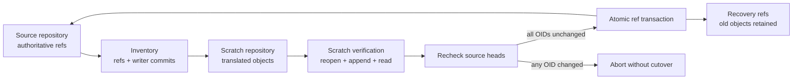

# v19 Public API Migration Guide

> **Status:** The public grammar shipped in `v19.0.0`. The retained-state
> migration described below requires `v19.0.1`; do not use the `v19.0.0`
> migrator on an authoritative repository. General generated-SDK publication
> remains future work.

v19 replaces the transitional storage- and timeline-shaped facade with one
application grammar:

```text
Write intents. Observe lanes. Keep receipts.
```

## Migrate Retained v18 State First

v19 does not read or append to an unmarked v18 retained substrate. Opening a
non-empty lane before migration fails with
`E_SUBSTRATE_MIGRATION_REQUIRED`; it does not write a v19 commit onto the v18
writer chain.

Stop every process that can write to the repository, make a normal repository
backup, and identify the graph name used by the application. Graph names are
not fixed: one Git repository may contain several independent WARP graphs.

Run the migration once:

```bash
npm exec --package=@git-stunts/git-warp@19.0.1 -- git-warp-v18-to-v19 \
  --repo /path/to/repository \
  --graph <graph-name>
```

The command first discovers every graph namespace in the repository. If the
requested name does not exist, it stops with `Graph not found` and lists each
graph it did find, its version posture, writer count, and ref count.

In an interactive terminal, a framed summary asks for confirmation before the
inventory begins. After confirmation, the command completes the migration in
one pass. It reports the current phase, writer, item count, and progress bar.
Use `--yes` for non-interactive automation and `--json` for a machine-readable
final report. Before confirmation, the summary also reports current Git object
storage, the scratch path, free space on the scratch and source Git volumes,
and whether scratch free space meets the operating budget.

### What the command does

The source repository is read-only until the final ref transaction:



At the Git level, migration does not edit commits in place. Git objects are
immutable:

1. It inventories refs below `refs/warp/<graph>/` and walks every writer
   commit from its ref toward its root.
2. It creates new blobs and trees for v19 git-cas asset handles.
3. It writes a new commit chain. Preserved author, committer, timestamp, tree,
   and message bytes can still produce a different commit OID because a
   translated commit names a different parent OID.
4. It builds a bounded v19 checkpoint and substrate marker in the scratch
   repository.
5. It proves that the scratch graph can reopen, accept a disposable append,
   return a bounded public reading, and produce a valid receipt.
6. It fetches the verified scratch objects into private import refs in the
   source repository.
7. One `git update-ref --stdin` transaction compares every original ref with
   its inventoried OID, archives the original refs, and promotes the verified
   refs. If any expected OID moved, the transaction fails as a unit.
8. It verifies the promoted graph. If that proof fails, another guarded ref
   transaction restores the original authoritative refs while retaining
   recovery refs for diagnosis.

Current v18 audit, intent, strand, overlay, braid, and trust publication refs
are carried through unchanged and included in the compare-and-swap inventory.
If one of those refs still targets a retired pre-v18 blob or tree shape, the
command fails before scratch work. Run the older one-shot migration first;
production v19 contains no fallback reader for that substrate.

The old refs and blob-backed state-cache payload roots remain reachable below:

```text
refs/warp/<graph>/recovery/v18-to-v19/<run-id>/
```

Keep those recovery refs until application reads, writes, and backups have
been independently confirmed. They are deliberately additive: migration does
not immediately reclaim old objects.

### Time, memory, and disk

Migration time scales mainly with writer-commit count, retained checkpoint
size, and Git process overhead. The command may look idle while Git is writing
or packing objects; follow the phase and progress display instead of the size
of the source repository alone.

The scratch and disposable verification repositories default to the operating
system's temporary volume. Use `--scratch-root <path>` to place all of them on
a volume with more space.

The preflight operating budget is the greater of:

```text
4 × current Git object-storage bytes

current Git object-storage bytes
  + current object count × scratch-filesystem allocation block size
```

The second term matters because migration writes many small loose objects. A
packed source object may occupy only a few bytes in a pack delta, while its
replacement still consumes at least one filesystem allocation block before
later Git maintenance packs it.

The preflight deliberately counts the complete object database, even when only
one of several graph namespaces is selected: shared and blob-indirected
objects cannot always be attributed reliably to one graph before inventory.
That makes the estimate conservative for multi-graph repositories.

In the 11,708-commit Think rehearsal, the source object database was about
78.5 MiB across 172,644 objects. A naive 2× estimate reported only 157 MiB,
but scratch exceeded 300 MiB while the new objects were loose. The
count-and-allocation formula recommends about 753 MiB on a 4 KiB-block
filesystem.

The budget is an operating minimum, not a mathematical upper bound. Object
reuse, pack layout, retained checkpoint state, and repository-local Git
configuration all affect the result.

The source repository can also grow because recovery refs keep the old graph
reachable while the promoted graph becomes authoritative. Do not expect the
source repository to shrink during migration. A later, separately approved
retention and garbage-collection decision is what can make old objects
collectable.

Production v19 public reads are bounded and do not decode a full graph state.
The one-shot migration has one explicit legacy bridge: it may decode a
monolithic v18 checkpoint, with a 64 MiB encoded-byte ceiling plus depth and
item limits, to seed bounded v19 indexes. Repositories without a usable
checkpoint fall back to replaying the complete writer history.

### Rehearse only when you mean to

The normal command performs the scratch proof and promotion in one invocation.
Use `--dry-run` only when you explicitly want a rehearsal whose result will be
discarded:

```bash
npm exec --package=@git-stunts/git-warp@19.0.1 -- git-warp-v18-to-v19 \
  --repo /path/to/repository \
  --graph <graph-name> \
  --dry-run
```

Because the scratch repository is intentionally deleted, a later normal run
must repeat the work. `--apply` remains accepted as a compatibility alias for
the normal one-pass behavior; it is no longer required.

For an encrypted v18 substrate, provide the passphrase through
`GIT_WARP_MIGRATION_PASSPHRASE`; never place it in command-line arguments or
the migration report.

The command is idempotent. Once the exact v19 substrate marker exists, reruns
verify the current repository and report `already-current`.

## Breaking Boundary

The package root has exactly one runtime value:

```typescript
import { Runtime } from '@git-stunts/git-warp';
```

The following root values are removed:

- `openWarp`
- `intent`
- `reading`

The following transitional root types are also removed:

- `Warp`
- `Timeline`
- `TimelineView`
- `DraftTimeline`
- `ReadingResult`
- `ReadReceipt`
- `JoinResult`
- `JoinReceipt`
- `WarpStorage`

They do not remain beside the v19 vocabulary. Source files supporting the
transition may still exist inside the repository, but package consumers cannot
import them through the package export map.

## Runtime Composition

Before:

```typescript
import { openWarp } from '@git-stunts/git-warp';
import { GitStorage } from '@git-stunts/git-warp/storage';

const storage = await GitStorage.open({ cwd: '.' });
const warp = await openWarp({ storage, writer: 'agent-1' });
const events = await warp.timeline('events');
```

After:

```typescript
import { Runtime } from '@git-stunts/git-warp';

const runtime = await Runtime.open({
  at: '.',
  writer: 'agent-1',
});
const events = await runtime.lane('events');
```

`Runtime.open()` owns production history, artifact, git-cas, and local Git
composition. Application code does not construct those dependencies.

`Runtime.close()` releases local resources only. It does not delete lanes,
rewrite history, revoke receipts, or change retention policy. Closing is
idempotent, waits for already-started local operations to reach their defined
terminal state, and rejects new work.

## Generated Domain SDKs

Generic root builders are gone. Application code should import a
Wesley-generated domain module:

```typescript
import { users } from './generated/users.js';

const assignRole = users.intents.assignRole({
  subject: 'user:alice',
  role: 'admin',
});

const roleOfAlice = users.observers.roleOf({
  subject: 'user:alice',
});
```

Generated builders return validated, runtime-backed `Intent` and `Observer`
objects. Loose JSON envelopes are not accepted at Lane boundaries.

[Wesley](https://github.com/flyingrobots/wesley) is a domain-free GraphQL-to-IR
compiler. The application authors a GraphQL schema whose directives describe
domain operations; Wesley turns that schema into deterministic typed operation
metadata. A git-warp SDK renderer then binds that metadata to runtime-backed
`Intent` and `Observer` builders.

The checked-in `users` example is a reference fixture, not yet a published
general-purpose SDK generator. Its authored source is
`test/fixtures/generated-sdk/users.graphql`. In a git-warp checkout with
Wesley `0.3.0-alpha.1` on `PATH`, reproduce it with:

```bash
npm run generate:sdk-fixture
```

The command is equivalent to these two conceptual stages:

```bash
wesley emit typescript \
  --schema test/fixtures/generated-sdk/users.graphql \
  --out test/fixtures/generated-sdk/users.wesley.generated.ts

node scripts/generated-sdk/RenderUsersSdkFixture.ts \
  --out test/fixtures/generated-sdk/users.generated.ts
```

The second command is deliberately fixture-specific: it validates the exact
`registerUser`, `assignRole`, `roleOf`, and `rolesOf` contract. Consumers
cannot yet point it at an arbitrary domain and receive a supported SDK. Until
general SDK generation is published, use the fixture as an executable contract
for the intended shape, but do not describe it as a consumer CLI.

These are two separate migrations:

- the retained-substrate command rewrites Git objects and refs once; it does
  not modify application source;
- the Wesley and SDK generation path produces TypeScript source; it does not
  open or mutate a retained WARP graph.

The fixture pipeline produces
`test/fixtures/generated-sdk/users.wesley.generated.ts` followed by
`test/fixtures/generated-sdk/users.generated.ts`. The import at the beginning
of this section consumes the second file. The write and observation examples
below then show the complete application-side use of its generated builders.

## Write Migration

Before:

```typescript
const receipt = await timeline.write(
  intent.property.set({
    subject: 'user:alice',
    key: 'role',
    value: 'admin',
  })
);
```

After:

```typescript
const receipt = await events.write(
  users.intents.assignRole({
    subject: 'user:alice',
    role: 'admin',
  })
);
```

Write admission is a closed, witnessed causal classification:

```typescript
switch (receipt.outcome.kind) {
  case 'derived':
    break;
  case 'plural':
    preservePlurality(receipt.outcome.witness);
    break;
  case 'conflict':
    proposeResolution(receipt.outcome.witness);
    break;
  case 'obstruction':
    repairOrStop(receipt.outcome.witness);
    break;
}
```

`derived` and `plural` are both admitted but describe different topology.
`conflict` and `obstruction` are different recovery classes. Runtime failures
remain outside this four-way causal union.

## Observation Migration

Before:

```typescript
const result = await timeline.read(
  reading.property({ subject: 'user:alice', key: 'role' })
);

console.log(result.value);
console.log(result.receipt);
```

After:

```typescript
const observation = events.observe(
  users.observers.roleOf({ subject: 'user:alice' })
);

for await (const reading of observation) {
  console.log(reading.value);
}

const receipt = await observation.receipt;
```

The nouns are deliberately distinct:

- An `Observer` is a reusable executable plan.
- An `Observation` is one bounded execution against one Lane.
- A `Reading` is one emitted semantic value.
- A `Receipt` is the terminal operational record.

`Lane.observe()` is synchronous and returns a dormant Observation. Execution
starts on the first iterator advance, lawful convenience consumption, or
receipt demand. These paths share one execution.

Receipt-first demand drains Reading values with backpressure and discards them.
It does not collect the stream. A later Reading consumer is rejected because
each Observation has exactly one delivery owner.

`observation.one()` means exactly one Reading. It is not an alias for the first
available item. An unresolved bounded basis therefore leaves an obstructed
receipt and causes `one()` to report cardinality failure.

## Reading Shape

`Reading.value` is canonical. `payload` is reserved for encoded transport
envelopes.

```typescript
for await (const reading of observation) {
  consume(reading.value);
  audit(reading.coordinate, reading.support, reading.witnessRefs);
}
```

Operational result and epistemic support remain separate. An admitted write
does not automatically prove an observed claim, and a supported claim does not
change an admission conflict into a derived result.

## Admission And Settlement

Admission classifies how a proposed history meets a destination history:

```text
derived | plural | conflict | obstruction
```

Settlement is a later cross-lane operation. It is not another spelling of
admission and it does not automatically linearize lawful plurality.

The final v19 settlement contract is:

```typescript
const preview = await runtime.previewSettlement({
  source: draft,
  target: events,
});

inspect(preview);
const receipt = await runtime.settle(preview.plan);
```

The preview is non-authoritative. Its immutable plan is bound to exact source
and target frontiers, proposal, law, and policy. `settle()` revalidates those
bindings and must obstruct or reclassify a stale plan.

This settlement surface is still open implementation work. Do not ship code
that calls it until the corresponding v19 source and conformance evidence has
landed.

## Expert Subpaths

The intended v19 expert surfaces are:

```text
@git-stunts/git-warp/advanced
@git-stunts/git-warp/charts
@git-stunts/git-warp/diagnostics
@git-stunts/git-warp/testing
```

`/charts` provides graph-shaped derived observations. It does not describe the
durable ontology as a graph. Its first shipped Observer is a one-hop, bounded,
cursor-page neighborhood chart. `/testing` provides an isolated real-Git
`Runtime` harness without exposing storage construction at package root.

There is no public `/graph`, `/browser`, `/legacy`, or `/storage` package.
Production storage composition belongs to `Runtime.open()`; tests use the
explicit `/testing` harness.

## Symbol Map

| Before                         | v19 replacement                         |
| ------------------------------ | --------------------------------------- |
| `openWarp(options)`            | `Runtime.open({ at, writer })`          |
| `warp.timeline(name)`          | `runtime.lane(name)`                    |
| `timeline.write(intent.*)`     | `lane.write(generated.intents.*)`       |
| `timeline.read(reading.*)`     | `lane.observe(generated.observers.*)`   |
| `ReadingResult.value`          | streamed `Reading.value`                |
| `ReadingResult.receipt`        | `await Observation.receipt`             |
| `timeline.draft(name)`         | `runtime.fork(lane, { name })`          |
| `timeline.previewJoin(draft)`  | `runtime.previewSettlement(...)`        |
| `timeline.join(draft)`         | `runtime.settle(preview.plan)`           |
| `GitStorage.open({ cwd })`     | internal to `Runtime.open({ at })`       |
| `storage.close()`              | `runtime.close()`                        |
| `accepted` write status        | `derived` or `plural` admission          |
| `conflicted` write status      | `conflict` admission with witness        |
| `obstructed`/`rejected` write  | `obstruction` admission with reason      |
| root graph/query builders      | generated SDK or `/charts` observer      |

## Upgrade Sequence

1. Replace storage construction and `openWarp()` with `Runtime.open()`.
2. Rename application timeline variables and types to Lane.
3. Generate domain intent and observer builders with Wesley.
4. Replace generic root intent builders with generated intents.
5. Replace eager `read()` calls with streaming `observe()` consumption.
6. Move receipt handling from each Reading to the Observation terminal path.
7. Match all four admission variants exhaustively.
8. Keep existing cross-lane join code isolated until settlement plans land.
9. Replace graph-shaped reads with bounded `/charts` observers.
10. Verify that no import from the removed `/storage` subpath remains.

## Validation

Run the package and declaration gates before treating a migration as complete:

```bash
npm run typecheck
npm run typecheck:consumer
npm run typecheck:surface
npm run test:local
```

The source-backed root tests reject competing factories, transitional root
nouns, star exports, and substrate vocabulary in the generated declaration
closure.

## Related Reading

- [v19 public vocabulary checkpoint](../../topics/api/README.md)
- [Optic reads](../../topics/optic-reads.md)
- [Public API reference](../../topics/reference.md)
