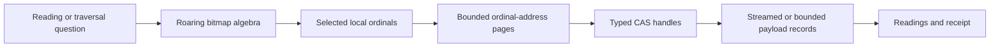
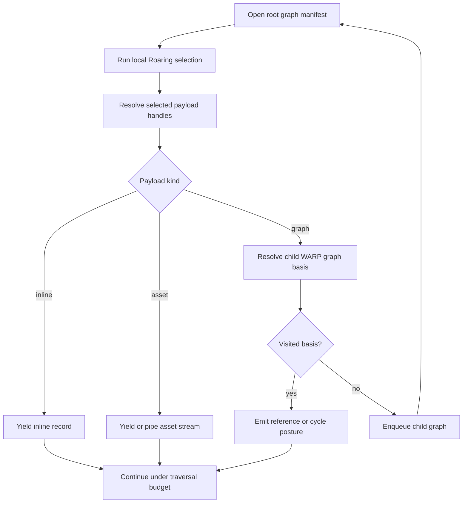

# Streaming, Indexed, Recursive WARP

Status: proposed

Target: v20.0.0

Priority: release-defining

Decision owner: git-warp maintainers

Incident date: 2026-07-27

Parent tracker:
[GitHub Issue #824](https://github.com/git-stunts/git-warp/issues/824)

Design review:
[GitHub Pull Request #813](https://github.com/git-stunts/git-warp/pull/813)

## Decision

git-warp will not require a process-resident, complete graph state for any
runtime, storage, checkpoint, migration, comparison, proof, export, diagnostic,
or attachment operation.

This prohibition includes:

- serializing or decoding a monolithic full-state document;
- returning a complete `WarpState` from a storage port;
- retaining a complete graph as one logical CAS asset;
- hashing state by first constructing a complete visible projection;
- buffering an arbitrary attachment before returning it;
- rebuilding a complete graph as the hidden implementation of a bounded read;
- hiding a whole-state operation behind names such as snapshot, replay basis,
  materialization, compatibility, or verification.

An operation may inspect the entire graph when its semantics require a global
scan, but it must do so as a bounded stream with an explicit external-memory
workspace. The amount of process memory must be governed by declared page,
shard, queue, and concurrency budgets rather than total graph or attachment
size.

Roaring bitmap indexes become the primary selection plane. Their integer
ordinals resolve through bounded address pages to immutable CAS payloads.
Payloads may contain ordinary graph records, byte assets, or typed references
to other WARP graphs.

Graph-valued attachments make WARP recursively traversable. Recursive traversal
opens each referenced graph lazily, uses that graph's local indexes, detects
cycles, observes explicit limits, and records every resolved graph basis in its
receipt.

## Release Decision

This work takes priority over the existing v19.0.1 migration UX and
documentation roadmap.

The published v19.0.0 migration can translate small retained substrates, but a
real Think repository proved that it can still construct a monolithic replay
basis that the ordinary runtime cannot decode. Shipping better progress bars
or a one-pass prompt without removing that storage path would make the failure
easier to watch, not make the migration safe.

The recommended release posture is:

1. Freeze publication of v19.0.1 while this plan is implemented.
2. Keep the graph-discovery, confirmation, progress, recovery, and migration
   documentation work; rebase is prohibited, so integrate it later with an
   ordinary merge.
3. Make v20.0.0 the next functional release. The existing v20.0.0 milestone
   already names streaming materialization, traversal/index paydown, and
   bounded scalability as its thesis.
4. Do not advertise the v18-to-v19 migrator as suitable for retained graphs
   that require the monolithic replay-basis path.
5. Ship only after a generated oversized fixture and a disposable copy of the
   real Think repository both migrate, reopen, append, read, traverse, and
   verify without a full-state codec or whole-attachment buffer.

An emergency v19.0.1 circuit-breaker that fails before expensive work remains
possible if operators need immediate protection from the published command.
It would be a safety notice, not completion of the migration promise, and is
not the preferred next functional release.

## Incident That Changed the Roadmap

The published v19.0.0 command was run against the real Think graph:

```text
git-warp-v18-to-v19 --repo ~/.think/codex --graph think --apply
```

After approximately 36 minutes, it completed inventory and rewrite for one
11,500-commit writer and one 208-commit writer, built and verified a scratch
repository, promoted the prepared refs, and then failed while verifying the
promoted repository:

```text
CBOR decode rejected: encoded byte length 23995927 exceeds 5242880
```

The command rolled the authoritative refs back and retained additive recovery
refs. Read-only inspection confirmed that the active writer, checkpoint, and
state-cache refs matched the recovery snapshot after rollback.

The failure is not that the Git repository exceeded 5 MiB. A single logical
v19 replay-basis value reached 23,995,927 encoded bytes. git-cas physically
streams and chunks the asset, but git-warp calls `collectAsyncIterable()` and
reassembles all chunks before invoking a synchronous full-state decoder.

The 5 MiB production CBOR limit exposed the eager-state architecture. Raising
the limit would postpone the next failure and weaken a useful defensive
boundary.

## Previous Decisions and Why This Plan Exists

This is corrective completion, not a wholly new direction.

- #626 decided that ordinary reads should use holographic slices and that
  checkpoint bases should be streamed.
- #628 required a materialization boundary guard.
- #629 defined a checkpoint basis manifest.
- #630 required a builder that accepts fact streams and never accepts a full
  `WarpState`.
- #631 required patch-to-fact streaming.
- #632 through #634 required node, property, neighborhood, and traversal reads
  to be bounded.
- #734 made git-cas the sole CAS and cache owner.
- #737 required streaming content round trips without full buffering.
- #738 stated that the default runtime must not require a complete `WarpState`
  or visible graph in memory.
- #739 required checkpoints and live materializations to share one immutable,
  paged representation.
- #742 required CI to prevent unbounded materialization from returning.
- #758 and #760 required an oversized graph to be observed under a heap cap.

Those issues were valuable, but their acceptance surfaces were narrower than
the runtime as a whole. Bounded observation paths landed while compatibility,
checkpoint, BTR, comparison, migration, and retained resume paths continued to
exchange complete `WarpState` values.

The new plan changes the invariant from:

> Ordinary application reads do not require full materialization.

to:

> No git-warp production operation requires full materialization.

## Current Truth

All source anchors in this section refer to commit
`2fc5b7d589e6d80f065b0c7606ecd381323a4b0c`.

### Whole-state contracts remain in production

`MaterializationStorePort` returns a complete `WarpState` from
`loadReplayBasis()`:
[src/ports/MaterializationStorePort.ts#L38](https://github.com/git-stunts/git-warp/blob/2fc5b7d589e6d80f065b0c7606ecd381323a4b0c/src/ports/MaterializationStorePort.ts#L38).

`PromoteMaterializationRequest` accepts `replayBasis?: WarpState`:
[src/ports/MaterializationWorkspacePort.ts#L16](https://github.com/git-stunts/git-warp/blob/2fc5b7d589e6d80f065b0c7606ecd381323a4b0c/src/ports/MaterializationWorkspacePort.ts#L16).

`GitCasMaterializationReplayBasis` encodes a complete state into one logical
`state.cbor` asset and later collects the entire asset before decoding it:
[src/infrastructure/adapters/GitCasMaterializationReplayBasis.ts#L50](https://github.com/git-stunts/git-warp/blob/2fc5b7d589e6d80f065b0c7606ecd381323a4b0c/src/infrastructure/adapters/GitCasMaterializationReplayBasis.ts#L50)
and
[src/infrastructure/adapters/GitCasMaterializationReplayBasis.ts#L84](https://github.com/git-stunts/git-warp/blob/2fc5b7d589e6d80f065b0c7606ecd381323a4b0c/src/infrastructure/adapters/GitCasMaterializationReplayBasis.ts#L84).

`WarpStateCborCodec` exposes `encodeWarpFullState()`,
`decodeWarpFullState()`, and `decodeCanonicalWarpFullState()`:
[src/infrastructure/codecs/WarpStateCborCodec.ts#L35](https://github.com/git-stunts/git-warp/blob/2fc5b7d589e6d80f065b0c7606ecd381323a4b0c/src/infrastructure/codecs/WarpStateCborCodec.ts#L35).

The only production caller of that codec is the replay-basis adapter. Deleting
the adapter and changing the materialization port makes the codec removable
rather than merely configurable.

### State identity also materializes the graph

`projectState()` builds complete sorted node, edge, and property arrays before
`computeStateHash()` serializes and hashes them:
[src/domain/services/state/StateSerializer.ts#L64](https://github.com/git-stunts/git-warp/blob/2fc5b7d589e6d80f065b0c7606ecd381323a4b0c/src/domain/services/state/StateSerializer.ts#L64)
and
[src/domain/services/state/StateSerializer.ts#L108](https://github.com/git-stunts/git-warp/blob/2fc5b7d589e6d80f065b0c7606ecd381323a4b0c/src/domain/services/state/StateSerializer.ts#L108).

BTR creation and verification serialize and deserialize complete states:
[src/application/provenance/BtrOperations.ts#L99](https://github.com/git-stunts/git-warp/blob/2fc5b7d589e6d80f065b0c7606ecd381323a4b0c/src/application/provenance/BtrOperations.ts#L99)
and
[src/application/provenance/BtrOperations.ts#L185](https://github.com/git-stunts/git-warp/blob/2fc5b7d589e6d80f065b0c7606ecd381323a4b0c/src/application/provenance/BtrOperations.ts#L185).

These paths require root-based commitments and streamed proof inputs, not a
second whole-state codec.

### Retained roots already name most of the right concepts

`MaterializationRoots` already names adjacency, node and edge liveness, edge
births, frontier, properties, provenance, replay basis, and Roaring indexes:
[src/domain/materialization/MaterializationRoots.ts#L4](https://github.com/git-stunts/git-warp/blob/2fc5b7d589e6d80f065b0c7606ecd381323a4b0c/src/domain/materialization/MaterializationRoots.ts#L4).

However, the current index-root assembly retains only property and Roaring
roots while explicitly marking adjacency, liveness, edge births, frontier, and
replay basis unavailable:
[src/domain/services/controllers/MaterializationIndexRoots.ts#L53](https://github.com/git-stunts/git-warp/blob/2fc5b7d589e6d80f065b0c7606ecd381323a4b0c/src/domain/services/controllers/MaterializationIndexRoots.ts#L53).

The whole-state replay basis compensates for roots that are not yet retained.
The plan removes that compensation by making the independently addressable
roots complete.

### Roaring already provides a useful ordinal geometry

`LogicalBitmapIndexBuilder` assigns stable 32-bit global node IDs, stores
node-to-ID metadata, tracks alive-node bitmaps, and builds forward and reverse
adjacency bitmaps:
[src/domain/services/index/LogicalBitmapIndexBuilder.ts#L49](https://github.com/git-stunts/git-warp/blob/2fc5b7d589e6d80f065b0c7606ecd381323a4b0c/src/domain/services/index/LogicalBitmapIndexBuilder.ts#L49).

Its current builders retain graph-wide maps in memory and emit all shards after
construction. They do not map ordinals to CAS addresses for node, edge,
property, attachment, or causal records.

`IndexStorePort` already supports streamed shard scans, resolving one member,
opening one member as an async byte stream, and bounded single-shard decoding:
[src/ports/IndexStorePort.ts#L80](https://github.com/git-stunts/git-warp/blob/2fc5b7d589e6d80f065b0c7606ecd381323a4b0c/src/ports/IndexStorePort.ts#L80).

The required storage primitives therefore mostly exist; the retained-state
model must use them consistently.

### Attachments still have eager and untyped escape hatches

`QueryContent` projects attachment metadata from a complete `WarpState`.
`getContentImpl()` and `getEdgeContentImpl()` collect the entire asset into a
`Uint8Array`, while parallel stream methods expose the correct primitive:
[src/domain/services/controllers/QueryContent.ts#L49](https://github.com/git-stunts/git-warp/blob/2fc5b7d589e6d80f065b0c7606ecd381323a4b0c/src/domain/services/controllers/QueryContent.ts#L49)
and
[src/domain/services/controllers/QueryContent.ts#L87](https://github.com/git-stunts/git-warp/blob/2fc5b7d589e6d80f065b0c7606ecd381323a4b0c/src/domain/services/controllers/QueryContent.ts#L87).

Generic `AttachmentRecord` values are ordinary `PropValue` values:
[src/domain/graph/AttachmentRecord.ts#L9](https://github.com/git-stunts/git-warp/blob/2fc5b7d589e6d80f065b0c7606ecd381323a4b0c/src/domain/graph/AttachmentRecord.ts#L9).

`PropValue` permits arbitrary `Uint8Array` values and recursively nested plain
objects without a typed graph-reference noun:
[src/domain/types/PropValue.ts#L6](https://github.com/git-stunts/git-warp/blob/2fc5b7d589e6d80f065b0c7606ecd381323a4b0c/src/domain/types/PropValue.ts#L6).

Large bytes can therefore bypass the content-attachment model, and nested WARP
graphs cannot be distinguished from an arbitrary structured property.

### Documentation acknowledges the remaining gap

The CAS-first materialization topic says full state-cache hits still hydrate a
complete `WarpState`, complete descriptors retain a full-state replay basis,
and several operations remain process-resident:
[docs/topics/cas-first-memoized-materialization.md#L120](https://github.com/git-stunts/git-warp/blob/2fc5b7d589e6d80f065b0c7606ecd381323a4b0c/docs/topics/cas-first-memoized-materialization.md#L120)
and
[docs/topics/cas-first-memoized-materialization.md#L214](https://github.com/git-stunts/git-warp/blob/2fc5b7d589e6d80f065b0c7606ecd381323a4b0c/docs/topics/cas-first-memoized-materialization.md#L214).

## Feasibility Position

The plan assumes that every production operation can avoid complete
process-resident state. That assumption is strong but technically credible.

Operations fall into three classes:

1. **Targeted operations** touch a bounded set of logical records. Patch
   application, node/property reads, and neighborhood expansion use indexes and
   address pages to load only those records.
2. **Streaming global operations** inspect every record but do not require
   random access to all records at once. Export, migration, canonical scans, and
   many comparisons use ordered streams and merge joins.
3. **Global algorithms with mutable working state** need random access or a
   large visited/work map. They use an operation-scoped git-cas workspace,
   paged tries, Roaring bitmaps, external sorting, or disk-backed queues.

The third class means "use streams" cannot mean "one stateless pass is always
enough." It means that the algorithm's working state is explicitly bounded and
spillable rather than proportional to the entire graph in the JavaScript heap.

Phase zero must prove this with representative patch, checkpoint, comparison,
BTR, export, and recursive traversal prototypes. If a true counterexample is
found, the plan must name the irreducible working set and provide an
external-memory implementation. Falling back to `WarpState` is not an accepted
resolution.

## Target Architecture

### Retained graph manifest

A retained graph view is a small immutable manifest containing typed roots:

```text
RetainedGraphManifest
├── coordinate and frontier
├── ordinal geometry
│   ├── node identifier dictionary
│   ├── edge identifier dictionary
│   ├── property coordinate dictionary
│   └── attachment coordinate dictionary
├── ordinal address tables
│   ├── node records
│   ├── edge records
│   ├── property CRDT records
│   ├── attachment records
│   └── graph-reference records
├── Roaring selection roots
│   ├── live nodes
│   ├── live edges
│   ├── forward adjacency
│   ├── reverse adjacency
│   ├── labels
│   ├── property presence
│   └── application-defined indexes
├── causal roots
│   ├── OR-set observations
│   ├── LWW event identities
│   ├── edge births
│   └── writer frontier
├── provenance and support roots
├── recursive graph-reference root
└── Merkle commitment
```

Every root is a typed opaque git-cas handle. No manifest member contains a
complete graph projection.

### Ordinal geometry

Roaring stores 32-bit integer sets, not CAS hashes. A retained materialization
therefore owns an ordinal namespace and bounded address pages.

The existing high-byte shard and low-24-bit local ordinal geometry is a viable
starting point. The exact geometry must be versioned and validated.

Required invariants:

- An ordinal is meaningful only with its retained manifest.
- Identifier-to-ordinal and ordinal-to-identifier mappings are deterministic.
- Existing ordinals remain stable across an incremental successor when
  practical.
- Rebuilds from the same causal basis produce byte-identical dictionaries.
- Address pages map ordinals to typed CAS handles without opening payloads.
- Missing, duplicated, out-of-range, or wrong-kind entries fail closed.
- Page size is governed by encoded bytes and item counts.
- A graph exceeding one page, one bundle, or one bitmap container continues by
  adding pages rather than widening global decoder limits.

### Why CAS addresses do not live directly in Roaring

Roaring Bitmap 32 stores unsigned 32-bit integers. A 64-bit Roaring variant
would enlarge the ordinal space, but it would not hold a complete
collision-resistant CAS address. Git object and content hashes are commonly
160 or 256 bits before handle-kind, codec, and schema information is included.

Truncating a CAS hash to 64 bits would require collision verification against a
full-handle table, which restores the same indirection with weaker first-stage
identity. Splitting one hash across several bitmap integers loses tuple
boundaries and makes bitmap union, intersection, and difference semantically
incorrect for handles.

Cryptographic hashes are also deliberately uniform. A hypothetical
wide-integer Roaring structure would see little run or container locality and
would behave more like a sorted fixed-width hash set or radix trie. Those
structures may be appropriate for CAS-handle membership, but they do not
replace Roaring's compact set algebra over logical graph identities.

The indirection is valuable independently of integer width:

```text
stable logical ordinal -> current immutable CAS payload
```

A property or attachment update changes its payload handle. With a stable
ordinal, only the corresponding address page and semantically affected indexes
change. If indexes contained payload hashes, a record update could force every
adjacency, label, liveness, or application index that refers to the logical
entity to replace the old content identity.

The 32-bit namespace permits 4,294,967,296 ordinals per retained geometry. If a
single materialization approaches that ceiling, extend the manifest with
segmented ordinal namespaces or a 64-bit `(segment, local ordinal)` coordinate.
Do not turn content hashes into logical entity identities.

### Selection and resolution

The ordinary read path is:



Roaring answers set questions: liveness, adjacency, label membership,
intersection, union, and exclusion. Address tables answer identity and payload
location. CAS payload records answer values and causal metadata.

Roaring is not asked to encode:

- a CAS address;
- an arbitrary property value;
- an LWW event identity;
- an OR-set observation set;
- a writer frontier;
- a graph capability;
- attachment bytes.

### Streaming state construction

Patch history is lowered into ordered state-record mutations. A builder applies
those mutations to an operation-scoped retained workspace:

1. Resolve only the dictionary, address, bitmap, and causal pages touched by
   the patch.
2. Decode each bounded page or record independently.
3. Apply the CRDT transition.
4. Write immutable successor payloads.
5. Structurally update affected address and index pages.
6. Produce successor roots and a new commitment.
7. Promote roots atomically after causal and storage verification.

Cold construction may scan the complete history, but patch decoding,
reduction, external sorting, shard flushing, and root promotion remain
streaming and bounded.

### State identity and proofs

`computeStateHash(WarpState)` is replaced with a domain commitment over retained
roots.

The commitment must:

- include graph semantics, coordinate, frontier, schema, ordinal geometry, and
  every authoritative retained root;
- exclude cache residency, physical repository paths, lease IDs, and host
  timing;
- use deterministic root ordering;
- support incremental recomputation when a bounded set of roots changes;
- permit a streamed canonical equivalence proof against legacy state during
  migration;
- let BTR and comparison operations bind input and output roots without
  embedding full states.

When semantic equivalence requires comparing two differently sharded
representations, use canonical record streams and a bounded merge join. Do not
serialize either graph into a single comparison buffer.

### Stream-first payload API

Asset bodies are streams by default:

```text
CAS chunks -> AsyncIterable<Uint8Array> -> consumer
```

Rules:

- Public and internal attachment APIs return handles, metadata, or byte
  streams.
- No general attachment method returns an eager `Uint8Array`.
- A convenience collector, if retained outside the core API, requires an
  explicit maximum and reports overflow before exceeding it.
- Structured payloads are decoded one bounded record or page at a time.
- Large binary `PropValue` values are rejected at admission and must use an
  asset attachment.
- Unknown declared lengths, size mismatches, truncated streams, and excess
  bytes fail closed.
- Backpressure and cancellation propagate through every adapter.
- Encryption frames remain independently bounded and streamable.

The source audit must classify every `collectAsyncIterable()` call. Unbounded
collection at an asset, attachment, retained-state, migration, proof, or
storage boundary is forbidden.

## Recursive WARP Graphs

### Typed graph attachments

A graph attachment is not a byte asset that happens to contain a repository.
It is a runtime-backed reference to a WARP graph basis.

Conceptually:

```text
AttachmentValue
├── inline bounded value
├── asset reference
└── WARP graph reference
```

A graph reference must name:

- graph identity;
- repository or resolver authority;
- immutable retained root or an explicitly live locator;
- coordinate/frontier posture;
- expected handle kind and schema;
- capability/trust requirements;
- retention posture.

The concrete model must use validated domain classes rather than plain
`PropValue` records.

### Pinned and live references

A pinned graph attachment names an immutable retained root and is deterministic.
It can participate directly in commitments and receipts.

A live graph attachment names a moving graph locator. A reading resolves that
locator once per execution, pins the observed root, and records the resolution
in its receipt. One traversal must not observe the same live locator at
different roots unless the API explicitly requests a new execution.

A continuation is part of the same execution. Its cursor is bound to the root
manifest, every resolved live-locator root, the visited-basis set, the pending
work root, and the result-order position recorded by the preceding receipt.
Resuming never resolves a live locator again. If a caller wants current live
roots, it starts a new reading with a new receipt.

### Recursive traversal

Recursive traversal uses an explicit async work queue rather than JavaScript
call-stack recursion:



Each graph keeps its own ordinal namespace. The traversal never treats an
ordinal from one graph as meaningful in another.

The ready queue has declared item and encoded-byte capacities. Enqueuing a child
applies admission backpressure when either capacity is reached. Fan-out that
does not fit in the ready queue is appended, in traversal order, to a bounded-
buffer external work log in the operation workspace; the scheduler refills the
ready queue from that log as capacity becomes available. The spill writer,
worker pool, and result sink all participate in the same cancellation and
backpressure chain.

No producer may accumulate rejected or not-yet-admitted children in a
JavaScript array. A child is admitted to the ready queue, durably appended to
the external work log, or the traversal stops with a typed obstruction. Queue
capacity, spill bytes, spill root, and the next dequeue position are part of the
budget and receipt.

### Cycles, sharing, and identity

The default visited identity is:

```text
graph identity + retained root + coordinate
```

The traversal expands each retained graph basis at most once by default.
Repeated attachment paths may still be yielded as reference occurrences.

Cycle posture must distinguish:

- first expansion;
- repeated shared reference;
- direct or indirect cycle;
- depth limit;
- graph-count limit;
- unresolved live locator;
- unavailable capability;
- redacted child graph.

Callers may request occurrence-sensitive traversal only with explicit depth and
work budgets.

### Recursive receipts

A recursive receipt records:

- root reading identity;
- every graph identity and retained basis opened;
- live-locator resolutions;
- index and address roots touched;
- attachment and graph-reference paths followed;
- cycle and sharing posture;
- depth, graph, node, edge, byte, time, and concurrency budgets;
- pending frontier or continuation cursor;
- completeness, redaction, and obstruction posture.

Before issuing a continuation, the scheduler stops admission and normalizes all
remaining work into one new immutable continuation log. It writes the bounded
ready queue first in exact dequeue order, then streams the unread suffix of the
existing external work log without collecting that suffix. After the new root
is flushed, no admitted work remains represented only in process memory.

The continuation cursor names immutable operation-workspace roots for the
visited-basis set and normalized continuation log, the log's exact next-read
and committed-end offsets, the pinned graph-root table, and the next result
sequence. Resume reconstructs its ready queue only from that closed log
interval. Cursor validation fails closed if either offset is outside the named
root, if the interval does not match the preceding receipt, or if any root,
ordering position, budget posture, or receipt commitment disagrees. This makes
resumption stable without dropped, replayed, or reordered work even when a
referenced live locator advances between calls.

### Retention and garbage collection

Graph references affect reachability.

- A pinned child handle must remain reachable through an owned git-cas
  retention witness or an explicit external-retention contract.
- Live locators retain no historical root merely by being named; the resolver
  and reading execution own the observed lease.
- Recursive retention walks graph-reference manifests with cycle detection and
  bounded work.
- GC and doctor output distinguish retained, externally retained, missing,
  expired, redacted, and dangling graph references.
- Cross-repository references never make one repository silently mutate or
  retain another repository.

## Global Operations Without Full State

### Checkpoint

Checkpoint publication pins the retained graph manifest and causal coordinate.
It does not copy a second state representation.

### Export

Export performs a deterministic ordered scan of identifier dictionaries and
address pages, opens payloads under bounded concurrency, and writes to a
streaming sink. Every scan item receives a monotonic sequence number. A bounded
worker pool may prefetch bounded records, but completions enter a reorder buffer
capped by worker count and encoded bytes. A single writer emits only the next
sequence and stops admitting work when the reorder buffer is full.

Unbounded attachment bodies are never prefetched into that buffer. The writer
opens and pipes an attachment stream only when its sequence reaches the head,
then resumes bounded record prefetch after downstream backpressure permits it.
Concurrency therefore cannot change export order or turn a slow early payload
into an unbounded collection of later results.

### Comparison

Comparison uses bitmap/root equality for fast paths and canonical record-stream
merge joins for semantic comparison.

### BTR and provenance

BTR operations bind root commitments, patch/fact streams, and proof witnesses.
They do not embed initial or final full-state CBOR.

### Diagnostics and doctor

Diagnostics inspect manifests, roots, handles, pages, reachability, and sampled
or streamed records. A human-friendly summary does not imply the graph was
loaded into memory.

### Algorithms requiring global mutable work

Topological ordering, connected components, global path analysis, and similar
jobs use operation-scoped external workspaces:

- Roaring visited and frontier sets;
- paged degree or score tables;
- disk/CAS-backed queues;
- external sorting;
- bounded worker pools.

Their APIs expose progress, cancellation, resource budgets, and streamed
results. They never silently switch to a heap-resident graph.

## Migration Design

Legacy compatibility remains under `scripts/`, never under `src/`.

### Manifest schema transition

The v20 `RetainedGraphManifest` uses a new schema version whose root set omits
`replayBasis`; it is neither optional nor represented by an unavailable
sentinel. Manifest construction requires the dictionary, address, Roaring,
causal, attachment, graph-reference, and commitment roots. No v20 builder,
checkpoint, or resume path accepts a complete state object or emits a
`replayBasis` root.

A v19 materialization descriptor containing
`MaterializationRoots.replayBasis` is classified as legacy substrate.
Production v20 fails with `legacy-substrate-required` before opening it.
`GitCasMaterializationReplayBasis.loadRoot` and its full-state codec are removed
from `src/`; the version-pinned reader needed to interpret an existing v19
checkpoint lives only under `scripts/v19-to-v20/`. Migration streams that
legacy asset into the incremental reader, or streams authoritative writer
history when no usable checkpoint exists, and constructs only v20 indexed
roots. Existing v19 checkpoints remain valid recovery inputs behind recovery
refs, but no promoted v20 manifest names them.

### Source routes

The primary retained-substrate migrator lives under `scripts/v19-to-v20/` and
accepts the documented authoritative v19 descriptor, checkpoint, patch, and
writer-ref shapes. The Think-sized 23,995,927-byte replay basis is a v19 input
fixture for this boundary.

An authoritative v18 repository takes an explicit two-stage route:

1. the released `scripts/v18-to-v19/` migrator produces and verifies canonical
   v19.0.1 substrate;
2. `scripts/v19-to-v20/` inventories that exact result and produces v20 indexed
   roots.

The combined migration command may orchestrate both stages in one maintenance
window, but each stage keeps its own versioned grammar, canonical validation,
source-coordinate diagnostics, ref inventory, scratch proof, and
compare-and-swap boundary. Tests cover direct v19 input and the complete
v18-to-v19.0.1-to-v20 chain; neither grammar guesses shapes owned by the other.

The v19-to-v20 retained-substrate migrator will:

1. Discover and classify graph namespaces.
2. Preflight repository, Git executable, free space, source refs, legacy
   artifact sizes, and execution budgets.
3. Ask for confirmation before expensive work.
4. Stream v19 checkpoint components and writer patches through a
   migration-only incremental CBOR event reader.
5. Lower decoded values into canonical state-record streams.
6. Build dictionaries, address pages, Roaring roots, causal roots, attachment
   roots, and graph-reference roots directly.
7. Produce a retained manifest and commitment without constructing
   `WarpState`.
8. Verify bounded reopen, append, property reads, attachment streaming,
   neighborhood traversal, recursive traversal, receipts, and semantic
   equivalence in scratch.
9. Refresh the source plan and compare every authoritative ref.
10. Promote through compare-and-swap, retain recovery refs, and repeat the
    runtime verification against the promoted repository.

The legacy event reader consumes `AsyncIterable<Uint8Array>` input and emits
container, key, scalar, and byte-range events without constructing the top-level
map or arrays. Its parser stack, token buffer, text/key length, and scalar
allocation all have explicit limits. Completed node, edge, property, attachment,
and causal records are written immediately to bounded record spools and released
before the next record. Oversized byte strings are copied directly to asset
streams; oversized structured legacy values are kept as external byte ranges
and converted by a second bounded pass rather than assembled as JavaScript
objects.

This is not ordinary runtime compatibility. The incremental v19 grammar and
its semantic lowering live under `scripts/v19-to-v20/`, accept only the
documented v19 shapes, verify canonical lengths and nesting while consuming
them, and fail with a source-coordinate diagnostic on unknown input. The
ordinary v20 runtime only opens the indexed roots produced by that script.

The migration must not:

- create a full-state replay basis;
- call a production full-state codec;
- collect a legacy attachment into memory;
- require a Think-sized fixture in Git;
- discard a successful normal run and require the user to repeat it;
- mutate any graph other than the selected namespace.

Existing v19.0.0 materialization cache entries are derived state. The current
runtime may ignore and rebuild them from authoritative history when the new
manifest key/schema is absent. Any authoritative v19 graph-format difference
requires an explicit script-owned migration rather than a production
compatibility branch.

## Failure Contract

Expected typed obstructions include:

| Obstruction | Meaning | Recovery |
| --- | --- | --- |
| `retained-root-unavailable` | A retained root required by the manifest is absent | Rebuild or migrate |
| `ordinal-address-missing` | Selected ordinal has no address | Repair or rebuild |
| `ordinal-address-kind-mismatch` | Address resolves to the wrong handle kind | Repair or rebuild |
| `page-budget-exceeded` | One structured page violates its contract | Re-shard or migrate |
| `inline-payload-too-large` | Bytes were written as an inline value | Store as an asset |
| `graph-reference-unresolved` | Child graph resolver cannot pin a basis | Configure resolver |
| `graph-reference-cycle` | Traversal reached an expanded basis again | Continue without expansion |
| `recursive-budget-exceeded` | Depth, graph, result, byte, or time limit ended work | Continue with cursor |
| `attachment-size-mismatch` | Streamed bytes disagree with metadata | Repair asset |
| `requires-external-workspace` | Global algorithm lacks a configured spill workspace | Configure workspace |
| `legacy-substrate-required` | Authoritative retained data needs script migration | Run migrator |

No obstruction recommends increasing a global decoder ceiling as its normal
recovery.

## Proof and Enforcement

### Source ratchets

Production source must contain none of:

- `decodeCanonicalWarpFullState`;
- `decodeWarpFullState`;
- `encodeWarpFullState`;
- `serializeFullState`;
- `deserializeFullState`;
- `loadReplayBasis`;
- a materialization request carrying `WarpState`;
- an unbounded asset-to-`Uint8Array` collector;
- a public content method returning the complete attachment bytes.

Any remaining `WarpState` use must be removed from production or proven to be a
bounded, operation-local record reducer whose memory does not scale with graph
size. The preferred end state is that `WarpState` survives only in migration
fixtures or is deleted entirely.

### Behavioral proofs

Required tests:

- A graph whose logical state is several times larger than the Node heap cap
  migrates, reopens, appends, and answers bounded readings.
- A retained graph whose encoded logical state exceeds 5 MiB never sends a
  value larger than the configured page/shard limit to the CBOR decoder.
- A deterministic generator emits the same oversized legacy replay-basis shape
  and exact 23,995,927-byte encoded length observed in the Think failure; the
  migration-only event reader converts it under the heap cap without one
  23,995,927-byte allocation or synchronous full-value decode.
- A multi-gigabyte, generated attachment streams through a byte-counting sink
  under a small heap cap without constructing the bytes in the test process.
- A deliberately eager attachment control fails under the same heap cap.
- A large graph checkpoint builds through repeated bounded flushes and never
  accepts `WarpState`.
- Incremental patch application opens only touched dictionary, address, index,
  and causal pages.
- State commitment is stable across rebuilds and changes only when semantic
  state or coordinate posture changes.
- Semantic comparison succeeds across different valid shard geometries.
- Recursive traversal covers a graph-valued attachment, shared child, direct
  cycle, indirect cycle, live locator, missing capability, and redacted child.
- Recursive traversal honors slow-consumer backpressure and every declared
  budget.
- Recursive traversal permits ready-queue item and encoded-byte usage to reach,
  but never exceed, their configured capacities; it spills excess fan-out and
  resumes from the spill root without duplicate, skipped, or reordered results.
- A continuation normalizes its complete ready queue and unread spill suffix
  into one immutable log, persists exact read/end offsets, and preserves its
  pinned live-locator roots, visited set, and ordering position when the
  underlying live locator advances.
- Concurrent export emits byte-identical deterministic order when payloads
  finish in adversarial order and never exceeds its reorder-buffer caps.
- Recursive retention and doctor remain cycle-safe.
- The real Think migration is rehearsed on a disposable copy before any
  authoritative retry.

### Fixture policy

Do not commit a large repository.

Use:

- the existing small authentic v18 fixture for format authenticity;
- deterministic generators that create oversized state and attachment streams
  during tests;
- a compact seed/configuration committed to Git;
- subprocess heap caps;
- disposable temporary repositories;
- optional local-only real Think copies for final release evidence.

The checked-in fixture budget remains measured in low megabytes.

## Implementation Slices

### Slice 0: feasibility and invariant ratchet

- Add the forbidden-contract inventory and failing architecture tests.
- Prototype targeted patch application, streamed root commitment, and one
  recursive traversal without `WarpState`.
- Record any operation that needs an external workspace.

### Slice 1: retained manifest and ordinal address plane

- Define runtime-backed manifest, geometry, dictionary, address-page, and
  payload-reference nouns.
- Validate handle kinds, schemas, bounds, and root completeness.
- Make git-cas bundles/pages retain the manifest and every root.

### Slice 2: Roaring index remix

- Make Roaring the primary selection plane for liveness, adjacency, labels,
  properties, and typed attachment presence.
- Resolve selected ordinals through bounded address pages.
- Replace graph-wide in-memory index builders with streamed, flushable
  builders.

### Slice 3: streaming causal reduction and commitments

- Lower patch operations into targeted immutable records.
- Retain causal roots needed for OR-set and LWW transitions.
- Replace state serialization/hashing with root commitments.
- Replace BTR, comparison, checkpoint, and resume full-state inputs.

### Slice 4: stream-only attachment boundary

- Remove eager node and edge content reads.
- Require explicit maxima for any convenience collection outside core.
- Bound inline values and route large bytes through asset handles.
- Audit encryption, comparison, audit, intent, patch journal, strand, trust,
  provenance, and index adapters for unbounded collection.

### Slice 5: typed recursive WARP graph references

- Add validated pinned and live graph-reference nouns.
- Separate inline, asset, and graph attachment kinds.
- Define resolver, capability, coordinate, and commitment semantics.

### Slice 6: recursive indexed traversal

- Traverse nested graphs with an explicit async work queue.
- Preserve graph-local ordinal namespaces.
- Add cycle, sharing, cursor, budget, backpressure, and receipt behavior.

### Slice 7: recursive retention, trust, and doctor

- Retain pinned graph roots safely.
- Make GC and doctor cycle-aware.
- Report cross-repository and capability posture without hidden mutation.

### Slice 8: streaming retained-substrate migration

- Translate legacy state directly into the retained manifest.
- Integrate graph discovery, confirmation, progress, capacity estimates,
  compare-and-swap, rollback, and recovery.
- Verify on generated oversized state and a disposable Think copy.

### Slice 9: release proof and documentation

- Update public API, CAS, querying, migration, and recursive graph docs.
- Publish source ratchets, benchmark history, heap-cap results, and migration
  evidence.
- Cut the release only after all parent acceptance checks are green.

## Existing GitHub Issue Cross-Reference

### Derived implementation trackers

| Issue | Slice |
| --- | --- |
| [#814](https://github.com/git-stunts/git-warp/issues/814) | Eliminate production full-state materialization contracts |
| [#815](https://github.com/git-stunts/git-warp/issues/815) | Define retained graph manifests and bounded ordinal address pages |
| [#816](https://github.com/git-stunts/git-warp/issues/816) | Remix Roaring indexes as the retained-state selection plane |
| [#817](https://github.com/git-stunts/git-warp/issues/817) | Stream causal reduction and replace state hashes with root commitments |
| [#818](https://github.com/git-stunts/git-warp/issues/818) | Make attachment APIs stream-only and bound all byte collection |
| [#819](https://github.com/git-stunts/git-warp/issues/819) | Add typed recursive WARP graph attachment references |
| [#820](https://github.com/git-stunts/git-warp/issues/820) | Traverse recursive WARP graphs with cycle-safe bounded receipts |
| [#821](https://github.com/git-stunts/git-warp/issues/821) | Retain and diagnose recursive graph references across CAS boundaries |
| [#822](https://github.com/git-stunts/git-warp/issues/822) | Migrate retained substrates directly into indexed graph roots |
| [#823](https://github.com/git-stunts/git-warp/issues/823) | Prove bounded memory across global jobs, attachments, migration, and recursion |
| [#824](https://github.com/git-stunts/git-warp/issues/824) | Parent release goalpost |

### Direct predecessors

| Issue | Disposition in this plan |
| --- | --- |
| #626 | Superseded as a weaker policy that still permitted explicit full materialization |
| #628 | Revalidated and widened to every production path |
| #629 | Retained-manifest starting point |
| #630 | Streaming builder contract becomes mandatory implementation |
| #631 | Patch-to-fact stream becomes the causal reduction input |
| #632 | Node/property bounded reads remain required |
| #633 | Neighborhood selection moves onto remixed Roaring roots |
| #634 | Traversal expands across recursive graph references |
| #635 | Operator evidence remains required |
| #646 | Typed content attachment retirement joins the stream-only boundary |
| #704 | Generated checkpoint fact/shard transport remains compatible follow-on |
| #734 | git-cas ownership boundary remains in force |
| #737 | Streaming-content promise receives stronger enforcement |
| #738 | Whole-state objective is reopened through a new correction issue, not historical issue mutation |
| #739 | Checkpoint/live shared representation becomes the retained manifest |
| #742 | CI gate is widened to full-state and eager-attachment contracts |
| #758 | Performance contract is revalidated against migration and global operations |
| #760 | Oversized proof is widened beyond one bounded observation |

### Existing open debt affected

| Issue | Relationship |
| --- | --- |
| #185 | Narrow shard-reading capability should use the new address/page reader |
| #186 | Default snapshot policy becomes retained-manifest policy |
| #192 | Typed index payload records replace duck-typed property bags |
| #211 | Checkpoint, GC, and migration separate naturally around root publication |
| #225 | Deprecated materializing traversal is deleted or reduced to the indexed traversal source |
| #226 | MaterializeController decomposition follows the new services |
| #228 | Index verification consumes streamed roots and sampled payloads |
| #248 | `_materializeGraph()` is deleted rather than renamed |
| #260 | Consumer contracts prove materialization remains absent |

### Existing migration work

| Issue | Relationship |
| --- | --- |
| #786 | Historical one-shot migration requirement; acceptance was incomplete for large retained state |
| #800 | Small-fixture read performance remains useful but did not cover migration memory |
| #806 | Graph discovery, confirmation, progress, and multi-graph isolation are retained |
| #807 | Wesley and generated-user guidance remains required |
| #808 | Public API relationship diagram remains required |
| #809 | Migration mechanics and capacity guidance must describe the new streaming representation |
| #810 | Migration guide goalpost becomes blocked on the new architecture |
| #811 | Canonical generated migration guidance remains follow-on debt |
| #812 | Reusable rehearsal remains optional after the normal one-pass migration is correct |

Closed predecessor issues remain closed as historical records. The new parent
issue and child slices own corrective completion explicitly.

## Acceptance Criteria

The architecture program is complete only when:

- [ ] No production port, adapter, service, command, or proof accepts or returns
      a complete graph state.
- [ ] Full-state codecs and replay-basis storage are deleted.
- [ ] Roaring selectors and ordinal-address roots answer targeted reads and
      mutations.
- [ ] Checkpoint, resume, comparison, BTR, export, migration, and diagnostics
      are streaming or use bounded external workspaces.
- [ ] Attachment bodies remain streams and no unbounded collection survives.
- [ ] Large binary inline properties are rejected in favor of asset handles.
- [ ] Typed graph attachments can reference pinned or live WARP graph bases.
- [ ] Recursive traversal is lazy, cycle-safe, budgeted, backpressured, and
      receipt-bearing.
- [ ] Recursive retention, trust, redaction, encryption, and doctor behavior
      are explicit and tested.
- [ ] State identity is a deterministic commitment over retained roots.
- [ ] The v18 migration constructs the new representation directly and keeps
      legacy code under `scripts/`.
- [ ] Generated oversized fixtures pass under a reviewed heap cap.
- [ ] A disposable real Think copy passes migration, reopen, append, bounded
      reading, attachment streaming, recursive traversal, and doctor checks.
- [ ] v20 release documentation explains storage, recursion, migration, memory,
      disk, and compatibility behavior.

## Open Design Questions

The implementation issues must resolve these without weakening the invariants:

1. Should ordinal geometry retain the existing high-byte shard layout or move
   to an explicit manifest-selected page geometry?
2. Which CRDT records are stored one-per-asset versus packed into bounded
   pages?
3. Are property ordinals global, node-local, or a two-level coordinate?
4. What is the canonical commitment over alternative valid shard geometries?
5. Which graph-reference forms are permitted in authoritative patches: pinned,
   live, or both?
6. How are cross-repository graph resolvers configured without leaking storage
   authority into the domain?
7. Which recursive traversal identity preserves occurrence paths while
   preventing repeated expansion?
8. What retention witness is required for a pinned child graph?
9. Which existing public eager attachment methods require a v20 breaking
   removal rather than a deprecation?
10. Can BTR proofs bind root commitments directly, or do they require a
    canonical record-stream witness in addition?

None of these questions justify retaining a monolithic full-state fallback.

## Validation for This Plan

```bash
npx markdownlint docs/plans/streaming-indexed-recursive-warp.md
npm run lint:md:code -- docs/plans/streaming-indexed-recursive-warp.md
git diff --check -- docs/plans/streaming-indexed-recursive-warp.md
```
