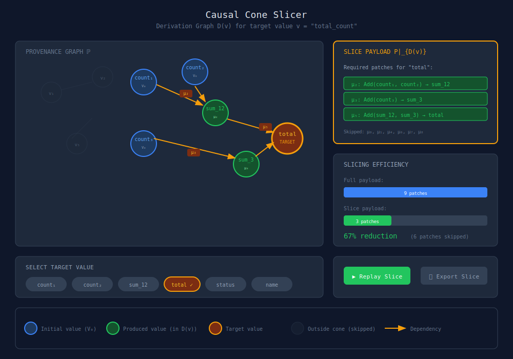
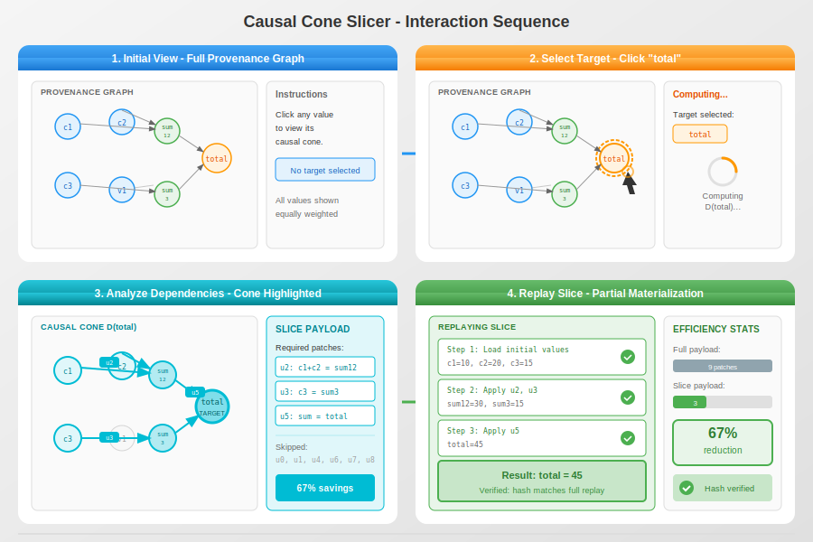

# Causal Cone Slicer

## Overview

The Causal Cone Slicer visualizes the derivation graph D(v) for any value v in the final state. This implements the slicing theorem from Paper III: you only need to materialize the patches that contribute to the causal cone of your target value.

## Feasibility Analysis

### Feasibility Score: ✅ HIGHLY FEASIBLE (95%)

**What's Implemented:**
- **`WarpGraph.materializeSlice(nodeId)`** — Computes causal cone D(v) and materializes only required patches
- **`WarpGraph.patchesFor(entityId)`** — Returns patch SHAs that affected an entity
- **ProvenanceIndex** — Maps entities to contributing patches (built during materialization)
- **ProvenancePayload** — Monoid structure for patch sequences with `slice()` and `replay()`
- **I/O Declarations** — V2 patches have `reads` and `writes` arrays for dependency tracking
- **Backward cone computation** — BFS from target through provenance index

**Key API Mappings:**

| Paper III Concept | Implementation |
|---|---|
| Derivation graph D(v) | `_computeBackwardCone(nodeId)` via BFS |
| Slice payload P\|_{D(v)} | `materializeSlice()` returns filtered patches |
| Provenance tracking | ProvenanceIndex + patch reads/writes |
| Partial materialization | Only cone patches are replayed |


**Code Example:**
```javascript
// Compute causal cone and materialize
const slice = await graph.materializeSlice('user:alice');
console.log(`Required ${slice.patchCount} patches (vs full materialization)`);

// Get patches for specific entity
const patches = graph.patchesFor('node:target');
```

**What's Fully Working:**
- Backward causal cone computation
- Topological sorting of cone patches
- Partial materialization with efficiency metrics
- TickReceipts for cone patches (optional)

**What's NOT Implemented:**
- Forward cone D⁻¹(v) — "what depends on this value"
- Incremental slice updates — updating cone as new writes arrive
- CLI command — no `git warp slice` (API only)

**Requirements for Full Visualization:**
1. Build UI for target selection (click node → highlight cone)
2. Render provenance graph with cone highlighting
3. Show slice payload panel with patch list
4. Add efficiency metrics display (full vs. slice patch count)
5. Implement slice replay animation

**Estimated effort**: 1-2 weeks (UI only, backend ready)

**Recommendation**: This is the most implementation-ready visualization after Holographic Reconstruction. The full Paper III slicing machinery is in place. Build it now.

## Core Concept

Given:
- A full provenance payload P = (μ₀, μ₁, ..., μₙ₋₁)
- A target value v in the final state

The slicer:
1. Computes D(v) - the backward causal cone
2. Identifies I(v) - the subset of tick indices whose patches contribute
3. Shows the slice payload P|_{D(v)}
4. Demonstrates partial materialization

## Main Visualization



## ASCII Terminal Version

```text
╔══════════════════════════════════════════════════════════════════════════════╗
║  CAUSAL CONE SLICER                                                          ║
║  Target: total_count                                                         ║
╠══════════════════════════════════════════════════════════════════════════════╣
║                                                                              ║
║  PROVENANCE GRAPH ℙ                          SLICE PAYLOAD                   ║
║  ─────────────────                           ─────────────                   ║
║                                                                              ║
║       ○ v₁        ○ v₂                       Required patches:               ║
║        ╲         ╱        (outside cone)                                     ║
║         ╲       ╱                            ┌────────────────────────────┐  ║
║          ╲     ╱                             │ μ₂: Add(c₁, c₂) → sum_12  │  ║
║   ┌───────●───────●───────┐                  │ μ₃: Add(c₃) → sum_3       │  ║
║   │     count₁  count₂    │                  │ μ₅: Combine → total       │  ║
║   │       ╲       ╱       │                  └────────────────────────────┘  ║
║   │        ╲     ╱        │                                                  ║
║   │         ●───●         │  D(v)            Skipped: μ₀, μ₁, μ₄, μ₆, μ₇, μ₈ ║
║   │       sum_12 │        │                                                  ║
║   │          ╲   │        │                  ═══════════════════════════     ║
║   │           ╲  ●        │                                                  ║
║   │            ╲sum_3     │                  EFFICIENCY                      ║
║   │             ╲│        │                  ──────────                      ║
║   │              ◉ ←──────┼── TARGET         Full:  [████████████████] 9     ║
║   │            total      │                  Slice: [█████░░░░░░░░░░░] 3     ║
║   │         count₃ ●      │                                                  ║
║   └───────────────────────┘                  Reduction: 67% (6 skipped)      ║
║                                                                              ║
╠══════════════════════════════════════════════════════════════════════════════╣
║  Select target: [count₁] [count₂] [sum_12] [◉ total] [status] [name]        ║
╠══════════════════════════════════════════════════════════════════════════════╣
║  [▶ Replay Slice]  [Export P|_D(v)]  [Show Full Graph]  [q: quit]           ║
╚══════════════════════════════════════════════════════════════════════════════╝
```

## Interaction Modes

### 1. Explore Mode
- Click any value in the final state
- Cone highlights automatically
- See which patches are needed

### 2. Compare Mode
- Select multiple target values
- Show union of cones
- Calculate combined slice efficiency

### 3. Verify Mode
- Replay the slice payload
- Confirm target value matches full replay
- Show hash verification

## Interaction Sequence



The interaction follows a 4-step flow:

1. **Initial View**: User sees the full provenance graph with all values shown equally
2. **Select Target**: User clicks "total" value, system computes D(total), cone highlights with glow, non-cone values fade
3. **Analyze Dependencies**: Cone nodes glow cyan, dependency edges highlight, slice payload panel shows required patches
4. **Replay Slice**: Partial materialization animates, only cone values computed, target value verified with hash match

## Features

### Multi-Value Selection
Select multiple values to see their combined cone:
```text
Selected: [total] [status]
Combined cone: D(total) ∪ D(status)
Required patches: μ₂, μ₃, μ₄, μ₅, μ₇
Efficiency: 44% reduction
```

### Cone Metrics
- **Depth**: Maximum path length to target
- **Width**: Maximum values at any level
- **Density**: Fraction of graph in cone

### Export Options
- Export slice payload as BTR
- Export cone as subgraph
- Export dependency report

## Technical Notes

- Cone computation uses reverse BFS from target
- Animation shows topological order of patches
- Large graphs use progressive rendering
- Keyboard: Tab to cycle values, Enter to select, R to replay
- Uses `materializeSlice(nodeId, { receipts: true })` for full provenance
- ProvenanceIndex must be populated (requires prior `materialize()` call)
- Efficiency gains depend on graph structure (sparse dependencies = better)
