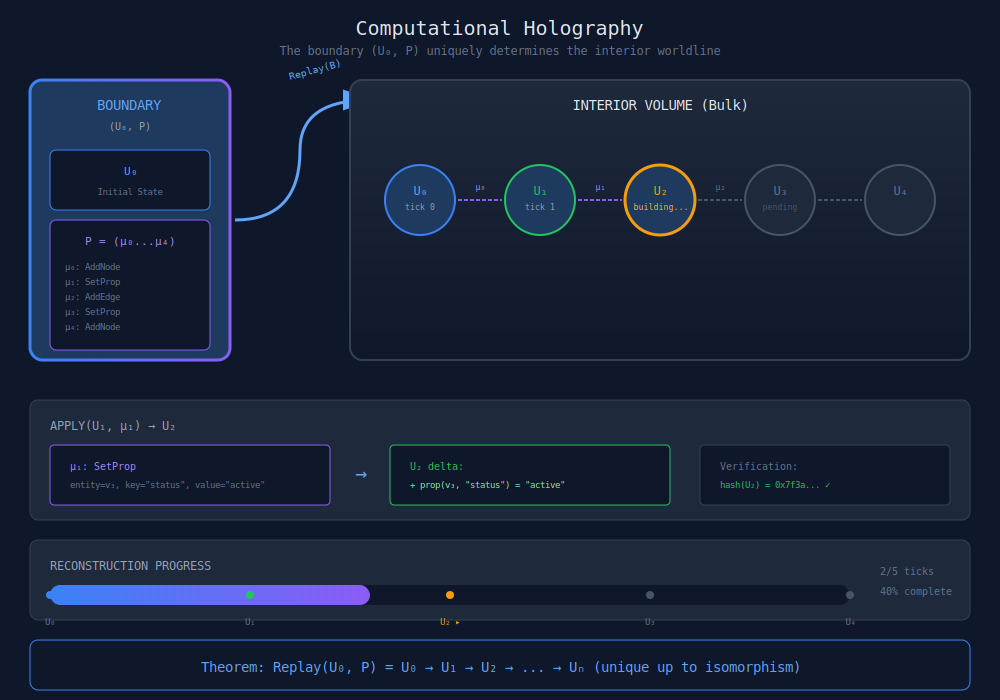
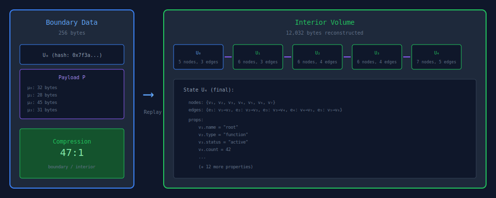
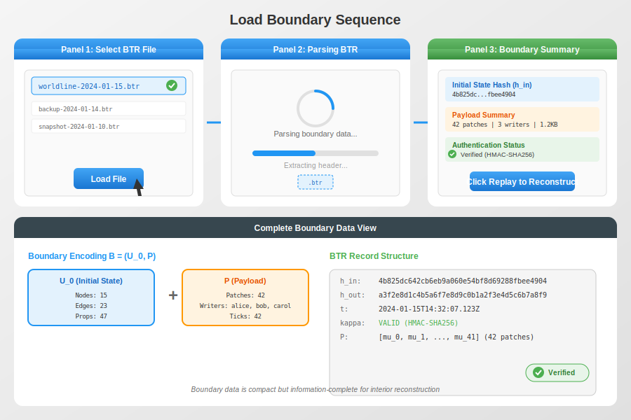
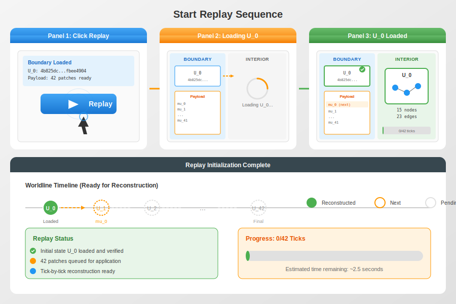
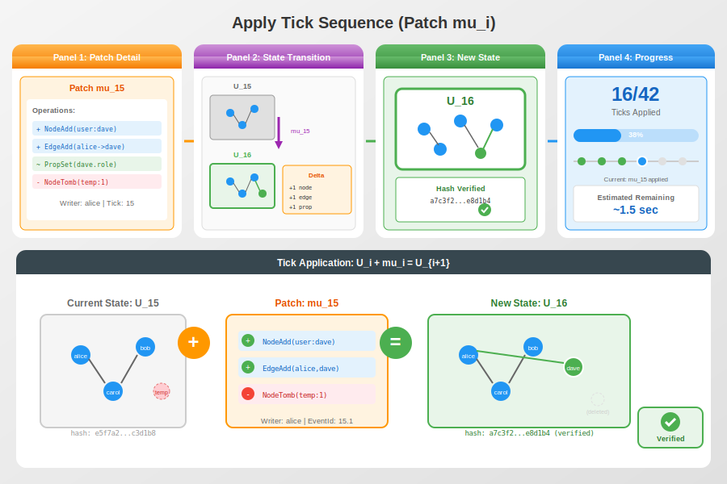
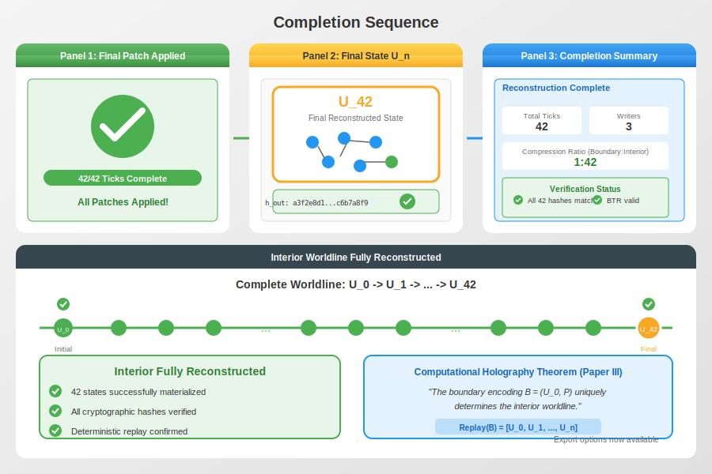
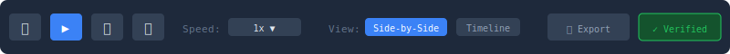

# Holographic Reconstruction Viewer

## Overview

The Holographic Reconstruction Viewer demonstrates the core theorem from Paper III: the boundary encoding `(U₀, P)` is information-complete for the interior worldline. This visualization shows how a compact boundary artefact expands into the full derivation volume through deterministic replay.

## Feasibility Analysis

### Feasibility Score: ✅ HIGHLY FEASIBLE (95%)

**What's Implemented:**
- `WarpGraph.materialize()` = Paper III's Replay(B) function
- Checkpoints = Initial state U₀ (stored as CBOR blobs in Git commits)
- Patches = Provenance payload P (ordered sequence of tick patches)
- `computeStateHashV5()` = h_out hash verification
- TickReceipts track per-operation outcomes (applied/superseded/redundant)
- Version vectors track causal frontier
- Incremental materialization from checkpoint + patches

**Key API Mappings:**

| Paper III Concept | Implementation |
|---|---|
| Boundary B = (U₀, P) | Checkpoint + patch stream |
| Replay(B) | `materialize()` |
| h_out | `computeStateHashV5(state)` |
| Tick patches μᵢ | Patch commits with ops array |
| Tick receipt | TickReceipt type |

**What's Partially Implemented:**
- BTR structure exists but missing explicit h_in storage
- Authentication is Git SHA integrity only (no HMAC/signatures)

**What's NOT Implemented:**
- Explicit h_in → h_out chain verification UI
- Authentication tag κ (would need crypto layer)

**Requirements for Full Implementation:**
1. Add h_in computation (store previous checkpoint's stateHash)
2. Implement `verify()` method that checks hash chain
3. Build UI with patch slider/step controls
4. Display TickReceipt ops with visual highlights

**Estimated effort**: 1-2 weeks (mostly UI work, backend ready)

**Recommendation**: This visualization is production-ready to build. The mathematical machinery from Paper III is fully implemented. Focus on the UI/UX.

## Core Concept

Given:
- **Boundary**: Initial state U₀ + provenance payload P = (μ₀, μ₁, ..., μₙ₋₁)
- **Interior**: The full worldline U₀ → U₁ → U₂ → ... → Uₙ

The viewer animates the **Replay(B)** function, showing tick-by-tick reconstruction of interior states from boundary data.

## Main Visualization

## Side-by-Side Comparison View

Show the compact boundary vs the expanded interior simultaneously:

## Interaction Sequence

### 1. Load Boundary

User loads a BTR file, system parses the boundary encoding, and displays initial state hash, payload summary, and authentication status.

### 2. Start Replay

User clicks Replay, system loads U₀ from storage, and the first state appears in the interior view with progress indicator.

### 3. Apply Each Tick

For each patch μᵢ, the system shows the patch detail, animates the state transition U_i to U_{i+1}, displays the new state with a glow effect, and verifies the hash.

### 4. Completion

All patches applied, final state U_n highlighted, summary with total ticks, compression ratio, and verification checkmarks displayed.

## Controls

## Features

### BTR Inspection
Before replay, show the Boundary Transition Record:
- `h_in`: hash of initial state
- `h_out`: expected hash of final state
- `P`: payload summary
- `t`: timestamp
- `κ`: authentication status

### Step-Through Mode
Pause at any tick to inspect:
- Current state structure
- Patch being applied
- Delta (what changed)
- Hash verification

### Verification Mode
Continuously verify that reconstructed state hashes match expected values.

### Export Options
- Export full interior (all states)
- Export single state at any tick
- Export as provenance graph

## Technical Notes

- Uses streaming replay: states are computed on-demand, not all loaded at once
- Hash verification uses the same algorithm as the WARP backend
- Animation timing respects user-configured speed
- Large payloads show progress indication with ETA
- Memory-efficient: only keeps recent states in memory (configurable window)
- Uses `materialize({ receipts: true })` to get per-tick outcomes
- Hash verification via `computeStateHashV5()`
- Streaming replay available via incremental materialization
