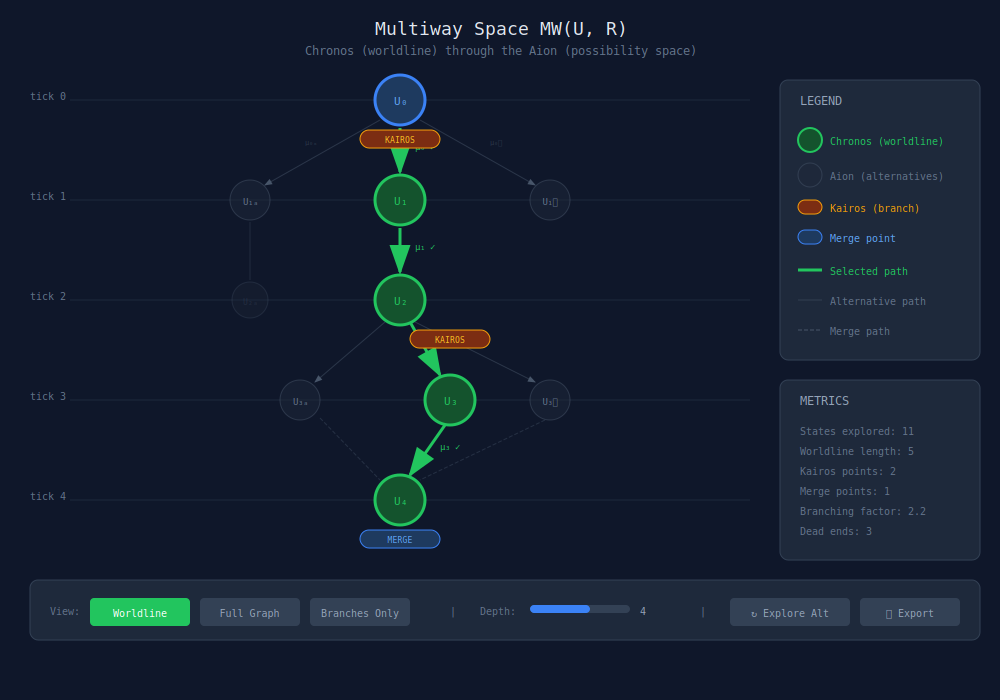
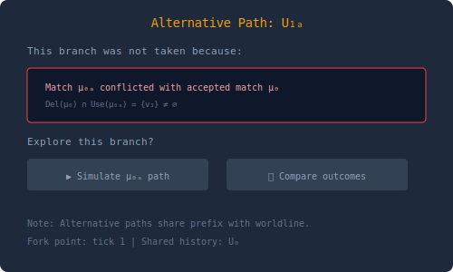

# Multiway Space + Worldline Viewer

## Overview

The Multiway Worldline Viewer shows the full branching possibility space MW(U, R) with the deterministic worldline highlighted as a selected path. This visualizes the Chronos-Kairos-Aion triad from Paper IV.

## Feasibility Analysis

### Feasibility Score: ⚠️ PARTIAL (40%)

**What's Implemented:**
- **Fork support**: `WarpGraph.fork({ from: writerId, at: patchSha })` creates branches
- **Git DAG traversal**: `CommitDagTraversalService` with BFS, DFS, shortest path, A*
- **Multi-writer patches**: Concurrent writers create natural branch-like structures
- **TickReceipts**: Record which operations won/lost in merge

**What's NOT Implemented (Paper IV concepts):**
- **Multiway graph MW(U, R)**: No explicit data structure for all possible rewrites
- **Chronos/Kairos/Aion terminology**: Zero matches in codebase
- **Rule pack R**: No multiple rewrite rules per state
- **Scheduler candidate enumeration**: Patches are pre-formed, not selected from candidates
- **Alternative branch tracking**: Forks exist, but rejected alternatives are not recorded
- **Counterfactual simulation**: Cannot ask "what if different rule applied?"

**Key Difference from Paper IV:**
Paper IV describes:
- A rule pack R with multiple possible rewrites at each state
- A scheduler that selects which rewrite to apply (creating Kairos branch points)
- The multiway graph containing ALL possible paths (Aion)
- Chronos as the single path actually taken

The codebase has:
- Writers that submit pre-formed patches
- Deterministic CRDT merge (no selection between alternatives)
- Fork capability for explicit branching (user-initiated, not scheduler-generated)
- No tracking of "paths not taken"

**What CAN Be Visualized:**
- Fork-based branching (explicit user branches)
- Writer timelines showing concurrent patch submission
- Merge points where writers' patches combine
- The deterministic worldline through multi-writer history

**What CANNOT Be Visualized Without New Implementation:**
- True multiway graph with all possible rewrites
- Kairos branch points (scheduler didn't choose, CRDT merged)
- Counterfactual paths ("what if this rule instead")
- Alternative match exploration

**Requirements to Enable Full Paper IV Visualization:**
1. Define rule pack R (what patterns trigger what operations?)
2. Implement match enumeration from state
3. Build scheduler that records rejected candidates
4. Create multiway graph data structure
5. Add counterfactual replay ("simulate alternative from this point")

**Estimated effort for full implementation**: 6-8 weeks

**Recommendation**: Build a "Fork & Merge Viewer" that shows:
- Explicit forks created by users
- Multi-writer concurrent patch submission
- The deterministic merge result
- Do NOT claim to show "all possible paths" — that's not what exists

**Important Clarifications:**
- "Worldline" = deterministic merge of all writers (not one of many paths)
- "Branching" = explicit forks, not scheduler alternatives
- Kairos/Aion concepts are theoretical, not implemented

## Core Concept

The multiway graph contains:
- **All possible rewrites** from the rule pack R
- **All alternative matches** at each state
- **Branch points** (Kairos) where alternatives diverge
- **Merge points** where branches reunite

The deterministic worldline (Chronos) is one path through this space, selected by the scheduler policy and boundary data.

## Main Visualization



## ASCII Terminal Version

```text
╔══════════════════════════════════════════════════════════════════════════════╗
║  MULTIWAY SPACE MW(U, R)                                                     ║
║  ══════════════════════                                                      ║
╠══════════════════════════════════════════════════════════════════════════════╣
║                                                                              ║
║  tick 0  ─────────────────────●─────────────────────── (U₀) initial          ║
║                              /│\                                             ║
║                             / │ \                                            ║
║                            /  │  \                                           ║
║  tick 1  ───────○─────────/───◉───\─────────○───────── KAIROS (3 choices)    ║
║               (U₁ₐ)          (U₁)          (U₁ᵦ)       ◉ = taken             ║
║                 │             │                                              ║
║                 │             │                                              ║
║  tick 2  ───────○─────────────◉───────────────────────                       ║
║               (U₂ₐ)          (U₂)                      linear                ║
║               dead            │\                                             ║
║               end             │ \                                            ║
║                              /│  \                                           ║
║  tick 3  ─────────○─────────/─◉───\───────○─────────── KAIROS (3 choices)    ║
║                 (U₃ₐ)        (U₃)        (U₃ᵦ)                               ║
║                    \          │          /                                   ║
║                     \         │         /                                    ║
║                      \        │        /                                     ║
║  tick 4  ─────────────────────◉─────────────────────── MERGE (confluence)    ║
║                              (U₄)                                            ║
║                                                                              ║
╠══════════════════════════════════════════════════════════════════════════════╣
║  CHRONOS (Worldline): U₀ → U₁ → U₂ → U₃ → U₄                                ║
║  KAIROS points: 2 (at ticks 1 and 3)                                         ║
║  AION (total states): 11                                                     ║
╠══════════════════════════════════════════════════════════════════════════════╣
║  Legend: ● initial  ◉ on worldline  ○ alternative  ═══ selected path        ║
╠══════════════════════════════════════════════════════════════════════════════╣
║  [W: toggle worldline]  [A: show all]  [K: highlight Kairos]  [q: quit]     ║
╚══════════════════════════════════════════════════════════════════════════════╝
```

## Alternative Path Explorer

When clicking an alternative state:



## Interaction Modes


### 1. Worldline Focus
- Only the deterministic path is fully visible
- Alternatives shown as faded ghosts
- Kairos points marked clearly

### 2. Full Exploration
- All branches equally visible
- Can navigate to any state
- See full branching structure

### 3. Counterfactual Mode
- Select an alternative branch
- System simulates that path
- Compare final states

### 4. Temporal Logic View
- Overlay formula satisfaction
- Show `AG F p` paths
- Highlight counterexamples

## Features

### Branch Analysis
At each Kairos point:
- Number of alternatives
- Why each was taken/rejected
- Footprint comparison

### Confluence Detection
Find states reachable by multiple paths:
- Highlight merge points
- Show path equivalence

### Depth Control
- Set maximum exploration depth
- Progressive loading for large spaces

## Technical Notes

- Layout uses force-directed algorithm constrained to time levels
- Large multiway graphs use clustering/aggregation
- Alternative paths computed lazily on hover
- Animation uses physics simulation for branch spreading
