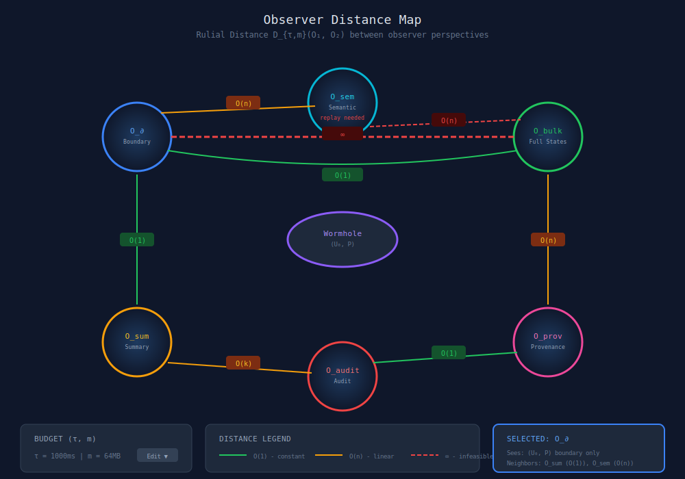
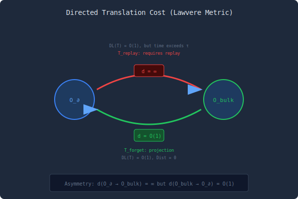
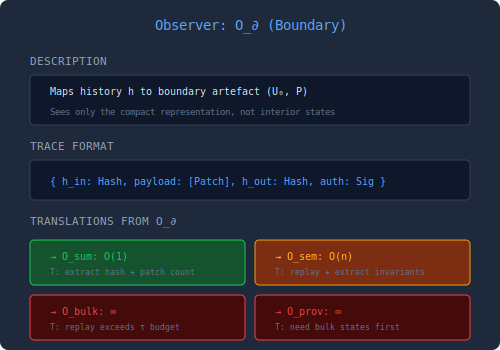

# Observer Distance Map

## Overview

The Observer Distance Map visualizes the rulial distance D_{τ,m} between different observers of the same WARP worldline. This implements the observer geometry from Paper IV, showing how translation cost creates a metric space of perspectives.

> **Note**: This visualization describes Paper IV theory that is NOT currently implemented in the codebase. "Observers" and "translators" would need to be designed from scratch. MDL computation is an open research problem. Consider this visualization as "future/research" tier.

## Feasibility Analysis

### Feasibility Score: NOT IMPLEMENTED (15%)

**What's Implemented (Foundation Only):**
- **CRDT primitives**: VersionVector, OR-Set, LWW for state tracking
- **Traversal algorithms**: BFS, DFS, shortest path, A* in CommitDagTraversalService
- **State materialization**: Can compute different "views" of state
- **Checkpoints**: Boundary-like snapshots exist

**What's NOT Implemented (Paper IV concepts):**
- **Observer abstraction**: No `Observer` class or interface
- **Observer types**: No boundary/bulk/semantic observer implementations
- **Translator functions**: No `T: Tr -> Tr` translation layer
- **MDL computation**: No description length metrics (DL(T))
- **Distortion metric**: No `Dist(O_2, T . O_1)` calculation
- **Rulial distance**: No `D_{tau,m}(O_1, O_2)` implementation
- **Budget constraints**: No (tau, m) time/memory limits on observers
- **History category**: No `Hist(U, R)` path category structure

**Why This Is Hard:**
1. **Observer semantics undefined**: What IS an observer in this codebase? A query? A view? A function?
2. **MDL is theoretically complex**: Minimum description length requires information theory, Kolmogorov complexity approximations
3. **Translator composition**: Need algebraic structure for combining translators
4. **No reference implementation**: Paper IV is most theoretical, least grounded in code

**What COULD Be Built (Simplified Version):**
- **Heuristic distances**: State diff size, hop count in commit DAG
- **Pre-defined observer types**: Hardcode boundary/bulk/summary observers
- **Simple translators**: Projection functions (drop fields, filter nodes)
- **Cost estimation**: Code size as proxy for DL(T)

**Requirements for Full Paper IV Visualization:**
1. Design observer interface and semantics
2. Implement observer types (boundary, bulk, semantic, audit, provenance)
3. Build translator registry with composition operators
4. Implement MDL estimation (start with code length heuristic)
5. Create distortion metric (state diff based?)
6. Add budget-aware distance calculation
7. Build visualization UI (graph + matrix views)

**Estimated effort**: 8-12 weeks for meaningful implementation

**Recommendation:**
- **Short term**: Skip this visualization or build a mockup with hardcoded data
- **Medium term**: Implement simplified "perspective distance" using state diffs
- **Long term**: Full observer geometry requires research-grade effort

## Core Concept

Observers are functors from history categories to trace space. The rulial distance measures:
- **DL(T)**: Description length of translator
- **Dist(O₂, T∘O₁)**: Residual distortion after translation
- **Budget constraints**: (τ, m) limits on time and memory

Observers close in distance can translate between each other cheaply.

## Main Visualization



## Directed Distance View (Lawvere Metric)



## ASCII Terminal Version

```text
╔══════════════════════════════════════════════════════════════════════════════╗
║  OBSERVER DISTANCE MAP                                                       ║
║  D_{τ,m}(O₁, O₂) - Rulial distance between observers                        ║
╠══════════════════════════════════════════════════════════════════════════════╣
║                                                                              ║
║                              ┌─────────┐                                     ║
║                              │ O_sem   │                                     ║
║                              │Semantic │                                     ║
║                              └────┬────┘                                     ║
║                             O(n)  │  O(n)                                    ║
║                            ╱      │      ╲                                   ║
║                           ╱       │       ╲                                  ║
║  ┌─────────┐  ════════∞════════   │   ════∞═════  ┌─────────┐               ║
║  │  O_∂    │←────────O(1)─────────┼──────────────→│ O_bulk  │               ║
║  │Boundary │         (forget)     │               │  Full   │               ║
║  └────┬────┘                      │               └────┬────┘               ║
║       │                     ╔═════╧═════╗              │                    ║
║       │ O(1)                ║ Wormhole  ║         O(n) │                    ║
║       │                     ║  (U₀, P)  ║              │                    ║
║       │                     ╚═══════════╝              │                    ║
║       │                           │                    │                    ║
║  ┌────┴────┐                ┌─────┴─────┐        ┌────┴────┐               ║
║  │ O_sum   │────O(k)───────→│  O_audit  │←─O(1)──│ O_prov  │               ║
║  │Summary  │                │   Audit   │        │Provenance│              ║
║  └─────────┘                └───────────┘        └─────────┘               ║
║                                                                              ║
╠══════════════════════════════════════════════════════════════════════════════╣
║  DISTANCE MATRIX (directed d_{τ,m})                                          ║
║  ─────────────────────────────────                                           ║
║                                                                              ║
║          │  O_∂   O_bulk  O_sum  O_prov  O_sem  O_audit                     ║
║  ────────┼─────────────────────────────────────────────                     ║
║  O_∂     │   0      ∞      O(1)    ∞      O(n)    ∞                         ║
║  O_bulk  │  O(1)    0      O(1)   O(n)    O(1)   O(n)                       ║
║  O_sum   │   ∞      ∞       0      ∞       ∞     O(k)                       ║
║  O_prov  │   ∞      ∞       ∞       0      ∞     O(1)                       ║
║  O_sem   │   ∞     O(n)     ∞       ∞       0      ∞                        ║
║  O_audit │   ∞      ∞       ∞      O(1)    ∞       0                        ║
║                                                                              ║
╠══════════════════════════════════════════════════════════════════════════════╣
║  Budget: τ = 1000ms, m = 64MB                                                ║
║  ∞ = exceeds budget or no known translator                                   ║
╠══════════════════════════════════════════════════════════════════════════════╣
║  [D: distance matrix]  [G: graph view]  [B: change budget]  [q: quit]       ║
╚══════════════════════════════════════════════════════════════════════════════╝
```

## Observer Detail View



## Interaction Modes


### 1. Graph Mode
- Observers as nodes, distances as edges
- Click observer to select
- Hover edge to see translator details

### 2. Matrix Mode
- Distance matrix view
- Row = source, Column = target
- Color-coded by cost

### 3. Budget Exploration
- Adjust τ, m sliders
- Watch distances change
- See what becomes feasible

### 4. Translator Inspection
- Click edge to see translator code
- See DL(T) and Dist components
- Run translator on sample input

## Features

### Rulial Ball Visualization
Show B_r(O) - all observers within distance r:
```
Observers within d=O(1) of O_bulk:
- O_∂ (via T_forget)
- O_sem (via T_invariant)
```

### Triangle Inequality Check
Verify: d(O₁, O₃) ≤ d(O₁, O₂) + d(O₂, O₃) + c

### Observer Equivalence
Highlight pairs where D(O₁, O₂) = 0 (equivalent observers).

## Technical Notes

- Distance computation uses pre-registered translators
- Unknown translators show as ∞
- User can add custom translators
- Layout uses force-directed algorithm weighted by inverse distance
