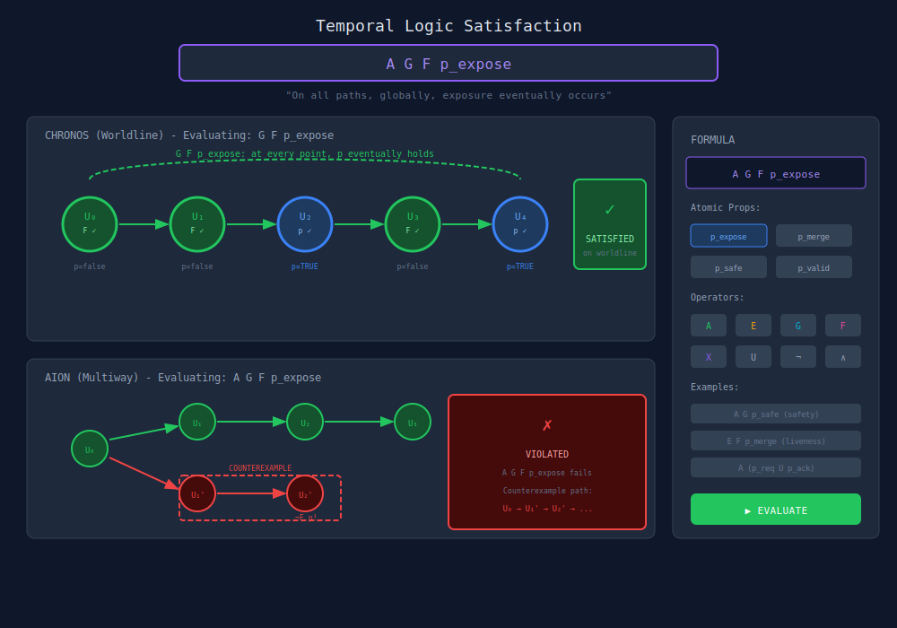
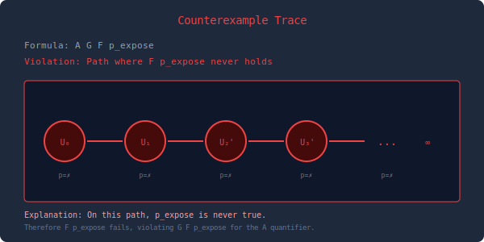
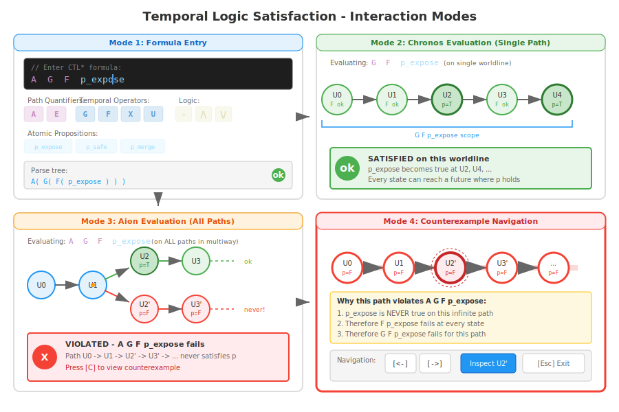

# Temporal Logic Satisfaction Viewer

## Overview

The Temporal Logic Satisfaction Viewer visualizes CTL*-style temporal formulas over WARP worldlines and multiway histories. This implements the temporal logic layer from Paper IV, showing how formulas like `AG F p_expose` (always eventually exposure) are satisfied or violated.

> **Important**: This visualization describes Paper IV theory that is NOT currently implemented in the codebase. Temporal logic verification would need to be built from scratch. This is classified as **research/future tier** with the **lowest priority**.

## Feasibility Analysis

### Feasibility Score: NOT IMPLEMENTED (10%)

**What's Implemented (Foundation Only):**
- **Graph traversal**: BFS, DFS, shortest path, topological sort
- **History replay**: ProvenancePayload can reconstruct worldlines
- **State snapshots**: Checkpoints capture state at points in time
- **Query predicates**: QueryBuilder supports filtering by properties

**What's NOT Implemented (Paper IV temporal logic):**
- **CTL* formula structures**: No AST for temporal formulas
- **Temporal operators**: No AG, EF, AX, EU, etc.
- **Path quantifiers**: No A (all paths) or E (exists path)
- **Formula parser**: No syntax for temporal expressions
- **Model checker**: No satisfaction algorithm
- **Counterexample generation**: No witness/counterexample paths
- **State labeling**: No atomic proposition evaluation

**Zero Matches in Codebase:**
Searched for: temporal, CTL, formula, satisfy, verify, model check - no relevant results.

**Why This Is a Major Undertaking:**
1. **Full model checking is complex**: CTL* checking is PSPACE-complete
2. **State space explosion**: Large histories = expensive verification
3. **Formula language design**: Need syntax, parser, type checker
4. **Algorithm implementation**: Fixed-point computation for nested formulas
5. **Counterexample synthesis**: Backtracking through failed subformulas

**What COULD Be Built (Simplified Version):**
- **LTL on single worldline**: Linear-time logic (no branching quantifiers)
- **Bounded model checking**: Check formulas up to depth k
- **Pre-defined properties**: Hardcode common patterns (safety, liveness)
- **Manual path inspection**: User selects path, system checks predicates

**Requirements for Full Paper IV Visualization:**
1. Design formula AST (StateFormula, PathFormula types)
2. Implement formula parser (recursive descent or PEG)
3. Build satisfaction checker for each operator
4. Implement counterexample extraction
5. Add witness path synthesis for existential formulas
6. Create visualization UI (formula editor + path highlighting)
7. Optimize for large state spaces (symbolic methods?)

**Estimated effort**: 6-9 weeks for basic implementation, 12+ weeks for production quality

**Recommendation:**
- **Short term**: Skip this visualization entirely
- **Medium term**: Implement simple property checks (invariants, reachability)
- **Long term**: Full CTL* requires dedicated model checking expertise

**External Tool Consideration:**
Consider partnering with model checking experts or integrating existing tools (NuSMV, SPIN) rather than building from scratch. These tools have decades of optimization for state space exploration.

## Core Concept

Temporal formulas are evaluated over:
- **Chronos**: Linear worldline (single path)
- **Kairos**: Branch points in the multiway graph
- **Aion**: Full possibility space (all paths)

The viewer shows:
- Formula satisfaction at each state
- Counterexamples when formulas fail
- Path quantifier scope (A = all paths, E = exists path)

## Syntax Reference

```text
State formulas (φ):
  p          - atomic proposition (predicate on trace)
  ¬φ         - negation
  φ ∧ φ      - conjunction
  A ψ        - for all paths, ψ holds
  E ψ        - there exists a path where ψ holds

Path formulas (ψ):
  φ          - state formula (lift)
  ¬ψ         - negation
  ψ ∧ ψ      - conjunction
  X ψ        - next: ψ holds in next state
  F ψ        - finally: ψ holds eventually
  G ψ        - globally: ψ holds always
  ψ U ψ      - until: ψ₁ holds until ψ₂
```

## Main Visualization



## ASCII Terminal Version

```text
╔══════════════════════════════════════════════════════════════════════════════╗
║  TEMPORAL LOGIC SATISFACTION                                                 ║
╠══════════════════════════════════════════════════════════════════════════════╣
║                                                                              ║
║  Formula: A G F p_expose                                                     ║
║  Meaning: "On all paths, globally, exposure eventually occurs"               ║
║                                                                              ║
╠══════════════════════════════════════════════════════════════════════════════╣
║  CHRONOS (Single Worldline)                                                  ║
║  ─────────────────────────                                                   ║
║                                                                              ║
║  ┌─────────── G F p_expose ───────────────────────────────────┐              ║
║  │                                                            │              ║
║  │   (U₀)───────→(U₁)───────→(U₂)───────→(U₃)───────→(U₄)   │              ║
║  │    F ✓         F ✓        p=✓          F ✓        p=✓     │              ║
║  │   p=no        p=no       EXPOSE       p=no       EXPOSE   │              ║
║  │                                                            │              ║
║  └────────────────────────────────────────────────────────────┘              ║
║                                                                              ║
║  Result on worldline: ✓ SATISFIED (exposure occurs at U₂, U₄, ...)         ║
║                                                                              ║
╠══════════════════════════════════════════════════════════════════════════════╣
║  AION (All Paths)                                                            ║
║  ────────────────                                                            ║
║                                                                              ║
║                 ┌───(U₂)───→(U₃)───→...  path 1: ✓ G F p holds              ║
║                 │   p=✓                                                      ║
║  (U₀)───→(U₁)──┤                                                            ║
║                 │                                                            ║
║                 └───(U₂')──→(U₃')──→...  path 2: ✗ ¬F p (never exposes!)    ║
║                     p=no     p=no        ╔════════════════════════╗         ║
║                                          ║   COUNTEREXAMPLE      ║         ║
║                                          ║   Path: U₀→U₁→U₂'→... ║         ║
║                                          ╚════════════════════════╝         ║
║                                                                              ║
║  Result on multiway: ✗ VIOLATED (A G F p_expose fails)                      ║
║                                                                              ║
╠══════════════════════════════════════════════════════════════════════════════╣
║  Formula Builder                                                             ║
║  ───────────────                                                             ║
║  Props: [p_expose*] [p_merge] [p_safe] [p_valid]                            ║
║  Ops:   [A] [E] [G] [F] [X] [U] [¬] [∧] [∨]                                 ║
║                                                                              ║
║  Examples:                                                                   ║
║    A G p_safe          (safety: always safe)                                ║
║    E F p_merge         (liveness: can eventually merge)                     ║
║    A (p_req U p_ack)   (until: request until acknowledged)                  ║
║                                                                              ║
╠══════════════════════════════════════════════════════════════════════════════╣
║  [E: edit formula]  [V: evaluate]  [C: show counterexample]  [q: quit]      ║
╚══════════════════════════════════════════════════════════════════════════════╝
```

## Counterexample Trace View



## Interaction Modes



### 1. Formula Entry
- Type formula or use builder
- Syntax highlighting
- Error feedback for malformed formulas

### 2. Evaluation Mode
- Choose Chronos (single path) or Aion (all paths)
- Step through satisfaction checking
- See intermediate results

### 3. Counterexample Mode
- When formula fails, highlight counterexample
- Navigate counterexample path
- Explain why it violates

### 4. Observer Transport
- Check if formula satisfaction transports
- Show required δ-robustness
- Compare across observers

## Features

### Proposition Editor
Define atomic propositions as predicates on trace:
```text
p_expose := trace.contains("receipt")
p_merge  := state.branch_count == 1
p_safe   := state.invariant("no_deadlock")
```

### Formula Library
Common patterns:
- **Safety**: `A G p` (always p)
- **Liveness**: `A F p` (eventually p)
- **Response**: `A G (p → F q)` (p leads to q)
- **Fairness**: `A G F p` (infinitely often p)

### Witness/Counterexample
- For existential formulas: show witness path
- For universal formulas: show counterexample path
- Highlight divergence points

## Technical Notes

- CTL* model checking uses standard algorithms
- Large multiway graphs use symbolic representation
- Counterexamples are minimal (shortest violating path)
- Animation shows evaluation order (inside-out)

## Implementation Status

**Classification**: Research/Future Tier (Lowest Priority)

This entire visualization is theoretical - none of the temporal logic infrastructure exists in the current codebase. The document above describes the desired end state based on Paper IV theory, not current capabilities.

**Current State**: 0% implemented. No temporal logic code exists.

**Path Forward Options**:
1. **Skip entirely** - Focus on visualizations that leverage existing code
2. **Minimal viable** - LTL on single worldlines with bounded depth (2-3 weeks)
3. **External integration** - Use NuSMV/SPIN for model checking, WARP provides state graph (4-6 weeks)
4. **Full implementation** - Build CTL* checker from scratch (12+ weeks, requires expertise)

**Dependencies**: Would require QueryBuilder extensions, new formula AST types, parser infrastructure, and significant algorithm work before any visualization could be built.
