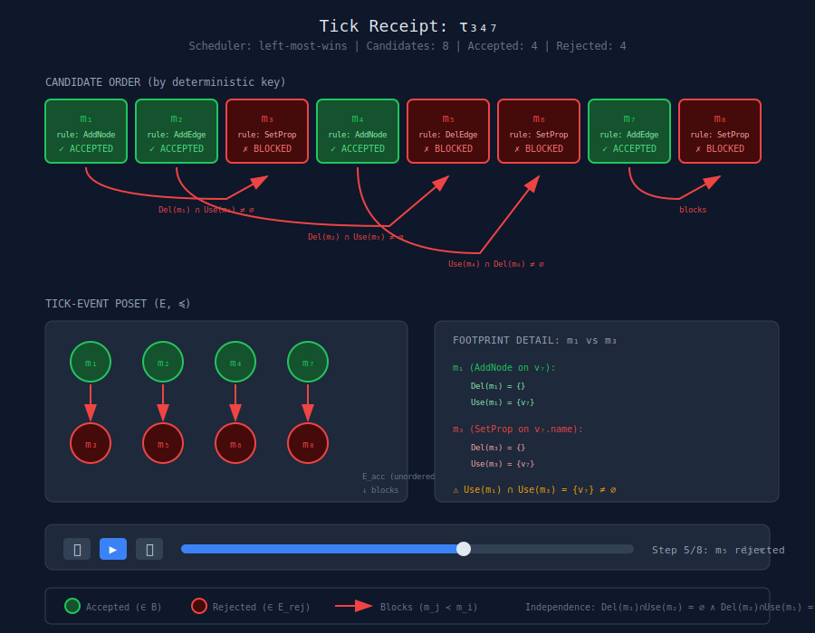
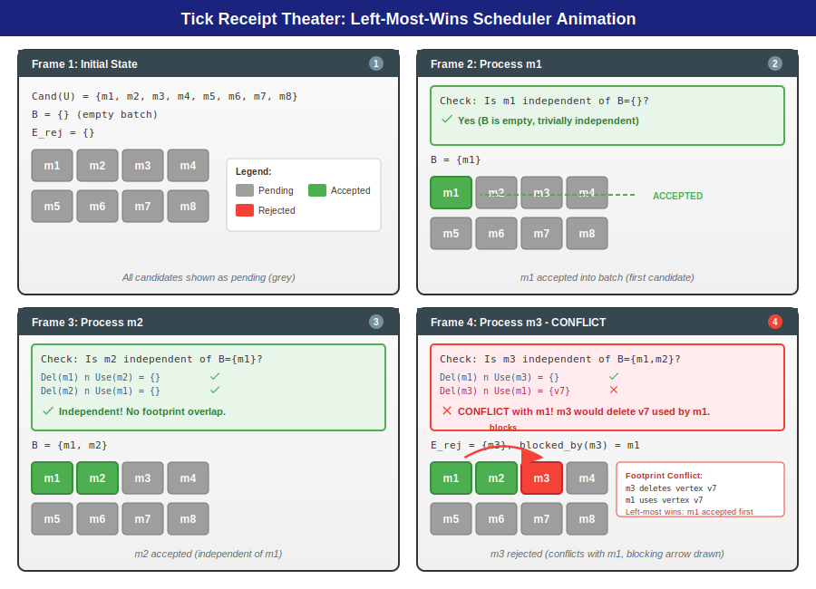
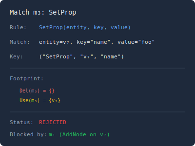
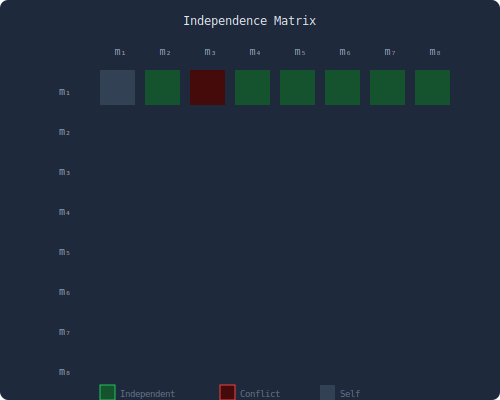

# Tick Receipt Theater

## Overview

The Tick Receipt Theater animates the internal structure of a single tick, making visible the deterministic conflict resolution process described in Paper II. It shows the tick-event poset: which candidate matches were considered, which were accepted, which were rejected (and why), and how the left-most-wins scheduler built the final batch.

> **Important Clarification**: The animation shows **CRDT merge outcomes**, not scheduler candidate selection. "Blocking" in this context means LWW supersession, not footprint conflict. The visualization is about conflict resolution results, not match independence.

## Feasibility Analysis

### Feasibility Score: ⚠️ PARTIAL (50%)

**What's Implemented:**
- **TickReceipt type** (`src/domain/types/TickReceipt.js`):
  - Records per-operation outcomes: `'applied' | 'superseded' | 'redundant'`
  - Includes patchSha, writer, lamport, and ops array
  - Each op has: operation type, target, result, reason (e.g., "LWW: writer bob at lamport 43 wins")
- **CRDT conflict resolution**: OR-Set for nodes/edges, LWW for properties
- **Version vectors**: Track causal history per writer
- **Deterministic ordering**: Patches ordered by (Lamport, writerId, patchSha)

**What's NOT Implemented (Paper II concepts):**
- **No scheduler with candidate enumeration**: Patches are pre-ordered in Git, not dynamically selected
- **No Cand(U) set**: The system doesn't enumerate all possible matches at each state
- **No footprint analysis**: Del(m) and Use(m) sets not computed
- **No independence checking**: CRDT semantics make all operations implicitly independent
- **No DPO rewriting**: No category-theoretic graph rewriting, just CRDT merge
- **No blocking relationships**: "Superseded" is LWW losing, not footprint conflict

**Key Difference from Paper II:**
Paper II describes a scheduler that:
1. Enumerates candidate matches from rule pack R
2. Computes footprints (Del/Use sets)
3. Checks pairwise independence
4. Selects admissible batch via left-most-wins

The codebase instead:
1. Receives patches as pre-formed units from writers
2. Merges them via CRDT semantics (OR-Set + LWW)
3. Records outcomes in TickReceipts
4. Determinism comes from CRDT math, not scheduler selection

**What CAN Be Visualized:**
- Per-patch operation outcomes (green=applied, red=superseded, yellow=redundant)
- Writer timelines with Lamport timestamps
- Conflict heatmap (which writer pairs conflict most)
- LWW winner explanations

**What CANNOT Be Visualized Without New Implementation:**
- Candidate match enumeration
- Independence matrix (footprint analysis)
- Scheduler batch selection animation
- "Why was this match rejected in favor of that one" (beyond LWW)

**Requirements to Enable Full Paper II Visualization:**
1. Define "match" concept (what patterns trigger operations?)
2. Implement footprint extraction (Del/Use sets per operation)
3. Build independence checker
4. Create pluggable scheduler interface
5. Record scheduler decisions (not just outcomes)

**Estimated effort for full implementation**: 4-6 weeks

**Recommendation**: Build a "Receipt Inspector" that shows what IS available (per-op outcomes, writer timelines, conflict summaries). Rename or reframe to avoid implying full Paper II scheduler semantics.

## Core Concept

> **Note**: The following describes the Paper II theoretical model. The current codebase uses CRDT merge semantics instead of DPO rewriting with footprint analysis. See Feasibility Analysis above for what can actually be visualized today.

A tick is atomic from the outside, but internally it involves:
1. Enumerating candidate matches from Cand(U)
2. Ordering them by a deterministic key (rule name + stable identifiers)
3. Running the left-most-wins filter (accept if independent of all prior accepted)
4. Recording the blocking relationships
5. Committing the accepted batch B

The theater animates this process step by step.

**Current Implementation Alternative**: In the actual codebase, "ticks" are patch commits from writers. Conflict resolution happens via CRDT semantics (OR-Set for existence, LWW for properties). The TickReceipt records whether each operation was `applied`, `superseded` (lost LWW), or `redundant` (already in state).

## Main Visualization

## Animation Sequence

> **Implementation Note**: This storyboard describes the Paper II scheduler model. To implement this visualization, the codebase would need footprint extraction and independence checking (see Feasibility Analysis). A simpler "Receipt Inspector" showing CRDT merge outcomes is achievable with current infrastructure.

### Step-by-Step Playback

The following storyboard illustrates the left-most-wins scheduler processing candidates in order, checking independence via footprint comparison (Del/Use sets), and building the accepted batch while recording blocking relationships for rejected matches.

**Frame 1 (Initial State)**: All eight candidates m1-m8 are shown in grey (pending). The batch B is empty, and no rejections have occurred yet.

**Frame 2 (Process m1)**: The first candidate m1 is trivially accepted since B is empty. m1 turns green and is added to the batch.

**Frame 3 (Process m2)**: The scheduler checks if m2 is independent of B={m1} by comparing footprints. Since Del(m1) does not intersect Use(m2) and Del(m2) does not intersect Use(m1), m2 is independent and accepted. m2 turns green.

**Frame 4 (Process m3 - Conflict)**: When checking m3 against B={m1, m2}, the scheduler finds that Del(m3) intersects Use(m1) at vertex v7. This means m3 would delete a vertex that m1 uses. Since m1 was accepted first (left-most-wins), m3 is rejected. m3 turns red and a blocking arrow is drawn from m1 to m3.

The animation continues for the remaining candidates (m4-m8), applying the same independence check against all previously accepted matches in B.

## Detail Views

### Match Inspector
When a match is clicked, show its full structure:

### Independence Matrix
Show pairwise independence of all candidates:

> **Not Currently Implementable**: Independence checking requires footprint analysis (Del/Use sets), which is not implemented in the codebase. CRDT operations are implicitly independent—conflicts are resolved by LWW, not by blocking.

## Interaction Modes

### 1. Playback Mode
- Automatic step-through animation
- Play/pause, speed control
- Jump to any step

### 2. Explore Mode
- Click any match to see its details
- Hover to highlight related matches
- Toggle between poset view and timeline view

### 3. Compare Mode
- Select two matches to see their footprint comparison
- Visualize the exact overlap that caused conflict

## Technical Notes

- Animation timing uses requestAnimationFrame with configurable frame rate
- Poset layout uses topological sorting for vertical positioning
- Blocking arrows use quadratic Bezier curves to avoid overlap
- Color scheme follows semantic meaning (green=accepted, red=rejected)
- Keyboard shortcuts: Space=play/pause, Arrow keys=step, Escape=reset
