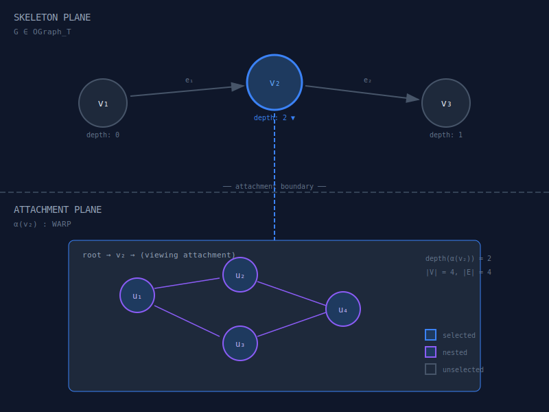
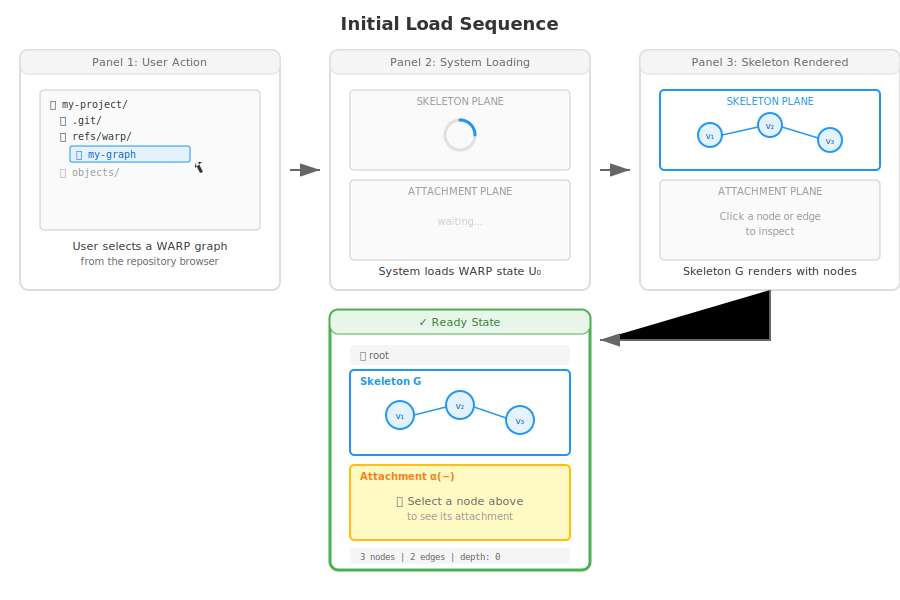
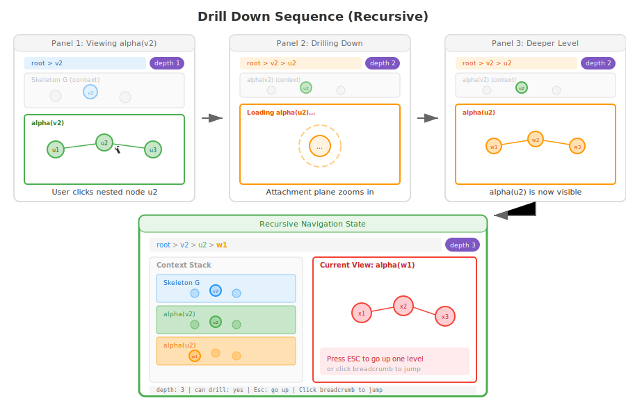
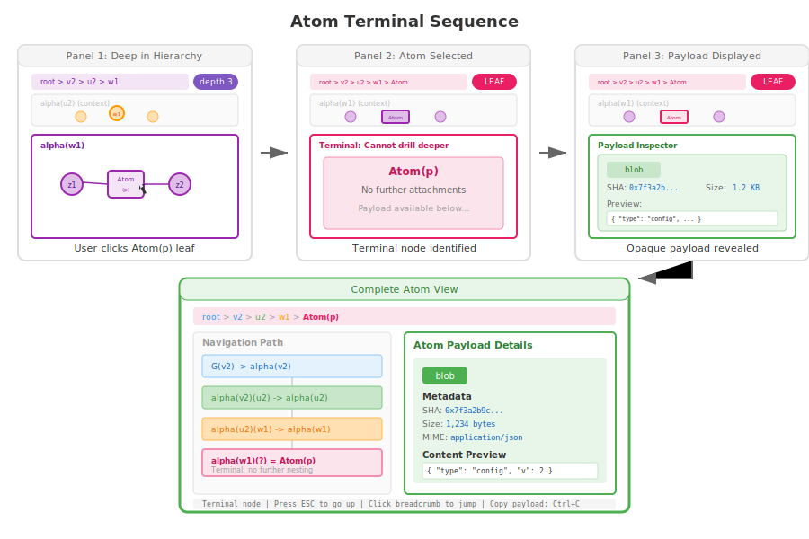
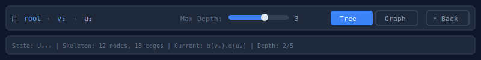

# Two-Plane State Explorer

## Overview

The Two-Plane Explorer visualizes WARP states as they truly are: a skeleton graph (the coarse wiring) with recursively attached WARP graphs at each vertex and edge. This directly implements the `U = (G; α, β)` structure from Paper I.

## Feasibility Analysis

### Feasibility Score: ⚠️ PARTIAL (60%)

**What's Implemented:**
- Flat graph structure: nodes (OR-Set of string IDs) + edges (OR-Set of "from\0to\0label" keys)
- Properties as LWW registers (node/edge properties stored in flat Map)
- Query API: `getNodes()`, `getEdges()`, `getNodeProps()`, `QueryBuilder`
- No recursive nesting - properties are JSON values or blob references, not sub-graphs

**What's NOT Implemented (Paper I concepts):**
- Recursive WARP attachments α(v) and β(e) - vertices/edges do NOT carry nested WARP graphs
- Atom(p) terminal types - nodes are string IDs, not Atom wrappers with payloads
- Depth/unfolding tower - structure is flat (depth=1 always)
- "Graphs all the way down" - properties are terminal values

**Visualization Adaptations Required:**
The visualization must be redesigned for the flat model:
- **Skeleton Plane**: Show nodes + edges (this works as-is)
- **Attachment Plane**: Show properties panel instead of nested graphs
- **Drill-down**: Navigate to property details, blob contents, or related nodes - NOT recursive sub-graphs
- **No depth badges**: Everything is depth 1

**Requirements to Enable Full Paper I Visualization:**
1. Implement recursive attachment types in `WarpTypesV2.js`
2. Extend OR-Set to store attachment references instead of just existence dots
3. Add Atom(p) value type alongside inline/blob
4. Implement depth computation and unfolding
5. Update JoinReducer to merge nested attachments

**Estimated effort for full implementation**: 4-6 weeks

**Recommendation**: Build a "Property Explorer" visualization that accurately reflects the flat model. Reserve the recursive two-plane concept for future versions if/when attachment nesting is implemented.

## Core Concept

The visualization splits into two synchronized planes:
- **Skeleton Plane** (top): The typed open graph showing nodes and edges
- **Attachment Plane** (bottom): Drill-down view of the WARP attached at a selected position

As the user selects different skeleton positions, the attachment plane updates to show what's "inside" that vertex or edge.

## Mockup



## Interaction Sequence

### 1. Initial Load



### 2. Select Node


### 3. Drill Down (Recursive)



### 4. Atom Terminal



## UI Controls



## Features

### Depth Limiting
Users can set a maximum unfolding depth. Attachments beyond that depth render as collapsed badges:
```text
[+] depth 3+ (click to expand)
```

### Property Inspection
Hovering over a node shows its properties (from the LWW registers):
```text
┌─────────────────────────┐
│ v₂                      │
├─────────────────────────┤
│ type: "function"        │
│ name: "processOrder"    │
│ modified: tick 347      │
│ writer: alice           │
└─────────────────────────┘
```

### Edge Attachment View
Clicking an edge shows β(e) - the WARP attached to that edge:
```text
Edge e₁: v₁ → v₂
├─ label: "calls"
└─ attachment: (WARP with 2 nodes)
   ├─ call_site: line 42
   └─ optimization: inlined
```

### Synchronized Highlighting
When viewing an attachment, the parent skeleton position remains highlighted, showing the context.

## Technical Notes

- Uses force-directed layout for skeleton plane (d3-force or similar)
- Attachment plane can switch between tree and graph layouts
- Animations use CSS transitions for smooth drilling
- State is loaded lazily - attachments fetched on demand from the WARP backend
- Keyboard navigation: arrow keys to move between nodes, Enter to drill down, Escape to go up

### Implementation Reality (Flat Model)

The current git-warp implementation uses flat properties, not recursive attachments:
- **Properties are terminal values**: Node and edge properties are stored as LWW registers containing JSON values or blob references - they are NOT nested WARP graphs
- **Drill-down shows property details**: When a user "drills down" on a node, they see a property inspector panel with key-value pairs, blob previews, and LWW metadata (timestamp, writer, patch SHA) - NOT a recursive sub-graph
- **No depth navigation**: Since everything is depth 1, there is no unfolding tower to traverse

**Recommended Rename**: Consider reframing this visualization as "Graph + Property Explorer" to accurately describe what it shows:
- **Graph Plane**: Force-directed node/edge visualization (unchanged)
- **Property Plane**: Detailed property inspector with LWW provenance, blob expansion, and related node navigation

This framing sets accurate expectations and avoids confusion with the full Paper I recursive model.
