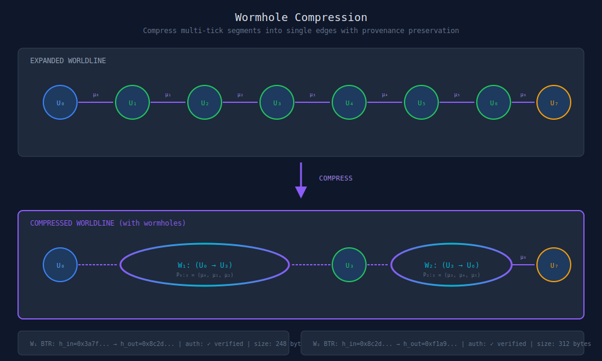
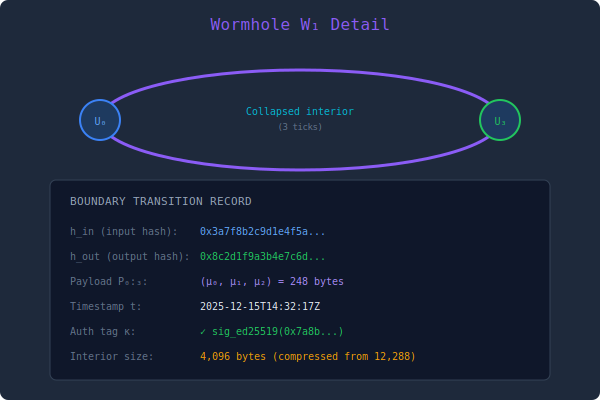
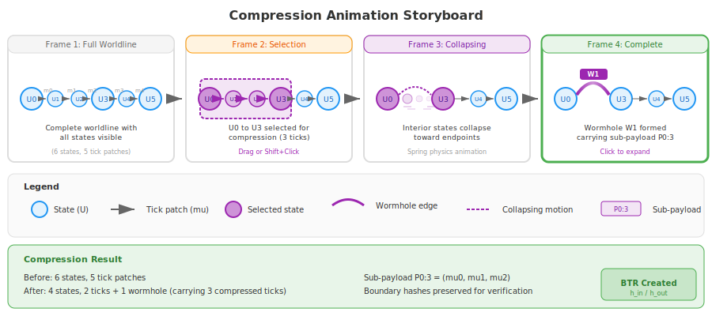
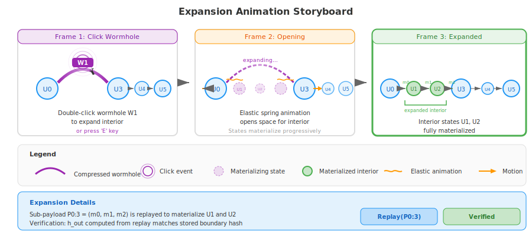

# Wormhole Compression Viewer

## Overview

The Wormhole Compression Viewer visualizes the compression and expansion of multi-tick worldline segments. A wormhole edge `(Uᵢ, W(Uᵢ, Uᵢ₊ₖ), Uᵢ₊ₖ)` represents a collapsed segment carrying its sub-payload.

> **Important**: This visualization plan assumes a wormhole backend that does not yet exist in the codebase. Checkpoints are NOT wormholes—they are state snapshots, not compressed segments with sub-payloads. BTR (Boundary Transition Record) packaging is planned but not implemented.

## Feasibility Analysis

### Feasibility Score: ❌ NOT YET IMPLEMENTED (20%)

**What's Implemented:**
- **Checkpoints** (`CheckpointService.js`): State snapshots at specific points
  - Contains: state.cbor, frontier.cbor, appliedVV.cbor, visible.cbor
  - Enables incremental materialization (load checkpoint, apply patches since)
- **State hashing**: `computeStateHashV5()` for integrity verification
- **GC/compaction**: Tombstone cleanup via `GCPolicy.js`

**What's NOT Implemented (Paper III wormhole concepts):**
- **Wormhole data structure**: No `W = (Uᵢ, P_{i:k}, Uᵢ₊ₖ)` type
- **Sub-payload**: No compressed patch range inside wormhole edges
- **Payload monoid operations**: No wormhole concatenation
- **Nested wormholes**: Cannot nest without wormhole type
- **BTR packaging**: No tamper-evident boundary records with h_in/h_out/κ
- **ProvenancePayload**: Foundation class exists but wormhole integration missing

**ROADMAP Status:**
```text
HOLOGRAM (v8.0.0) — 0% complete
  ○ HG/PROV/1  [OPEN]     — ProvenancePayload foundation (5 hrs)
  ○ HG/WORM/1  [BLOCKED]  — Wormhole compression (6 hrs) ← blocked on HG/PROV/1
  ○ HG/BTR/1   [BLOCKED]  — BTR packaging (5 hrs) ← blocked on HG/PROV/1
```

**Dependency Chain:**
```text
Wormhole Visualization
        ↓ requires
    HG/WORM/1 (wormhole compression)
        ↓ blocked by
    HG/PROV/1 (ProvenancePayload)
```

**What CAN Be Built Today (Workaround):**
- **Checkpoint-based "pseudo-wormhole"**: Visualize checkpoints as collapsed segments
- **Manual segment selection**: UI to select patch range, show as compressed
- **No backend wormhole object**: Visualization only, no persistence

**Requirements to Enable Full Wormhole Visualization:**
1. Implement `HG/PROV/1` — ProvenancePayload with monoid operations (~5 hrs)
2. Implement `HG/WORM/1` — WormholeEdge type with sub-payload (~6 hrs)
3. Implement `HG/BTR/1` — BTR serialization with hash chain (~5 hrs)
4. Add `graph.createWormhole(fromSha, toSha)` API
5. Update materialization to replay wormhole sub-payloads

**Estimated effort**: 2-3 weeks (backend) + 1-2 weeks (visualization)

**Recommendation**:
- **Option A**: Wait for v8.0.0 HOLOGRAM milestone, then build visualization
- **Option B**: Build checkpoint-based mockup now, swap in real wormholes when available
- **Option C**: Contribute to HG/PROV/1 and HG/WORM/1 implementation to unblock

## Core Concept

Wormholes are:
- **Semantically redundant**: The sub-payload fully determines the interior
- **Operationally useful**: Single handle for indexing, checkpointing, replication
- **Composable**: Payload monoid makes chaining natural

The viewer shows:
1. Worldline with wormhole overlays
2. Compression/expansion animation
3. BTR packaging for wormhole boundaries

## Main Visualization



## Wormhole Detail View



## ASCII Terminal Version

```text
╔══════════════════════════════════════════════════════════════════════════════╗
║  WORMHOLE COMPRESSION VIEWER                                                 ║
╠══════════════════════════════════════════════════════════════════════════════╣
║                                                                              ║
║  EXPANDED WORLDLINE                                                          ║
║  ─────────────────                                                           ║
║                                                                              ║
║  (U₀)──μ₀──>(U₁)──μ₁──>(U₂)──μ₂──>(U₃)──μ₃──>(U₄)──μ₄──>(U₅)──μ₅──>(U₆)     ║
║                                                                              ║
║                              │                                               ║
║                              │ COMPRESS                                      ║
║                              ▼                                               ║
║                                                                              ║
║  COMPRESSED WORLDLINE (with wormholes)                                       ║
║  ─────────────────────────────────────                                       ║
║                                                                              ║
║  (U₀)══════╗                         ╔══════(U₆)                             ║
║            ║   W₁: P₀:₃              ║                                       ║
║            ╠════════════════════╗    ║   W₂: P₃:₃                            ║
║            ║   (U₀ → U₃)        ║    ╠══════════════════╗                    ║
║            ╚═══════════════(U₃)═╝    ║   (U₃ → U₆)      ║                    ║
║                              └───────╚═════════════════(U₆)──μ₅──>(U₇)       ║
║                                                                              ║
╠══════════════════════════════════════════════════════════════════════════════╣
║  WORMHOLE SUMMARY                                                            ║
║  ─────────────────                                                           ║
║                                                                              ║
║  │ Wormhole │ Entry │ Exit │ Ticks │  Payload  │   Hash In  │  Hash Out │   ║
║  ├──────────┼───────┼──────┼───────┼───────────┼────────────┼───────────┤   ║
║  │    W₁    │  U₀   │  U₃  │   3   │ 248 bytes │ 0x3a7f... │ 0x8c2d... │   ║
║  │    W₂    │  U₃   │  U₆  │   3   │ 312 bytes │ 0x8c2d... │ 0xf1a9... │   ║
║  └──────────┴───────┴──────┴───────┴───────────┴────────────┴───────────┘   ║
║                                                                              ║
║  Compression: 7 ticks → 2 wormholes + 1 tick                                 ║
║  Storage: 12,288 bytes → 560 bytes (95.4% reduction)                         ║
║                                                                              ║
╠══════════════════════════════════════════════════════════════════════════════╣
║  [E: Expand W₁]  [C: Compress]  [V: Verify]  [X: Export BTR]  [q: quit]     ║
╚══════════════════════════════════════════════════════════════════════════════╝
```

## Animation Sequence

### Compression Animation



The compression animation proceeds in four frames:
1. **Full Worldline** - Complete worldline with all states visible
2. **Selection** - User selects U0 to U3 for compression (drag or Shift+Click)
3. **Collapsing** - Interior states collapse toward endpoints with spring physics
4. **Complete** - Wormhole W1 formed carrying sub-payload P0:3

### Expansion Animation



The expansion animation proceeds in three frames:
1. **Click Wormhole** - User double-clicks wormhole W1 (or presses 'E' key)
2. **Opening** - Elastic spring animation opens space for interior states
3. **Expanded** - Interior states U1, U2 fully materialized with tick patches

## Interaction Modes

### 1. Create Wormhole
- Drag to select tick range
- Click "Compress"
- System creates wormhole + BTR

### 2. Expand Wormhole
- Double-click wormhole
- Or click and press 'E'
- Interior animates into view

### 3. Verify Wormhole
- Click wormhole, press 'V'
- System replays sub-payload
- Confirms h_out matches

### 4. Chain Wormholes
- Multiple wormholes can share boundaries
- `W₁.h_out == W₂.h_in` links them

## Features

### Nested Wormholes
A wormhole's sub-payload can contain wormholes:
```text
W_outer = (U₀, [W₁, μ₄, W₂], U₁₀)
         where W₁ = (U₀, [μ₀, μ₁, μ₂], U₃)
               W₂ = (U₅, [μ₅, μ₆, μ₇, μ₈], U₉)
```

### Wormhole Metrics
- Entry/exit state hashes
- Sub-payload size
- Compression ratio
- Verification status

### Export Options
- Export wormhole as BTR file
- Export expansion as full worldline
- Export nested structure diagram

## Technical Notes

- Wormhole edges use quadratic bezier curves in expanded view
- Animation uses spring physics for natural collapse/expand feel
- BTR hashes computed on-the-fly for verification
- Large sub-payloads load progressively during expansion
