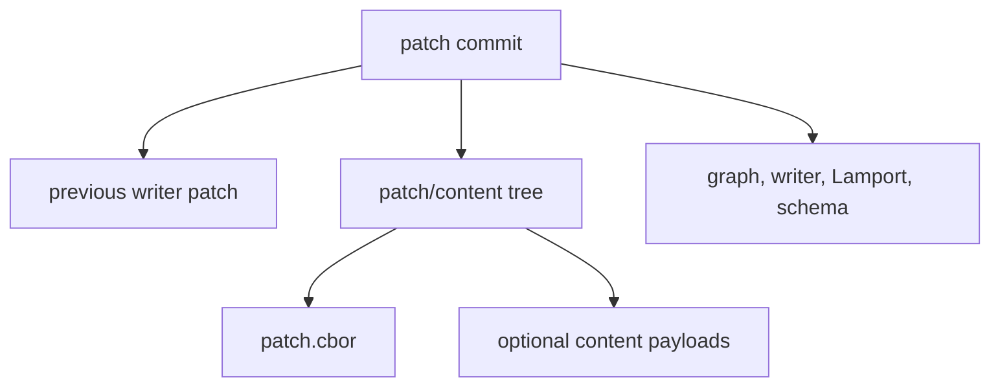

# Git substrate

Use this page when you need to understand what lives in Git and why replay is
deterministic.

## Public roots

`git-warp` exposes three public roots:

- `openWarpWorldline()` for application code and agent workflows;
- `openWarpGraph()` for diagnostics, sync, checkpoints, provenance,
  comparison, strands, migration, and compatibility;
- `WarpApp` and `WarpCore` for legacy facade compatibility and substrate
  tooling.

Application code should start with `openWarpWorldline()`. Drop to
`openWarpGraph()` when the task is intentionally substrate-level.

## WARP refs

WARP data stays under `refs/warp/...`, outside normal source-tree refs:

```text
refs/warp/<graphName>/
├── writers/
│   ├── alice
│   └── bob
├── checkpoints/
│   └── head
├── coverage/
│   └── head
├── cursor/
│   ├── active
│   └── saved/<name>
├── strand-braids/
│   └── <strand>/<support>
├── audit/
│   └── <writerId>
└── trust/
    └── ...
```

Normal source code remains under refs such as `refs/heads/main`.

## Patch commits

At the substrate level, a WARP patch is a Git commit on a WARP ref.



Patch commits may carry Git trees for payloads and content. Do not document a
blanket empty-tree invariant for current graph state.

## Replay convergence

Each writer appends an independent patch chain. Visible state is derived by
replaying the visible patches and reducing them with deterministic CRDT rules:

- nodes and edges use OR-Set semantics;
- properties use last-writer-wins registers;
- Lamport ticks plus writer identity provide deterministic ordering;
- version vectors distinguish causal order from concurrency.

That is why multiple writers can work independently and later converge without
source-tree merge conflicts for graph data.

## Checkpoints

Checkpoints persist folded state plus index, frontier, and schema metadata.
They accelerate recovery and bounded-read evidence. They are not the source of
truth; patch history remains authoritative.

Use [Operations](../operations/) for checkpoint and GC workflows.

## Provenance

Provenance APIs explain which patches contributed to an entity or slice.
`materializeSlice(nodeId)` can replay a single entity's backward causal cone for
diagnostics. It is not the first-use application read path.

## Content storage

Patch trees can carry payloads and content pointers. Larger payloads and
encrypted content are handled through CAS-backed adapters. Use
[Content and CAS](content-and-cas.md) for content attachments, git-cas, and
encryption posture.

## Strands and braids

Strands are durable speculative lanes built on pinned observations and overlay
patch logs. Braid refs record pinned support overlays for strand composition.

Use [Strands](strands.md) for user-facing strand and braid workflows.

## Continuum boundary

git-warp owns local runtime truth over Git-backed history. Continuum owns the
shared boundary vocabulary for witnessed history exchange. Use
[Continuum boundary](continuum-boundary.md) for that relationship.

## See also

- [Getting started](getting-started.md)
- [Querying](querying.md)
- [Content and CAS](content-and-cas.md)
- [Operations](../operations/)
- [Troubleshooting](troubleshooting.md)
