# v19.1.0 release witness: bounded tries and compound admission

This document is the architectural and evidentiary witness for
<code>@git-stunts/git-warp</code> v19.1.0. It explains what changed, why it
changed, which meanings were preserved, how the trie actually reaches Git
bytes, which measurements are authoritative, which apparent wins were rejected,
and what a consumer must know before upgrading.

The release thesis is simple:

> git-warp used to perform logically bounded work through physically fragmented
> Git operations. v19.1.0 preserves the same causal history, materialization
> identity, trie representation, and read results while admitting dependent
> artifacts in bounded waves and reusing lower-level Git sessions.

The word **witness** is deliberate. This is not a roadmap, a design proposal, or
a victory lap. The implementation already merged. The claims below are tied to
source paths, deterministic tests, a controlled versioned corpus, exact replay
evidence, an audited commit, a hosted base/head comparison, a migrated-v18
comparison, and a bounded-memory streaming control.

## Release ruling at a glance

v19.1.0 is primarily a performance and operational-integrity release. It does
not change the v19 storage format and it does not require a repository
migration. It does change default checkpoint behavior, and it contains an
explicitly unofficial Entity API preview whose TypeScript union widening can
affect exhaustive consumers. Those two facts are disclosed rather than hidden
behind the word “performance.”

| Surface                     | v19.1.0 ruling                                                          | Consumer consequence                                                |
| --------------------------- | ----------------------------------------------------------------------- | ------------------------------------------------------------------- |
| Patch history               | Same causal patch meaning and order                                     | No history rewrite                                                  |
| Trie encoding               | Same route keys, leaf envelope, branch members, and root identity rules | No storage migration                                                |
| Materialization cache       | Same coordinate and semantic fingerprint                                | Existing retained values remain readable                            |
| Physical publication        | Fewer, bounded compound admissions and persistent Git sessions          | Large cold and incremental reads become materially cheaper          |
| Default checkpoint policy   | Omitted policy now means <code>{ every: 64 }</code>                     | New checkpoint commits may appear after the inclusive threshold     |
| Explicit checkpoint opt-out | <code>checkpointPolicy: null</code> remains supported                   | Deliberate no-checkpoint deployments retain their choice            |
| Entity API                  | Included as an unofficial, unstable preview                             | Do not build authority-sensitive production semantics on it yet     |
| Think integration           | Dependency-only follow-up                                               | No Think data-model or source-occurrence migration in this campaign |

The architectural distinction that keeps this release honest is:

> Logical granularity and physical granularity are different axes.

A patch is still a patch. A trie leaf is still independently addressed. A
materialization root is still content-addressed. A receipt still proves the
same admitted outcome. What changed is how many of the dependent physical
operations share a bounded staging scope and how many times the host must start
Git.

**Section verdict:** v19.1.0 changes the cost and publication topology, not the
meaning of retained state. Its two compatibility caveats are named separately
so “no migration” is never misread as “no observable change.”

## 1. The failure that forced the architecture work

The motivating Think symptom was absurd on its face: a 15-byte capture could
produce a 33,624-byte patch, and a bounded-looking read could start 5,267 Git
processes. The patch size exposed a future data-model problem in Think—derived
aggregate state had been copied forward as if it were source history. The
process count exposed a lower-layer problem in git-warp: even when its domain
work was bounded, its Git execution topology was fragmented.

This release addresses the lower-layer problem first. It does **not** smuggle
the larger Think source-occurrence redesign into a performance release.

Before this campaign, three multiplication effects could compound:

1. Patch-chain discovery asked Git about one commit at a time.
2. Object reads opened one-shot blob processes instead of preserving a bounded
   object session.
3. Trie and materialization publication crossed the git-cas boundary once per
   page, bundle, index root, or retention step.

The result was not “Git is slow.” The result was an architecture that repeatedly
paid process startup, repository discovery, configuration, object-database
initialization, protocol setup, and reference-publication overhead for tiny
units of work.

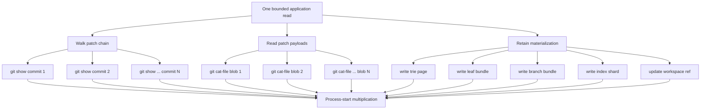
```mermaid
flowchart TB
    A["One bounded application read"] --> B["Walk patch chain"]
    B --> C1["git show commit 1"]
    B --> C2["git show commit 2"]
    B --> C3["git show ... commit N"]
    A --> D["Read patch payloads"]
    D --> E1["git cat-file blob 1"]
    D --> E2["git cat-file blob 2"]
    D --> E3["git cat-file ... blob N"]
    A --> F["Retain materialization"]
    F --> G1["write trie page"]
    F --> G2["write leaf bundle"]
    F --> G3["write branch bundle"]
    F --> G4["write index shard"]
    F --> G5["update workspace ref"]
    C1 --> H["Process-start multiplication"]
    C2 --> H
    C3 --> H
    E1 --> H
    E2 --> H
    E3 --> H
    G1 --> H
    G2 --> H
    G3 --> H
    G4 --> H
    G5 --> H
```

<details>
<summary>Figure 1 — The old process-multiplication topology</summary>

The application asks one bounded question, but the implementation repeatedly
crosses the Git process boundary. The diagram is conceptual: it shows the
sources of multiplication rather than claiming that every materialization
contains exactly the illustrated objects.

</details>

| Boundary crossing | Old physical behavior                      | Why it was expensive                                           |
| ----------------- | ------------------------------------------ | -------------------------------------------------------------- |
| Chain metadata    | One <code>git show</code> per patch commit | Cost grew with history length times spawn latency              |
| Payload bytes     | One-shot blob reads                        | Repeated object-session initialization                         |
| Trie persistence  | Singleton page and bundle calls            | Repeated staging and publication mechanics                     |
| Derived indexes   | Independent shard/root admissions          | Related objects could not share one scope                      |
| Retention         | Intermediate checkpointing                 | More commits and ref updates than the final authority required |

The practical diagnosis came from counting child processes, not guessing from
wall time. On a real 745-patch Think writer chain, the optimized discovery and
object-read path reduced a consumer-level spawn census from 3,205 children to 27. All 3,179 one-shot <code>git cat-file blob</code> children disappeared;
two bounded <code>git cat-file --batch-command</code> sessions served the
object-read path. The normalized output still contained the same 54 semantic
JSON events.

That evidence proved the process topology was real. It did not yet prove the
complete v19.1.0 release, which is why the controlled corpus described next
became the canonical example.

**Section verdict:** the defect was architectural fragmentation across a
process boundary. Treating it as a micro-optimization inside a JavaScript loop
would not have addressed the dominant cost.

## 2. Canonical example: Corpus 19C0FFEE

Every concept in this witness follows one real fixture: the checked-in v2
materialization corpus seeded with hexadecimal <code>0x19c0ffee</code>. We will
call it **Corpus 19C0FFEE**.

The corpus is intentionally small enough to finish reliably and deliberately
shaped to cross the runtime’s default checkpoint boundary:

| Property                |         Canonical value | Why it matters                                    |
| ----------------------- | ----------------------: | ------------------------------------------------- |
| Seed                    | <code>0x19c0ffee</code> | Makes generation reproducible                     |
| Topology                |          Directed chain | Keeps semantic cardinality obvious                |
| Base nodes              |                      65 | Crosses the 64-patch checkpoint interval          |
| Base patches            |                      65 | Makes causal depth independent of payload volume  |
| Suffix nodes            |                       5 | Creates a bounded incremental tail                |
| Suffix patches          |                       5 | Proves predecessor reuse plus exact suffix replay |
| Property bytes per node |                     256 | Exercises real retained property pages            |
| Measured samples        |          5 per scenario | Supports medians and dispersion                   |
| Warmups                 |          1 per scenario | Removes first-run setup from measured samples     |

Each patch adds one node, one deterministic <code>payload</code> property, and,
after the first node, one edge from the preceding node. The base therefore
contains a 65-node directed chain. The suffix extends it to 70 nodes without
changing the already-retained base coordinate.

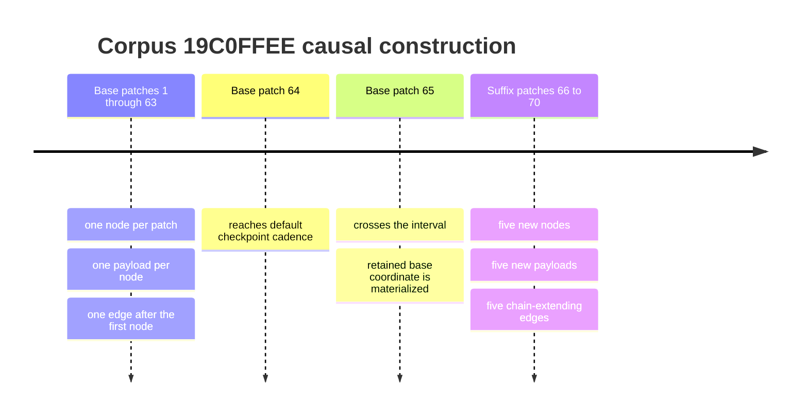
```mermaid
timeline
    title Corpus 19C0FFEE causal construction
    Base patches 1 through 63 : one node per patch
                              : one payload per node
                              : one edge after the first node
    Base patch 64             : reaches default checkpoint cadence
    Base patch 65             : crosses the interval
                              : retained base coordinate is materialized
    Suffix patches 66 to 70   : five new nodes
                              : five new payloads
                              : five chain-extending edges
```

<details>
<summary>Figure 2 — The canonical corpus timeline</summary>

The fixture separates patch count from node count explicitly. A previous
one-patch benchmark could grow payload volume without exercising causal-chain
depth; this v2 corpus cannot.

</details>

| Phase          | Authoritative history       | Retained materialization posture      |
| -------------- | --------------------------- | ------------------------------------- |
| Before patch 1 | Empty                       | None                                  |
| After patch 64 | 64 causal patches           | Default checkpoint threshold reached  |
| After patch 65 | 65 causal patches           | Base coordinate can be retained       |
| After patch 70 | Base plus five-patch suffix | Base remains a compatible predecessor |

The same corpus is read in three postures. These are not three arbitrary timing
labels; they are three different evidence obligations:

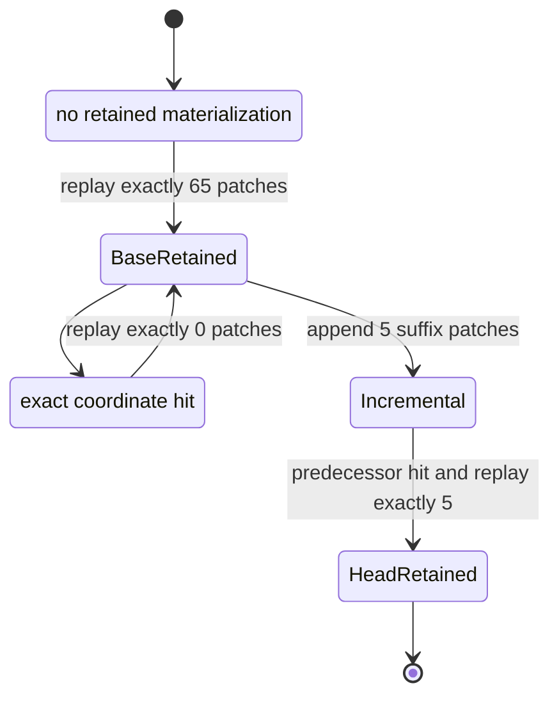
```mermaid
stateDiagram-v2
    [*] --> Cold
    Cold: no retained materialization
    Cold --> BaseRetained: replay exactly 65 patches
    BaseRetained --> Warm
    Warm: exact coordinate hit
    Warm --> BaseRetained: replay exactly 0 patches
    BaseRetained --> Incremental: append 5 suffix patches
    Incremental --> HeadRetained: predecessor hit and replay exactly 5
    HeadRetained --> [*]
```

<details>
<summary>Figure 3 — Cold, warm, and incremental evidence states</summary>

The state transition labels are correctness assertions. A faster result is
invalid if cold skips any of 65 patches, warm replays anything, or incremental
replays anything other than the five-patch suffix.

</details>

| Scenario    | Required hit evidence      | Required replay evidence | Required semantic evidence                      |
| ----------- | -------------------------- | -----------------------: | ----------------------------------------------- |
| Cold        | No retained basis          |                       65 | Exact nodes, edges, properties, and fingerprint |
| Warm        | Exact git-cas hit          |                        0 | Same fingerprint as cold                        |
| Incremental | Compatible predecessor hit |                        5 | Exact head cardinality and fingerprint          |

This fixture replaced a rejected 1,500-node profile. One worker in that profile
exceeded the ten-minute timeout. A benchmark that cannot finish predictably is
not a release gate; it is an anecdote generator. Corpus 19C0FFEE keeps the
critical checkpoint and suffix behavior while completing on both local and
hosted runners.

**Section verdict:** Corpus 19C0FFEE is the running example because it is
causally non-vacuous, deterministic, bounded, and strict enough to catch both
history-traversal and retained-publication regressions.

## 3. The cast: four layers, four responsibilities

The campaign followed the publication sequence
<code>Plumbing → git-cas → git-warp → Think</code> because each layer consumes
capabilities from the layer beneath it. That sequence is a dependency order,
not a claim that the packages share one undifferentiated transaction.

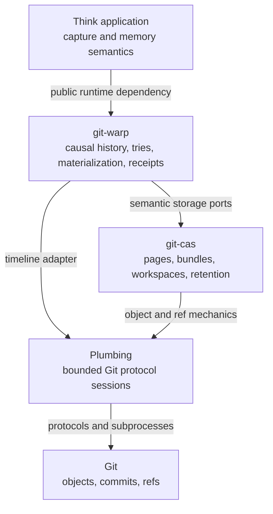
```mermaid
flowchart TB
    THINK["Think application<br/>capture and memory semantics"]
    WARP["git-warp<br/>causal history, tries, materialization, receipts"]
    CAS["git-cas<br/>pages, bundles, workspaces, retention"]
    PLUMB["Plumbing<br/>bounded Git protocol sessions"]
    GIT["Git<br/>objects, commits, refs"]

    THINK -->|"public runtime dependency"| WARP
    WARP -->|"semantic storage ports"| CAS
    WARP -->|"timeline adapter"| PLUMB
    CAS -->|"object and ref mechanics"| PLUMB
    PLUMB -->|"protocols and subprocesses"| GIT
```

<details>
<summary>Figure 4 — Dependency and responsibility stack</summary>

The arrows show dependency direction. Think owns application meaning; git-warp
owns causal runtime meaning; git-cas owns content-addressed staging and
retention; Plumbing owns bounded Git protocols; Git owns durable objects and
refs.

</details>

| Layer    | Owns                                                              | Does not own                                   |
| -------- | ----------------------------------------------------------------- | ---------------------------------------------- |
| Think    | What a capture means and how a mind is read                       | Trie fanout, Git subprocesses, CAS generations |
| git-warp | Patches, causal lanes, ORSets, retained materialization, receipts | Git process implementation details             |
| git-cas  | Page/bundle handles, workspace generations, compound retention    | Causal patch meaning                           |
| Plumbing | Persistent object/ref sessions and bounded protocol requests      | Materialization semantics                      |
| Git      | Object database and reference updates                             | Application or causal ontology                 |

The improvement required all three infrastructure packages:

- Plumbing v3.3.0 made bounded multi-operation Git sessions available.
- git-cas v6.5.10 turned those primitives into bounded page, bundle, asset, and
  workspace admission.
- git-warp v19.1.0 changed its trie and materialization paths to actually use
  those capabilities.

Installing a faster Plumbing package without changing git-warp’s call topology
would not be enough. Likewise, adding a git-cas batch API without preserving
trie dependency order would be fast but wrong.

**Section verdict:** performance improved because responsibility stayed
separated while physical operations became composable. No layer had to steal
another layer’s semantics.

## 4. The trie’s job inside git-warp

The trie in this release is a content-addressed shadow structure for ORSet
state. It is not a general-purpose semantic entity database. For node and edge
liveness, it maps an element identifier to its observed and tombstoned causal
dots.

A useful mental model is:

1. The element identifier is hashed into a uniformly distributed 256-bit route
   key.
2. Successive fixed-width slices select branch slots.
3. The remaining suffix is stored in a sorted leaf entry.
4. Leaves split when they grow beyond the configured capacity.
5. A mutation dirties only the changed leaf and ancestor path.
6. Clean siblings retain their existing content-addressed handles.
7. A bottom-up flush writes children before parents and returns one new root.

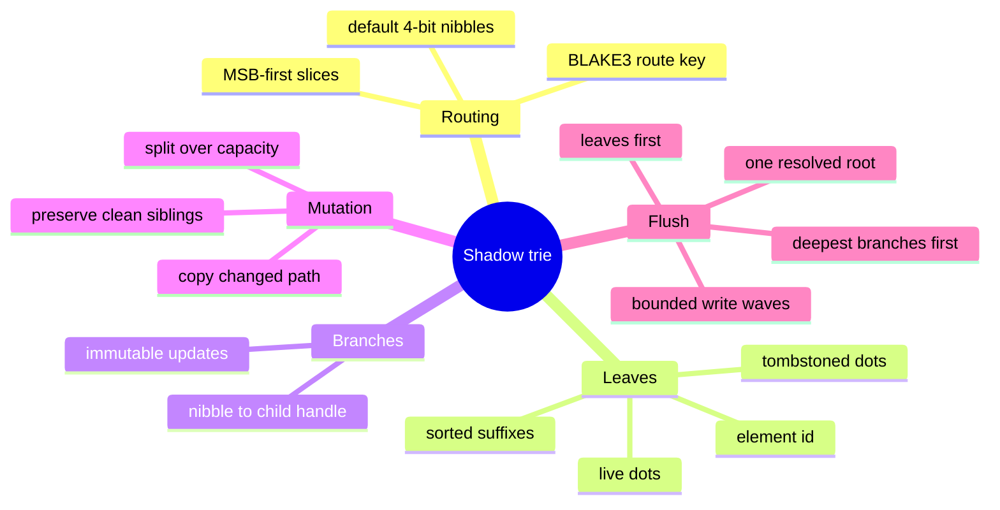
```mermaid
mindmap
  root((Shadow trie))
    Routing
      BLAKE3 route key
      MSB-first slices
      default 4-bit nibbles
    Leaves
      sorted suffixes
      element id
      live dots
      tombstoned dots
    Branches
      nibble to child handle
      immutable updates
    Mutation
      copy changed path
      split over capacity
      preserve clean siblings
    Flush
      leaves first
      deepest branches first
      bounded write waves
      one resolved root
```

<details>
<summary>Figure 5 — Trie concepts before storage mechanics</summary>

The mind map separates the logical structure from Git. Route keys, leaf
contents, branch selection, and split behavior are domain concerns. Page,
bundle, process, and ref mechanics appear later at adapter boundaries.

</details>

| Concept           | Runtime type              | Invariant                                           |
| ----------------- | ------------------------- | --------------------------------------------------- |
| Route             | <code>RouteKey</code>     | Exactly 32 immutable bytes                          |
| Geometry          | <code>TrieGeometry</code> | Fanout and nibble width agree                       |
| Leaf              | <code>TrieLeaf</code>     | Entries strictly byte-lex sorted                    |
| Branch            | <code>TrieBranch</code>   | Nibbles fall inside geometry fanout                 |
| Mutation snapshot | <code>DirtyPageSet</code> | No path is both leaf and branch                     |
| Flush result      | <code>FlushResult</code>  | Root and write metrics describe one completed flush |

Corpus 19C0FFEE uses this trie for retained node and edge ORSet roots. The
properties themselves are retained through property-index pages; the trie does
not secretly absorb every graph field. This matters when counting both logical
artifacts and physical writes.

**Section verdict:** the trie is a deterministic, structurally shared ORSet
index. Understanding that narrow job prevents both undercounting its causal
data and overclaiming it as the entire graph.

## 5. From an element identifier to route-key bytes

Route selection begins with <code>RouteKey.fromElement(element)</code>. The
element’s UTF-8 bytes are hashed with BLAKE3’s default 32-byte output. The
result is copied into an immutable <code>Uint8Array</code>. Empty element
identifiers and non-32-byte route keys are rejected with typed errors.

The default geometry uses four bits per step. Therefore:

- 32 bytes × 8 bits = 256 route bits.
- 4 bits per step = 64 possible trie depths.
- 4 bits encode values 0 through 15.
- Each default branch has 16 possible slots.
- Bits are read most-significant-first, even for the supported 6-bit geometry
  whose slices can cross byte boundaries.

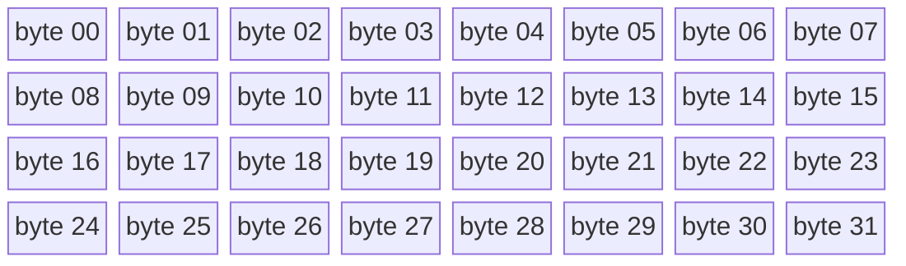
```mermaid
block-beta
    columns 8
    b00["byte 00"]
    b01["byte 01"]
    b02["byte 02"]
    b03["byte 03"]
    b04["byte 04"]
    b05["byte 05"]
    b06["byte 06"]
    b07["byte 07"]
    b08["byte 08"]
    b09["byte 09"]
    b10["byte 10"]
    b11["byte 11"]
    b12["byte 12"]
    b13["byte 13"]
    b14["byte 14"]
    b15["byte 15"]
    b16["byte 16"]
    b17["byte 17"]
    b18["byte 18"]
    b19["byte 19"]
    b20["byte 20"]
    b21["byte 21"]
    b22["byte 22"]
    b23["byte 23"]
    b24["byte 24"]
    b25["byte 25"]
    b26["byte 26"]
    b27["byte 27"]
    b28["byte 28"]
    b29["byte 29"]
    b30["byte 30"]
    b31["byte 31"]
```

<details>
<summary>Figure 6 — The complete 32-byte route-key block</summary>

Every element receives one deterministic 256-bit route key. The diagram shows
all 32 bytes rather than abbreviating the key into a misleading “hash” box.

</details>

| Byte range         | Route-bit range | Default nibble depths |
| ------------------ | --------------- | --------------------- |
| Byte 0             | 255 through 248 | 0 and 1               |
| Bytes 1 through 30 | 247 through 8   | 2 through 61          |
| Byte 31            | 7 through 0     | 62 and 63             |

For one illustrative digest prefix <code>a7 3c …</code>, the default route
steps are <code>a → 7 → 3 → c → …</code>. That example is not a checked-in
Corpus 19C0FFEE identifier; it is a byte-reading foil used to make the MSB-first
rule visible.

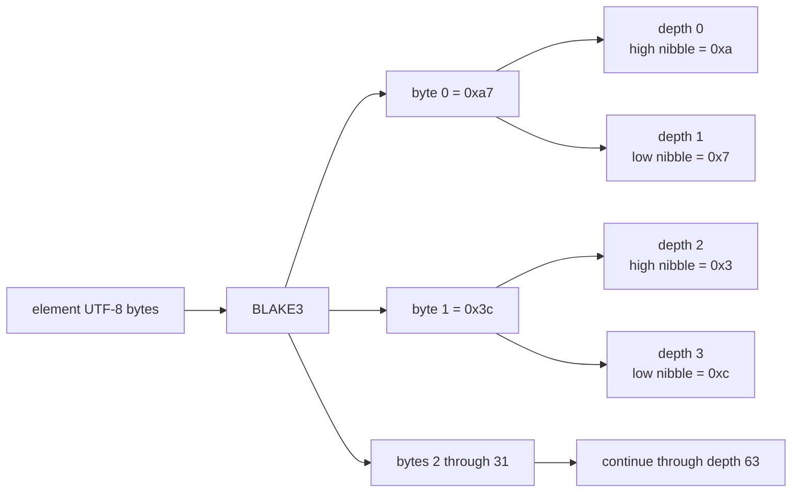
```mermaid
flowchart LR
    E["element UTF-8 bytes"] --> H["BLAKE3"]
    H --> B0["byte 0 = 0xa7"]
    B0 --> N0["depth 0<br/>high nibble = 0xa"]
    B0 --> N1["depth 1<br/>low nibble = 0x7"]
    H --> B1["byte 1 = 0x3c"]
    B1 --> N2["depth 2<br/>high nibble = 0x3"]
    B1 --> N3["depth 3<br/>low nibble = 0xc"]
    H --> REST["bytes 2 through 31"]
    REST --> N63["continue through depth 63"]
```

<details>
<summary>Figure 7 — MSB-first nibble extraction</summary>

The first route step consumes the high four bits of byte zero; the second
consumes the low four bits. Repeating that rule across 32 bytes yields 64
default route positions.

</details>

| Extraction property    | Runtime rule                                                    |
| ---------------------- | --------------------------------------------------------------- |
| Direction              | Most-significant bit first                                      |
| Default width          | 4 bits                                                          |
| Supported widths       | 1, 2, 4, 6, and 8 bits at the route-key layer                   |
| Supported trie fanouts | 16, 64, and 256                                                 |
| Out-of-range behavior  | Typed <code>RouteKeyError</code>                                |
| Textual diagnostics    | Lowercase hexadecimal                                           |
| Storage route          | Raw bytes and path-derived suffixes, not the textual hex string |

Hash routing makes expected path distribution independent of human identifier
prefixes. A thousand identifiers beginning with <code>document:</code> do not
all crowd under a <code>d</code> branch merely because their source strings do.
The cost is that route order is hash order, not human lexical order; semantic
ordering belongs in higher-level readings.

**Section verdict:** one element becomes one immutable 256-bit route key, and
the default trie consumes that key four bits at a time. This byte-level rule is
the foundation for every split, branch path, and structural-sharing decision
that follows.

## 6. Leaf and branch anatomy

The default geometry permits a leaf to hold exactly 64 entries. The sixty-fifth
entry triggers a split because <code>splitRequired</code> uses a strict
greater-than comparison. A leaf with exactly 64 entries remains valid. The
default merge floor is 16; merge becomes required only below that floor.

Every leaf entry contains four fields:

1. The unused route-key suffix below the leaf’s path.
2. The original element identifier.
3. The set of observed live dots.
4. The set of tombstoned dots.

Entries are sorted strictly by suffix bytes. Exact lookup is a binary search
over that sorted array. The full element identifier remains in the leaf so a
hash route never becomes a claim that hash equality is semantic identity.

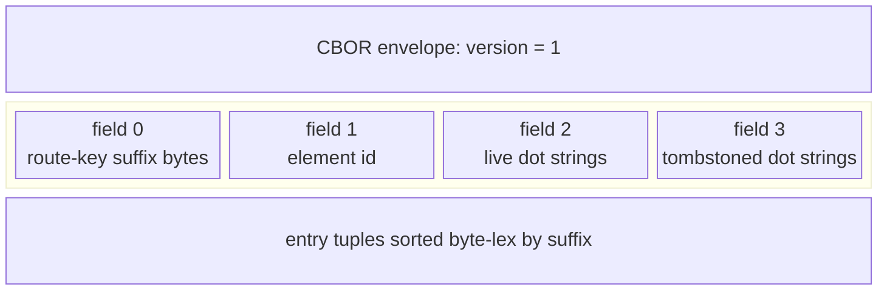
```mermaid
block-beta
    columns 1
    envelope["CBOR envelope: version = 1"]
    block:entries
      columns 4
      suffix["field 0<br/>route-key suffix bytes"]
      element["field 1<br/>element id"]
      dots["field 2<br/>live dot strings"]
      tombstones["field 3<br/>tombstoned dot strings"]
    end
    order["entry tuples sorted byte-lex by suffix"]
```

<details>
<summary>Figure 8 — One leaf’s versioned wire shape</summary>

The leaf serializes as a versioned envelope containing a dense array of
four-field tuples. Sets become arrays at the CBOR boundary; the domain
reconstructs them when decoding.

</details>

| Leaf property    | Preserved invariant                                        |
| ---------------- | ---------------------------------------------------------- |
| Wire version     | Exactly 1 for the current storage representation           |
| Entry density    | Sparse entry arrays are rejected                           |
| Sort order       | Strict ascending byte-lex suffix order                     |
| Lookup           | Binary search for exact suffix                             |
| Causal payload   | Live and tombstoned dots remain distinct                   |
| Identity defense | Original element string accompanies the hash-derived route |

A branch is even narrower. It is an immutable map from a validated nibble to a
child bundle handle. Calling <code>set</code> returns a new branch. In the
default geometry the nibble is 0 through 15; the Git adapter renders those slots
as <code>children/0</code> through <code>children/f</code>.

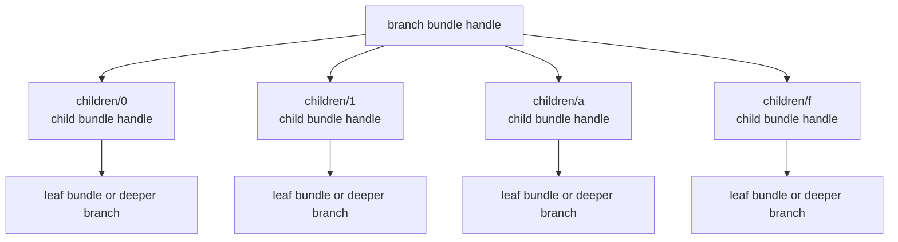
```mermaid
flowchart TB
    R["branch bundle handle"]
    R --> C0["children/0<br/>child bundle handle"]
    R --> C1["children/1<br/>child bundle handle"]
    R --> CA["children/a<br/>child bundle handle"]
    R --> CF["children/f<br/>child bundle handle"]
    C0 --> L0["leaf bundle or deeper branch"]
    C1 --> L1["leaf bundle or deeper branch"]
    CA --> LA["leaf bundle or deeper branch"]
    CF --> LF["leaf bundle or deeper branch"]
```

<details>
<summary>Figure 9 — Default 16-way branch naming</summary>

Only populated slots exist as bundle members. The four pictured members are an
example subset, not a requirement that every branch contain exactly four
children.

</details>

| Branch concern         | Rule                                                  |
| ---------------------- | ----------------------------------------------------- |
| Slot domain            | Integer from zero through fanout minus one            |
| Default textual width  | One hexadecimal digit                                 |
| Child kind             | Another git-cas bundle, representing a leaf or branch |
| Mutation               | Copy-on-write new <code>TrieBranch</code>             |
| Member order           | Numeric nibble order before serialization             |
| Duplicate slot         | Rejected while reading a stored branch                |
| Unexpected member path | Rejected as corrupt storage                           |

The branch does not tag its child as “leaf” or “branch.” The adapter first tries
the leaf representation and otherwise reads branch members. This is an
implementation detail worth knowing because the content-addressed child handle,
not a mutable object header, is the connective tissue.

**Section verdict:** a leaf is a sorted causal payload; a branch is a sparse
immutable nibble map. Both are narrow enough to validate at runtime and stable
enough to preserve the v19 storage format through the performance changes.

## 7. How insertion and splitting work

Consider one Corpus 19C0FFEE node whose route enters an existing leaf. The
cursor descends one nibble at a time, loading only the branch and child pages on
that route. It inserts or updates the leaf entry, marks the leaf dirty, and
rebinds each ancestor with a temporary pending child token.

If the updated leaf holds no more than 64 entries, the mutation stops there.
If it holds 65, the cursor partitions entries by the next nibble, shortens each
stored suffix by the consumed bits, installs child leaves, and replaces the old
leaf with a branch. If any partition still exceeds capacity, splitting
cascades.

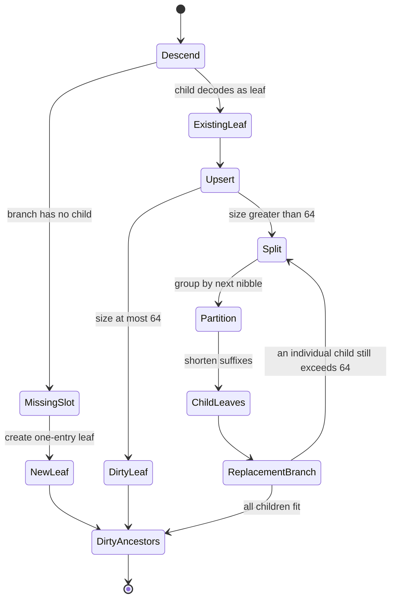
```mermaid
stateDiagram-v2
    [*] --> Descend
    Descend --> MissingSlot: branch has no child
    MissingSlot --> NewLeaf: create one-entry leaf
    Descend --> ExistingLeaf: child decodes as leaf
    ExistingLeaf --> Upsert
    Upsert --> DirtyLeaf: size at most 64
    Upsert --> Split: size greater than 64
    Split --> Partition: group by next nibble
    Partition --> ChildLeaves: shorten suffixes
    ChildLeaves --> ReplacementBranch
    ReplacementBranch --> Split: an individual child still exceeds 64
    ReplacementBranch --> DirtyAncestors: all children fit
    NewLeaf --> DirtyAncestors
    DirtyLeaf --> DirtyAncestors
    DirtyAncestors --> [*]
```

<details>
<summary>Figure 10 — Cursor insertion and split states</summary>

The split threshold is inclusive on capacity and exclusive on overflow:
64 entries fit; 65 split. Cascading continues only when a child partition still
exceeds capacity.

</details>

| State              | Runtime action                                         | Persisted yet? |
| ------------------ | ------------------------------------------------------ | -------------- |
| Descend            | Read branch slot chosen by next route nibble           | No new object  |
| New leaf           | Store one suffix, element, and dot in memory           | No             |
| Upsert             | Produce a sorted replacement leaf                      | No             |
| Partition          | Group by the next nibble and shorten suffixes          | No             |
| Replacement branch | Point at pending child paths                           | No             |
| Snapshot           | Freeze dirty leaves, branches, and clean-child handles | No             |
| Flush              | Resolve pending paths to content-addressed handles     | Yes            |

The distinction between a route path and a stored suffix is easiest to see
through a split. Suppose the cursor has consumed nibbles
<code>a → 7</code>. The leaf does not need to repeat those eight route bits.
Its entries store only what remains. When that leaf splits on nibble
<code>3</code>, the child path becomes <code>a/7/3</code> and the child entries
drop that nibble from their suffixes.

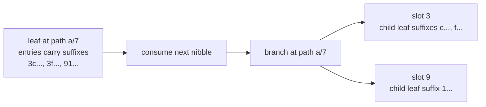
```mermaid
flowchart LR
    BEFORE["leaf at path a/7<br/>entries carry suffixes<br/>3c..., 3f..., 91..."]
    BEFORE --> SPLIT["consume next nibble"]
    SPLIT --> B["branch at path a/7"]
    B --> C3["slot 3<br/>child leaf suffixes c..., f..."]
    B --> C9["slot 9<br/>child leaf suffix 1..."]
```

<details>
<summary>Figure 11 — Prefix consumption during a split</summary>

The route prefix lives in the branch path. Each leaf stores only the remaining
suffix, avoiding repetition of bits already expressed by its location.

</details>

| Before split                                        | After split                                   |
| --------------------------------------------------- | --------------------------------------------- |
| One leaf at <code>a/7</code>                        | One branch at <code>a/7</code>                |
| Suffix begins with the next route nibble            | Branch slot records that nibble               |
| All entries share one page                          | Entries partition into child pages            |
| Parent points to leaf                               | Parent points to replacement branch           |
| Existing persisted handle may be reused until flush | New handles appear only after bottom-up flush |

The cursor never publishes a pending token. Tokens such as
<code>pending:a/7/3</code> exist only in the in-memory dirty graph. The flusher
must replace every pending child with a freshly written or structurally shared
handle. An unresolved token becomes the typed error
<code>E_TRIE_FLUSH_UNRESOLVED</code>.

**Section verdict:** insertion is copy-on-write route descent, and splitting is
prefix consumption plus deterministic partitioning. Pending handles make
unresolved dependencies explicit rather than letting partially wired branches
reach storage.

## 8. Dirty paths and structural sharing

After mutation, <code>TrieCursor.snapshot()</code> produces a
<code>DirtyPageSet</code>. This snapshot is the contract between editing and
publication. It records:

- dirty leaves;
- dirty branches;
- clean children encountered during descent;
- the original root handle.

Paths use a canonical hexadecimal form joined by slashes. The root is the empty
string, <code>[15, 3]</code> becomes <code>f/3</code>, and wider geometries can
use values such as <code>ff</code>.

The key performance property is structural sharing. If Corpus 19C0FFEE changes
one leaf under slot <code>a</code>, an untouched sibling under slot
<code>b</code> keeps its exact old handle. Only the changed leaf and the
ancestor path to the root need new content-addressed objects.

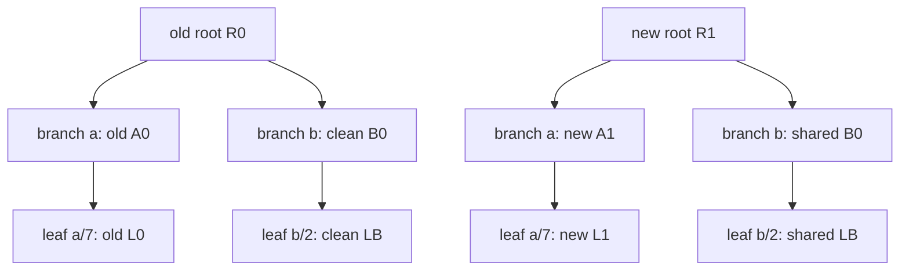
```mermaid
flowchart TB
    OLD["old root R0"]
    OLD --> A0["branch a: old A0"]
    OLD --> B0["branch b: clean B0"]
    A0 --> L0["leaf a/7: old L0"]
    B0 --> LB["leaf b/2: clean LB"]

    NEW["new root R1"]
    NEW --> A1["branch a: new A1"]
    NEW --> B1["branch b: shared B0"]
    A1 --> L1["leaf a/7: new L1"]
    B1 --> LB1["leaf b/2: shared LB"]
```

<details>
<summary>Figure 12 — Copy-on-write path with clean subtree reuse</summary>

The new root changes because one descendant changed. The clean
<code>b</code> subtree retains its old handles exactly; it is not decoded,
rewritten, or republished merely because another path changed.

</details>

| Child-resolution source            | Meaning                                           | Write required? |
| ---------------------------------- | ------------------------------------------------- | --------------- |
| Fresh handle map                   | Child was written earlier in this flush           | Already written |
| Clean-child map                    | Cursor visited but did not modify child           | No              |
| Original non-pending branch member | Another slot changed, this one did not            | No              |
| Pending token                      | Child must have been written but no handle exists | Fail closed     |

The dirty set enumerates pages deepest-first, with equal-depth paths in
ascending nibble order. That deterministic ordering is a dependency contract:
children precede parents, and equal input produces equal write order.

**Section verdict:** the dirty snapshot makes the minimal changed subgraph
explicit. Structural sharing is not an opportunistic cache; it is the reason a
small mutation does not rewrite the entire trie.

## 9. Bottom-up flush and bounded write waves

The old flusher persisted each dirty page through a singleton storage call. The
new flusher preserves the same bottom-up dependency order but groups independent
work into bounded waves.

The algorithm is:

1. Enumerate the immutable dirty snapshot deepest-first.
2. Serialize all dirty leaves deterministically.
3. Write leaf pages in waves bounded by item count and serialized bytes.
4. Wrap the resulting page handles in leaf bundles, also through bounded
   ordered batches.
5. Group branches by equal depth.
6. Resolve every branch child from fresh or structurally shared handles.
7. Write same-depth branch bundles in waves.
8. Continue upward until the empty path resolves to the new root.

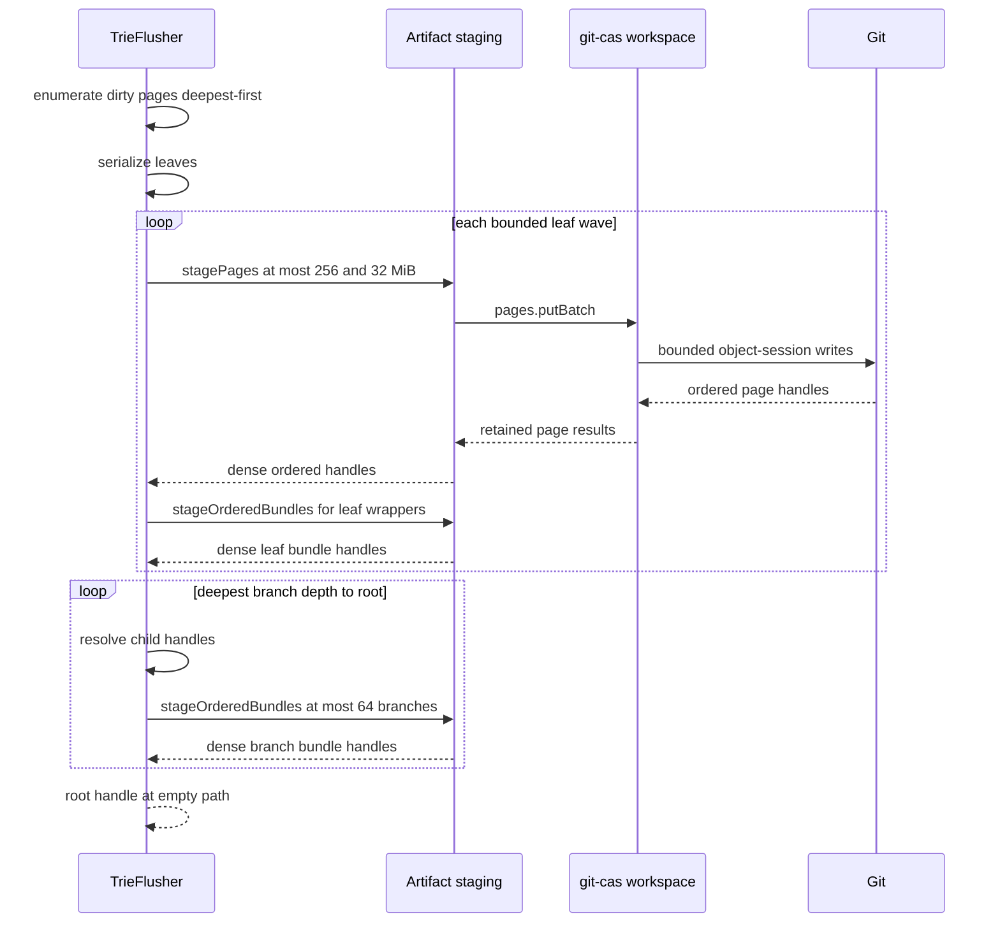
```mermaid
sequenceDiagram
    participant F as TrieFlusher
    participant S as Artifact staging
    participant C as git-cas workspace
    participant G as Git

    F->>F: enumerate dirty pages deepest-first
    F->>F: serialize leaves
    loop each bounded leaf wave
        F->>S: stagePages at most 256 and 32 MiB
        S->>C: pages.putBatch
        C->>G: bounded object-session writes
        G-->>C: ordered page handles
        C-->>S: retained page results
        S-->>F: dense ordered handles
        F->>S: stageOrderedBundles for leaf wrappers
        S-->>F: dense leaf bundle handles
    end
    loop deepest branch depth to root
        F->>F: resolve child handles
        F->>S: stageOrderedBundles at most 64 branches
        S-->>F: dense branch bundle handles
    end
    F-->>F: root handle at empty path
```

<details>
<summary>Figure 13 — One bottom-up trie flush</summary>

Leaves can be written together because no leaf depends on another leaf.
Branches can be written together only at the same depth, after all deeper child
handles are known.

</details>

| Wave                       |                      Domain ceiling | Dependency rule                          |
| -------------------------- | ----------------------------------: | ---------------------------------------- |
| Serialized leaf pages      |                256 items and 32 MiB | Leaves are independent                   |
| Leaf wrapper bundles       | Adapter-constrained ordered batches | Each depends on its page handle          |
| Branch bundles             |                            64 items | Every branch in a wave has equal depth   |
| Next shallower branch wave |                            64 items | Starts only after deeper handles resolve |

The batching doctrine is not “make the batch as large as possible.” It is:

> Admit as much independent work as the smallest applicable safety boundary
> allows.

The leaf wave closes before adding an item that would exceed 32 MiB, or once it
already contains 256 items. Branch waves close when depth changes or the wave
reaches 64 branches. The equality case was audited explicitly: checks use
greater-than-or-equal where a preexisting over-limit count must flush rather
than assuming only exact boundary values can occur.

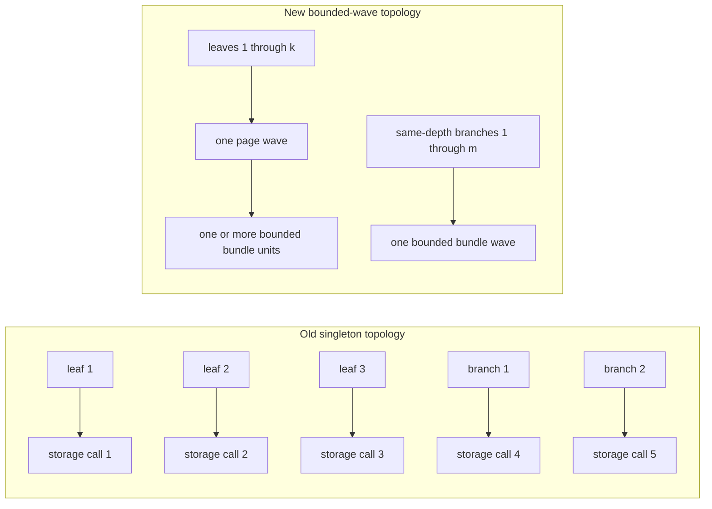
```mermaid
flowchart LR
    subgraph OLD["Old singleton topology"]
      O1["leaf 1"] --> O2["storage call 1"]
      O3["leaf 2"] --> O4["storage call 2"]
      O5["leaf 3"] --> O6["storage call 3"]
      O7["branch 1"] --> O8["storage call 4"]
      O9["branch 2"] --> O10["storage call 5"]
    end
    subgraph NEW["New bounded-wave topology"]
      N1["leaves 1 through k"] --> N2["one page wave"]
      N2 --> N3["one or more bounded bundle units"]
      N4["same-depth branches 1 through m"] --> N5["one bounded bundle wave"]
    end
```

<details>
<summary>Figure 14 — Singleton crossings versus bounded waves</summary>

The new path does not collapse every object into one blob. It keeps independent
content-addressed identities while reducing the number of calls that carry them
through staging and Git.

</details>

| Property         | Singleton path                       | Bounded-wave path                             |
| ---------------- | ------------------------------------ | --------------------------------------------- |
| Leaf identity    | Independent                          | Independent                                   |
| Branch identity  | Independent                          | Independent                                   |
| Write order      | Bottom-up                            | Bottom-up                                     |
| Storage calls    | Approximately one per page or bundle | Approximately one per bounded wave            |
| Fallback support | Native path                          | Preserved for stores without batch capability |
| Error location   | Per singleton                        | Indexed within ordered result                 |

The flusher remains stateless between calls. There is no hidden partially
completed trie transaction to recover. If a flush fails, the caller retries
from a fresh dirty snapshot and the content-addressed objects already written
remain harmless unless retained by an authoritative root.

**Section verdict:** write waves change the crossing count, not the trie’s
object graph. Dependency ordering remains explicit, limits remain finite, and
failure does not manufacture a half-resolved root.

## 10. The nested limit envelope

Several limits apply simultaneously. The domain chooses semantic wave sizes;
the adapter applies the tighter git-cas constraints; git-cas and Plumbing
enforce their own object and protocol bounds.

For trie leaves:

- one serialized leaf may be at most 16 MiB;
- one domain leaf wave may contain at most 256 leaves;
- one domain leaf wave may contain at most 32 MiB of serialized leaf bytes.

For ordered bundle waves:

- one domain branch wave may contain at most 64 branches;
- one adapter batch may contain at most 8,192 members;
- one adapter batch may plan at most 256 Git objects;
- the git-cas batch byte ceiling is 64 MiB;
- one descriptor-tree payload level accounts for 1,023 members.

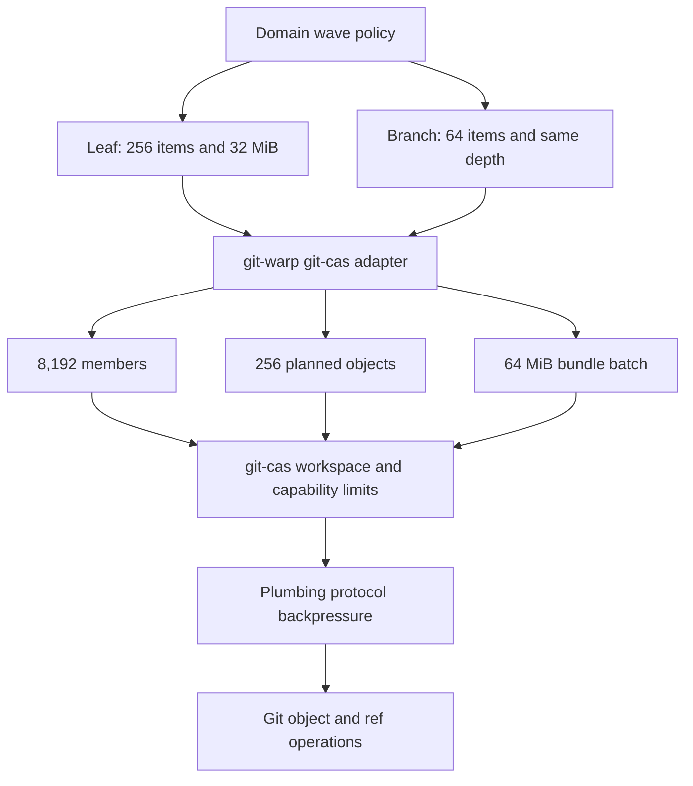
```mermaid
flowchart TB
    D["Domain wave policy"]
    D --> DL["Leaf: 256 items and 32 MiB"]
    D --> DB["Branch: 64 items and same depth"]
    DL --> A["git-warp git-cas adapter"]
    DB --> A
    A --> AM["8,192 members"]
    A --> AO["256 planned objects"]
    A --> AB["64 MiB bundle batch"]
    AM --> C["git-cas workspace and capability limits"]
    AO --> C
    AB --> C
    C --> P["Plumbing protocol backpressure"]
    P --> G["Git object and ref operations"]
```

<details>
<summary>Figure 15 — Limits narrow toward the physical boundary</summary>

No upper layer can enlarge a lower layer’s safe envelope. The effective unit is
the smallest bound that applies to the current page or bundle graph.

</details>

| Limit owner                           | Protects                                     | Failure or fallback posture              |
| ------------------------------------- | -------------------------------------------- | ---------------------------------------- |
| <code>TrieGeometry</code>             | Leaf and branch logical shape                | Split or typed validation error          |
| <code>TrieWriteWavePolicy</code>      | Domain memory and wave size                  | Close current wave                       |
| <code>GitCasTrieStorageProfile</code> | Individual leaf page size                    | Typed store failure                      |
| <code>GitCasTrieWriteBatcher</code>   | Member and planned-object totals             | Split batch or singleton fallback        |
| git-cas                               | Compound operation and byte limits           | Reject before unsafe admission           |
| Plumbing                              | Protocol request validation and backpressure | Reject before or fail session explicitly |

The planned Git-object count deserves special attention. A bundle with many
members may require descriptor trees at more than one level. The adapter
calculates the number of descriptor nodes, adds the root descriptor, and
multiplies by two because each descriptor has both page and bundle objects. It
does not pretend that “one logical bundle” means “one Git object.”

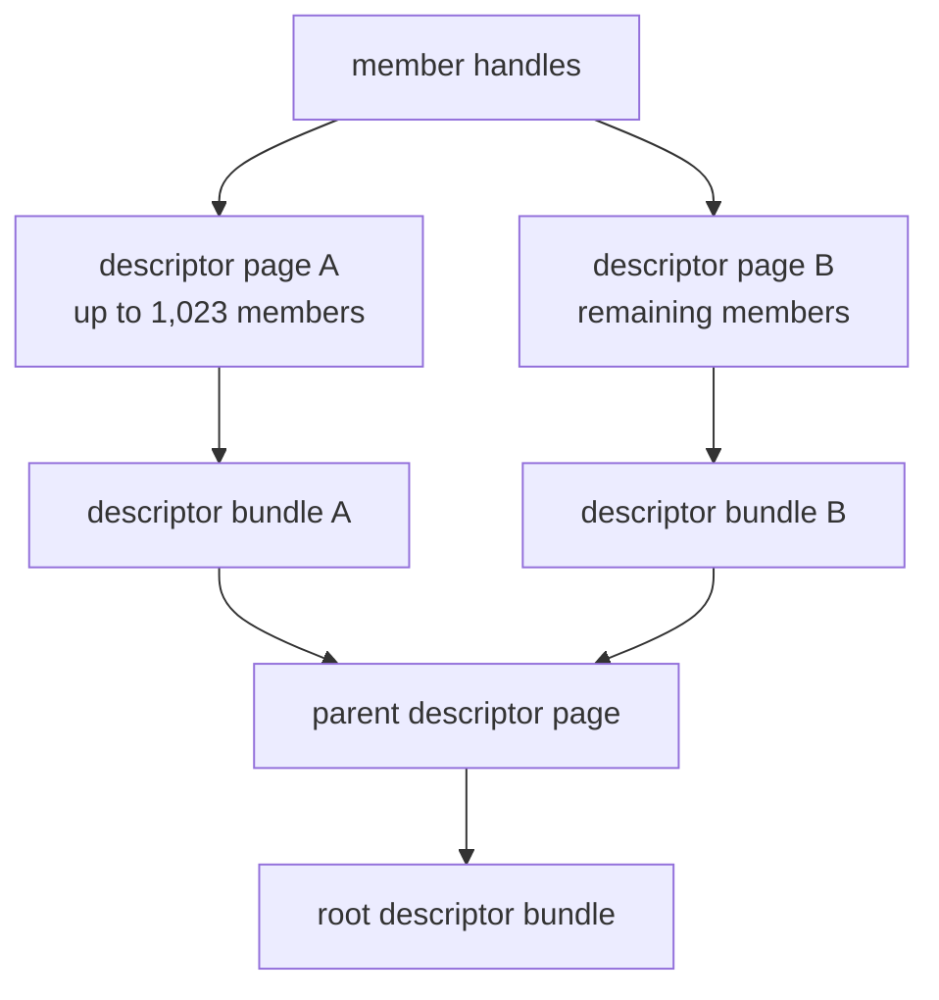
```mermaid
flowchart TB
    M["member handles"]
    M --> D0A["descriptor page A<br/>up to 1,023 members"]
    M --> D0B["descriptor page B<br/>remaining members"]
    D0A --> B0A["descriptor bundle A"]
    D0B --> B0B["descriptor bundle B"]
    B0A --> D1["parent descriptor page"]
    B0B --> D1
    D1 --> ROOT["root descriptor bundle"]
```

<details>
<summary>Figure 16 — Why a logical bundle can plan several Git objects</summary>

The exact tree depth depends on member count. Counting descriptor levels before
admission prevents a large bundle graph from slipping through a limit expressed
only in top-level requests.

</details>

| Member count posture         | Planned shape                                                       |
| ---------------------------- | ------------------------------------------------------------------- |
| At most 1,023                | One descriptor page plus one descriptor bundle                      |
| More than 1,023              | Multiple leaf descriptor pairs plus parent descriptor pairs         |
| Too large for batch envelope | Flush prior batch; use bounded singleton path if individually valid |
| Individually invalid         | Reject; never partially mutate the in-memory test facade            |

The in-memory git-cas facade now enforces the same per-bundle and aggregate
limits before its first mutation. That audit repair matters: a test double that
accepts impossible production requests gives false confidence precisely where
the limit model is most important.

**Section verdict:** the release does not replace thousands of tiny operations
with one unbounded mega-operation. It composes a nested envelope whose planned
logical and physical costs are known before admission.

## 11. Fail-closed ordered results

Batch APIs return ordered handles because later dependencies must match each
input by index. Merely comparing array lengths is insufficient in JavaScript:
a sparse array can report the expected length while omitting one index.

For example, an array with length three may contain entries zero and two but no
entry one. If a branch later consumes index one, <code>undefined</code> could
become a malformed member or an opaque downstream failure.

v19.1.0 closes this hole at every relevant boundary:

- compound artifact staging;
- materialization workspace page and bundle staging;
- trie page and bundle write waves;
- CBOR index page staging.

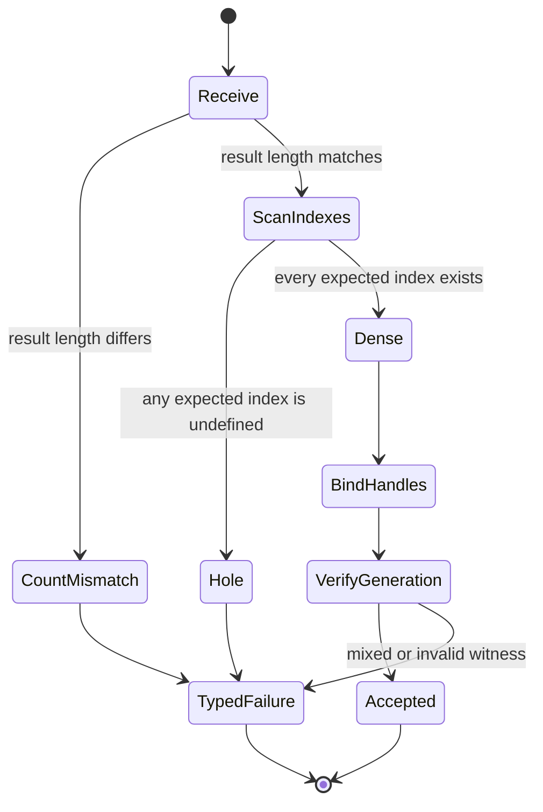
```mermaid
stateDiagram-v2
    [*] --> Receive
    Receive --> CountMismatch: result length differs
    Receive --> ScanIndexes: result length matches
    ScanIndexes --> Hole: any expected index is undefined
    ScanIndexes --> Dense: every expected index exists
    CountMismatch --> TypedFailure
    Hole --> TypedFailure
    Dense --> BindHandles
    BindHandles --> VerifyGeneration
    VerifyGeneration --> Accepted
    VerifyGeneration --> TypedFailure: mixed or invalid witness
    Accepted --> [*]
    TypedFailure --> [*]
```

<details>
<summary>Figure 17 — Ordered batch admission validation</summary>

Cardinality, density, handle binding, and retention generation are separate
checks. Passing one does not imply the others.

</details>

| Check               | Defect caught                                             |
| ------------------- | --------------------------------------------------------- |
| Exact length        | Too few or too many returned results                      |
| Dense indexed scan  | Sparse arrays with the expected length                    |
| Non-empty handle    | Missing or unusable root token                            |
| Input-order binding | Handle attached to the wrong logical artifact             |
| Single generation   | Results crossing workspace publication generations        |
| Exact retention set | Intermediate roots retained instead of terminal authority |

This is a good example of a performance optimization improving correctness.
Once more work crosses one call, the response contract becomes more important.
The Code Lawyer audit treated missing indexed handles as P2 structural defects,
added deterministic regression tests, and repaired all four boundaries before
release.

**Section verdict:** a batch is acceptable only when every logical input has one
dense, ordered, witnessed output. “The array length looked right” is not
evidence.

## 12. From trie roots to one retained materialization

A materialization contains more than one trie. Corpus 19C0FFEE’s retained
reading may refer to:

- the node-liveness trie root;
- the edge-liveness trie root;
- a property-index root;
- a Roaring logical-index root;
- replay-basis support;
- provenance support;
- a descriptor naming the coordinate, state hash, lane, and roots;
- the terminal materialization bundle.

The old path admitted many of these through separate workspace operations. The
new path first computes a conservative operation bound, then—only when more
than one admission group exists and the total remains within the compound
ceiling—uses one git-cas <code>workspace.batch</code> scope.

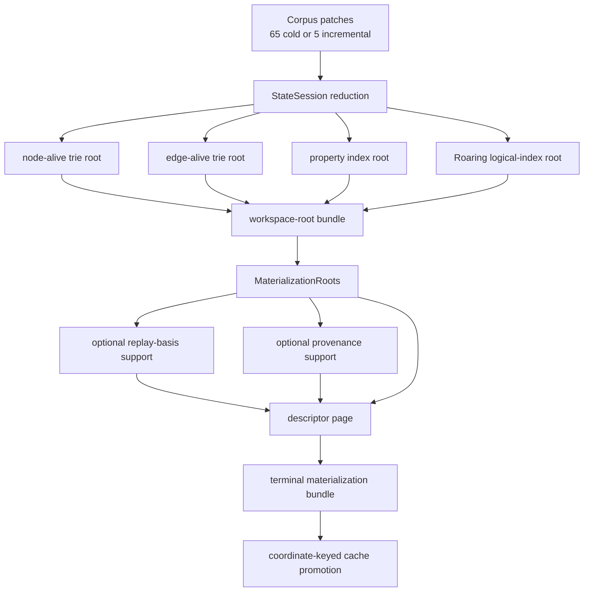
```mermaid
flowchart TB
    PATCHES["Corpus patches<br/>65 cold or 5 incremental"]
    REDUCE["StateSession reduction"]
    PATCHES --> REDUCE

    REDUCE --> NODE["node-alive trie root"]
    REDUCE --> EDGE["edge-alive trie root"]
    REDUCE --> PROP["property index root"]
    REDUCE --> ROAR["Roaring logical-index root"]

    NODE --> WROOT["workspace-root bundle"]
    EDGE --> WROOT
    PROP --> WROOT
    ROAR --> WROOT

    WROOT --> ROOTS["MaterializationRoots"]
    ROOTS --> REPLAY["optional replay-basis support"]
    ROOTS --> PROV["optional provenance support"]
    REPLAY --> DESC["descriptor page"]
    PROV --> DESC
    ROOTS --> DESC
    DESC --> TERM["terminal materialization bundle"]
    TERM --> CACHE["coordinate-keyed cache promotion"]
```

<details>
<summary>Figure 18 — The retained materialization artifact graph</summary>

The workspace-root bundle retains the state and index roots produced together.
The terminal materialization bundle then binds those roots with the descriptor
and any support artifacts before promotion to the coordinate-keyed cache.

</details>

| Artifact           | Meaning                                    | Publication role          |
| ------------------ | ------------------------------------------ | ------------------------- |
| Node-alive root    | ORSet membership for nodes                 | Derived state root        |
| Edge-alive root    | ORSet membership for edges                 | Derived state root        |
| Property root      | Page-backed property lookup                | Derived index root        |
| Roaring root       | Page-backed logical bitmap index           | Derived index root        |
| Workspace root     | One bundle naming jointly staged roots     | Temporary retention root  |
| Replay support     | Basis needed to justify predecessor replay | Optional support root     |
| Provenance support | Evidence needed by provenance readings     | Optional support root     |
| Descriptor         | Coordinate, lane, roots, and state hash    | Materialization metadata  |
| Terminal bundle    | One retained application handle            | Cache-promotion authority |

The property and Roaring indexes are prepared lazily. Their builders expose an
exact shard count independently from the shard stream. The count supports
operation-bound planning; the stream avoids retaining every encoded shard in a
large in-memory array merely to know how much work exists.

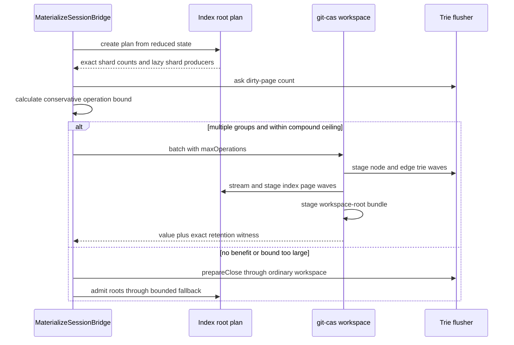
```mermaid
sequenceDiagram
    participant M as MaterializeSessionBridge
    participant I as Index root plan
    participant W as git-cas workspace
    participant T as Trie flusher

    M->>I: create plan from reduced state
    I-->>M: exact shard counts and lazy shard producers
    M->>T: ask dirty-page count
    M->>M: calculate conservative operation bound
    alt multiple groups and within compound ceiling
        M->>W: batch with maxOperations
        W->>T: stage node and edge trie waves
        W->>I: stream and stage index page waves
        W->>W: stage workspace-root bundle
        W-->>M: value plus exact retention witness
    else no benefit or bound too large
        M->>T: prepareClose through ordinary workspace
        M->>I: admit roots through bounded fallback
    end
```

<details>
<summary>Figure 19 — Planning and admitting one session’s dependent roots</summary>

Compound admission is conditional. A one-group operation does not pay the
compound path merely because the capability exists, and an operation beyond
the reviewed ceiling falls back rather than widening the ceiling.

</details>

| Planning input                 |                                        Bound contribution |
| ------------------------------ | --------------------------------------------------------: |
| Each dirty trie leaf           |                  At most two operations: page plus bundle |
| Each dirty trie branch         |                                      One bundle operation |
| Each pending index root        |                      Exact shard/page and root operations |
| Workspace-root bundle          |                                             One operation |
| Terminal descriptor and bundle |                                            Two operations |
| Any support roots              | Two additional operations as a group: assets plus bundles |

The scope’s <code>retain</code> callback is just as important as its operation
callback. During joint root staging it retains the workspace-root bundle, not
every intermediate leaf and branch. During terminal materialization admission
it retains the terminal materialization bundle. Content-addressed descendants
remain reachable through those roots.

The final cache promotion occurs after compound staging. That separation keeps
the coordinate-keyed cache entry as the visible retained result while allowing
its internal object graph to be built efficiently.

**Section verdict:** compound admission follows the real artifact dependency
graph and retains exact terminal roots. It is a physical publication
optimization with explicit bounds, not a redefinition of materialization
meaning.

## 13. Physical batching is not domain atomicity

One git-cas workspace batch may carry many pages and bundles. That does not turn
all of those objects into one semantic event, one graph node, one patch, or one
causal occurrence.

This release keeps four cardinalities separate:

| Axis                         | Unit                                                            |
| ---------------------------- | --------------------------------------------------------------- |
| Causal history               | Patch and its admitted coordinate                               |
| Logical derived state        | Independently addressed trie pages, branches, shards, and roots |
| Physical staging             | Bounded page, bundle, asset, and workspace waves                |
| Visible retained publication | Exact terminal root promoted for a materialization coordinate   |

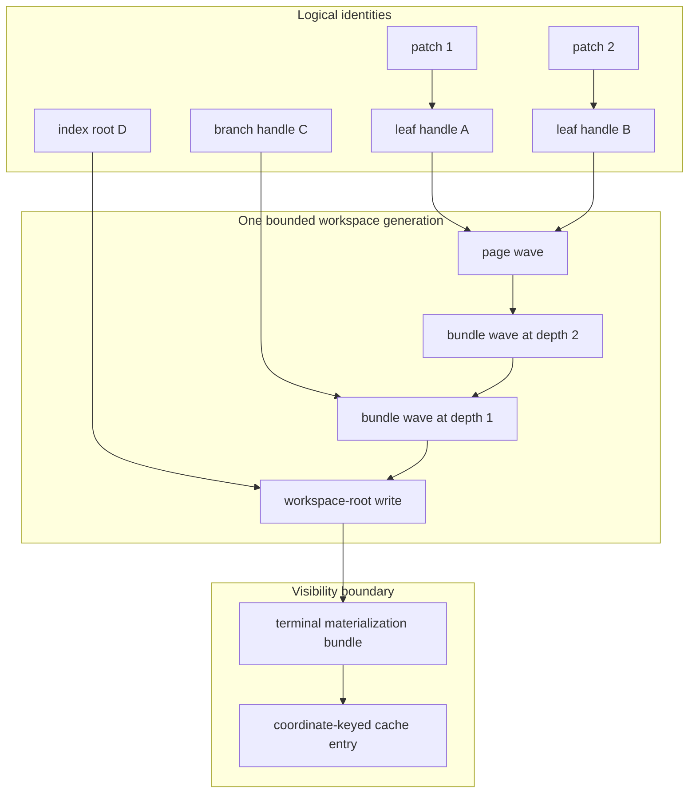
```mermaid
flowchart TB
    subgraph LOGICAL["Logical identities"]
      P1["patch 1"]
      P2["patch 2"]
      L1["leaf handle A"]
      L2["leaf handle B"]
      B1["branch handle C"]
      I1["index root D"]
    end

    subgraph PHYSICAL["One bounded workspace generation"]
      W1["page wave"]
      W2["bundle wave at depth 2"]
      W3["bundle wave at depth 1"]
      W4["workspace-root write"]
    end

    subgraph VISIBLE["Visibility boundary"]
      T["terminal materialization bundle"]
      C["coordinate-keyed cache entry"]
    end

    P1 --> L1
    P2 --> L2
    L1 --> W1
    L2 --> W1
    W1 --> W2
    B1 --> W3
    I1 --> W4
    W2 --> W3
    W3 --> W4
    W4 --> T
    T --> C
```

<details>
<summary>Figure 20 — Logical, physical, and visible cardinalities</summary>

Several logical artifacts can share one physical generation without collapsing
their handles. Visibility comes from the retained terminal root and cache
promotion, not from the mere fact that bytes were staged.

</details>

| Incorrect inference                      | Correct interpretation                                                               |
| ---------------------------------------- | ------------------------------------------------------------------------------------ |
| One batch means one domain transaction   | A batch amortizes mechanics for bounded dependent writes                             |
| One generation means one object identity | Every page and bundle remains independently content-addressed                        |
| A staged object is visible authority     | Retention and promotion establish the visible root                                   |
| Failure erases every object written      | Unretained content-addressed objects may exist but do not become the retained result |
| Retaining every child is safer           | Retaining the exact terminal root is smaller and equally reaches its descendants     |

This distinction also explains retry behavior. Content-addressed writes can be
repeated safely when bytes are identical. The authoritative outcome is still
the exact retained root and witness returned by the completed admission.

**Section verdict:** atomize meaning and batch mechanics. The release is fast
because it does not force the two axes to have the same cardinality.

## 14. Patch-chain discovery: one history stream, bounded payload reads

Trie publication fixes the write side of materialization. The read side also
needed repair. Previously <code>PatchDiscovery</code> called
<code>getNodeInfo</code> for every commit in a writer chain. The Git adapter
implements that call as <code>git show</code>, producing
O(history × process-start latency).

v19.1.0 asks the persistence port for one <code>logNodesStream</code>:

- <code>firstParent: true</code> excludes merge side branches;
- <code>stopAt</code> restricts Git to the range the caller will actually walk;
- NUL-delimited streaming preserves record boundaries;
- parsing stops at the boundary even if a faulty persistence ignores
  <code>stopAt</code>;
- patch payloads are read with concurrency eight;
- results and failures are observed in original chain order.

```mermaid
sequenceDiagram
    participant D as PatchDiscovery
    participant P as Persistence port
    participant G as Git
    participant J as Patch journal

    D->>P: logNodesStream tip, firstParent, stopAt
    P->>G: git log -z --first-parent stopAt..tip
    G-->>P: one streamed metadata sequence
    P-->>D: parsed chain nodes
    loop bounded worker pool of 8
        D->>J: read patch payload
        J-->>D: patch or typed error
    end
    D->>D: await results in chain order
    D-->>D: reverse to oldest-first
```

<details>
<summary>Figure 21 — Batched chain metadata and deterministic payload reads</summary>

Metadata becomes one bounded Git history stream. Payload reads can overlap, but
the earliest failure in causal-chain order remains the error the caller sees.

</details>

| Concern               | New contract                                          |
| --------------------- | ----------------------------------------------------- |
| Merge topology        | Follow first parent only                              |
| Known basis           | Do not read earlier than <code>stopAt</code>          |
| Metadata subprocesses | One streamed Git log per chain                        |
| Payload concurrency   | At most eight in flight                               |
| Output order          | Oldest patch first                                    |
| Multiple failures     | Earliest chain-index failure wins deterministically   |
| Missing bulk commit   | Warn once, then fetch that commit through legacy path |
| Bulk stream failure   | Warn, then use complete per-commit fallback           |
| Parent cycle          | Stop rather than spin forever                         |

The fallback is intentionally observable. Correctness alone is insufficient if
an adapter silently returns to the very O(history) process topology this work
exists to remove. A thrown bulk read logs one warning; a successful but
incomplete index logs the first missing commit before filling gaps.

On the real 745-patch Think writer chain, median reads moved from 80.0 seconds
to 9.3 seconds and captures from 59.0 seconds to 17.1 seconds. That measurement
is valuable field evidence. It is not mixed into Corpus 19C0FFEE’s controlled
release comparison because the workloads and hosts differ.

**Section verdict:** patch discovery now pays one Git history-stream crossing
per chain and bounded object-read concurrency, while deterministic ordering and
fallback error behavior remain explicit.

## 15. Checkpoints make bounded replay the default

Batching cannot save a system whose replay horizon grows forever. Before this
release, omitting <code>checkpointPolicy</code> disabled automatic
checkpointing. A caller had to know to opt into the mechanism that bounds
replay.

v19.1.0 changes the default:

- omitted policy means <code>{ every: 64 }</code>;
- the threshold is inclusive: checkpoint at or beyond 64 replayed patches;
- <code>checkpointPolicy: null</code> remains the explicit opt-out;
- a checkpoint is derived state and does not change the semantic state hash.

```mermaid
stateDiagram-v2
    [*] --> ReplayDepth0
    ReplayDepth0 --> BelowThreshold: patches 1 through 63
    BelowThreshold --> Threshold: replay depth reaches 64
    Threshold --> WriteCheckpoint: default policy
    Threshold --> NoCheckpoint: explicit null policy
    WriteCheckpoint --> BoundedTail
    BoundedTail --> Threshold: another 64-patch interval accumulates
    NoCheckpoint --> UnboundedTail: patches continue
    UnboundedTail --> UnboundedTail
```

<details>
<summary>Figure 22 — Default checkpoint cadence and explicit opt-out</summary>

The default path periodically establishes a retained replay basis. The
unbounded path still exists, but only through an explicit <code>null</code>
policy.

</details>

| Configuration               | v19.0.2 behavior                 | v19.1.0 behavior                   |
| --------------------------- | -------------------------------- | ---------------------------------- |
| Option omitted              | Automatic checkpointing disabled | Checkpoint every 64 replay patches |
| <code>{ every: 64 }</code>  | Checkpoint every 64              | Same                               |
| <code>null</code>           | Disabled                         | Still disabled                     |
| Existing checkpoint objects | Readable                         | Readable                           |
| State hash                  | Semantic state                   | Unchanged by snapshot publication  |

This is an observable write-behavior change. A graph that never supplied the
option can begin writing checkpoint commits. It is also the correction that
keeps future reads bounded. The field symptom was 262 unreplayed patches,
5,267 Git subprocesses for one read, and a backlog growing by two commits per
write.

No repository migration is required because checkpoints use the existing v19
representation. The runtime begins producing derived snapshots under the new
default; it does not rewrite old patches or demand an offline conversion.

**Section verdict:** bounded replay is now the safe default, while deliberate
opt-out remains possible. This is a behavioral compatibility note, not a
storage migration.

## 16. What Plumbing v3.3.0 contributed

Plumbing is where repeated Git invocations become bounded protocol sessions.
The campaign released v3.3.0 before git-cas and git-warp so downstream packages
could depend on a real public capability rather than a workspace illusion.

Relevant capabilities include:

- bounded <code>infoMany</code> object queries;
- bounded <code>writeBlobs</code> and <code>writeMany</code> pipelines;
- a persistent <code>openUpdateRefSession</code>;
- unconditional, create-only, and compare-and-swap ref update modes;
- full request validation before one backpressure-aware stdin write;
- prior persistent <code>cat-file</code>, <code>mktree</code>, and
  <code>fast-import</code> sessions that v3.3.0 composes.

```mermaid
flowchart LR
    CALLS["many validated logical requests"]
    CALLS --> CAT["persistent cat-file session"]
    CALLS --> TREE["persistent mktree session"]
    CALLS --> IMPORT["persistent fast-import session"]
    CALLS --> REF["persistent update-ref session"]
    CAT --> GIT["bounded Git child processes"]
    TREE --> GIT
    IMPORT --> GIT
    REF --> GIT
```

<details>
<summary>Figure 23 — Plumbing’s session boundary</summary>

Logical requests remain distinct, but compatible requests share a long-lived
Git protocol process. Validation and backpressure happen before or during the
protocol write rather than after an uncontrolled burst.

</details>

| Session                               | Replaces                              | Release relevance                                         |
| ------------------------------------- | ------------------------------------- | --------------------------------------------------------- |
| <code>cat-file --batch-command</code> | One blob/object process per read      | Eliminated 3,179 one-shot blob children in field evidence |
| Tree session                          | Repeated tree-construction starts     | Supports page and bundle object graphs                    |
| Fast-import session                   | Repeated object/commit import starts  | Amortizes compound workspace persistence                  |
| Update-ref session                    | Repeated reference publication starts | Allows one bounded publication sequence                   |

This release does not claim all Git commands disappeared. Corpus 19C0FFEE still
uses 50, 25, and 60 Git commands in cold, warm, and incremental scenarios. The
claim is that the remaining crossings correspond to larger bounded semantic
operations, not microscopic loops that accidentally start Git.

**Section verdict:** Plumbing moves the process boundary outward while keeping
request validation and protocol backpressure explicit.

## 17. What git-cas v6.5.10 contributed

git-cas converts Plumbing’s process capabilities into content-addressed
application operations. The performance series arrived in compatible steps:

| git-cas version | Capability                                                                         |
| --------------- | ---------------------------------------------------------------------------------- |
| 6.5.7           | Persistent small-blob reads with a genuine oversized streaming path                |
| 6.5.8           | Bounded <code>assets.putBatch</code> and <code>bundles.putOrderedBatch</code>      |
| 6.5.9           | <code>workspace.batch</code> with one private persistence scope and generation     |
| 6.5.10          | Asset support inside compound scope plus exact terminal <code>retain(value)</code> |

The 6.5.9 workspace proof used a 33-operation, 81-handle graph. It reduced Git
children from 200 to 23, workspace commits and ref updates from 33 to one, kept
the same handle digests, and cut wall time by 80.5%. v6.5.10 then allowed a
caller to retain the exact result root instead of retaining intermediate
artifacts by default.

```mermaid
sequenceDiagram
    participant W as git-warp
    participant C as git-cas workspace
    participant P as Plumbing
    participant G as Git

    W->>C: workspace.batch operation and maxOperations
    C->>C: open one private generation
    W->>C: stage pages, assets, and ordered bundles
    C->>P: pipeline bounded object graph
    P->>G: persistent object sessions
    W->>C: retain exact terminal handles
    C->>P: one workspace publication sequence
    P->>G: one bounded ref session
    C-->>W: value plus retention witnesses
```

<details>
<summary>Figure 24 — git-cas compound workspace admission</summary>

git-cas owns the private generation, object-session reuse, and exact retention
witness. git-warp supplies the semantic dependency graph and the terminal
handles that should survive.

</details>

| git-cas proof           | What it establishes                                                   |
| ----------------------- | --------------------------------------------------------------------- |
| Same handle digests     | Batching did not change content identity                              |
| One private generation  | Related staged results share publication basis                        |
| Exact retain callback   | Only result roots become workspace retention authority                |
| Bounded operation count | A caller cannot turn compound admission into an unbounded transaction |
| Public-package A/B      | v6.5.10’s contribution can be isolated from git-warp source changes   |

Holding git-warp source constant and changing only public git-cas 6.5.9 to
public 6.5.10 moved Corpus 19C0FFEE’s Git-command medians from
139 / 25 / 149 to 50 / 25 / 60. Cold and incremental wall medians fell 52.2%
and 49.9%. Warm remained at 25 commands, and its small timing movement was
classified as host noise.

**Section verdict:** git-cas supplies the bounded physical unit that lets
git-warp publish a dependency graph efficiently without surrendering
content-addressed identity or exact retention evidence.

## 18. The hosted materialization result

The final hosted performance job compared exact audited implementation head
<code>249897094b56891bd5a85c873e3b9a258be821b2</code> with base
<code>59795a08f2fcaba480411c72871cb0fed0ddc867</code> on one Ubuntu 24.04
runner using Node 22 and Git 2.55.0. Execution was counterbalanced so one
revision did not always run first.

The result passed:

| Scenario    | Base CPU | Head CPU | CPU change | Base Git commands | Head Git commands | Head wall |  Head RSS |
| ----------- | -------: | -------: | ---------: | ----------------: | ----------------: | --------: | --------: |
| Cold        | 4,570 ms | 1,490 ms |     -67.4% |               781 |                50 |  590.3 ms | 131.7 MiB |
| Warm        | 1,010 ms |   990 ms |      -2.0% |                30 |                25 |  255.0 ms | 125.5 MiB |
| Incremental | 2,690 ms | 1,390 ms |     -48.3% |               372 |                60 |  559.7 ms | 128.7 MiB |

```mermaid
xychart-beta
    title "Corpus 19C0FFEE Git command medians"
    x-axis ["Cold", "Warm", "Incremental"]
    y-axis "Git commands" 0 --> 800
    bar [781, 30, 372]
    bar [50, 25, 60]
```

<details>
<summary>Figure 25 — Base and head Git-command medians</summary>

The first bar in each pair is the base; the second is the audited head. The
adjacent table is the authoritative legend and carries the exact values.

</details>

| Scenario    |                Structural reduction | Interpretation                                            |
| ----------- | ----------------------------------: | --------------------------------------------------------- |
| Cold        | 731 fewer commands; 93.6% reduction | Full replay plus first retained publication benefits most |
| Warm        |   5 fewer commands; 16.7% reduction | Exact-hit path already avoided replay and write waves     |
| Incremental | 312 fewer commands; 83.9% reduction | Predecessor reuse plus bounded suffix publication         |

All five command-count samples for every scenario had median absolute deviation
zero. That stability is why command counts are a blocking structural gate:
runner speed can change CPU and wall time, but it cannot normally change which
Git call paths execute.

The reviewed absolute ceilings are 60 cold, 30 warm, and 72 incremental. CPU
ceilings are intentionally much looser at 30 seconds, 10 seconds, and
30 seconds, because they block gross failure while the relative same-runner
comparison catches regressions outside explicit noise floors. Wall time remains
diagnostic rather than blocking.

```mermaid
flowchart LR
    RAW["five head samples<br/>five base samples<br/>one warmup each"]
    RAW --> SCHEMA["strict schema validation"]
    SCHEMA --> SEM["cardinality and fingerprint checks"]
    SEM --> STORAGE["65 / 0 / 5 replay and hit evidence"]
    STORAGE --> STRUCT["absolute and relative Git-command gates"]
    STRUCT --> CPU["relative CPU plus noise floors"]
    CPU --> MEM["absolute heap and RSS envelopes"]
    MEM --> PASS["release performance PASS"]
```

<details>
<summary>Figure 26 — Materialization evidence must pass before speed counts</summary>

The gate parses and validates semantic and storage evidence before comparing
performance. A malformed or semantically incomplete fast result cannot reach
the speed verdict.

</details>

| Gate order       | Failure example                                        |
| ---------------- | ------------------------------------------------------ |
| Schema           | Missing scenario or malformed distribution             |
| Cardinality      | Wrong node, edge, or property count                    |
| Fingerprint      | Cold and warm produce different state                  |
| Storage evidence | Warm replays patches or incremental misses predecessor |
| Command policy   | Structural process regression                          |
| CPU policy       | Same-runner CPU regression outside noise floor         |
| Memory policy    | Peak heap or RSS exceeds reviewed envelope             |

The exact semantic fingerprint in the final job was
<code>d4a3d26858bddad534c3f5d00e5ed8f7896767ae9e05e972b6005892f85e73e3</code>.
Cold replayed 65 patches, warm replayed zero with an exact hit, and incremental
replayed five with a compatible predecessor hit. The command reduction therefore
did not come from silently skipping history.

**Section verdict:** hosted evidence shows large cold and incremental
structural and CPU improvements, a deliberately modest warm change, and exact
semantic equivalence.

## 19. Oversized Observer streaming under a hostile control

Materialization speed can improve while a public iterator still buffers its
entire result. The release therefore includes a separate bounded-memory
Observer proof.

The proof persists 128 deterministic descriptors through ordinary patches and
the production checkpoint/property-page path. At read time, each descriptor
expands to one 2 MiB logical value. The iterator therefore emits:

<code>128 × 2 MiB = 256 MiB</code> of logical result under a 64 MiB V8
old-space limit.

The consumer pauses for 2 ms after each reading. Instrumentation records
time-to-first, throughput, heap, RSS, property-page identities, receipt state,
whole-index scans, materialization calls, and the maximum gap between planned
and consumed readings.

```mermaid
sequenceDiagram
    participant O as Public Observer
    participant P as Property pages
    participant C as Slow consumer
    participant H as Hostile control

    loop 128 descriptors
        O->>P: open next exact property page
        P-->>O: small descriptor
        O->>O: expand one 2 MiB logical value
        O-->>C: yield one Reading
        C->>C: wait 2 ms
    end
    O-->>C: completed Receipt
    H->>H: expand and retain all 128 values
    H-->>H: required out-of-memory termination
```

<details>
<summary>Figure 27 — Streaming proof and materializing control</summary>

The production path keeps at most one reading of planning lead. The hostile
control performs the forbidden operation—retaining every expanded value—and
must fail from memory exhaustion under the same limit.

</details>

| Streaming obligation    |                Final head evidence |
| ----------------------- | ---------------------------------: |
| Logical bytes           |                        268,435,456 |
| V8 old-space limit      |                   67,108,864 bytes |
| Readings                |                                128 |
| Distinct property pages |                                128 |
| Maximum planning lead   |                                  1 |
| Whole-index scans       |                                  0 |
| Full materializations   |                                  0 |
| Receipt                 |                          Completed |
| Hostile control         | OOM evidence required and observed |
| Throughput              |                    72.6 readings/s |
| Time to first reading   |                           159.8 ms |
| Peak heap               |                           36.0 MiB |
| Peak RSS                |                          143.1 MiB |

Relative to base, head throughput changed -1.0%, time-to-first +4.5%, peak heap
+0.2%, and peak RSS +1.1%. Those small movements are not advertised as an
improvement. The release claim is that the public many-Observer path remains
bounded while the materialization topology changes beneath it.

Fixture generation itself never constructs the 256 MiB result. It persists
small descriptors in bounded batches and expands at most one value while
computing the expected fingerprint. Otherwise the test setup would consume the
very memory posture the runtime is supposed to avoid.

**Section verdict:** v19.1.0’s faster retained path does not trade process
counts for whole-result buffering. A hostile materializing control proves the
memory limit is capable of detecting that class of regression.

## 20. Published-v18 migration compatibility proof

“No new migration” does not mean old migrated data can be ignored. The release
gate restores an authentic checked-in 2 MiB v18 fixture using the exact public
<code>@git-stunts/git-warp@18.2.1</code> and
<code>@git-stunts/git-cas@6.0.0</code> lock, reads it under v18, migrates a
separate restored copy once, and reads that copy through the v19 public API.

The fixture contains 18 v18 patches and 16 ordinal properties. Both runtimes
must produce:

- 16 readings;
- checksum 120;
- final value 15.

The v19 side must also produce one completed Receipt.

```mermaid
flowchart TB
    FIX["retained v18 fixture<br/>2 MiB and 18 patches"]
    FIX --> V18["published v18.2.1 read"]
    FIX --> COPY["independent restored copy"]
    COPY --> MIG["one-shot v18 to v19 migration"]
    MIG --> V19["candidate v19 public Runtime read"]
    V18 --> EQ["16 readings<br/>checksum 120<br/>final 15"]
    V19 --> EQ
    V19 --> RECEIPT["completed Receipt"]
    EQ --> GATE["cold and warm performance policy"]
    RECEIPT --> GATE
```

<details>
<summary>Figure 28 — Migrated-read release proof</summary>

Migration duration is recorded separately and excluded from steady-state
samples. The performance comparison measures equivalent reads, not the
one-time conversion.

</details>

| Scenario             |   v18 wall | v19 wall | Wall improvement | v18 Git | v19 Git | Git improvement |
| -------------------- | ---------: | -------: | ---------------: | ------: | ------: | --------------: |
| Cold                 | 1,228.9 ms | 545.6 ms |            55.6% |     322 |      93 |           71.1% |
| Warm, second process | 1,234.8 ms | 549.4 ms |            55.5% |     322 |      93 |           71.1% |

The one-shot migration took 1,572.4 ms and was excluded from every read sample.
This proof prevents a vacuous v19-to-v19 comparison from satisfying the legacy
compatibility gate.

Existing v18 repositories still need the established v18-to-v19 migration
before any v19 process opens them. Existing v19 repositories need no additional
migration for v19.1.0.

**Section verdict:** the release remains compatible with the already defined
v18-to-v19 path and materially improves equivalent retained reads after that
one-time migration.

## 21. Why wall time is not the primary gate

Wall time is intuitive and noisy. It includes runner scheduling, filesystem
contention, background host work, and cache effects that the implementation
does not control. A smaller wall number is useful diagnostic evidence; it is
not reliable enough to be the sole merge law.

The measurement hierarchy is:

1. Semantic and replay evidence: did the same work produce the same meaning?
2. Git command counts: did the structural boundary actually change?
3. CPU: did the same-runner implementation consume less execution work?
4. Heap and RSS: did the optimization stay inside reviewed memory bounds?
5. Wall time: what did a user on this runner happen to experience?

```mermaid
flowchart TB
    SEM["1. semantic identity<br/>blocking"]
    CMD["2. Git command topology<br/>blocking"]
    CPU["3. CPU with noise floors<br/>blocking"]
    MEM["4. heap and RSS ceilings<br/>blocking"]
    WALL["5. wall time<br/>diagnostic"]
    SEM --> CMD --> CPU --> MEM --> WALL
```

<details>
<summary>Figure 29 — Performance evidence authority order</summary>

Later evidence cannot rescue an earlier failure. A fast wall time does not
override a semantic mismatch, missing replay receipt, command-count regression,
or memory-limit breach.

</details>

| Metric               | Strength                                  | Limitation                             |
| -------------------- | ----------------------------------------- | -------------------------------------- |
| Semantic fingerprint | Exact result comparison                   | Does not describe cost                 |
| Replay/hit receipt   | Proves which history was consumed         | Does not count process crossings       |
| Git command count    | Stable structural measurement; MAD 0      | Not all commands cost the same         |
| CPU                  | Captures execution cost on same runner    | Noisy enough to need floors and ratios |
| Heap/RSS             | Detects buffering and gross memory growth | Platform-specific baselines            |
| Wall time            | User-visible elapsed experience           | Highly sensitive to host noise         |

This hierarchy is why the warm result is described conservatively. Its command
count improves from 30 to 25, CPU changes by only -2.0%, and the public
git-cas isolation arm remains at 25 commands with small timing noise. The
release does not inflate that into a dramatic warm-cache claim.

**Section verdict:** structural, semantic, and resource evidence outrank a
single stopwatch. That makes the release gate both stricter and more portable.

## 22. Unofficial preview: Entity intent and occurrence receipts

v19.1.0 contains the already-merged Entity API as an **unofficial,
unstable preview**. It is included so the merged source and published package
remain aligned, but it is not the architectural center of this performance
release, Think will not adopt it in this campaign, and consumers should not
build authority-sensitive production semantics on it yet.

The preview adds two intent builders:

- <code>intent.entity.add({ subject, properties })</code> uses an
  application-supplied subject.
- <code>intent.entity.addAuto({ namespace, properties })</code> allocates an
  opaque subject from the same writer-local Dot used by the node addition.

Both lower one initial entity payload into one patch. The patch contains a
leading node addition followed by canonically key-sorted property writes for
that node. Its declared footprint has no reads and exactly one subject write.
The older composition—<code>node.add</code> followed by
<code>property.set</code>—required two patches and gave the property patch a
self-read.

```mermaid
flowchart LR
    subgraph OLD["Existing explicit composition"]
      N["node.add patch"] --> P["property.set patch"]
      P --> R2["two write receipts"]
    end
    subgraph PREVIEW["Unofficial Entity preview"]
      E["entity.add intent"] --> ONE["one patch<br/>NodeAdd plus initial properties"]
      ONE --> R1["one admitted write receipt"]
      R1 --> O["EntityOccurrence"]
    end
```

<details>
<summary>Figure 30 — Two-patch composition and one-patch preview</summary>

The preview changes the construction shape, not the lifetime semantics of the
resulting node. Existing node and property intents remain available.

</details>

| Preview guarantee          | Exact scope                                                |
| -------------------------- | ---------------------------------------------------------- |
| Non-empty payload          | At least one property is present                           |
| Payload record             | Plain or null-prototype object only                        |
| Canonical order            | Keys lower in deterministic sorted order                   |
| Prototype-name safety      | A key such as <code>**proto**</code> remains ordinary data |
| One declared subject write | Footprint names the created subject                        |
| No declared reads          | Patch operands do not include a graph read                 |
| One occurrence receipt     | Only for admitted derived or plural outcomes               |

Those guarantees are intentionally narrower than the word “entity” may suggest:

- **Initial payload, not schema completeness.** git-warp does not know which
  fields make a Person, Project, or Thought complete.
- **Creation, not lifetime immutability.** Existing property mutation and node
  removal APIs remain legal.
- **Occurrence, not global subject uniqueness.** Several admitted additions may
  target one application-supplied subject.
- **Declared footprint, not proof of caller ignorance.** A caller could have
  read the graph before constructing the intent.
- **Substrate noun, not cross-runtime constitution.** The preview does not make
  <code>EntityOccurrence</code> the universal Continuum or Think primitive.

An admitted preview receipt may carry an <code>EntityOccurrence</code>. The
occurrence binds:

- its worldline scope;
- its opaque occurrence identifier;
- the resolved subject;
- the causal coordinate;
- the exact Intent;
- the exact frozen Evidence;
- the public lane and writer named by the receipt.

```mermaid
classDiagram
    class Intent {
      entity.add
      entity.addAuto
    }
    class PublishedPatch {
      NodeAdd
      initial properties
      declared footprint
    }
    class Evidence {
      exact published basis
    }
    class WriteReceipt {
      outcome
      lane
      public writer
    }
    class EntityOccurrence {
      worldline scope
      opaque occurrence id
      subject
      causal coordinate
    }
    Intent --> PublishedPatch : lowers to
    PublishedPatch --> Evidence : hydrates canonical
    Evidence --> WriteReceipt : binds
    WriteReceipt --> EntityOccurrence : carries when admitted
```

<details>
<summary>Figure 31 — Preview occurrence authority chain</summary>

An arbitrary occurrence object cannot be attached to an unrelated receipt. The
runtime derives the occurrence from the complete published patch and binds it
back to the exact intent, evidence, lane, and writer.

</details>

| Occurrence operation                    | Meaning                                                                      |
| --------------------------------------- | ---------------------------------------------------------------------------- |
| <code>relationTo</code>                 | Causal same, before, after, or concurrent using worldline and vector context |
| <code>compare</code>                    | Stable display order using worldline then canonical EventId                  |
| Equal application timestamp             | No occurrence identity claim                                                 |
| Equal payload bytes                     | No occurrence identity claim                                                 |
| Same subject                            | May name several distinct occurrences                                        |
| Same writer Dot in different worldlines | Concurrent, not the same occurrence                                          |

<code>compare</code> is deliberately not a causality oracle. Concurrent
occurrences still need a deterministic listing order, but that order does not
turn concurrency into “before.”

### Preview compatibility warning

The runtime surface is additive, but <code>entity.add</code> widens the
structurally reachable <code>Intent['kind']</code> union. A TypeScript consumer
that exhaustively switches on all intent kinds can stop compiling with the new
member. Such a consumer must add an <code>entity.add</code> arm or stop treating
the preview union as closed.

That type-level break is real even though the feature is labeled unofficial.
The label means no stability promise is being made for the preview; it does not
mean the package can conceal a compiler error.

**Section verdict:** the preview provides a hardened one-patch initial-payload
path and a strongly bound occurrence receipt, but it remains outside Think’s
current adoption boundary and outside any claim of universal entity ontology.

## 23. Causal and lifecycle integrity fixes bundled with the preview

The Entity work forced several adjacent invariants to become executable. These
are not cosmetic API polish; they prevent ambiguous coordinates, forged
receipts, and late mutation.

### Canonical Dots and safe counters

Writer counters now require positive safe integers. Values beyond JavaScript’s
exact integer range are rejected before mutation, preventing a writer from
reissuing a coordinate after numeric precision collapses.

<code>Dot.decode</code> accepts only spellings that
<code>Dot.encode</code> can produce. Signs, exponents, decimal points, leading
zeroes, suffixes, and surrounding whitespace cannot create aliases for one
coordinate.

Version-vector serialization also preserves writer names such as
<code>**proto**</code> as own data rather than invoking inherited object
setters.

```mermaid
stateDiagram-v2
    [*] --> CandidateCounter
    CandidateCounter --> Reject: not a positive safe integer
    CandidateCounter --> CanonicalToken: exact integer
    CanonicalToken --> Decode
    Decode --> Reject: spelling is not canonical
    Decode --> Dot: encode and decode agree
    Dot --> VersionVector
    VersionVector --> OwnProperty: prototype-like writer names preserved
    OwnProperty --> [*]
    Reject --> [*]
```

<details>
<summary>Figure 32 — Canonical causal coordinate admission</summary>

The counter value and its textual encoding must both be exact. Version-vector
serialization then preserves the writer key without prototype interference.

</details>

| Defect class                  | Prevented outcome                         |
| ----------------------------- | ----------------------------------------- |
| Unsafe integer                | Duplicate or misordered writer coordinate |
| Noncanonical numeric spelling | Several byte strings aliasing one Dot     |
| Prototype-named writer        | Silently dropped vector component         |
| Cross-worldline equal Dot     | False “same occurrence” relation          |

### Publication and attachment lifecycle

Content attachment performs asynchronous asset staging. The builder now
rechecks its lifecycle after that await. Publication that overtakes staging can
no longer be followed by late property operations on an already committed
patch.

Auto-allocated subjects are also recovered from the canonical published patch
during live strand settlement. Reopening the Runtime and settling the same
evidence therefore preserves the subject named by the receipt.

### Receipt and retention authority

Occurrence issuance hydrates the complete published patch and binds every
normalized payload value back to the requested Intent. A malicious or faulty
publication callback cannot substitute another subject or payload while
retaining a legitimate-looking request object.

Retention evidence is revalidated structurally: policy, reachability, root kind,
handle, and generation must agree. A frozen object with a forged prototype does
not inherit authority merely because its TypeScript shape resembles a genuine
witness.

```mermaid
flowchart LR
    REQUEST["validated intent"]
    STAGE["asynchronous staging"]
    COMMIT["published patch"]
    HYDRATE["hydrate canonical intent"]
    EVIDENCE["frozen evidence"]
    RECEIPT["write receipt"]

    REQUEST --> STAGE
    STAGE -->|"recheck builder lifecycle"| COMMIT
    COMMIT --> HYDRATE
    HYDRATE -->|"compare subject and every value"| REQUEST
    HYDRATE --> EVIDENCE
    EVIDENCE -->|"bind lane and writers"| RECEIPT
```

<details>
<summary>Figure 33 — Publication must bind back to the request</summary>

The async boundary does not authorize late mutation, and published bytes—not a
callback’s claim—are rehydrated before the receipt is issued.

</details>

| Authority check                                          | Why it exists                                       |
| -------------------------------------------------------- | --------------------------------------------------- |
| Builder still mutable after await                        | Prevent late writes after commit                    |
| Published subject matches intent or namespace allocation | Prevent subject substitution                        |
| Every normalized payload value matches                   | Prevent payload substitution                        |
| Evidence is exact and frozen                             | Prevent ambient process registry authority          |
| Receipt writer separate from Dot writer                  | Preserve valid strand overlays                      |
| Conflict outcomes carry no occurrence                    | Avoid claiming an admitted birth where none settled |

**Section verdict:** the preview’s value lies as much in the invariants it forced
into runtime code as in the new builder method. Coordinate exactness,
publication hydration, and receipt binding are now harder to forge or misread.

## 24. Release integrity and developer-environment repairs

The runtime optimization would be untrustworthy if the release machinery could
test a different checkout, rerun expensive gates accidentally, publish with a
drifting toolchain, or leak machine-local paths into evidence. v19.1.0 therefore
bundles several release-integrity repairs.

### Docker now tests the invoking worktree

Docker contexts previously assumed a literal sibling directory named
<code>git-warp/</code>. A linked worktree could invoke the suite while the
container silently copied another checkout. The Docker context now begins at
the invoking checkout root, excludes Git metadata, installs the exact lockfile
with <code>npm ci</code>, and avoids unused Puppeteer browser downloads.

### Release preflight is single-pass

Validation-only <code>npm pack</code> calls now use
<code>--ignore-scripts</code> and consume the already prepared
<code>dist</code> tree. Coverage, lint, unit, and consumer-type gates no longer
rerun indirectly through <code>prepack</code>. A maintainer’s standalone pack
or publish still retains the full lifecycle safety boundary.

### JSR proof is pinned and classified

JSR validation and publication use locked <code>jsr@0.14.3</code> with its
expected Deno v2.6.7. Only named transport or bootstrap failures receive up to
three attempts. Deterministic package validation errors fail after the first
attempt rather than being retried into noise.

### The full development graph is audited

The locked tool graph resolves repaired versions of
<code>brace-expansion</code>, <code>js-yaml</code>, <code>nanoid</code>,
<code>dompurify</code>, and <code>mermaid</code>. Full-graph npm audit is now a
required CI and release gate. The published runtime dependency graph itself is
unchanged by these development-tool repairs.

### Machine-local path leakage is blocked through history

Lint rejects personal-home and Darwin temporary absolute paths in tracked or
unignored text and binary files. The pre-commit hook scans exact staged bytes,
not mutable worktree bytes. The pre-push hook scans every outgoing Git object,
so a later clean tip cannot conceal an earlier leaking blob. A required CI lane
checks the exact commit tree independently.

```mermaid
flowchart TB
    WORK["working checkout"]
    WORK --> DOCKER["Docker uses invoking root"]
    WORK --> STAGED["exact staged additions and modifications"]
    STAGED --> COMMIT["commit"]
    COMMIT --> OUT["every outgoing Git object"]
    OUT --> CI["exact CI commit tree"]
    CI --> PREP["single-pass release preflight"]
    PREP --> NPM["npm pack and smoke"]
    PREP --> JSR["pinned JSR and Deno proof"]
    NPM --> TAG["reviewed main commit and immutable tag"]
    JSR --> TAG
```

<details>
<summary>Figure 34 — Release-integrity chain before tagging</summary>

Each boundary checks a different failure mode: checkout substitution, path
leakage, hidden historical objects, duplicate gate execution, package smoke,
and registry-tool determinism.

</details>

| Repair                        | Previous false-positive or false-negative risk  | New witness                                  |
| ----------------------------- | ----------------------------------------------- | -------------------------------------------- |
| Worktree-aware Docker context | Green container from the wrong checkout         | Source-context regression test               |
| Single-pass preflight         | Expensive gates rerun through pack lifecycle    | Command-contract regression test             |
| Pinned JSR/Deno               | Toolchain drift or indiscriminate retries       | Exact command and retry-classification tests |
| Full npm audit                | Development vulnerabilities treated as advisory | Blocking locked-graph audit                  |
| Staged-byte path scan         | Worktree bytes differ from committed bytes      | Exact index-object scan                      |
| Outgoing-object firewall      | Safe tip hides an earlier leaked object         | Entire push range inspected                  |
| Exact-tree CI                 | Local hook omission                             | Independent commit-tree gate                 |

These changes explain part of the release’s large diff. They are not trie
algorithm code, but they are essential to the claim that the tagged artifact is
the one reviewed and tested.

**Section verdict:** the release pipeline now has fewer opportunities to prove
the wrong source, rerun the wrong work, or publish evidence contaminated by a
developer’s machine.

## 25. Code Lawyer audit: all twenty findings

The merged performance pull request received a zero-tolerance structural audit.
The queue combined 15 inline review findings, one outside-diff review finding,
and four self-discovered findings. Each was reproduced or independently
audited, fixed in a focused commit, and verified before merge.

|   # | Severity | Source | Finding                                                  |       Fix commit       | Release outcome                              |
| --: | :------: | :----: | -------------------------------------------------------- | :--------------------: | -------------------------------------------- |
|   1 |    P2    |   PR   | Duplicate operations-per-dirty-page factor               | <code>ff556356e</code> | One shared fail-closed admission factor      |
|   2 |    P5    |   PR   | Equality checks could miss over-limit wave counts        | <code>1f5657b63</code> | Ceiling checks and regression coverage       |
|   3 |    P2    |   PR   | Tagged prepared-root dispatch violated domain policy     | <code>c7a2413f9</code> | Runtime domain classes own behavior          |
|   4 |    P2    |   PR   | Prepared shards were eagerly retained in arrays          | <code>c7a2413f9</code> | Lazy production plus exact independent count |
|   5 |    P2    |   PR   | Admission-bound literals obscured storage invariants     | <code>ff556356e</code> | Named shared operation factors               |
|   6 |    P5    |   PR   | Retained-root derivation was duplicated                  | <code>e71125b8e</code> | One compound/checkpoint derivation           |
|   7 |    P2    |   PR   | Materialization admission limits were magic numbers      | <code>ca33ece7d</code> | Named base and support limits                |
|   8 |    P2    |   PR   | Trie leaf path and size contracts were duplicated        | <code>ce0da84c2</code> | One Git-CAS trie storage profile             |
|   9 |    P2    |   PR   | In-memory facade exceeded test file-size policy          | <code>bcfc398fd</code> | Compound workspace helper extracted          |
|  10 |    P5    |   PR   | Admission fake ignored retained-handle selection         | <code>02187c671</code> | Exact terminal-root survival proved          |
|  11 |    P5    |   PR   | Branch-wave failure and fallback paths lacked proof      | <code>9fde983ec</code> | Adversarial branch-wave tests                |
|  12 |    P2    |   PR   | Compound request collectors used imprecise types         | <code>21f64d3d0</code> | Exact request types                          |
|  13 |    P2    |   PR   | Sparse compound responses passed length checks           | <code>405c6fb3b</code> | Dense indexed validation                     |
|  14 |    P5    |   PR   | Bitmap shard-key parsing was duplicated                  | <code>b039092e9</code> | One parser for enumeration and counting      |
|  15 |    P4    |   PR   | Laziness test allowed eager shard enumeration            | <code>e13cb86b2</code> | Count proved independent of yield            |
|  16 |    P2    |   PR   | Test facade ignored bundle limits                        | <code>2a3c4ee83</code> | Preplanned production-equivalent limits      |
|  17 |    P2    |  Self  | Sparse workspace results leaked missing handles          | <code>928df96dc</code> | Dense validation and typed failure           |
|  18 |    P2    |  Self  | Sparse trie results passed cardinality checks            | <code>46c2df419</code> | Direct and staged paths reject holes         |
|  19 |    P2    |  Self  | Sparse index-page results could create malformed members | <code>8436ebab0</code> | Dense validation; unsafe cast removed        |
|  20 |    P5    |  Self  | Calibration evidence was noncanonical JSON               | <code>249897094</code> | Canonical artifact plus regression test      |

The audit’s deeper pattern is visible when the findings are grouped by
invariant:

```mermaid
flowchart LR
    AUDIT["20 findings"]
    AUDIT --> BOUNDS["Bounds and named policies"]
    AUDIT --> DENSE["Dense ordered results"]
    AUDIT --> LAZY["Lazy bounded memory"]
    AUDIT --> AUTH["Exact retained authority"]
    AUDIT --> MODEL["Runtime-backed domain model"]
    AUDIT --> TEST["Production-honest test doubles"]
    AUDIT --> EVID["Canonical evidence"]

    BOUNDS --> SAFE["bounded compound admission"]
    DENSE --> SAFE
    LAZY --> SAFE
    AUTH --> SAFE
    MODEL --> SAFE
    TEST --> SAFE
    EVID --> SAFE
```

<details>
<summary>Figure 35 — Audit findings converge on one trust boundary</summary>

The findings were not twenty unrelated style nits. They tested whether a
bounded batch can be planned, executed, returned, retained, reproduced, and
measured without losing an artifact or lying about production behavior.

</details>

| Audit family       | Why it affects performance truth                      |
| ------------------ | ----------------------------------------------------- |
| Named bounds       | Prevents undercounted or drifting admission ceilings  |
| Dense results      | Proves every planned artifact received a handle       |
| Lazy shards        | Prevents process savings from becoming heap growth    |
| Terminal retention | Avoids extra publication work and authority ambiguity |
| Runtime classes    | Keeps behavior on validated objects instead of tags   |
| Honest test facade | Prevents tests from accepting impossible batches      |
| Canonical evidence | Makes calibration diffs deterministic and reviewable  |

The final local audit head passed 649 stable test files with 7,408 tests,
676 coverage files with 7,609 tests, 129 v19 acceptance tests, and the complete
static, type, generated-SDK, documentation, machine-path, and release-policy
gates. Coverage reported 93.01% statements, 85.70% branches, 96.36% functions,
and 93.08% lines.

**Section verdict:** the audit strengthened the exact places batching tends to
hide mistakes: limit planning, ordered response density, retention selection,
test-double fidelity, memory posture, and evidence determinism.

## 26. Complete release-improvement portfolio

The release diff from v19.0.2 through the merged implementation spans 198 files,
14,655 insertions, and 2,027 deletions. That scale is not one giant algorithm.
It is the full dependency consumption, runtime optimization, preview API,
benchmark repair, audit paydown, release-tool hardening, documentation, and
executable evidence needed to make the result publishable.

The following table is the compact inventory of user- and maintainer-visible
improvements:

| Area                 | Improvement                                                            | Primary consequence                                     |
| -------------------- | ---------------------------------------------------------------------- | ------------------------------------------------------- |
| Patch discovery      | One first-parent, stop-bounded history stream per chain                | Removes one <code>git show</code> per patch             |
| Patch payloads       | Persistent git-cas blob session and concurrency eight                  | Removes one-shot blob process storm                     |
| Trie domain          | Ordered leaf and same-depth branch waves                               | Preserves dependency order with fewer calls             |
| Trie adapter         | Bounded page and bundle batches                                        | Uses public git-cas batch capability                    |
| Trie safety          | Dense result checks and unresolved-child errors                        | Missing handles fail at their boundary                  |
| Structural sharing   | Clean child handles reused exactly                                     | Only changed paths receive new objects                  |
| Index preparation    | Lazy shard producers with exact counts                                 | Bound planning without eager shard arrays               |
| Materialization      | Joint state trie, index, workspace, descriptor, and support admission  | Amortizes one retained artifact graph                   |
| Retention            | Exact terminal-root selection                                          | Intermediate roots do not become authority              |
| Checkpoints          | Default cadence every 64 replay patches                                | Bounded replay becomes default                          |
| Benchmark corpus     | 65-patch base plus five-patch suffix                                   | Causal depth is no longer vacuous                       |
| Performance law      | Blocking Git command, CPU, heap, and RSS gates                         | Structural regressions become merge failures            |
| Streaming proof      | 256 MiB logical output under 64 MiB old-space                          | Public iterator stays bounded                           |
| Migrated-read proof  | Published v18 versus candidate v19                                     | Legacy compatibility stays non-vacuous                  |
| Instrumentation      | Production batch capabilities preserved in recorder                    | Measuring does not disable the optimization             |
| Entity preview       | One-patch initial payload and occurrence receipt                       | Experimental lower-level construction path              |
| Causal safety        | Canonical Dots, safe counters, prototype-key preservation              | Coordinates remain exact                                |
| Receipt safety       | Published evidence bound back to request                               | Callback substitution and forged occurrences rejected   |
| Attachment lifecycle | Recheck after asynchronous staging                                     | No late mutation after publication                      |
| Docker               | Test the invoking linked worktree                                      | CI/local containers use the intended source             |
| Release preflight    | Validation pack uses prepared dist once                                | Expensive gates are not recursively duplicated          |
| JSR                  | Pinned wrapper, Deno, and classified retries                           | Deterministic validation and bounded transport recovery |
| Dependency hygiene   | Full locked development audit                                          | Toolchain vulnerabilities block release                 |
| Path hygiene         | Staged, outgoing-object, and exact-tree scans                          | Machine-local paths cannot hide in history              |
| Documentation        | Runtime, CLI, readings, optics, changelog, and release witness updated | Public claims match merged behavior                     |

```mermaid
flowchart LR
    READ["Read-path repair"]
    WRITE["Trie and materialization write repair"]
    BOUND["Checkpoint and memory bounds"]
    PREVIEW["Unofficial Entity preview"]
    INTEGRITY["Audit and release integrity"]

    READ --> REL["v19.1.0"]
    WRITE --> REL
    BOUND --> REL
    PREVIEW --> REL
    INTEGRITY --> REL

    REL --> OUT1["same semantic fingerprints"]
    REL --> OUT2["50 / 25 / 60 Git commands"]
    REL --> OUT3["no new repository migration"]
    REL --> OUT4["explicit compatibility warnings"]
```

<details>
<summary>Figure 36 — The release is a portfolio, not one optimization</summary>

The performance thesis dominates, but benchmark honesty, causal exactness,
release-source integrity, and preview disclosure are part of the same
publishable unit.

</details>

| Portfolio slice           | Why it could not be safely omitted                                  |
| ------------------------- | ------------------------------------------------------------------- |
| Lower dependency releases | Local-only APIs would not prove consumer availability               |
| Benchmark v2              | One-patch evidence would miss chain traversal                       |
| Audit paydown             | Batch holes and false test limits would undermine correctness       |
| Release tooling           | The wrong checkout or repeated gates could produce false evidence   |
| Compatibility notes       | No migration does not imply no behavior or type change              |
| Source documentation      | A release witness must remain understandable after the session ends |

**Section verdict:** v19.1.0 is the smallest release unit that carries the
optimized runtime and the evidence needed to trust, reproduce, publish, and
consume it.

## 27. How the architecture was found

The final design emerged through falsification rather than a predetermined
“batch everything” plan.

### Step 1: count processes

The 5,267-process Think read made the physical boundary visible. A child-process
census separated Git startup from JavaScript computation and showed thousands
of one-shot blob reads.

### Step 2: repair chain metadata

Replacing per-commit <code>git show</code> with one bounded log stream removed a
history-length multiplier while preserving first-parent traversal, stop
boundaries, error order, and fallback behavior.

### Step 3: release session reads

git-cas 6.5.7 consumed Plumbing’s persistent object session. This allowed the
consumer census to fall from 3,205 processes to 27 without changing normalized
semantic events.

### Step 4: make writes batch-capable

Plumbing v3.3.0 and git-cas 6.5.8 through 6.5.10 introduced bounded multi-object
and compound-workspace surfaces. git-warp then reorganized trie and
materialization calls around dependency waves.

### Step 5: discover the benchmark was vacuous

The old one-patch fixture exercised object volume but not causal depth. A new
corpus format separated base node count, base patch count, suffix node count,
and suffix patch count.

### Step 6: reject the oversized replacement

The first 1,500-node replacement exceeded ten minutes in one worker. It was
rejected rather than weakening the timeout or calling a partial run evidence.

### Step 7: preserve production capability in instrumentation

The recording workspace initially risked wrapping only singleton methods,
which would make the benchmark disable the batch surface it was supposed to
measure. <code>RecordingMaterializationWorkspace</code> now delegates compound
and batch capabilities while recording them.

### Step 8: isolate dependency impact

A public-package A/B held git-warp source constant and changed only git-cas
6.5.9 to 6.5.10. That isolated the final compound-admission gain from unrelated
branch changes.

### Step 9: audit the new trust boundary

Once one call could carry many artifacts, dense ordering, exact bounds, lazy
memory, test-double fidelity, and terminal retention became the critical
failure modes. The twenty-item audit attacked precisely those points.

```mermaid
timeline
    title Discovery and falsification sequence
    Diagnose process storm : count Git children
                           : separate field evidence from timing intuition
    Repair reads           : stream first-parent chain metadata
                           : reuse persistent object sessions
    Build lower capability : publish Plumbing 3.3.0
                           : publish git-cas 6.5.10
    Repair writes          : batch trie dependency waves
                           : admit compound materialization graph
    Repair measurement     : reject one-patch corpus
                           : reject 1,500-node timeout profile
                           : preserve batch capability in instrumentation
    Attack invariants      : twenty-item Code Lawyer audit
                           : final hosted and migrated-read gates
```

<details>
<summary>Figure 37 — Architecture discovered through failed assumptions</summary>

Each turn removed a different source of false confidence: timing intuition,
local dependency illusion, vacuous corpus, unusable corpus, instrumentation
distortion, or batch-response shape trust.

</details>

| Rejected assumption                                     | Evidence that rejected it                          |
| ------------------------------------------------------- | -------------------------------------------------- |
| “Git itself is simply slow”                             | Thousands of redundant child starts                |
| “Persistent reads alone finish the job”                 | Retained writes still crossed storage per artifact |
| “One patch can represent a deep history benchmark”      | Payload volume did not create chain traversal      |
| “Bigger fixture means stronger gate”                    | 1,500-node worker timed out                        |
| “A wrapper automatically preserves optional capability” | Recorder had to delegate batch methods explicitly  |
| “Array length proves ordered completeness”              | Sparse arrays keep length while omitting indexes   |
| “Warm timing moved, so warm improved”                   | Same topology and small noisy timing changes       |
| “Local workspace dependency proves release readiness”   | Consumer requires public npm/JSR artifacts         |

**Section verdict:** the architecture is credible because several attractive
but false shortcuts were measured and rejected before release.

## 28. Why a native Git rewrite was not part of v19.1.0

The campaign briefly considered libgit2, Rust Git libraries, native Node
bindings, and WebAssembly Git implementations. Such a rewrite could eventually
remove more process crossings, but it would also replace a mature Git CLI
capability surface with a new compatibility, distribution, security, and
maintenance burden.

The current path needs more than object hashing:

- commit and tree construction;
- ref compare-and-swap and lock semantics;
- first-parent and bounded history traversal;
- pack/object compatibility;
- platform-portable installation;
- signing and repository configuration behavior;
- Git transport interoperability;
- exact failure classification already encoded by the adapters.

```mermaid
quadrantChart
    title Backend decision after bounded-session work
    x-axis Low capability coverage --> High capability coverage
    y-axis Low adoption cost --> High adoption cost
    quadrant-1 Measure before adopting
    quadrant-2 Attractive
    quadrant-3 Reject
    quadrant-4 Current fit
    Git CLI plus sessions: [0.88, 0.28]
    libgit2 binding rewrite: [0.72, 0.78]
    partial WASM Git: [0.38, 0.70]
    one-shot Git CLI: [0.83, 0.62]
```

<details>
<summary>Figure 38 — Qualitative backend decision posture</summary>

The coordinates are an architectural judgment, not benchmark data. They make
the tradeoff explicit: the current session-based Git CLI path has broad
capability coverage and now a much lower measured process cost.

</details>

| Option                     | Potential gain                             | Current blocker                                                     |
| -------------------------- | ------------------------------------------ | ------------------------------------------------------------------- |
| More Git protocol sessions | Remove remaining compatible process starts | Measure which of 50 / 25 / 60 still dominate                        |
| Native Node binding        | In-process object and ref operations       | ABI distribution, platform support, capability parity               |
| libgit2                    | Mature object and ref library              | Semantic differences, transport/signing coverage, binding lifecycle |
| Rust Git library plus Wasm | Portable safe kernels                      | Incomplete host filesystem/ref/transport surface                    |
| Full Rust sidecar          | Maximum implementation control             | New daemon/toolchain and duplicated runtime boundary                |

The high-impact next performance question is empirical: after v19.1.0 reaches
Think, which remaining Git commands dominate real captures and reads? Only then
can a native backend proposal compare its complexity against an observed floor.

**Section verdict:** a dramatic backend rewrite remains a legitimate future
experiment, but batching and sessions delivered large gains without sacrificing
Git capability. Rewriting before measuring the new floor would be architecture
by impatience.

## 29. Compatibility and migration matrix

The phrase “does this release require a migration?” needs a versioned answer:

| Starting state or consumer posture                                   | Required action                                                                 |
| -------------------------------------------------------------------- | ------------------------------------------------------------------------------- |
| Existing v19 repository                                              | No repository migration                                                         |
| Existing v18 repository never migrated                               | Run the established v18-to-v19 one-shot migration before any v19 process        |
| Existing v19 app omitting checkpoint policy                          | Expect automatic checkpoint commits at the inclusive 64-patch threshold         |
| App explicitly using <code>checkpointPolicy: null</code>             | No behavior change; checkpointing remains disabled                              |
| TypeScript app exhaustively switching on <code>Intent['kind']</code> | Add an <code>entity.add</code> arm or stop treating the preview union as closed |
| App ignoring the unofficial Entity preview                           | Existing node/property paths remain available                                   |
| Previously written git-cas manifests                                 | Remain readable                                                                 |
| New manifests written with git-cas 6.5.10                            | May carry the newer package version in metadata and therefore new handles       |
| Think current data model                                             | Do not migrate or redesign in this campaign                                     |

```mermaid
flowchart TB
    START["consumer upgrade"]
    START --> REPO{"repository substrate"}
    REPO -->|"v18"| MIG["run established v18 to v19 migration"]
    REPO -->|"already v19"| NOMIG["no repository migration"]
    MIG --> POLICY{"checkpoint policy"}
    NOMIG --> POLICY
    POLICY -->|"omitted"| DEFAULT["default every 64"]
    POLICY -->|"null"| OFF["explicitly disabled"]
    POLICY -->|"custom"| CUSTOM["retain validated cadence"]
    DEFAULT --> TYPES{"exhaustive Intent switch?"}
    OFF --> TYPES
    CUSTOM --> TYPES
    TYPES -->|"yes"| ARM["handle entity.add preview"]
    TYPES -->|"no"| READY["runtime-compatible"]
    ARM --> READY
```

<details>
<summary>Figure 39 — Upgrade decision tree</summary>

Repository migration, checkpoint behavior, and TypeScript union compatibility
are independent questions. Answering “no migration” does not erase the latter
two.

</details>

| What is unchanged                           | What is observable                                  |
| ------------------------------------------- | --------------------------------------------------- |
| v19 patch and trie wire representations     | More checkpoints under omitted policy               |
| Existing materialization coordinate meaning | Fewer Git commands during cold and incremental work |
| Public node and property intents            | Additional unofficial intent kind                   |
| Explicit checkpoint opt-out                 | Stronger receipt and causal validation              |
| Causal state hashes                         | New derived retention/publication grouping          |

Think will consume the public v19.1.0 package only after registry publication is
verified. That follow-up is dependency metadata and lockfile work. It must not
change Think’s schema, captured-source model, migration authority, or existing
production data.

**Section verdict:** no new storage migration is required, but checkpoint
default behavior and exhaustive TypeScript intent switches deserve explicit
upgrade review.

## 30. Reproducing the witness

The shortest trustworthy reproduction begins from the exact release source and
the exact lockfile. Do not use a sibling checkout’s <code>node_modules</code>,
an unpublished workspace dependency, or a hand-edited benchmark result.

Install and run the static and deterministic suites:

```sh
npm ci
npm run lint
npm run lint:md
npm run lint:links
npm run typecheck
npm run test:local
npm run test:coverage:ci
npm run test:v19-acceptance
```

The full coverage command without the <code>:ci</code> suffix owns the coverage
ratchet and may update its threshold. Use the CI form for a read-only
verification unless intentionally maintaining that ratchet.

Run the checked-in head performance mechanism:

```sh
npm run performance:measure -- --output .performance/head.json
npm run performance:gate -- \
  --head .performance/head.json \
  --policy benchmarks/v19/policy.json
npm run performance:streaming -- \
  --profile proof \
  --output .performance/streaming.json
```

For a same-runner base/head comparison, use two clean worktrees and the
counterbalanced runner documented in
<code>benchmarks/v19/README.md</code>:

```sh
npm run performance:compare -- \
  --base-directory ../git-warp-base \
  --head-directory . \
  --output-directory .performance/comparison \
  --order-seed 1
npm run performance:gate -- \
  --comparison .performance/comparison/comparison.json \
  --policy benchmarks/v19/policy.json \
  --summary .performance/comparison/summary.md
```

The <code>mini</code> streaming profile skips the hostile OOM control and is
therefore a mechanism check, not release evidence.

Finally, run the release-preparation law:

```sh
npm run release:prep
```

That command verifies metadata lockstep, changelog and documentation signposts,
milestone and priority posture, lint, Markdown, links, types, coverage,
declaration surface, npm packing, JSR dry-run, packed-artifact smoke, and the
full locked dependency audit.

```mermaid
flowchart TB
    SRC["exact source and lockfile"]
    SRC --> INSTALL["npm ci"]
    INSTALL --> STATIC["lint, docs, links, types"]
    STATIC --> TEST["stable, coverage, and v19 acceptance"]
    TEST --> PERF["materialization and streaming evidence"]
    PERF --> LEGACY["published-v18 migrated-read gate"]
    LEGACY --> PACK["npm and JSR dry-run plus packed smoke"]
    PACK --> PREP["release-prep PASS"]
```

<details>
<summary>Figure 40 — Local reproduction order</summary>

The order narrows uncertainty. Package and publication checks happen only after
source, behavior, semantics, performance, and legacy compatibility have passed.

</details>

| Evidence artifact  | What to retain                                               |
| ------------------ | ------------------------------------------------------------ |
| Test output        | File and test counts plus skipped-test rationale             |
| Performance result | Raw samples, merged result, comparison, and Markdown summary |
| Streaming result   | Production and hostile-control outputs                       |
| Migrated read      | v18/v19 raw batches, report, and summary                     |
| Pack smoke         | Tarball identity and external import/CLI result              |
| Release prep       | Exact source commit and successful command                   |

Reproduction on another host may produce different CPU and wall medians. It
must preserve semantic cardinalities, fingerprints, replay evidence, and the
structural Git-command topology for an equivalent source and corpus.

**Section verdict:** the witness is reproducible from source, but only when the
benchmark’s semantic controls and exact dependency graph travel with the timing
commands.

## 31. Source and evidence ledger

The implementation evidence is anchored at audited head
<code>249897094b56891bd5a85c873e3b9a258be821b2</code>, merged by
<code>90f534831fd266c6a25a13ee8231b69abecaf7d8</code>. Release-preparation
documentation and version metadata are layered on that merged runtime source;
they do not alter the measured algorithms.

### Runtime source ledger

| Claim                                                  | Source at audited implementation head                                                     |
| ------------------------------------------------------ | ----------------------------------------------------------------------------------------- |
| 32-byte BLAKE3 route key and MSB-first extraction      | <code>src/domain/orset/route/RouteKey.ts#L5-L155</code>                                   |
| Default 16-way, 4-bit, capacity-64 geometry            | <code>src/domain/orset/trie/TrieGeometry.ts#L3-L128</code>                                |
| Versioned sorted leaf tuple                            | <code>src/domain/orset/trie/TrieLeaf.ts#L6-L238</code>                                    |
| Copy-on-write branch                                   | <code>src/domain/orset/trie/TrieBranch.ts#L6-L126</code>                                  |
| Cursor insertion, pending paths, and split cascade     | <code>src/domain/orset/trie/TrieCursor.ts#L510-L694</code>                                |
| Deepest-first deterministic dirty ordering             | <code>src/domain/orset/trie/DirtyPageSet.ts#L59-L244</code>                               |
| Fresh, clean, original, or unresolved child resolution | <code>src/domain/orset/trie/TrieBranchRootResolver.ts#L9-L57</code>                       |
| Domain write-wave ceilings                             | <code>src/domain/orset/trie/TrieWriteWavePolicy.ts#L1-L25</code>                          |
| Bottom-up leaf and branch waves                        | <code>src/domain/orset/trie/TrieFlusher.ts#L27-L337</code>                                |
| git-cas leaf and branch representation                 | <code>src/infrastructure/adapters/GitCasTrieStoreAdapter.ts#L22-L224</code>               |
| Adapter batch limits and descriptor planning           | <code>src/infrastructure/adapters/GitCasTrieWriteBatcher.ts#L18-L309</code>               |
| Joint session-root and index preparation               | <code>src/domain/services/controllers/MaterializeSessionBridge.ts#L130-L265</code>        |
| Lazy exact index-root plans                            | <code>src/domain/services/controllers/MaterializationIndexRoots.ts#L28-L230</code>        |
| Compound workspace and dense retention validation      | <code>src/infrastructure/adapters/GitCasMaterializationWorkspace.ts#L41-L357</code>       |
| Terminal materialization admission                     | <code>src/infrastructure/adapters/GitCasMaterializationBundleAdmission.ts#L33-L240</code> |
| Bulk patch-chain discovery                             | <code>src/domain/services/controllers/PatchDiscovery.ts#L21-L353</code>                   |
| One streamed Git log                                   | <code>src/infrastructure/adapters/GitTimelineHistoryAdapter.ts#L242-L280</code>           |
| Default checkpoint interval                            | <code>src/domain/warp/CheckpointPolicy.ts#L1-L42</code>                                   |
| Omitted-policy normalization and explicit null         | <code>src/domain/warp/RuntimeHostBoot.ts#L204-L238</code>                                 |
| Preview intent kind                                    | <code>src/domain/api/Intent.ts#L1-L179</code>                                             |
| Preview occurrence relation and ordering               | <code>src/domain/api/EntityOccurrence.ts#L37-L223</code>                                  |
| Receipt occurrence binding                             | <code>src/domain/api/WriteReceipt.ts#L1-L94</code>                                        |

### Executable evidence ledger

| Evidence                                   | Location                                                                                                                              |
| ------------------------------------------ | ------------------------------------------------------------------------------------------------------------------------------------- |
| Corpus definition and gate law             | <code>benchmarks/v19/README.md</code>                                                                                                 |
| Reviewed absolute and relative policy      | <code>benchmarks/v19/policy.json</code>                                                                                               |
| Hosted calibration and rejected profile    | <code>benchmarks/v19/calibration.json</code>                                                                                          |
| Trie wave regressions                      | <code>test/unit/domain/orset/trie/TrieFlusher.writeWaves.test.ts</code>                                                               |
| Adapter wave and sparse-result regressions | <code>test/unit/infrastructure/adapters/GitCasTrieStoreAdapter.writeWaves.test.ts</code>                                              |
| Compound index-root regressions            | <code>test/unit/domain/services/controllers/MaterializationIndexRoots.compound.test.ts</code>                                         |
| Patch discovery and fallback regressions   | <code>test/unit/domain/services/controllers/PatchDiscovery.batched.test.ts</code>                                                     |
| Compound workspace lifecycle               | <code>test/unit/infrastructure/adapters/GitCasMaterializationWorkspace.test.ts</code>                                                 |
| Performance harness contract               | <code>test/integration/scripts/PerformanceHarness.test.ts</code>                                                                      |
| Entity intent and occurrence integration   | <code>test/integration/Runtime.entityCapture.integration.test.ts</code> and <code>Runtime.entityOccurrence.integration.test.ts</code> |
| Checkpoint default contract                | <code>test/unit/domain/WarpGraph.checkpointPolicy.test.ts</code>                                                                      |
| Release-source and toolchain repairs       | <code>test/unit/scripts/</code> release, Docker, JSR, audit, and path-guard tests                                                     |

### Public campaign ledger

- [Plumbing PR #16: bounded Git protocol operation pipelining](https://github.com/git-stunts/plumbing/pull/16)
- [Plumbing PR #17: v3.3.0 release](https://github.com/git-stunts/plumbing/pull/17)
- [Plumbing v3.3.0](https://github.com/git-stunts/plumbing/releases/tag/v3.3.0)
- [git-cas PR #128: compound workspace admission](https://github.com/git-stunts/git-cas/pull/128)
- [git-cas PR #129: v6.5.10 release](https://github.com/git-stunts/git-cas/pull/129)
- [git-cas PR #130: publication evidence](https://github.com/git-stunts/git-cas/pull/130)
- [git-cas v6.5.10](https://github.com/git-stunts/git-cas/releases/tag/v6.5.10)
- [git-warp PR #842: default checkpoint policy](https://github.com/git-stunts/git-warp/pull/842)
- [git-warp PR #838: unofficial Entity preview implementation](https://github.com/git-stunts/git-warp/pull/838)
- [git-warp PR #852: compound retained materialization admission](https://github.com/git-stunts/git-warp/pull/852)
- [Code Lawyer activity summary](https://github.com/git-stunts/git-warp/pull/852#issuecomment-5405264119)
- [Final hosted performance run](https://github.com/git-stunts/git-warp/actions/runs/32809236430)
- [Worktree-correct Docker prerequisite PR #858](https://github.com/git-stunts/git-warp/pull/858)
- [Single-pass release preflight prerequisite PR #859](https://github.com/git-stunts/git-warp/pull/859)
- [Locked development-tool audit prerequisite PR #860](https://github.com/git-stunts/git-warp/pull/860)

This ledger is intentionally redundant across source, tests, and hosted
evidence. Runtime code states what the system does; tests attack invariants;
hosted artifacts record the measured result; public pull requests preserve the
review history.

**Section verdict:** every high-level claim has a short path back to runtime
source and a separate path to executable or hosted evidence.

## 32. The publication trust chain

Implementation merge is not public availability. The release becomes usable
only when one exact reviewed commit travels through an immutable tag, registry
publication, post-publication verification, and then a normal downstream
install.

```mermaid
stateDiagram-v2
    [*] --> RuntimeMerged
    RuntimeMerged: implementation merged at 90f534831
    RuntimeMerged --> ReleasePrepared: version, changelog, witness, signposts
    ReleasePrepared --> ReleaseReviewed: normal release PR and green gates
    ReleaseReviewed --> Tagged: v19.1.0 at exact main merge commit
    Tagged --> NpmPublished: npm provenance and visibility
    Tagged --> JsrPublished: JSR OIDC publication and visibility
    NpmPublished --> PublicVerified
    JsrPublished --> PublicVerified
    PublicVerified --> ExternalSmoke: clean consumer import and CLI proof
    ExternalSmoke --> ThinkDependency: public package only
    ThinkDependency --> [*]
```

<details>
<summary>Figure 41 — Release and downstream-consumption states</summary>

The tag must not move. A registry-specific failure is repaired by rerunning
publication from the same tag or by patching forward, never by rebuilding a
different artifact under the same version.

</details>

| Boundary       | Required witness                                               |
| -------------- | -------------------------------------------------------------- |
| Release PR     | Reviewed source, lockstep versions, green preflight            |
| Main merge     | Exact commit associated with <code>release/v19.1.0</code> PR   |
| Tag            | Annotated <code>v19.1.0</code> at that exact commit            |
| npm            | Public version, provenance/attestation, package contents       |
| JSR            | Public version from user-dispatched OIDC workflow              |
| GitHub Release | Tag-aligned notes and source                                   |
| External smoke | Clean directory installs and imports public artifacts          |
| Think          | Dependency and lockfile consume public v19.1.0; no model edits |

The GitHub main-push workflow creates the tag only after final preflight.
Because GitHub’s default token cannot reliably trigger the required JSR actor
posture, a maintainer then dispatches <code>release.yml</code> from the tag.
Publication evidence and the post-release retrospective complete the public
witness after the immutable source has been tagged.

**Section verdict:** a fast local build is not the release. The public package
chain must preserve source identity all the way into Think.

## 33. What “done” and “mature” look like

For v19.1.0, **done** means:

1. This witness and all release signposts ship in the exact reviewed tag.
2. npm and JSR expose v19.1.0 from that tag.
3. GitHub Release, workflow, package, provenance, and pack evidence agree.
4. A clean external consumer imports the package and exercises the CLI.
5. Think updates only its dependency metadata and lockfile to the public
   package.
6. Think’s existing tests pass without a data-model or migration change.
7. The release retrospective records what shipped, what did not, evidence,
   lessons, and fallout.

For the performance architecture, **mature** means:

- real workloads remain under the 60 / 30 / 72 structural command ceilings or
  deliberately revise them with fresh evidence;
- cold, warm, and incremental results continue to carry exact semantic and
  replay receipts;
- new projections declare their memory and traversal bounds;
- new batch APIs prove cardinality, density, order, generation, and retention;
- test doubles reject every production-invalid limit combination;
- checkpoint defaults keep normal replay bounded;
- no consumer needs unpublished workspace wiring to obtain the fast path.

Several future ideas remain intentionally outside this release:

- Extract the trie into its own git-stunts package only after a second consumer
  proves a storage-neutral contract worth stabilizing.
- Investigate a native, Rust, libgit2, or Wasm backend only after measuring the
  residual 50 / 25 / 60 command floor in real Think workloads.
- Continue moving repeated expensive predicates into disposable projections
  that state their coverage and completeness.
- Design Think’s source-occurrence model separately, with its own migration and
  authority gates.

```mermaid
flowchart LR
    NOW["v19.1.0 mature baseline"]
    NOW --> MEASURE["measure public-package Think workloads"]
    MEASURE --> FLOOR{"what dominates now?"}
    FLOOR -->|"remaining Git crossings"| SESSION["extend sessions or evaluate native backend"]
    FLOOR -->|"trie reuse pressure"| EXTRACT["prove second consumer before package extraction"]
    FLOOR -->|"application data model"| THINK["separate Think source-occurrence program"]
    FLOOR -->|"projection cost"| OPTICS["add capability-declared disposable projections"]
```

<details>
<summary>Figure 42 — Evidence-driven branches after v19.1.0</summary>

The release establishes a new measured floor. Future architecture should branch
from the bottleneck observed at that floor, not from the bottleneck that existed
before this work.

</details>

| Future branch                    | Trigger                                                       |
| -------------------------------- | ------------------------------------------------------------- |
| More Plumbing/session work       | Remaining commands are compatible protocol starts             |
| Native backend experiment        | Process boundary still dominates after session exhaustion     |
| Trie package extraction          | Independent consumer needs the same domain-plus-port contract |
| Think source-occurrence redesign | Product semantics and migration gates are ready               |
| Projection promotion             | Repeated query workload justifies a capability-declared index |

The running example provides the final acceptance test. Corpus 19C0FFEE must
remain one 65-patch base plus one five-patch suffix, produce the same causal
state, and retain the same logical identities. The runtime may cross Git far
fewer times, but it may not obtain that win by erasing history, collapsing
objects, hiding replay, buffering the world, or weakening evidence.

> Atomize causality. Share structure. Batch mechanics. Retain the exact root.
> Measure meaning before speed.

**Final verdict:** v19.1.0 exhausts the highest-impact performance work
available in the existing Git, Plumbing, git-cas, and git-warp architecture
without a backend rewrite. It turns per-artifact process and publication storms
into bounded dependency waves, makes bounded replay the default, strengthens
the response and retention contracts that batching depends on, and leaves a
reproducible witness for every claim. The remaining work is publication and a
dependency-only Think adoption—not a hidden data-model migration.
