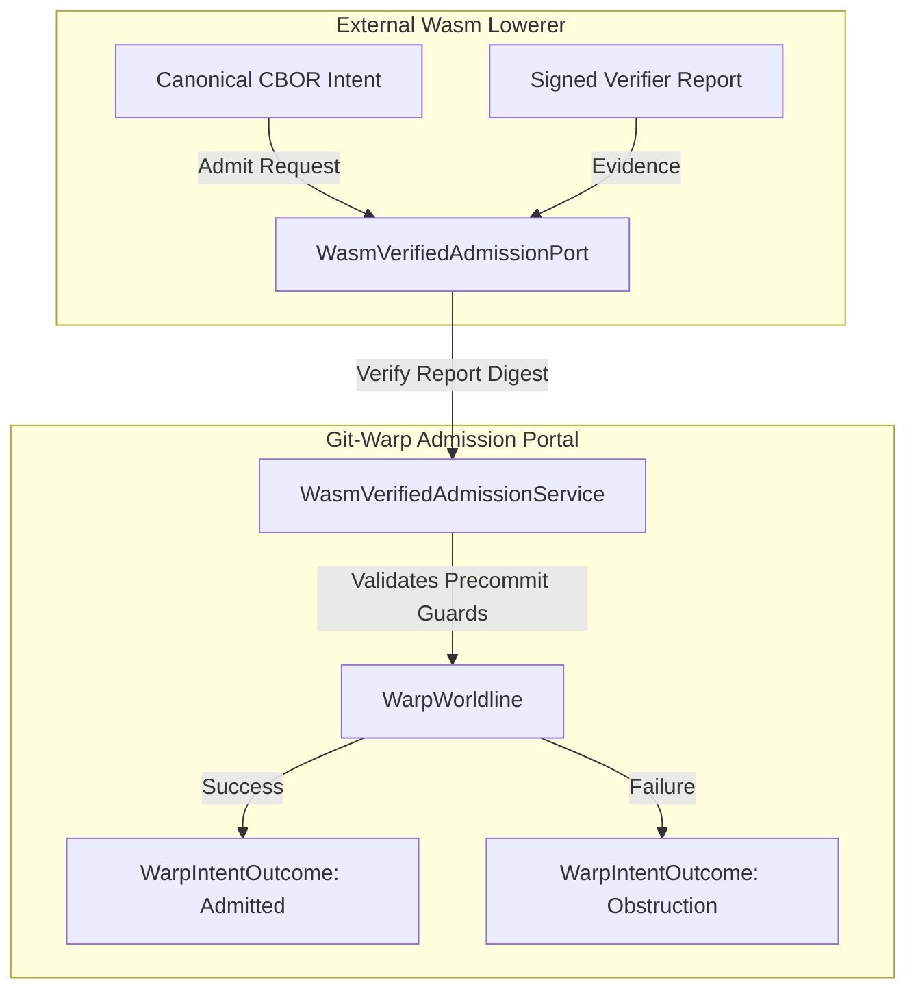

# Wasm-Verified Admission Port (`WasmVerifiedAdmissionPort`)

To establish secure, verified agent execution and close the ambient-authority gap for unmaterialized intents, `git-warp` introduces `WasmVerifiedAdmissionPort`. This port serves as the secure admission gate between external WebAssembly lowerers (such as Edict's `xyph-target-lowerer.wasm`) and `WarpWorldline`.

## Architectural Contract

The `WasmVerifiedAdmissionPort` abstract class defines the contract for admitting Wasm-lowered intents accompanied by cryptographic verifier reports:

### 1. `admitWasmIntent`

Accepts a `WarpIntentDescriptor` and a `WasmVerifierReport`. The service verifies the report digest against the expected Wasm plugin SHA-256 identity, ensuring the intent was generated by a certified lowerer (`continuum.lane.lawful-autonomous/v1`) without modification or prompt injection tamper.

### 2. Guard & Obstruction Handling

Once the verifier report is cryptographically authenticated, the service forwards the `WarpIntentDescriptor` to `WarpWorldline.admitIntent`. If any precommit guards (such as `nodeStatus` or `nodeUnassignedOrSelf`) are obstructed by the current worldline causal state, `admitWasmIntent` reflects the exact `WarpIntentOutcome` containing the obstruction tag and actual state back to the caller.

## See also

- [Unmaterialized Intents](unmaterialized-intents.md)
