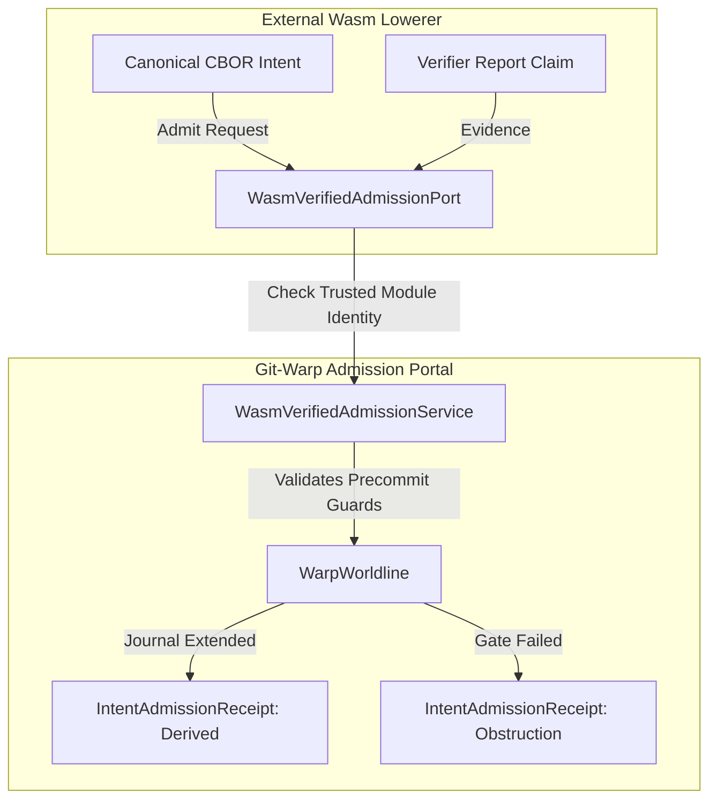

# Wasm-verified admission port (`WasmVerifiedAdmissionPort`)

`WasmVerifiedAdmissionPort` is a compatibility boundary between external WebAssembly lowerers (such as Edict's `xyph-target-lowerer.wasm`) and `WarpWorldline`. The current implementation provides a narrow trusted-module gate; it is not cryptographic report authentication.

## Architectural contract

The `WasmVerifiedAdmissionPort` abstract class defines the contract for admitting Wasm-lowered intents accompanied by cryptographic verifier reports:

### 1. `admitWasmIntent()`

Accepts a `WarpIntentDescriptor` and a `WasmVerifierReport`. The current compatibility service requires `report.verified` and compares `report.wasmDigest` with its built-in trusted module digest. It does not independently verify a signature over `reportDigest`; callers must not interpret this boundary as cryptographic report authentication.

### 2. Guard and obstruction handling

When the trusted-module checks pass, the service forwards the descriptor to `WarpWorldline.admitIntent()`. A journal append returns a witnessed `derived` receipt. A failed precommit guard, missing bounded basis, or exhausted tail-read budget returns the controller's witnessed `obstruction` unchanged.

An unverified report or untrusted module digest produces an `invalid-derivation` obstruction bound to the exact current descriptor-journal basis. The witness records the supplied report, verification status, module references, required trusted evidence, failed condition, and `with-evidence` retry disposition. Runtime failures remain outside this four-way causal classification.

## See also

- [Unmaterialized Intents](unmaterialized-intents.md)
